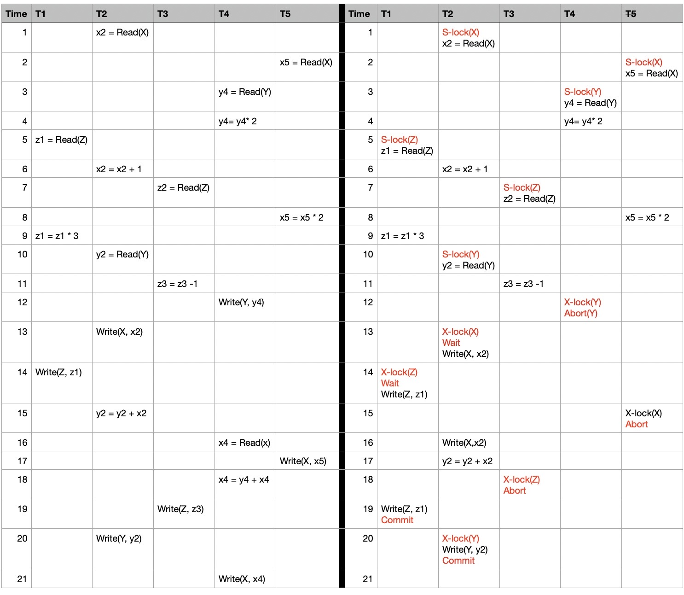
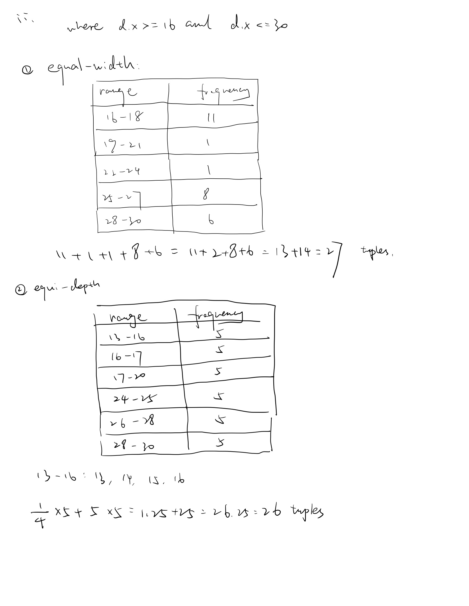
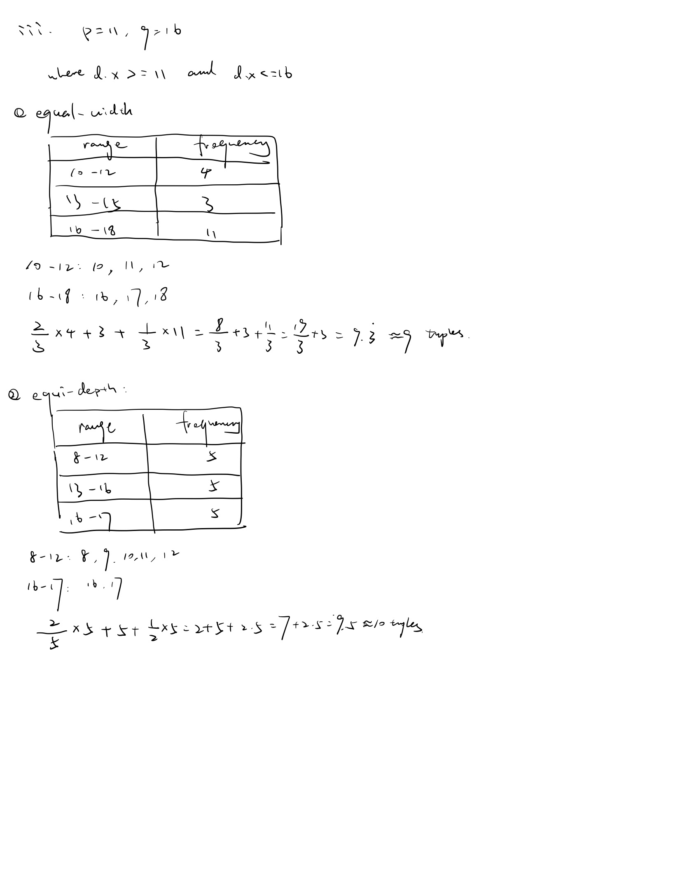
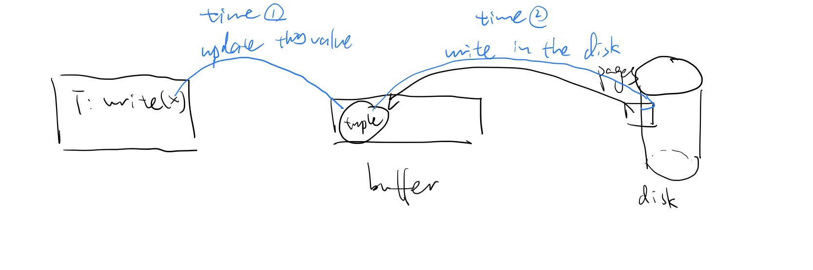

### Question1



It is has circles therefore is not schedule seriaizable. 

X = 2, Y = 4, Z = 9


### Question 2

solution: 

1. insert 16, 22

   Bucket 0 : (16, 22)

   Next bucket to be split: bucket 0 

2. insert 3, 7

   Bucket 0: (16, 22)

   Bucket 1: (3,7)

   Next bucket to be split: bucket 0

3. insert 1

   Bucket 00: (16)

   Bucket 10: (22)

   Bucket 1: (3,7)-(1)
   
   Next bucket to be split: bucket 1

4. insert 15, 2 

   Bucket 00: (16)

   Bucket 01: (1)

   Bucket 10: (22, 2)

   Bucket 11: (3, 7) - (15)
   
   Next bucket to be split: bucekt 11

5. insert 19, 9, 4

   Buckett 00: (16, 4)

   Bucket 01: (1, 9)

   Bucket 10: (22, 2)

   Bucket 011: (3, 19)

   Bucekt 111: (7, 15)

   Next bucket to be split: bucket 00

6. insert 21, 0

   Bucket 000: (16, 0)

   Bucket 01: (1,9) - (21)

   Bucket 10: (22, 2)

   Bucekt 100: (4)

   Bucekt 011 (3, 19)

   Bucket 111 (7, 15)

   Next bucket to be split: bucket 01

7. insert 8

   Bucket 000: (16, 0) - (8)

   Bucket 101: (21)

   Bucket 10: (22, 2)

   Bucket 100: (4)

   Bucekt 011: (3, 19)

   Bucket 111: (7, 15)

   Bucket 001: (1, 9)

   Next bucket to be split: bucket 10


   

   


### Question 3 

a. 

A: $\frac{100 \times 20,000}{2,000} = 1,000 \ pages$

B: $\frac{200 \times 30,000}{2,000} = 3,000 \ pages$

C: $\frac{300\times60,000}{2,000} = 9,000 \ pages$ 


b. 

i. sequential scan, read all. Because C is evenly split between two tracks, which means we have to seek+rotation twice. 

$Time = 2 \ (seek+rotation) +  9,000\times(read)=2\times 50ms+9,000 \times 0.5ms = 4,600ms$

Therefore, the time for this query is 4600 ms.


ii. $k \times (50 + 0.5) = 50.5k \ ms$

Therefore, the time for this query in worst case is $50.5k $ ms.


iii. $50.5k \geq 4,600 \rightarrow k \geq \left\lceil\frac{4,600}{50.5} \right\rceil \rightarrow k \geq 90 $  

Therefore, when $k \geq 90$ such that (i) is a faster way to execute the query than (ii)


### Question 4 

a.  $A_{A.x=C.x} \Join C$ is small, and $A_{A.x=B.x} \Join B $ or $B_{B.x=C.x}\Join C$ is quite large


b. A should be in the outer loop. 

Because A has 1000 pages smaller than C has 9,000 pages. Nested loop, the each block in the outer loop need to be read once. For inner loop, each block has to be read once for each block of the outer loop. Therefore, the number of block access = $b_r+b_r\times b_s$. Therefore, $b_r \times b_s$ is fixed, depend on the blocks of A and the block C. But when $b_r$ smaller, the block access will more smaller, which means, the number of block access is up to $b_r$ . Therefore, the outer loop should be smaller table. Therefore, A should be in the outer loop.


 c.  


d.


f. 


g.


h. 


### Question 5 

a. 

$range=\frac{30}{10 \ columns} = 3$

| Range | Frequency |
| ----- | --------- |
| 1-3   | 10        |
| 4-6   | 1         |
| 7-9   | 5         |
| 10-12 | 4         |
| 13-15 | 3         |
| 16-18 | 11        |
| 19-21 | 1         |
| 22-24 | 1         |
| 25-27 | 8         |
| 28-30 | 6         |


b. 

$frequency = \frac{50}{10} = 5$

| Range | Frequency |
| ----- | --------- |
| 1-2   | 5         |
| 2     | 5         |
| 4-8   | 5         |
| 8-12  | 5         |
| 13-16 | 5         |
| 16-17 | 5         |
| 17-20 | 5         |
| 24-25 | 5         |
| 26-28 | 5         |
| 28-30 | 5         |

  

c. 

i.  


ii. 



iii. 



### Question 6

solution:

Write-ahead logs(WAL): All operations must be logged first. Log records must be force to stable storage before acutally operations can be executed.

* Atomicity

  For example, if log after excuation and there is a crash between excuation and log.

  A = $1000 and  B = \$ 2000, A transfer \$50 to B.

  ```shell
  write A = $ 950 (T has not commit yet)
  ------------------------------ crash
  log(A exucation)
  ```

  When the system restarts, it will not any record about A has already losed $50. It cannot find the write operation on the log. We cannot do undo the transaction, because we do not know happen the thing. Therefore, it is not satified the atomicity.

* Durability 

  Suppose the crash occurs right after a transaction T committed.

  ```shell
  write A = $ 950 (T commit)
  ------------------------------------ crash
  log (A exucation)
  ```

  When the system restart, T may have written something onto the disk. However, the writes may not have propagated to the disk. And log is after the excuation, therefore, we can not find the transaction that has committed. We cannot do the redo. Therefore, it is not satified the durability.

  

  By the way, T commited also need time. And in some situation, for example, if five other transactions want to read x. It's probably better to store the x tuple in the buffer for a while longer before write it to the dis and release the buffer for other transcations. And there is crash at that moment. We didn't log the exucation.  when the system recovers, it cannot find the write operation on the log. We cannot redo. 

Therefore, it log after the execute, it will conflict atomicity and durability.

