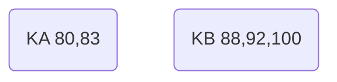
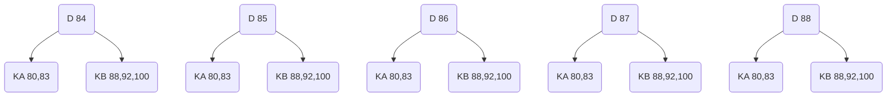
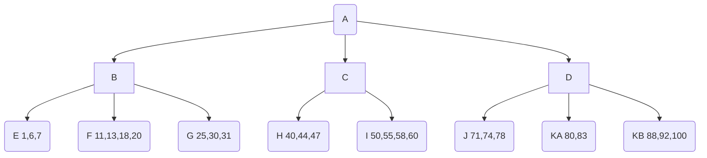
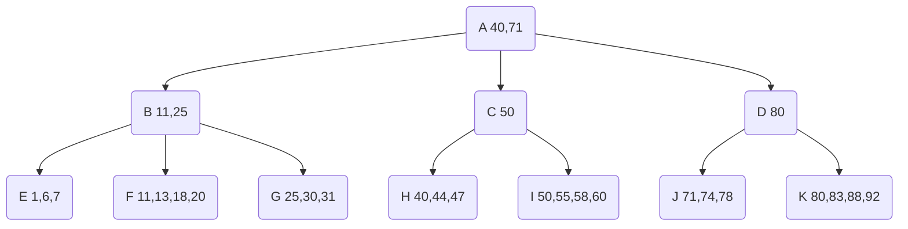
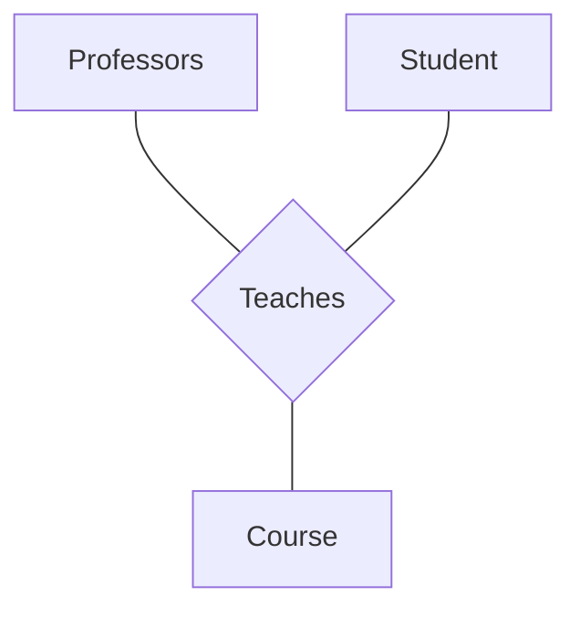
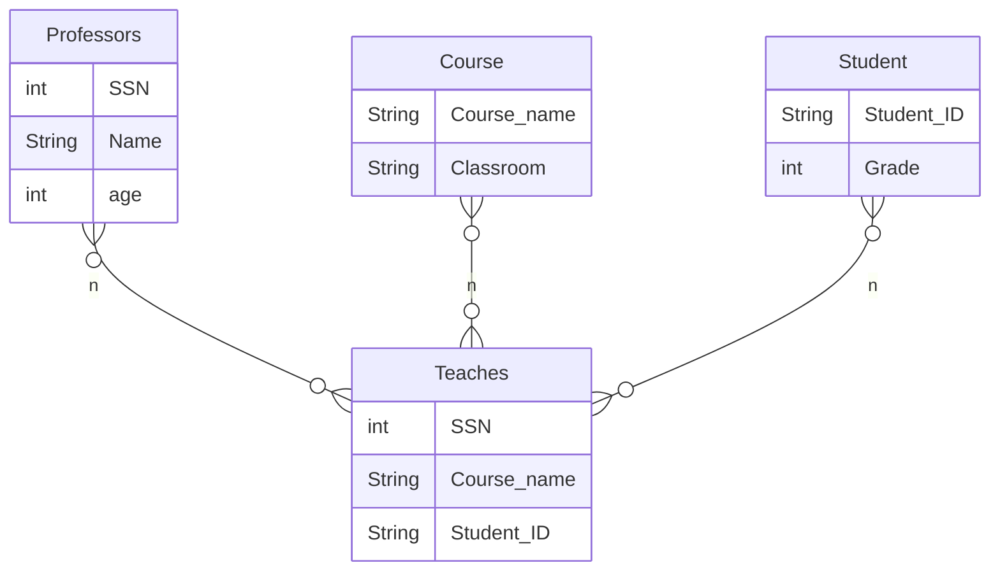

# Homework_1_Modify

Bingying Liang Due: Oct 6th(Thu) 11:59p.m.

1. **(20 points) Consider building a B+-tree to store numbers. You are given the following constraints on the B+-tree.**

* Each leaf node can store at most 4 numbers

* Each internal node can store at most 2 numbers (how many children maximum?)

* Suppose an internal node stores (14, 28). The three children correspond to number with value strictly less than 14, greater than or equal 14 and strictly less than 28, and greater than or equal to 28 respectively.

* If a node is split, and the number of items of the nodes are odd – this implies one of the split node will have one more item then the other. In such case choose the node on the “right” (containing larger numbers) to be the one who get one more item.

  a. Suppose 100 is inserted into the tree. This will cause nodeK to be split. That means a new key value need to be installed into node D. What is (in theory) the range of the value that can be used there? Explain your answer. (Notice that even though the algorithm use a certain number, but in theory there are other numbers that can be used without violating the B+-tree’s requirements).

  b. Fill in the key values of all nodes A to D, assuming we take the largest possible value for each key value. (Assume the insertion of 75 in part (a) did not happen).

  c. (Ignore part a) Suppose the following numbers are inserted (in order): 57, 4, 99, 12, 53, 5, Every time a node is split, listed the contents of all the nodes being affected. Use the following convention:

  * For any leaf nodes that has changes, list its content after the insertion
  * If a node is split, name the two new nodes by added letter A and B to it. For example, if node K is split, the two new nodes should be named KA and KB. Later if KB is split, then the two nodes should be named KBA and KBB etc.
  * If a new root is created, name the new root N. If subsequently another new root is created then name it NN etc.

---

**Solution:**

Each internal node can store at most 2 numbers, three children maximum.

a. In theory the range of the value is $[84,88]$, which is $84, 85, 86, 87, 88$ these five numbers can be uesed there.

Explain: $100 > 92$ which means $100$ should ineserted after the $92$, but the Node $K$ is full. So the Node $K$ should be spitted. Because Node $D$ is an internal node, so it can stores two numbers, but it only have two children $J$ and $K$, which means $D$ only have one number and is not full. So spitting the Node $K$ into $KA$ and $KB$ and then add one number to the Node $D$. Because of contraints, when spitted the "right" has to get one more items, so it must have three items. Therefore, $KA \ \ (80,83)$ and $KB \ \ (88, 92, 100)$ . Therefore , D just add a new key which range is $>83$ and $\leqslant 88$, can be used without violating the B+-tree’s requirements.

✅








b. A(40, 71) B(11, 25) C(50) D(80) ✅



> b. A(50, 80)  B(11, 25) C(50) D(80) ❌

c.  ✅

* 57 is inserted to node $I$

  * Node $I$ is splitted. New values for $IA(50, 55)$ ,$IB(57, 58, 50)$
  * Node $C$ is affected. New values for keys of $C$ is (50, 57)

  ```mermaid
  graph TB
  A(A 40,71)
  A-->B(B 11,25)
  A-->C(C 50,57)
  A-->D(D 80)
  B-->E(E 1,6,7)
  B-->F(F 11,13,18,20)
  B-->G(G 25,30,31)
  C-->H(H 40,44,47)
  C-->IA(IA 50,55)
  C-->IB(IB 57,58,60)
  D-->J(J 71,74,78)
  D-->K(K 80,83,88,92)
  ```

  

* 4 is inserted to node $E$ ✅

  * Node $E$ is afftected. New values for keys of $E$ is (1,4,6,7)

    ```mermaid
    graph TB
    A(A 40,71)
    A-->B(B 11,25)
    A-->C(C 50,57)
    A-->D(D 80)
    B-->E(E 1,4,6,7)
    B-->F(F 11,13,18,20)
    B-->G(G 25,30,31)
    C-->H(H 40,44,47)
    C-->IA(IA 50,55)
    C-->IB(IB 57,58,50)
    D-->J(J 71,74,78)
    D-->K(K 80,83,88,92) 
    ```

* 99 is inserted to node $K$ ✅

  * Node $K$ is splitted. New values for $KA(80,83), KB(88,92,99)$ 

  * Node $D$ is affected. New values for keys of $D$ is $(80, 88)$.

    ```mermaid
    graph TB
    A(A 40,71)
    A-->B(B 11,25)
    A-->C(C 50,57)
    A-->D(D 80,88)
    B-->E(E 1,4,6,7)
    B-->F(F 11,13,18,20)
    B-->G(G 25,30,31)
    C-->H(H 40,44,47)
    C-->IA(IA 50,55)
    C-->IB(IB 57,58,60)
    D-->J(J 71,74,78)
    D-->KA(KA 80,83)
    D-->KB(KB 88,92,99)
    ```

    

* 12 is inserted to node $F$

  * Node $F$ is splitted. New values for keys of $FA(11,12), FB(13, 18, 20)$
  
  * Node B is affected, and B is also splitted. $BA (11), BB(25)$
  * Node A is affected, and A is also splitted. $AA(13), AB(71)$ 
  * Create new root $N(40)$ 
  
  ```mermaid
  graph TB
  N(N)
  AA 
  AB
  
  
  AA(AA 13)
  AB(AB 71)
  N(N 40)
  N-->AA
  N-->AB
  AA-->BA
  AA-->BB
  AB-->C
  AB-->D
  BA(BA 11)
  BB(BB 25)
  BA-->E(E 1, 4, 6, 7)
  BA-->FA(FA 11, 12)
  BB-->FB(FB 13,18,20)
  BB-->G
  G(G 25,30,31)
  H(H 40,44,47)
  IA(IA 50,55)
  IB(IB 57,58,60)
  J(J 71, 74, 78)
  KA(KA 80, 83)
  KB(KB 88, 92, 90)
  C(C 50, 57)
  D(D 80, 88)
  C-->H
  C-->IA
  C-->IB
  D-->J
  D-->KA
  D-->KB
  ```
  
  > * Node $F$ is affected. New values for keys of $F$ is $(11,12,13,18)$
  > * Node $G$ is affected. New values for keys of $G$ is $(20, 25, 30, 31)$
  > * Node $B$ is affected. New values for keys of $B$ is $(11, 20)$ ❌ nodes are not balanced. A full node is split -> create new root.
  >
  > ```mermaid
  > graph TB
  > A(A 40,71)
  > A-->B(B 11,20)
  > A-->C(C 50,57)
  > A-->D(D 80,88)
  > B-->E(E 1,4,6,7)
  > B-->F(F 11,12,13,18)
  > B-->G(G 20,25,30,31)
  > C-->H(H 40,44,47)
  > C-->IA(IA 50,55)
  > C-->IB(IB 57,58,60)
  > D-->J(J 71,74,78)
  > D-->KA(KA 80,83)
  > D-->KB(KB 88,92,99)
  > ```
  >
  > Because the $B^+$-tree is full. We have to make sure the space for the following insert.
  >
  > Therefore, we have to split.
  >
  > pointer = n = 3 叶节点最多$4$
  >
  > 叶节点最少$3/2 =1$
  >
  > 
  >
  > * Node $F$ is splitted. New values for keys of $FA(11,12), FB(13, 18, 20)$
  > * Node B is affected, and B is also splitted. $BA (11), BB(25)$
  > * Node A is affected, and A is also splitted. $AA(13), AB(40)$ ❌
  > * Create new root $N(40)$ 
  >
  > ```mermaid
  > graph TB
  > N(N)
  > AA 
  > AB
  > 
  > 
  > AA(AA 13)
  > AB(AB 40)
  > N(N 40)
  > N-->AA
  > N-->AB
  > AA-->BA
  > AA-->BB
  > AB-->C
  > AB-->D
  > BA(BA 11)
  > BB(BB 25)
  > BA-->E(E 1, 4, 6, 7)
  > BA-->FA(FA 11, 12)
  > BB-->FB(FB 13,18,20)
  > BB-->G
  > G(G 25,30,31)
  > H(H 40,44,47)
  > IA(IA 50,55)
  > IB(IB 57,58,60)
  > J(J 71, 74, 78)
  > KA(KA 80, 83)
  > KB(KB 88, 92, 90)
  > C(C 50, 57)
  > D(D 80, 88)
  > C-->H
  > C-->IA
  > C-->IB
  > D-->J
  > D-->KA
  > D-->KB
  > 
  > 
  > 
  > ```
  >
  > 


* 53 is inserted to node $IA$  ✅

  * Node $IA$ is affected. New values for keys of $IA$ is $(50, 53, 55)$

    ```mermaid
    graph TB
    N(N)
    AA 
    AB
    
    
    AA(AA 13)
    AB(AB 71)
    N(N 40)
    N-->AA
    N-->AB
    AA-->BA
    AA-->BB
    AB-->C
    AB-->D
    BA(BA 11)
    BB(BB 25)
    BA-->E(E 1, 4, 6, 7)
    BA-->FA(FA 11, 12)
    BB-->FB(FB 13,18,20)
    BB-->G
    G(G 25,30,31)
    H(H 40,44,47)
    IA(IA 50,53,55)
    IB(IB 57,58,60)
    J(J 71, 74, 78)
    KA(KA 80, 83)
    KB(KB 88, 92, 90)
    C(C 50, 57)
    D(D 80, 88)
    C-->H
    C-->IA
    C-->IB
    D-->J
    D-->KA
    D-->KB
    
    ```
    
    


* 5 is inserted to node $E$

  * Node E is splitted. New values for $EA(1,4)$ $EB(5,6,7)$ ✅

  * Node BA is affected. New values for $BA(5, 11)$ ✅

    

    ```mermaid
    graph TB
    N(N)
    AA 
    AB
    
    
    AA(AA 13)
    AB(AB 71)
    N(N 40)
    N-->AA
    N-->AB
    AA-->BA
    AA-->BB
    AB-->C
    AB-->D
    BA(BA 5,11)
    BB(BB 25)
    BA-->EA
    BA-->EB
    EA(EA 1,4)
    EB(EB 5,6,7)
    BA-->FA(FA 11, 12)
    BB-->FB(FB 13,18,20)
    BB-->G
    G(G 25,30,31)
    H(H 40,44,47)
    IA(IA 50,53,55)
    IB(IB 57,58,60)
    J(J 71, 74, 78)
    KA(KA 80, 83)
    KB(KB 88, 92, 90)
    C(C 50, 57)
    D(D 80, 88)
    C-->H
    C-->IA
    C-->IB
    D-->J
    D-->KA
    D-->KB
    ```
  
    > * Node $E$ is affected. New values for keys of $E$ is $(1,4,5,6)$
    >
    > * Node $F$ is affected. New values for keys of $F$ is $(7, 11, 12, 13)$ ❌ same problem
    >
    > * Node $G$ is affected. New values for keys of $G$ is $(18, 20, 25, 30)$
    >
    > * Node $B$ is affected. New values for keys of $B$ is $(7, 18)$
    >
    > * Node $A$ is affected. New values for keys of $A$ is $(31,80)$
    >
    > * Node $H$ is affected. New values for keys of $H$ is $(31, 40, 44, 47)$
    >
    >   ```mermaid
    >   graph TB
    >   A(A 31,80)
    >   A-->B(B 7,18)
    >   A-->C(C 50,57)
    >   A-->D(D 80,88)
    >   B-->E(E 1,4,5,6)
    >   B-->F(F 7,11,12,13)
    >   B-->G(G 18,20,25,30)
    >   C-->H(H 31,40,44,47)
    >   C-->IA(IA 50,55)
    >   C-->IB(IB 57,58,60)
    >   D-->J(J 71,74,78)
    >   D-->KA(KA 80,83)
    >   D-->KB(KB 88,92,99)
    >   ```
    >


2. **(20 points) Consider you have a Person table with SSN as the primary key, and an attribute age (there are other attributes, which is not important to this problem). You are also given the following:**

* Each tuple of the table has size of 200 bytes
* Each sector (page) on the disk have 1600 bytes
* No tuple is split between two pages
* There are 250,000 tuples in the table
* The table is store in a single file, but is split (equally) between 2 tracks on the disk. Within the same track the sector of the file is contiguous

* Each seek/rotation combination takes 50 milliseconds on average

* Transferring a single page from the disk to memory take 0.5 millisecond.

* When you first access a file, you will need to do a single seek/rotation combination

  a. How many tuples can be stored in a single page?

  b. How many pages are needed to store the table?

  c. Consider the following SQL query: `SELECT * from Person where SSN=”123456789”`. Calculate the best case and worst case time taken to answer this query if

  * i. There is no index

  * ii. There is a clustering index on SSN (Ignore the time needed for reading the index)

  d. Now consider the following SQL query: `SELECT * FROM Person WHERE (age > 20) and (age < 29) ORDER BY age`. Assume that there is a non-clustering index on the age attribute. Assume that you want to use the index to answer the query by first accessing the indexing, and then read each tuple in the order that the index provided. (Assume there is NO buffer to store the location of the buffer so as to make reading easier – i.e. you really do have to access each tuple in the order of the age attribute). Calculate the (worst case) time taken to answer this query using the index if

  * i. There are 2 tuples that satisfy this query

  * ii. There are 10,000 tuples that satisfy this query

    (Once again, ignore the time needed for reading the index)

  Show your work in all the cases.

---

**Solution:**

a. $\frac{1600}{200} = 8 \ tuples$ ✅

b. $\left \lceil \frac{250000}{8} \right \rceil = 31250 \ pages$ ✅

c.  

* Best case: 

  1. We have to seek/rotation combination 1 time, we just only need one time transfer time 0.5 milliseconds.
  2. Lucky, the first read tuple is what we want.

  *  i. There is no index

    $Time = 1 \ seek/ rotation \ combination  + transfer\  1 \  page = 50 + 0.5 =50.5 \ milliseconds$ ✅

  * ii. We can use the index find the tuple immediately, and if no match, don't have to go to the table

    $Time = 0$
    
    > There is a clustering index on SSN (Ignore the time needed for reading the index). There for we can find the right page immediately. 
    >
    > $Time = 1 \ seek/rotation +  1 \ page \  transferring = 50 + 0.5 = 50.5 \ milliseconds$ ❌
    
    

* Worst case:

  1. We first time to access the file, so we do need do a single seek/rotation combination. 

  
  * i. There is no index
  
    * We have to read all pages, and the pages are splited into two tracks. Therefore we have to do two seek/rotation combination. And transfer all pages into the memory. And because the file was splitted equally into 2 tracks on the disk. Therefore we have do two single seek/rotation 
  
      $50 \ milliseconds \times 2$
      
      $Time = 50 \times 2 + 31250 \times 0.5 = 15725 \ milliseconds$ ✅
  
  * ii. There is a cluserting index on SSN( (Ignore the time needed for reading the index), therefore we can know the location of the track. We just need to transfer one track pages and because of the index we also can know the which page is what we want. Because the cluserting index stroed as binary tree.
  
    * $\left\lceil log_2(31250) \right\rceil = 15 $ 
    
    * $Time = 1 \ seek/rotation + 15 \ seek/rotation + 15 \ transfer  = 50 + 15 \times 50 + 15 \times 0.5 = 807.5 milliseconds$
    
      > $Time = 50+50\times ceiling(log_2(31250)) + ceiling(log_2(31250))\times 0.5 = 804.0442127508708 \ milliseconds$ ❌
      
       
    
    


d.

* worst case:

  1. first access the file, have to do a single seek/rotation combination. But the file was splitted equally into 2 tracks on the disk. 

     i. There are 2 tuples that satisfy this query. Therefore we have to do two times of a single seek/rotation. 

     * The 2 tuples are in the different tracks and different pages, and then we have to  transfer the two pages.

       $Time = 50\times2 + 0.5 \times 2 = 101 \ milliseconds$

     ii. There are 10,000 tuples that satisfy this query.

     * Because of the order by age, but the age is not the primary key. Therefore, like the first satisfied tuple is on the track1, and the second satisfied tuples is on the track2, and the third satisfied tuples is on the track1, and the forth satisfied tuples is on the track2 and so on. Keeping switching the two tracks and transfer different pages until find all. Which means we have to do seek/rotation combination $10000 $ times, and transfer the $10000$ pages.

       $Time = 10000 \times 50 + 10000 \times 0.5 = 505000 \ milliseconds$


3. (14 points) Suppose we want to represent a ternary relationship between three entities. Assume each entity has a unique key attribute, and other attributes that need to be stored.

   Now suppose you are only allowed to use embedding to store the information. Suggest what can be a problem. Use an example to illustrate.

   Is there any restrictions on the relationship that will make this at least a feasible way of representing the relationship?

----

**Solution:**

For example: Terneray relationship "Teaches" can be read as many professors may teach many courses with many students

Professor(<u>SSN</u>, Name, Age)

| SSN  | Name | Age  |
| ---- | ---- | ---- |
| 1200 | Eve  | 30   |
| 1203 | Jo   | 40   |
| 1212 | Mike | 50   |


Course(<u>Course_name</u>, Teacher, Classroom)

| Course_Name | Teacher | Classroom |
| ----------- | ------- | --------- |
| A1          | 1200    | A11       |
| A2          | 1203    | A12       |
| B1          | 1212    | A13       |


Student(<u>Student_ID</u>, Grade)

| Studuent_ID | Grade |
| ----------- | ----- |
| S1          | 90    |
| S2          | 92    |
| S3          | 93    |


Relation: teach(<u>SSN, Course_name, Student</u>, Time)

| SSN  | Course_name | Student | Time |
| ---- | ----------- | ------- | ---- |
| 1200 | A1          | S1, S3  | 2022 |
| 1203 | A2          | S1, S2  | 2021 |
| 1212 | B1          | S2, S3  | 2019 |





```
{
	{
	_id: 1
	time: 2022
  professor{
					SSN:1200
					name: "Eve"
					age: 30
	}
	course: { 
           class_name:"A",
           classroom:"A11"
          }
  student:{
						{
						 student_id: "s1",
          	 Grade: 90
						},
						{
						 studnent_id: "s3",
						 Grade: 92
  					} 
	}
}

{
	_id: 2
	time: 2021
  professor{
					SSN:1203
					name: "Jo"
					age:40
	}
	course: { 
           class_name:"A2",
           classroom:"A12"
          }
  student:{
						{
						 student_id: "s1",
          	 Grade: 90
						},
						{
						 studnent_id: "s2",
						 Grade: 92
            } 
  }
}

{
	_id: 3
	time: 2019
  professor{
					SSN:1212
					name: "Mike"
					age:50
	}
	course: { 
           class_name:"B1",
           classroom:"A13"
          }
  student:{
						{
						 student_id: "s2",
          	 Grade: 92
						},
						{
						 studnent_id: "s3",
						 Grade: 93
            } 
  }
}
}
```


1. Duplication of data can be a problem. Like when you have more than 1000 student same choose the different courses, the information of the students will repeat a lot of times.
2. Update the information of some students or professors or courses can be a problem. Because you have to change all of them, especially there are a lot of repeated information. 


Solutions for the duplication, we can limit the number of students of a courses, and also limit the student how many course they can choose. This will help to decrease the duplication of some information.  Or we can use link way to the same information instead of embed way to store information. 

Solutions for the update the information, we can break the ternary relationship into binary relationship, create separte objects to store the relationships. And check them often.




