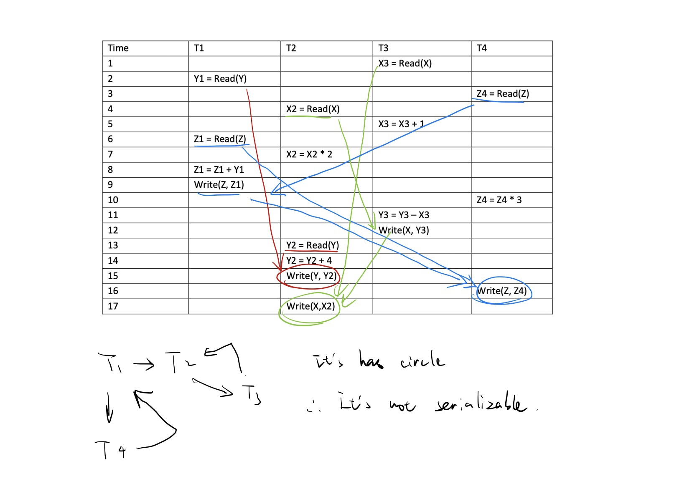
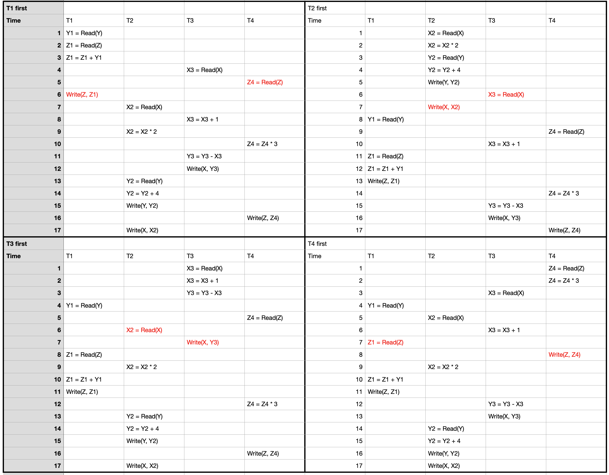
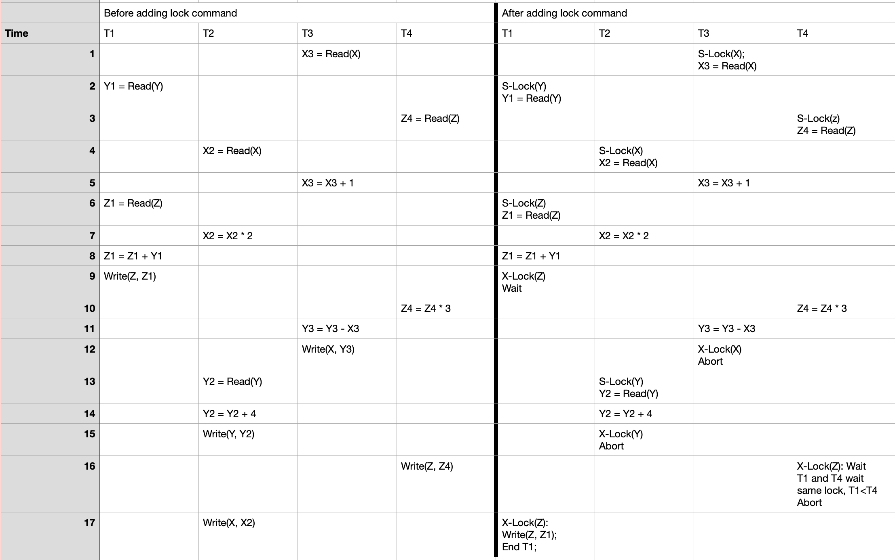

# Homework 2 

Bingying Liang Due: Oct. (Late deadline: Dec 2nd 11:59pm.)

### 1. Consider the following query

```sql
SELECT *
FROM A, B 
WHERE A.x = B.x
```

Calculate (or provide lower and/or upper bound, if you don’t have enough information) the number of tuples returned from the query, under the following conditions (each part is separate from the other). Unless otherwise stated, table A has 10000 tuples, table B has 20000 tuples.

a. A.x is the primary key of x, and B.x is the primary key of B

b. A.x is the primary key of x, and B.x is the foreign key refer to A.x (but B.x is not unqiue)

c. A.x and B.x is evenly distributed between 1-100.

d. A.x is evenly distributed between 1-100, B.x is evenly distributed between 51-150.

---

#### **Solution:**

* **a.** Because the x is the primary key of both A and B, which means there is no duplicate tuples on the x.

  * **1 The lower bound:**

    Unlucky: None of 10000 tuples of A.x is equal to B.x

    Therefore return 0 tuples

    
  
    
  
    
  
    
  
  * **2 The upper bound:**
  
    Lucky: Every tuples of A.x is equal to B.x and none of them is duplicated.
  
    Therefore return 10000 tuples.
  
  
  
  


Therefore the lower bound is 0, the upperbound is 10000.


* **b.** Because the x is the primary key of A, therefore, there is no duplicate tuples on the x of table A.

  ​	 But B.x is the foreign key refer to A.x, therefore, B every tuples reference to A, which means every B.     

  ​	 tuple is matched with A.x .

  ​	 It will return the number B 

  * **1 The lower bound:**

    Unlock: Because B.x is not the primary key of the B. so it can be none. If all the B.x is none, therefore, 0 tuples will matches A.x = B.x. 

    Therefore, it return 0 tuples.

    

    

    

    

  * **2 The upper bound:**

    Lucky: Every B.x is not none, so every tuples reference to the A.x, therefore, it can return the whole B tuples, which is 20000 tuples.

    Therefore, it return 20000 tuples.

  

  

  

  Therefore the lower bound is 0, the upperbound is 20000.

  

* **c.** 

  * **1 The lower bound:**

    * A.x has 10000 tuples distribute evenly 1-100, therefore we can divided 1-100 as $\frac{100}{10000}=0.01$ , Suppose the first tuple of A.x that x = 0.01, and the second x = 0.02 ... the last one x = 100.00

      B do the same thing, divided 1-100 as 20000 parts,  and each parts' range is $\frac{100}{20000} = 0.005$ , supose the first tuple of x is 0.00023, the second x = 0.00523, ... the last one x = 19999.99523

      Obvisouly , no tuple A.x = B.x can match.

    Therefore, return 0 tuples 

    

    

    

    

  * **2 The upper bound:**

    * x is not the primay key of A and B, therefore, B.x or A.x can be dulicated. A.x has 10000 tuples, therefore we can divided 1-100 as $\frac{100}{10000} = 0.01$ , suppose the first tuple of x is 0.01, the second tuple A.x = 0.02, ... the last one x =100.00

      Because B has 20000 tuples, which is 2 times of A. 

      Now let B.x first tuple = 0.01 and second tuple of B.x =0.01, and the third and fouth tuple of B.x = 0.02 ... the 19999th and 20000 th tuple of B.x = 10000.00 .Therefore, every B table B.x mathes with the table A.x.
    
    Therefore, return 20000 tuples.
    

  

   

  

  

  Therefore the lower bound is 0, the upperbound is 20000.

  

  

* **d.**

  * **1 The lower bound:**

    A.x has 10000 tuples, distribute evenly between 1-100, therefore we can divided range 100 into 10000 parts, each part range is $\frac{100}{10000} = 0.01$ , let first tuple A.x  = 0.01, and the second is x = 0.02... the last one x = 100.00
  
    B.x has 20000 tuples, distribute evenly between 51-150, therefore we can divided  the range into 20000 parts, each part range is $\frac{100}{20000} =0.005$, the first tuple of B, let's say B.x = 51.00023, the second is B.x = 51.00523... the last one B.x = 149.99523.
  
    In this situation, the there is no tuple satisfy that A.x = B.x, therefore return 0 tuples.
  
    Therefore, return 0 tuples
  
    
  
    
  
    
  
  * **2 The upper bound:**
  
    Because A.x has 10000 tuples between 0-100 and distribute evenly, which means there are at most $\frac{10000}{2} = 5000$ tuples between 51-100. 
  
    Because B.x has 20000 tuples between 51-150 and distribute evenly, which means there are at most $\frac{20000}{2}=10000$ tuples between 51-100.
  
    Therefore, we can let 5000 tuples A.x = B.x, and the last 5000 tuples let duplicated to A.x. For example, divided 51-100 into 5000 parts , and each parts range is $\frac{50}{5000}= 0.01$ parts. If first A.x = 50.01, and the second A.x = 50.02 ... the 5000th A.x = 100. Now if 1st and 2nd B.x =50.01 and 3rd and 4th B.x = 50.02... the 9999th and 10000th B.x = 100. Therefore, there are 10000 tuples A.x = B.x
  
    Therefore return 10000 tuples.
  
  
  
  
  
  
  
  Therefore the lower bound is 0, the upperbound is 10000.


### 2. Consider the following schedule for four transactions:


How to read the table:

- X, Y, Z are data stored on the database in the disk

- X1..X4, Y1..Y4, Z1..Z4 are local variables stored in memory and only accessible via the corresponding transactions (T1 for X1, Y1, T2 for X2, Y2 etc.). You can assume all local variables are initialized to 0.

- The Read() operation read in the corresponding data on the disk and store it in the local variable

- All the operations (*, +, - etc.) only operate on the local variable, and do not affect the data on the disk

- The Write() command write the value of the local variable onto the corresponding data on the disk.


a. Is the above schedule serializable? If it is, list all possible equivalent serial schedule. If not, explain why not.

b. Now suppose we want to implement 2-phase locking on the transactions. Assume we use the following convention:

 1. Every time a transaction wants to read/write an item in the disk for the first time, it will request a share/exclusive lock (respectively). We denote it as the operation S-Lock(), X-Lock() respectively


2. If a request is granted, the transaction can proceed immediately and execute the corresponding command
3. Otherwise, the transaction will use the wait-die policy to determine whether it will wait or abort.
4. If a transaction waits, it will wait until the lock is released and attempt to obtain it. It will try to obtain the lock immediately        after it was released by another transaction. 
5. If it can obtain the lock, it will execute all commands up to the time that the lock is requested/obtained.
6. If a transaction aborts, it will not be restarted
7. If there is more than one transaction waiting for the same lock, the lock is always granted to the transaction Ti with the smallest value of i.
8. We assume a transaction immediately commits and release all the locks after the last operation is successfully executed.

Below is a simple example


Apply the same notation to the 4 transactions on the first table, and show the execution in the table form as above.

---

#### **Solution:**

**a.** Because there is a circle, it is not schedule serializable.



And whatever Transaction swap to the first, it always have the conflicts, it is not schedule seriaizable.




**b.** 