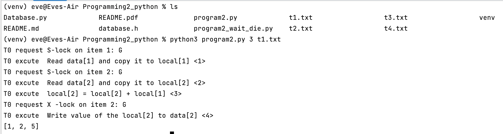

# README

To run this project, you can use the following to start.

For example 

```shell
python3 program2.py 3 t1.txt 
```

`python3` +`program2.py` +`<number of items in database>` + `<file1>` +`<file2>`+ `...`+`<transaction file n>`




The `program2_wait_die.py` same as before.

