# 1 Review & Intro to NoSQL

## Database Systems ✅

* Why database systems?

  * Provide means for user to manage data

  * Allow users to 

    * Specify data to be stored (data modeling)

    * Specify operation on the data (query language)

      > Structurally language is not stupid language

    * Ensure consistency and integrity of data (integrity checking)

    * Manage how data is being stored (indexing, file organization)

    * Manage how data is actually retrieved (query processing, optimization)

    * Manage how data is being shared/not shared (concurrency control)

    * Recover data after a failure (recovery)

      > No power. Database can save the information.

    * Ensure data are not accessible by people who should not (security)

    * Access data from a variety of sources/locations (distribution processing)


## 2.1 Relational Model ✅

* Data are represented as tuples in relations
* Represented as tables 
  * Rows (tuples): each unit of data
  * Columns (attributes) : attributes of each unit

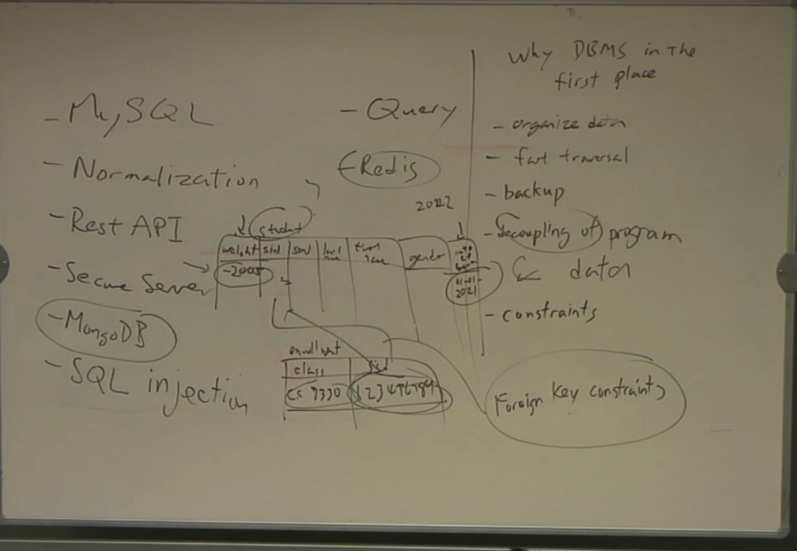


* Relation can be viewed as SETS of attributes (set in a mathematical sense)
* Constraints on the table
  * First Normal Form
    * But NULL values allowed
  * No duplicate tuples
    * Thus (primary) keys
  * Domain values
  * Referential Integrity
    * Foreign keys

> if you specify a table to have a primary key, the database will automatically ensure that actually is unique
>
> So let's say you have a table with a student SSN and and you call a student id a primary key. It does not automatically ensure the SSN is unique. You may have to post a different student ID, but they have the same SSN and they're different student. And you have this in your table, you are dead.


## 2.5 SQL ✅

* A typical SQL query has the form:

  ```sql
  select A1, A2, ..., An
  from r1, r2, ..., rm
  where P
  ```

  $A_i$ represents an attribute

  $R_i$ represents a relation

  $P$ is a predicate.


* The result of an SQL query is a relation.

* API available for a variety of programming languages to interact (e.g. ODBC, JDBC)

* Also database specific APIs are available


## 2.6 Relational Algebra ✅

* An abstract query language on relations

* A set of operations on a relations, returning another relation

* Basic operations: 

  * Selection: $\sigma_{condition}(R)$

    * <u>Pick tuples from the relation based on a condition, keeping all attributes</u>

      返回输入关系中满足谓词的行

  * Projection: $\prod_{attribute\ list}(R)$

    * Select all tuples, but <u>only keep attributes</u> on the attribute list

      对输入关系的所有行输出指定的属性. 从输出中去除重复元组

  * Set operations: $\cap, \cup, -$,

    * There are corresponding SQL commands for these (not often used)

      > `-` cut the diiference not to set.

> SQL basically tell the database system what I want. But it doesn't tell the database system how to find.
>
> There are two kind of bosses. One boss says, hey go to finish the project, I don't care. Cannot finish the project in two days, you'll fire. And then you ask him, How do I finish the project? They'll say, You'll figure it out. If you are the boss, it is super cool, but if you are employee not cool.
>
> So relational algebra is the query language that kind of keep in more detail how to do it.  It's not totally procedural, it's not totally every detail, but it goes towards.


>Student table
>
>| ...  | ...  | ...  |
>| ---- | ---- | ---- |
>| ...  | ...  | ...  |
>
>Find all students that have gpa at least 3.7 
>
>$\sigma_{gpa \geq 3.7}(Student)$
>
>
>
>Projection:
>
>This is student table, so I have a lot of academic, all I want just SSN
>
>$\prod_{SSN}(Student)$ 


* Basic operations:

  * Cartesian product: $r\times s$

    * Create a table such that every pair of tuples in $r, s$ is match to a topic
    * Basis of merging multiple tables

    从两个输入关系中输出所有的元组对(无论它们在共同属性上的取值是否相同)

    >$A = \{1, 2, 3\} $          $B = \{a, b, c\}$
    >
    >What is $A \times B$ ?
    >
    >$ A \times B = \{(1,a), (1,b),(1,c),(2,a),(2,b),(2,c),(3,a),(3,b),(3,c)\}$       
    >
    >Now you can link to tables by doing a Cartesian product, followed by selection

  * Join: $r\Join s$ 

    * Cartesian Product followed by a selection
    * The selection usually (not always) match the corresponding attributes (foreign keys) of the two tables
    * Most common operation for merging tables.

    从两个输入关系中输出这样的元组对: 它们在具有相同名字的所有属性上取值相同.

    > $\sigma_{A \times B} = \Join $

    > $r\Join_\theta s = \sigma_\theta(r\times s)$

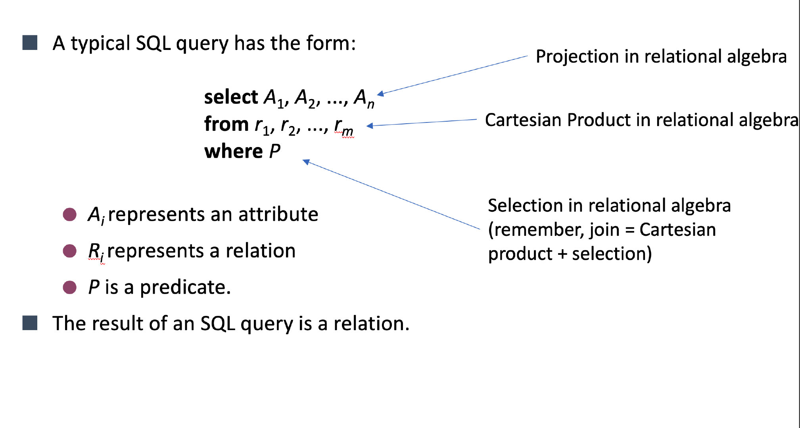

### Extension ✅

* Each query input is a table (or set of tables)
* Each query output is a table.
* All data in the output table appears in one of the input tables
* There are many things that relational algebra (and SQL) cannot do
  * E.g. things that require recursion
* Extension of relational algebra to incorporate SQL statements such as
  * SUM 
  * AVG 
  * MAX 
  * MIN
  * GROUP BY…HAVING


### Why? ✅

* Very straight forward way of converting SQL statements into a list of operations

* Now executing a query becomes executing a program of such operations
* Implementing them correctly and efficiently will ensure the database system perform well


## Course outline ✅

* NoSQL (from data modelling perspective)

* Internals of a DBMS       

  * Query execution and optimization

    >```sql
    >SElECT name
    >From Student
    >WHERE gpa > 3.9
    >```

  * Concurrency Control

  * Recovery

* Distributed databases / Big Data

  * NoSQL (from a performance perspective)

> At least most of the mainstream database systems like mysql, SQL Server, DB2, all these are still running on relational model. Now, there's some modification here. Some people will tell you they are running the object relational model. But underlying it is still a relational model. And relational model has been very popular, has been very successful.
>
> At least the second part of the class will be focused on the internals of a database system, a relational database system.
>
> So this class, we're going to look more inside the internal operations.We're going to look at the clear execution optimization.


> if you understand underlying how the database system work now we can flip the table back and let's say you IDBA, let's say you the administrator of a database.
>
> Murphy's Law: Anything that can go wrong, and at the worst possible time.
>
> So let's say an example. Let's say I want to transfer money from a savings account to a checking account. I want to transfer \$100 from me to you. It basically need to take to subtract \$100 from my account. And they need to add \$100 to your account
>
> From my account: -100
>
> ----------------------------------------     Murphy's law: the system will crash here. 
>
> To your account: +100
>
> If the system crashed here for 5 seconds and the system restart. But how do you make sure thing doesn't go hardware? 
>
> ACID doesn't cover full recovery, It also cover an issue called Concurrency Control.
>
> What should the ATM do? The first thing is to check whether your have \$100. If you does have 100\$. Then put a cut out. The will minus 100$ from my account.
>
> 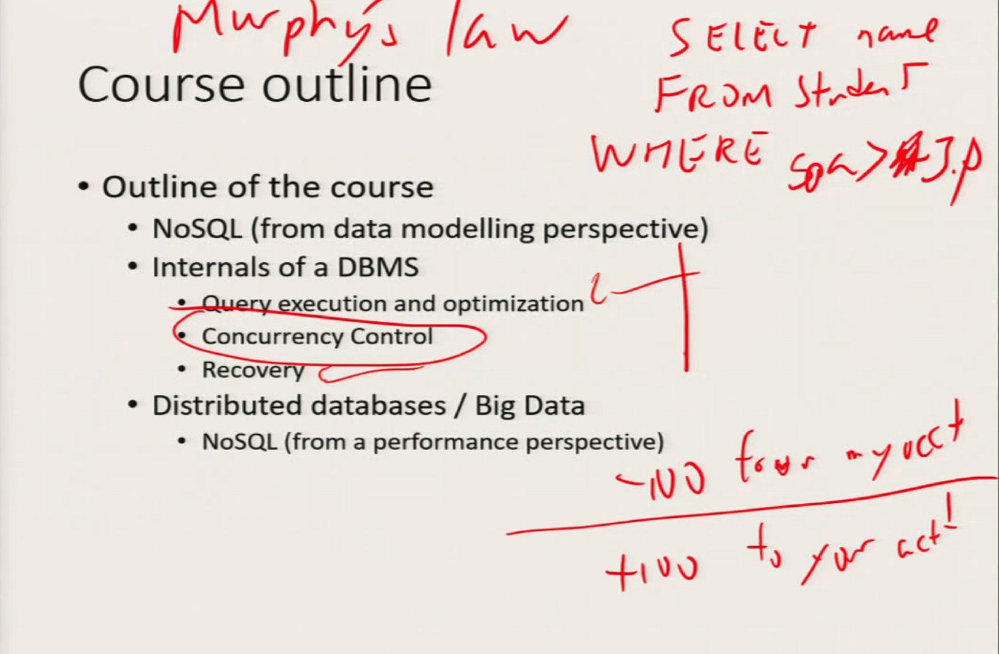


> ```mermaid
> graph TD;
> A(ATM:you x = 100$)
> B(Your spouse)
> ```
>
> You put your card in ATM. And you to check if you have a $100
>
> if subtract $100 from your account and then give you 100 bucks

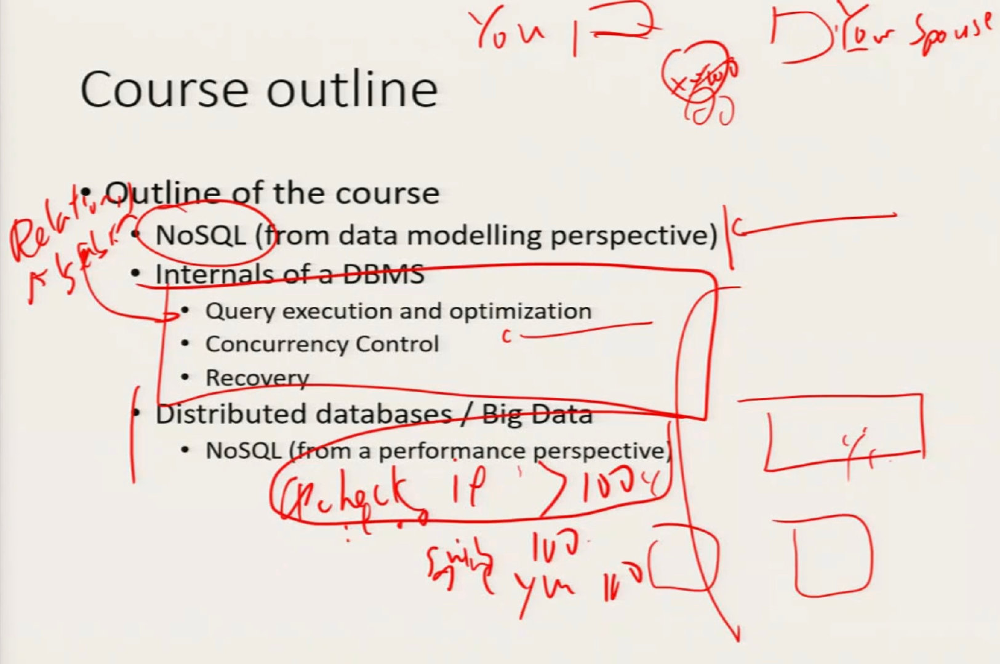


## NoSQL databases

* A history of database systems

  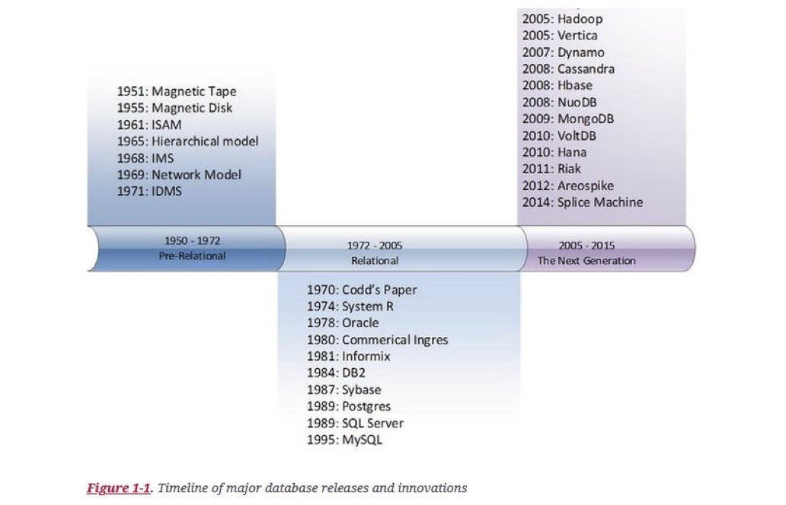

From: Guy Harrison, “[Next generation databases : NoSQL and Big Data](https://smu.primo.exlibrisgroup.com/discovery/fulldisplay?docid=alma9952401872403716&context=L&vid=01SMU_INST:01SMU&lang=en&adaptor=Local Search Engine)”, Apress, 2015

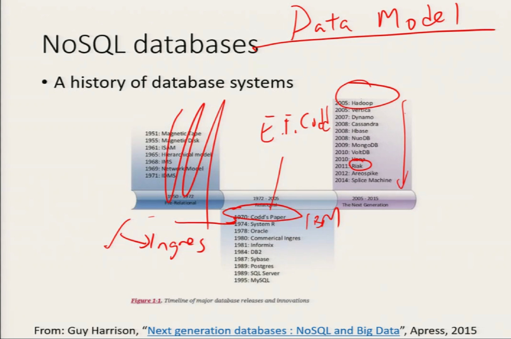


## First Generation Databases ✅

* Network Model/Hierarchical Model
* Works on mainframes
* Navigation based (i.e. you need to tell the DBMS “where” the data is)
  * E.g. following pointers and links (parent-child etc.)
* ==Drawbacks==
  * Inflexible schema structure (next to impossible to change mid-stream)
  * Navigation based means complex query equal to complex program
    * User have to specify how to get to the data

> Think about a database represented as a tree. And each piece of data if they knock on the tree.
>
> tree structure is also very rigid


## Second Generation Database ✅

* Relational Model

* ==Advantages==

  * Well-defined mathematical background 

  * **Normal forms.   **   // Normalizaiton

    * “all non-key attributes must be dependent on “the key, the whole key, and nothing but the key—So Help Me Codd”

  * Separation of physical and logical layers

    * Make things like optimization possible/manageable

      > ```sql
      > SELECT name 
      > FROM Student
      > WHERE gpa > 3.6
      > ```
      >
      > Do you have any clue how the data is actually physically organized in the database?
      >
      > You have no clue. Do you need to have any clue? 
      >
      > NO. That's the key point. That's where the relation model becomes very successful.
      >
      > If I am a user, do I care how the data is being stored? No, I don't. But if you are a DBA, you might want to care because you want to create to return faster. but the total separation of physical and logical layer is important. 

  * Full transaction model (ACID)

    * For concurrency and recovery

      > ACID 表示原子性（atomicity）、一致性（consistency）、隔离性（isolation）、持久性（durability）。ACID 是数据库事务（database transaction）需要向用户确保有效的属性——即使在出现崩溃、错误、硬件故障等情况时也需要保证这些属性。

  * Well suited for client-server systems

  > You have a database that sits somewhere on a computer, constantly running 
  >
  > You have other people have either web browser machine, they send a query, hey, I want to ask this school query. He wants to assess the centralized database, collect the query, execute it, and send the results back to the user.
  >
  > ```mermaid
  > graph TD;
  > A--> B(Database)
  > B-->A
  > C-->B
  > B-->C
  > D-->B
  > B-->D
  > E-->B
  > B-->E
  > F(...)-->B
  > B-->F
  > ```

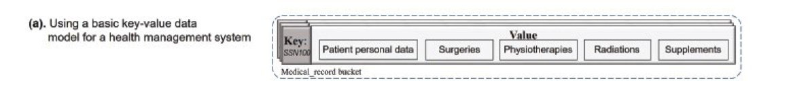


## Limit of relational models ✅

* First normal form

* ==No compound value (set/list/sequence etc.)== 

  > |      |                  |
  > | ---- | ---------------- |
  > | 1    | 7330, 7445       |
  > | 2    | 7330, 7555, 7688 |
  >
  > This might be what you want to do right, but in the relation model, this is seriously discouraged.
  >
  > Why is it being discouraged in a traditional relational database?
  >
  > So that means a human being had to encode this. 
  >
  > I can encode this way  7330, 7555, 7688     or  7330 # 7555 # 7688
  >
  > Then let's say find all student who asks who is taking 7555? Your sql will be very ugly
  >
  > Because you basically are giving up all the advantage to a relational database give you so you are forced to do something like this. Which is fine. It's just that people don't like it.

* To store this require multiple tuples:

| **Student ID** | **Course** |
| -------------- | ---------- |
| 1              | CS 7330    |
| 1              | CS 7445    |
| 2              | CS 7330    |
| 2              | CS 7555    |
| 2              | CS 7688    |

> a student was taking two classes, I need to have two separate tuples


* Modeling of (undirected) graph can be very tricky

| **Edge** **ID** | **Node 1** | **Node2** |
| --------------- | ---------- | --------- |
| 1               | 1          | 2         |
| 2               | 1          | 4         |
| 3               | 3          | 2         |
| 4               | 5          | 1         |
| 5               | 4          | 6         |

> Can you think of some real life data that is very nicely suited to be model by graph?
>
> Can you think of application where the data is better suited to be as a graph?

* Do we need to duplicate edge?

* Either query will be complicated (e.g. node1 = 3 or node2 = 3)

  > If I want to see Node1 and Node5 is connected, how will the sql looks like?
  >
  > ```sql
  > select count(*)
  > from t
  > where ((node1 = "1") AND (node2 = "5"))
  > 			 or
  > 			 ((node1 = '5') AND (node2 = "1"))
  > ```

* Or inconsistency may occur (deleted (1, 3) but forget to delete (3,1) 

  > If you delete one five and forget to delete five one, then you're screwed.
  >
  > Very high potential inconsistency.

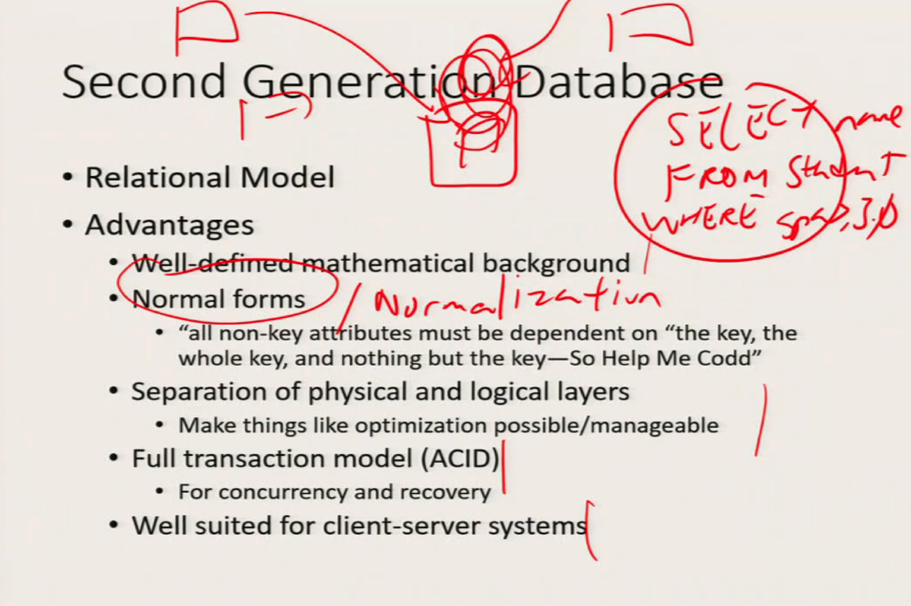

* Development of new applications

  * Large amount of data
  * Not necessarily structured
    * Potentially evolving

  * Required high availability and fault tolerance
    * ACID may not be the best options for transactions


SQL does not do recursion, because you don't know how many tables you will jump.


## NoSQL databases ✅

* More flexible data models
  * Semi-structured / Non-structured
  * Allow for evolving (non-fixed schema)

* Weak consistency model
  * Not requiring ACID properties
* Different storage management
  * E.g. storing via columns
* Designed to allow replication
  * Need to handle consistency (<u>or allow limited level of inconsistency</u>) 
* Targeted for Big Data / Web applications

> 事务具有4个特性：原子性(Atomicity)、一致性(Consistency)、隔离性(Isolation)和持续性(Durability)。这4个特性简称为ACID特性(ACID properties)。


## NoSQL Data Models ✅

* Key-Value stores

* Wide Columns stores

* Document stores

* Graph stores


### Key-Value Store ✅

* Data are represented as a set of (key, value) pairs

* Key

  * Can be simple (single attributes) or structured (composition of attributes)
  * DBMS provide efficient means of indexing them

* Value

  * Treated as a BLOB (Binary large object)
  * No structure (schemaless)
    * User has to interpret the structure him/herself

  * Some system provide a little bit of structure
    * List/tables of values

* Typically provide efficient operations on
  * Get(Key)
  * Put(Key, value)
  * Delete(Key

* Suitable for system that want maximum flexibility
  * Cost: no database support of handling/interpreting values

* Example: Redis


> But the whole thing the whole point said the key value store call value very efficient organization based on the key and the key only.
>
> Example: doctor -> patient treatment records 


### Wide Column Store ✅

* Rows and column sets

* A set of rows
  * Each with a row-key

* Each row has a fixed number of column sets (family)
  * Each column set has an arbitrary set of columns
  * No need to be the same for different rows
  * Each column has a column name and value associated with it. 
* Many such system allow timestamps
  * Each column has a timestamp indicating when it is added to the database
* Data can be group by rows or by column sets
* Index structure available for columns
* Support big data operations such as map reduce
* Example: Apache HBase

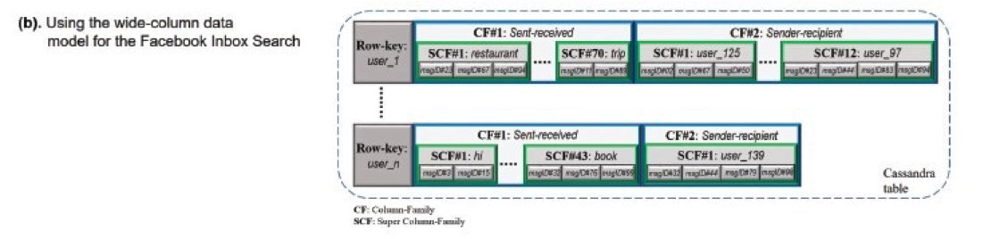


### Document Store ✅

* Extended key-value structure where value is represented as a “document”

  * E.g. XML, JSON
  * Basically a document has a set of attributes
  * Each attribute has a name and a set of values
  * Attributes can be different for different keys

* Data are grouped into buckets (like tables)

* Relationship between documents are modelling via embedding or referencing documents

  * Embedding: attributes are documents themselves 

    > duplicating the way 

  * References: attributes are keys of other documents

* Provide indexes for document attributes

* Provide query language support to retrieve (part of) a document

* Example: MongoDB, Amazon DynamoDB

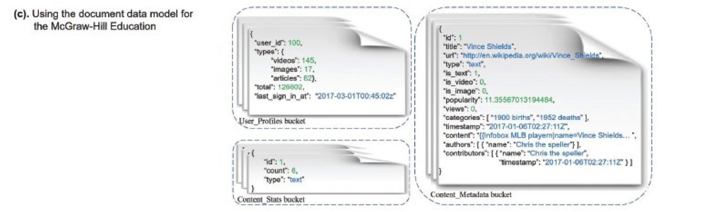


### Graph Store ✅

* Data Represented as graphs
* Potential different types of graphs
  * Undirected/Directed graphs
  * Labeled graph: vertex/edge have scalar values 
  * Attribute graph: (key, value) pairs associated
  * Multigraphs: Multiple edges between vertices
  * Hypergraph: Each edge is a set connecting multiple vertices


* Two types of storage
  * Non-native: build on top of other storage system (e.g. Document store)
  * Native: Build from scratch

* Graph Query 
  * Path query: check if a path exist between two nodes
    * May specify only certin type of paths (e.g. only contain certain labels)
  * Pattern matching query: find all the path that isomorphic with the query graph (maybe allow wildcards in some places)
  * Some system provide more complicated graph queryies


* Example: Neo4j, Titan


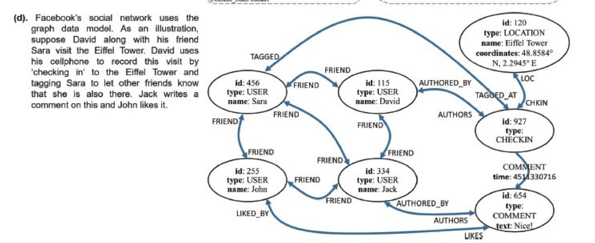


### Other major issues ✅

* Most NoSQL database are aim at large, distributed data with long transactions

  * Different consistency/isolation levels then ACID

  * Distributed data issues

    * Data may be distributed and replicated 
    * Multiple copies of the database running on different sites
    * Network may fail without any of the database failing
    * The CAP issue
      * Consistency – (close to) serializability
      * Availability – How likely the system can withstand failure of multiple sites 
      * Parition tolerance – will network failure causes different copy of the database to become inconsisant

    * CAP Theorem: You can only choose 2 out of the 3 to maintain correctly.


## Quiz 1 ✅

Consider modeling two entities ("Student" and "Faculty", each of them having multiple properties), and a relationship between them ("Advise"). Suppose we want to embed Faculty documents as part of the Student document (but not vice versa). Under what condition will this be a reasonable choice (as if without causing duplication and potential inconsistencies)?

(You can also assume these are the only entity/relationships that needs to be modeled)

(a) if Advise is a 1-1 relationship

(b) if Advise is a 1-n relationship (with 1 student having many advisers, but each faculty having only 1 advisee

(c) If Advise is a 1-n relationship (with 1 faculty having many advisers, but each student having only 1 advisor

(d) If Advise is a m-n relationship (with m, n > 1) 

A. (d) 

B. (a) and (c) 

C. (a) and (b) ✅

D. (a), (b), (c) and (d) 

My Answered: C

Correct Answer: C

题意Student(Faculty)

(a) 可以嵌套 因为 是 1-1 Student(Faculty(Advise))

(b) 可以embed, 1-n Student(Faculty{Advise1, Advise 2 ...})

(c) ❌ Student(Faculty({Advise1, Advise 2,....}) Advise 1) -> duplication

(d) ❌ duplication + inconsistencies 