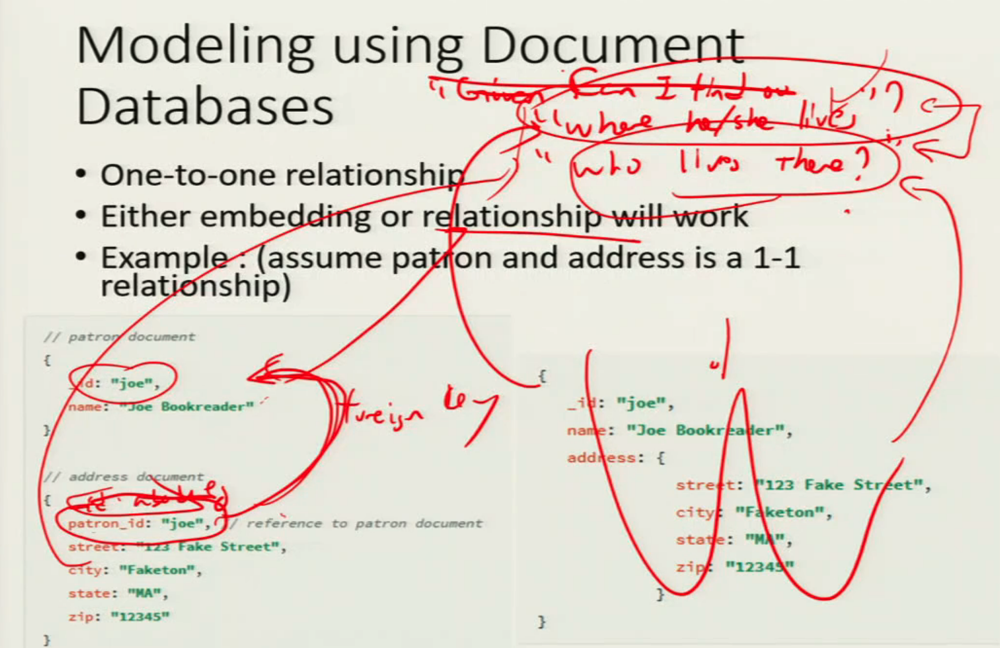
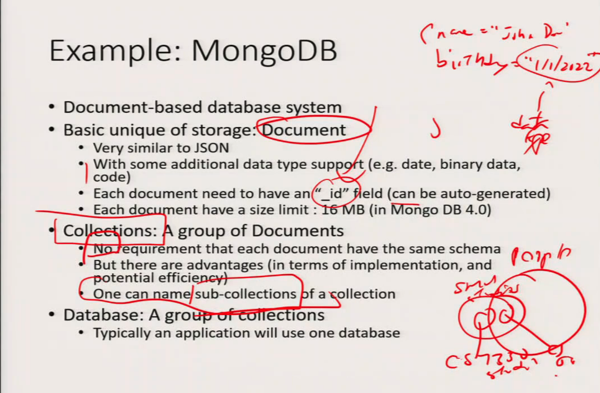
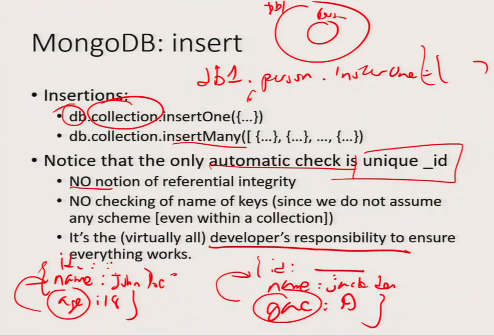

# 2 NoSQL : Document Databases & MongoDB

> MongoDB is a kind of NoSQL database. We call it document database.
>
>
> Why obejct oriented database fail?
>
> 1. efficiency
> 2. No clear query language
> 3. ...
>
> 
>
> Can you switch a the database underlying Amazon into a MongoDB so that you maintain the same efficiency? Same computer, same resources. Can you do it with the same efficiency?
>
> A: The answer at this stage is unclear. And if the answer is no, then this database is going to die anyway. No matter how easy you can do your schema, if it turns out your database system is not as fast as doing things relational database. No company is going to use it.
>
> It is unclear whether the NoSQL database we express as a relational database all convenience is not going to give you it in order for you to using the system translate to 5 seconds slower, five millisecond slower for each transaction you dead. But now it doesn't mean that these are not useful. I do want to give you a word of caution.
>
> But still, this warning aside, as I say, I still think there is a lot of value on in learning the database system because in certain circumstances they are useful. for example, in application where you can kind of trade correctness a little bit with efficiency. All Maybe another second of my running time is not going to save me a lot of dollars. But if I use this database system, maybe the management, the schema becomes much easier that I'm willing to pay the price. Or as I say, last time we talked about we relational database are weak in handling different types of data, relational database doesn't do well.

 ## Motivation: Semi-structured data ✅

* Relational model is very rigid in terms of structure

* For example, consider this table:

  | SSN       | Name     | Phone-#  |
  | --------- | -------- | -------- |
  | 123456789 | John Doe | 123-4567 |
  | 234567890 | Mary Doe | 456-8901 |

* But what if someone have more/less than one phone?


* No phone

  | SSN       | Name     | Phone-#  |
  | --------- | -------- | -------- |
  | 123456789 | Brad Doe | NULL     |
  | 234567890 | Mary Doe | 466-8901 |

* What can NULL means?

  * Brad has no phone
  * Brad has a phone but I don't know his number
  * Possible ambiguity


* Many phones

  | SSN       | Name         | Phone-#  |
  | --------- | ------------ | -------- |
  | 123456789 | Tai-Kwan Doe | 555-5555 |
  | 234567890 | Tai-Kwan Doe | 689-0777 |

  > Look at the table, there is very important problem?
  >
  > Combine primary key: SSN + Phone-#      
  >
  > A key is not a thing to attribute. A key can be a combination of attributes as long as they are unique overall tables.
  >
  > A bad habit: just think and when you start think only have a key.
  >
  > Remember, database have a responsibility to maintain the uniqueness of a primary key. Database have no responsibility to maintain any other unless you asked it to do that. And when you aked it to do that you will be less efficiency. 
  >
  > if you have  a table and you have people key  and you set peoplekey to be the key, What happen?
  >
  > | Peoplekey | SSN       |      |
  > | --------- | --------- | ---- |
  > | 1         | 123456789 |      |
  > | 2         | 234567899 |      |
  > | 3         | ....      |      |
  > | 4         |           |      |
  > | ...       |           |      |
  >
  > The database will be responsive to maintain that. Database has no responsiblity  to maintain two tuples tend have a same SSN unless you tell it to do that. 
  >
  > And if you want a table such that two different peope has the same SSN?  Then you fire.
  >
  > Querying primary key has more efficent.
  >
  > In the later semester, the database can only do that with one key. If you ask query base on the artificial key will be faster than asking a query based on SSN. (Indexing)
  >
  > Do you want it? That's the question you need to ask do efficiency matter in your application
  >
  > The database will try to be very efficient in indexing the primary key. You can declare a unique attribute out of the primay key. The database will also atuomate here for that, but this method will be less efficient.

* Cause duplication

  >1. wast space 
  >2. obvious the issue but hardrive is cheaper 
  >
  >What's the main problem of duplication?
  >
  >If Tai-Kwan Doe change his name into Cool Doe
  >
  >He has to change all the tuples. 
  >
  >The worst thing is that if you forget to change one. You will be fired.
  >
  >The NO.1 task for database application is consistency unless you have very a clear mandate that you do not care.

* Anomaly and/or inefficiency


Taxi. Old time. Call a certain company to get the passager.  


* Many problems can be resolved by normalization (breaking into multiple table)

  > In the undergratuate school, you can use two table: 1. ssn+Name 2.ssn+number  But in this way, there is no free lunch. Drawback is if do something you have to join the table. Join is not efficent in the real life.

* But queries will require potentially many joins

  * Can be inefficient

* Solution:

  * Semi-structured data


## Semi-structured Data 半结构化数据✅ 

* Some data have a bit of a structure
* E.g. item have a set of attributes
* However they can still differs
  * Some attributes may be present in some items but not all of them
  * Some attributes for an item may have multiple values
  * ... or even multiple possible types
* So new models are proposed. Examples:
  * XML https://www.w3schools.com/xml/xml_whatis.asp
  * JSON


## JSON ✅

* JavaScript Object Notation

* Orignally decided as a way for information interchange

  * Text-based

  * **Self describing**

    * The "schema" is described within the object

      > There's no database schema out there. There is no external schema

* While the schema for an object is flexible, the way of describing the schema is fixed.

  * Thus one can write standard tool(s) to interpret any JSON object, without knowing its schema beforehand.


* Each JSON object is represented as a set of <u>name/value</u> pairs
  
  ```json
  {"name":"John", "age":30, "car":null}
  ```
  
* Name is a string in quotes("name", "age", "car")

* Each name has a value associated with it.

* Valid value types:
  * String
  * Number
  * Array
  * Boolean
  * Null
  * Another JSON object


> The original use for Json is not to store data. It meant for people to exchange information. Such that the structure of the information is somewaht cohesive. 
>
> Self describing: So let's say I want to describe myself using a decent document. I have to explicitly say, Hey, this is me. My name is David Lee. My age is, say, 75. My height is, say, five foot five. I have to explicitly mention a name height. Right. My name of my two kids are a set of A and B, for example. 
>
> There's no database schema out there
>
> 
>
> Drawback: 1. the way you organize the obejcts. Searching may not be most efficient. 2. waste space 
>
> Always a double edged sword. There is no free lunch.
>
> 
>
> You can write a program to interpret Jason objects in a very standard, straightforward way. It's not hard. You guys should be able to do it. If you take any data structure, class and so forth, you should be able to think.


## JSON (Example of complex case) ✅

https://www.sitepoint.com/twitter-json-example/

> if you just look for Json document, there's no restriction on anything, you may have the same location being four different ways to work.
>
> The whole point of that end, and we call it being a JSON object, the idea of document database, you can think of a document as a case, an object.
>
> And in order to put it into a database, they will put a little bit more restriction on it.
>
> 

## General idea of document databases ✅

* Database store objects

  * Objects are known as documents

  * Name/value pairs are usually termed as **<u>key</u>**/value pairs

    > So key here is not quite a key in the relational database. The work here is really more correspond to attribute names. So be careful about this. In a relational database. We think of a key. We think of kind of like assets and that unique attributes for each table. Here where I see that what key I usually means with what we've raised academic capital.

* **Objects have unique IDs** 

  * Typically as Entity in E-R Model

    ```
    {_id: ____
    	title:"Harry Potter ___"
    	author: J.K.Rowling
    	year: 1995
      ISBN:_
    }
    
    {_id: ____                    //Unique
     name: J.K.Rowling
     age: 65
     national: England
     height: 54"
    }
    ```

    more freedom -> sometime inefficiency.

​		

* Relations between objects can be enforced by

  * Nested Objects/Documents (embedding)
  * Key/value pairs where values are IDs of documents to be related (references)

  

  > So now this kind of document based system is very good. If all your objects are independent of one another, there's no relationship between one document against the other. However, in real life, things are related. 
  >
  > How do you relate things and how do you relate things efficiently and consistently?
  >
  > If you do not care about this, if everything is fine, welcomed and fit, you can do whatever you want. But unfortunately, or maybe fortunately in life, things are related and you need to capture that relationship.


* Other properties 

  * Data are often grouped into buckets (like tables)      

    > In the mongoDB call collections
    >
    > And most of these systems will provide some indexing method that you can use to index documents. For example, I want to index all offers based on name so that I can search for it more efficiently.

  * Provide indexes for document attributes

  * Provide query language support to retrieve (part of) a document


## Modeling using Document Databases ✅

* One-to-one relationship
* Either embedding or relationship will work
* Example: (assume patron and address is a 1-1 relationship)


```json
// patron document
{
  _id: "joe",
  name: "Joe Bookreader"
}

// address document
{
  patron_id: "joe", // reference to patron document
  street: "123 Fake Street",
  city: "Faketon",
  state: "MA",
  zip: "12345"
}
```

> ```mermaid
> graph TD;
> A(patron);
> B(address);
> ```
>
> I want to link the two things 
>
> Patron_id : each Each address can only have one patron. It's kind of like a foreign key.


This is what called embedding


```json
{
  _id: "joe",
  name: "Joe Bookreader",
  address: {
    					street: "123 Fake Street",
    					city: "Faketon",
    					state: "MA",
    					zip: "12345"
 					  }
}
```

> "Where he/she live"?           --> embedding
>
> "Who live there"?                 --> no embedding
>
> So that the answer to that question becomes determine which design is better.
>
> No free lunch.
>
> So understand how the application is being used, is important in your database. This turns out to be a very general question, not just restricted to NoSQL databases
>
> 
>
> Most system basically will have a automatically generated ID for every document.


* One-to-many relationship

* Example : (assume patron and address is a 1-m relationship)

* Embedding

  ```json
  {
    "_id": "joe",
    "name": "Joe Bookreader",
    "addresses":[
      					{
                  "street": "123 Fake Stree",
                  "city": "Faketon",
                  "state": "MA",
                  "zip": "12345"
                },
      					{
                  "street": "1 Some Other Street",
                  "city": "Boston",
                  "state": "MA",
                  "zip": "12345"
                }
   						  ]
  }
  ```
  
  




* One-to-many relationship

* Example : (assume publisher and books is a 1-m relationship)

* relationship

  

> So once again, it kind of depends how likely you want to use books as an individual thing. Through it, we'll kind of decide how are you whether you want to do it this way or this previous way. And that question cannot be answered in the classroom. It has to be answered when you actually ask the client, what does he or she wants?


**What you should AVOID**

* Duplication of data
* Same problem as in relational databases 


* One thing you should never do

* Whenever there is a relationship between two objects, using relationship should only be from one object to the other, BUT NOT BOTH WAYS

* Why not?         

  > When John Doe graduated from SMU, he does not want to live in the SMU. So update the new address will be esay miss something. then you are dead. Like you forget update the patron_id then you have inonsistency.

* Which way to go is database and application dependent

  ```shell
  { _id = “_1”;
     name = “john doe”
     address = “_add1”              // 
  }
  {
     _id = “_add1”
     address = “SMU Blvd”
     patron_id = “1”                //
  }
  ```


* **Document models tends to works well with binary relationship.**
* For relationship with multiple entity (e.g: supplier-restaurant-food), it may need either:
  * Deep embedding
  * Creating separate objects to store the relationships (in terms of E-R modelling, treating relationship as entity)

> Dallas restaurant: In and out, What a burger, Tao rice roll.
>
> rice beef bread
>
> ```mermaid
> graph TD;
> A(In and out)-->E(beef)-->G(Supplier A: rice & beef)
> B(What a burger)-->F(bread)-->I(Supplier C: rice & bread)
> C(Tao rice)-->D(rice)-->H(Supplier B: beef & bread)
> 
> 
> 
> 
> 
> 
> 
> 
> ```
>
> It's term relationship, If you break it down into binary relationship, you have a problem.
>
> If in and out required breef and rice, supplied by A. If he need bread so it will relate to C or B, B C also offer beef and rice so which is offer. Maybe they will half half like that.
>
> ```
> {_id: ___
> name: "in and out"
> food: "beef"
> supplier: ["A", "C"]
> 
> }
> 
> 
> {_id:___
> name: "in and out"
> food: {{ name:beef
> 					supplier: 'A'
> 				}
> 				{ name: "rice"
> 					supplier: 'C'
> 				}
>     }
> }
> // it is the binary relationship between the restaurant and the whole thing,  you relate this whole thing within 
> // So you are essentially creating a relationship as a document.
> ```
>
> 
>
> If all you have a binary relationship between complicated objects, document models do have this advantage, do have it.
>
> And you want to account for the fact that, say, some objects don't have all the attributes, some object have only different type of attributes. Document model does that pretty well and we'll have to give them


## Example: MongoDB ✅

* Document-based database system

* Basic unique of storage: ==**Document**==

  * Very similar to JSON

  * With some additional data type support (e.g. date, binary data, code)

    > ```shell
    > { name = "John Doe"
    >   birthday = '1/1/2022' 
    >   //you can actually specify this as a date type where MongoDB will provide a bunch of say operator so you can compare to dates to see which one come first. You can probably calculate a difference between those two dates. How many dates are this behind that.
    > }
    > ```

  * Each document need to have an “_id” field (**<u>can be auto-generated</u>**)

  * Each document have a size limit : 16 MB (in Mongo DB 4.0)

* Collections: A group of Documents

  * No requirement that each document have the same schema 

    > no fixed schema

  * But there are advantages (in terms of implementation, and potential efficiency)

  * One can name sub-collections of a collection

  > a collection is not a table
  >
  > Although MongoDB to explicitly mention you are willing to keep the same schema for every object you will have, the system will be able to make it more efficient. Because they can make use of internal data structures and so forth. So once again, it's up to you. You want flexibility or you want efficiency. 
  >
  > And other interesting thing that MongoDB do is you can actually have a notion of subcollections. -> improve efficency  because no need to look for everything

* Database: A group of collections

  * Typically an application will use one database




### insert ✅

* Insertions:

  `db.collection.insertOne({...})` 

  > db is the name of database, collection is the name of collection

  `db.collection.insertMany([{...}, {...}, ..., {...}])`

* Notice that the ==only automatic check is unique `_id`==

  * **No notion** of referential integrity
  * No checking of name of keys (since we do not assume any scheme [even within a collection])
  * It's the (virtually all) **<u>==developer's responsibility==</u>** to ensure everything works.

  > ```MongoDB
  > {_id: __
  > name: "John Doe"
  > age: 18
  > }
  > 
  > // then you want to insert something 
  > {_id: ___
  > name: "Jack Doe"
  > gae: 19           // the system won not check
  > }
  > 
  > // The system will say yes it wil not say no
  > // Because there is no restriction on the number of keys and different keys.
  > // So you get the idea that you better check your spelling in such things.
  > ```




### ==selection✅==

* Basic method: find()
* `db.collection.find( {<selection>}. {<projection>} )`
  * Describe the documents to be retrieved
  * Each of this has the same format as a document (but without the_id).
* `db.collection.find({})`
  * Return all documents in the collection
* `db.collection.find({"name" : "john doe", "age" : 30})`
  * ==**Return all documents that have BOTH key value pairs**==
  * Logical And
* Note:
  * Value in the key/value pair in find must be a constant.
  * Need other constructs to relate different documents from the same/different collections

> if you want to be restricted, you are essentially doing kind of a matching by matching columns, all by matching attributes


### projection✅

* `db.collection.find({"name": "john doe"},{"name":1, "age": 1})` 

  * Return all documents that have key value pair (name: John doe), and output the name and the age 

  > The first parameter `{"name": "john doe"}` they return the name. This is tell you what document do you need. The second parameter `{"name":1, "age":1}` tell you what key do I want to return.

* `db.collection.find({"name": "john doe",{"name":0, "age": 1}})`

  * Return all documents that have key value pair (name: John doe), and output age, but not the name

* Note: 

  * `_id` : is output by default
  * Can suppress it by including `{"_id":0}` in the projection clause


### selection clauses ✅

* `db.collection.find({"name": "john doe", "age": {"$gte": 18}})`
  * Return all documents have name John doe, and is at least 18 years old (gte = greater than or equal to)
  * Clause: a document, the key is a reserved word starting with`$`, to denote special condition or functions
* `db.collection.find({"name": "john doe", "age": {"Sgte":18, "$lte": 22}})`
  * Return all documents that have name John Doe, and is between 18 and 22 (lte = less than or equal to)


### OR/ NOT ✅

* `db.collection.find({"dept": "CS", {$or, [{"age": {"$gte": 18}}, {"gpa": 4.0} ] } })`
  * Return all documents that have dept = "CS" and either age is >= 18, or age = 4.0
  * Notice that the term following or is an list (array) of conditions.
* `db.collection.find({"dept": "CS", {$not, {"gpa": 4.0}}})`
  * Return all documents that have dept = "CS" and gpa $\neq$4.0 


### ==NULL values==  ✅

* ==BE VERY CAREFUL!==

* Suppose your collection has the following docutments:

  * `{"_id": "1", "name": "john doe", "phone": null}`
  * `{"_id": "2", "name": "jack doe", "age": 28}`

* `db.collection.find({"phone": null})` will return BOTH documents

  * Null matches either "having the value null", and "no such key exists in the document"

    > If you try to do this form equal to now, then you will return both documents, you have to be careful about what this empty string means

  * Use the "$exists" clause to compensate


### Arrays ✅

`{ “_id” : “1”, “name” : “john doe”,  “x” : [1, 3, 5, 11]}`

* The following queries will return this document

  * `db.collection.find( {“x” : 5} )`

    > find me all the document such that the actual x is five. Notice that if your attribute is an arry by default, it will mean that five is contained in this array. Once again, short hand fast, but it can also be a bit ambiguous.

  * `db.collection.find( {“x” :  {“$gte”, 4, “$lte”, 11}} )`

  * `db.collection.find( {“x” : {“$gte”, 7, “$lte”, 9}} )`

    > However, MongoDB will still return this document. Logic is OR. one element that matched the first condition and one element that matched the second condition there find.
    >
    > For example, I want to find. I want to this class to somebody wearing a yellow shirt and glasses. MongoDB as long as that one person who satisfied each of the different positions, it will perfect fine.

    * Why?
      Notice that matching an array means that every clause has to be matched, **==but each clause can be matched by a different element in the array==**
    * Use $elemMatch to overcome this


### Embedded documents ✅

```mongoDB
{ “_id” : “1”, “name” : “john doe”,  
             “course” : {“cid” : “CS 5330”, “grade”: “A”} }
```

* `db.collection.find({“course” : {“cid” : “CS 5330”, “grade”: “A”} })`

  * will return the document


* `db.collection.find({“course” : {“cid” : “CS 5330”} })`

  * Will NOT

  * <u>For embedding documents, require perfect match (“_id” can be left out)</u>

    > Because in MongoDB by default, if you want to match and back the document, you have to do a perfect match.

* `db.collection.find({“course.cid” : “CS 5330”} }) `

  * Will return the document again

  * Use dot notation

    > Because you explicitly say that I only need to match that key into every document.


### More complicated issues ✅

(See MongoDB manual / books for details)

* Matching array of embedded documents can be very tricky

* No inherit way to “join” multiple collections using the query language
  * Need to write program and using API
  * There is an option of a “$WHERE” clause where you can embed code inside a query statement 

> Matching a real embed. The document can be very tricky if you think about earlier we talk about making an array already is tricky matching and embed document is also tricky. Put these two together. It's actually very quick.

 

### Updates and Delete ✅

* `db.collection.updateOne()`
* `db.collection.updateAll()`
* `db.collection.replaceOne()`
* `db.collection.replaceAll()`
  * Two parameters
    * First one is the query conditon to specify which document(s) in the collection is to be updated
    * Second one specify how the document is to be updated/ or what to replace the document with
    * <u>**==For replacement, the "_id" will not change, but everything else will be replaced==**</u>
    * Also an "upsert" option: try to update, if the document to be updated is not found, then insert a new document.


The MongoDB shell provides the following methods to update documents in a collection:

* To update a single document, use 

  `db.collection.updateOne()`

* To update multiple document, use

  `db.collection.updateMany()`

* To replace a document, use

  `db.collection.replaceOne()`


### Other aspects ✅

* Indexing – per collection basis, similar to relational database indices

* Specific type of indices for specific data types (e.g. text, geospital)
* Aggregation – group by, and computation based on groups
* Replication – allow for duplication of data 

> Relational database are not good in replication. In fact, you can see people like my age or older who is in favor of relational database. They will argue that replication is bad for your health. You really should not replicate a database. We now have cloud computing. We now have Fast Fast Index, the first network and never are more reliable. A lot of the reason that was against replication is gone.


## Quiz 1 ✅

Which of the following about the MongoDB query language is true? ✅

(a)  db.collection.find( {“state": "TX", “pop” : 20000} ) returns all document with key/value pair ("state", "TX") OR ("pop", 20000) ❌

(b)  db.collection.find({“state” : null}) will only returns document that does not have a "state" key ❌

A. (a) and (b) 

B. Neither (a) nor (b) ✅

C. (b) 

D. (a) 

My Answered: B

Correct Answer: B

(a) It will returns all documents with key/value pair `("state", "TX") AND ("pop", 200000)`, the logical is `And`.