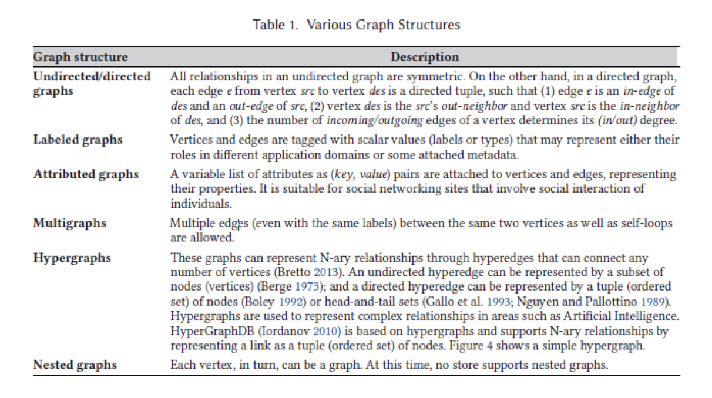

# 3 Graph Databases

## 10.6 Graphs ✅

**Graph**

* Vertices and edges
* Vertices (may) have (multiple) labels/attributes
* An edge connects a pair of vertices
  * Can be directed (or not)
  * Can have (multiple) labels/attributes
  * May have multiple edges between any pairs of vertices (not common, but can be useful)


Graphs can be used to model:

* Relationships
* Maps
* Networks


From: Eifrem, Robinson, Webber, “Graph Databases”, 2nd edition


From: Eifrem, Robinson, Webber, “Graph Databases”, 2nd edition


> Graph represented by relational model is not a very smart thing.


> So to some degree, you can actually understand the need of a graph database even more than a document database. Because news that percent in graph is a clear but it is a disadvantage in a relational database system.
>
> of course, if your application doesn't lead itself to a graph, you don't want to force itself to be in the graph. Because also you need to remember that a lot of growth algorithms are not the most efficient thing out there. So you don't want to force your application into a graph if it's not necessary, but if it's somehow that's a somewhat natural fit, a graph can be very useful and building a graph database can be useful in its own right.


> Relational database did not do a good job as graph, because of the limitations of the relational models. You have to put everything in the table.
>
> Example: Fred is the friend of Ed, and Ed is also friend of Fred. However, Bob is the friend of Zach, Zach is not friend of Bob.
>
> This situation happens, the relational database will limited the efficiency. Because you have to do a lot of extra things for checking purposes or other stuff. It will tend to be riddled with problems.
>
> -> need to build a database such that I can directly represent a graph. 
>
> 
>
> A lot of graph, like for the shortest path ever found might be useful in a lot of real life applications.


## Diffterent types of graphs ✅



> In theory, attributed graphs and multigraph are pretty much interchangeable. It is useful to distinguish them just for thought management sake. Maybe we have a specific type of excuse and depend on the system. Sometimes may not be a better idea to have different ideas. So do the type everyone or only that kind of edges. And it depend on how the underlying database implemented it may be more efficient to do it that way. So that's kind of a different way of looking at the same thing.
>
> Hypergraphs and Nested graphs are probably less popular, at least somewhat intuitively upon. But it is useful. 
>
> Hypergraph's connect more than two nodes. (Restaurant, Food, Supply) example.  Remember this example is not a binary relation. It is  ... ?❓last class. We are relating three things together at the same time. Hyper graph will help you when you multiple things at the same time. But the bad news that hypergraph will casue a lot of graph problem, like time consuming. So hypergraph is not used too often. If you have to use that, you have to make sure you not do things too complicated.
>
> Nested graph is a vertex be a graph itself. For example, I hava a graph that about cities and flight between them. They are talking about and connecting cities that fly from one place to another. 
>
> ```mermaid
> graph TD;
> Dallas-->Cleveland.OH
> Dallas-->Austin
> ```
>
> There is anther transportation, like dart train. If you insert the information in the Dallas about the dart train. The dart train station also is a graph. Or may be even bus. 
>
> 
>
> **Undirected/directed graphs**
>
> All relationships in an undirected graph are symmetric. On the other hand, in a directed graph, each edge *e* from vertex *src* to vertex *des* is a directed tuple, such that (1) edge *e* is an *in-edge* of *des* and an *out-edge* of *src*, (2) vertex *des* is the *src*'s *out-neighbor* and vertex *src* is the i*n-neighbor* of *des*, and (3) the number of *incoming/outgoing* deges of a vertex detemines its (*in/out*) degree.
>
> >
> >
> >An undirected graph is graph, i.e., a set of objects (called vertices or nodes) that are connected together, where all the edges are bidirectional. An undirected graph is sometimes called an undirected network. In contrast, a graph where the edges point in a direction is called a directed graph.
> >
> >
> >
> >A directed graph is graph, i.e., a set of objects (called vertices or nodes) that are connected together, where all the edges are directed from one vertex to another. A directed graph is sometimes called a digraph or a directed network. In contrast, a graph where the edges are bidirectional is called an undirected graph.
> >
> >When drawing a directed graph, the edges are typically drawn as arrows indicating the direction, as illustrated in the following figure.
> >
> >
>
> 
>
> **Labeled graphs**  
>
> Vertices and edges are tagged with scalar values (labels or types) that may represent either their roles in different application domains or some attached metadata.
>
> 
>
> 
>
> **Attributed graphs**  
>
> A variable list of attributes as (key, value) pairs are attached to vertices and edges, representing their properties. It is suitable for social networking sites that involve social interaciton of individuals.
>
> > An example of attributed graph. Both nodes and edges have attributes. 
> >
> > 
>
> 
>
> **Multigraphs**  [ˈmʌltɪɡræf]
>
> Multiple edges (even with the same labels) between the same two vertices as well as self-loops are allowed.
>
> > In mathematics, and more specifically in graph theory, a multigraph is a graph which is permitted to have multiple edges (also called parallel edges[1]), that is, edges that have the same end nodes. Thus two vertices may be connected by more than one edge.
> >
> > 
>
> 
>
> **Hypergraphs**  ['haipə,gra:f]
>
> These graphs can represent N-ary relationships throught hyperedges that can connect any number of  vertices (Bretto 2013). An undirected hyperedge can be represented by a subset of nodes (vertices) (Berge 1973); and a directed hyperedge can be represented by a tuple (ordered set) of nodes (Boley 1992) or head-and-tail sets (Gallo et al. 1993; Nguyen and Pallottino 1989). HyperGraphDB (lordanov 2010) is based on hyper graphs and supports N-ray relationships by represeting a link as a tuple (ordered set) of nodes. Figure 4 shows a simple hypergraph.
>
> > In mathematics, a hypergraph is a generalization of a graph in which an edge can join any number of vertices. In contrast, in an ordinary graph, an edge connects exactly two vertices.
> >
> > 
> >
> > An example of an undirected hypergraph, with $ X=\{{v_{1},v_{2},v_{3},v_{4},v_{5},v_{6},v_{7}}\} $ and $E=\{e_{1},e_{2},e_{3},e_{4} \} = \{  \{ v_{1},v_{2},v_{3} \}, \{v_{2}, v_{3} \}, \{v_3,v_5,v_6 \}, \{v_4\} \}$. This hypergraph has order 7 and size 4. Here, edges do not just connect two vertices but several, and are represented by colors.
> >
> > While graph edges are pairs of nodes, hyperedges are arbitrary sets of nodes, and can therefore contain an arbitrary number of nodes. However, it is often desirable to study hypergraphs where all hyperedges have the same cardinality; a k-uniform hypergraph is a hypergraph such that all its hyperedges have size k. (In other words, one such hypergraph is a collection of sets, each such set a hyperedge connecting k nodes.) So a 2-uniform hypergraph is a graph, a 3-uniform hypergraph is a collection of unordered triples, and so on.
> >
> > 
> >
> > An example of a directed hypergraph, with $ X=\{1,2,3,4,5,6\}$ and $ E=\{a_{1},a_{2},a_{3},a_{4},a_{5}\}={\displaystyle \{(\{1\},\{2\}), \{(\{2\},\{3\}), \{(\{3\},\{1\}), \{(\{2,3\},\{4,5\}),}\{(\{3,5\},\{6\})\}\}$.
> >
> > 
> >
> > 
>
> 
>
> **Nested graphs**
>
> Each vertex, in turn, can be a graph. At this time, no store supports nested graphs.
>
> > A series of destinations can be grouped into a nested graph within a parent navigation graph called the root graph. Nested graphs are useful to organize and reuse sections of your app’s UI, such as a self-contained login flow.
> >
> > The nested graph encapsulates its destinations. As with a root graph, a nested graph must have a destination identified as the start destination. Destinations outside of the nested graph, such as those on the root graph, access the nested graph only through its start destination.
> >
> > Figure 1 shows a navigation graph for a simple money transfer app. From the start destination on the left, the graph has two flows: one along the top for sending money and another along the bottom for viewing an account balance.
> >
> > 
>
> 

## ==Typical Operations for graph databases== ✅

* On-line graph ==**navigations**==:
  * Explore a (typically small) subset of vertices
  * Require fast response time


> ```mermaid
> graph TD;
> Dallas-->Cleveland.OH
> Dallas-->Austin
> Dallas-->A
> Dallas-->B
> A-->Cleveland.OH
> B-->A
> Dallas-->C
> D-->Dallas
> E-->Dallas
> ```
>
> Can I go from vertex D to vertex E or Can I fly from Dallas to Austin or can I fly from Dallas to Timbuktu? I don't need a direct flight to get from Dallas to Timbuktu.
>
> Dallas: Which place I can fly? And I want to continue to ask this question again and again. So this is what we call navigation quesitons.
>
> These are not typical questions that are aksed by relational database, although you can do it for one thing.
>
> SQL by itself do not support recursion. If you have to do that, you has to use C++ or other and then use API to talk to the database.
>
> So you can see that there is a difference here for what graph database should support. And you will see no matter what graph database system you any reasonable graph database system should support these kind of thing for efficient.

* Two types

  * ==**Path query**==
    
    * Whether a path exists between two given vertices
    
    * **==Conditions on the edges along the path==**
    
      **For path queries, one can restrict the types of edges for that path**
    
    * Can also be given only one vertex and find all the other vertices that can be reached/can reach it from the query vertex.
  
  > So if you look at the flight information, I am going to ask whether it can still fly from Houston to Hong Kong? I don't care how many flights or whatever. So does there exists a path?
  >
  > Now I can be more complicated. Say, can I fly from Houston to Hong Kong only by using American Airline? 
  >
  > Things may be more complicated. I have back problems and I can't sit on the flight for too long, Can I fly from Houston to Hong Kong such that each length of the flight is no more than 5 hours? 
  >
  > So but things like that these are the types of queries that do I have a path from one look to the other and you and if I furthermore restric the type of edges I can use.
  
  
  
  * ==Pattern matching query==
    
    * Find all subgraphs that is **==<u>isomorphic</u>==** to the query subgraph
    
      找到所有与查询子图同构的子图
    
    * Gerneral graph isomorphism is ==**NP-complete**==
    
      一般的异构图是np完备的
    
      > P是一个分类, 基本上包括所有可以用相当快的程式解决的问题, 如乘法或者排序
      >
      > 然后 有个包含P类的NP类: 如果你作出了正确的解决方案, 可以在一个合理的时间量检验它的方案是否正确. 
      >
      > https://www.youtube.com/watch?v=YX40hbAHx3s
      >
      > https://www.bilibili.com/video/BV1WW411H7nH/?spm_id_from=333.999.0.0&vd_source=73e7d2c4251a7c9000b22d21b70f5635
      >
      > 即能用多项式时间验证解的问题是否能在多项式时间内找出解
    
    *  Subgraph pattern matching is not often implemented because it is NP-complete
    
    * **==Tree==** isomorphism has polynomial time solutions
    
      树同构有多项式时间解
  
  > isomorphic    [ˌaɪsəˈmɔrfɪk] adj. [物] 同构的；同形的
  >
  > Talking about in discrete math. iso means 1 to 1 match.
  >
  > it means is there  a 1 to 1 match between vetex and edge. Such that this match such two graphs actually at the same shape.

  >If I have a graph, like this I want to ask. So basiically from the previous graph, each day love triangle brewing. Maybe it is a love triangle.
  >
  >```mermaid
  >graph TD;
  >A(male)-->B(male)
  >B(male)-->C(female)
  >C(female)-->A
  >
  >```
  >
  >
  >
  >So I want to look at a graph that had thik kind of shape, this kind of construction. 
  >
  >``` mermaid
  >graph TD;
  >A-->B
  >C-->B
  >```
  >
  >If I can find a graph that I can. Maybe even as simple as this.
  >
  >```mermaid
  >graph TD;
  >A-->|"Southwest"|B-->|"Spirit"|C-->|"JetBlue"|D  
  >```
  >
  >You can actually put any restrictions on any of the things. Obviously, the more restricitons you put, the less likely you can find a match. But there's nothing stopping you from doing that.
  >
  >
  >
  >For example. I have a graph, can I find a subgraph I four texts and five edeges state connected this way.
  >
  >```mermaid
  >graph TD;
  >A-->B;
  >A-->C;
  >A-->D;
  >B-->D;
  >C-->D;
  >
  >
  >```
  >
  >The graph maybe very large. I want to find a usbgraph four vertexes.and five edges that look like this. 
  >
  >Now the bad new is that in the general context, this problem is what we call NP-complete.
  >
  >What is NP-complete means? What is the NP stand for?
  >
  >NP-complete: nondeterministic polynomial-time complete.
  >
  >> nondeterministic  [ˈnɒndɪtɜːmɪˈnɪstɪk] adj. [数] 非确定性的
  >>
  >> polynomial [,pɔli'nəumiəl] adj. 多项的，多词的；多项式的 n. 多项式；多词拉丁学名；表示任何多项数之和
  >
  >What Korean drama or movie you want? PTS, black pain... 
  >
  >A girl has to go to the USA for a study, so the boys keep writing letters to her, stating his love or whatever. Now, once the boy sent the letter, they have three possible outcomes. Assumption she receives the letter: 1. He never received a letter, so he never know whether the girl say yes or no. 2. Yes 3. Just be friends 
  >
  >N-complete is something like this. Basically means that there is no efficient algorithm. All algorithm take exponetial. However, I have never been able to prove that there's nothing better. So nobody approved that. Nobody can prove that explanation time is alobal.
  >
  >> exponential  [ˌekspəˈnenʃl] adj. （增长）越来越快的；指数的，含有指数的 n. 指数
  >
  >Polynomial: How do you know about traveling salesperson problem. Used to be called a traveling salesman. But nowadays, I presume we should call traveling salesperson. I have to deliver ten packages and go back to headquarters. And let's assume all ten locations are connected. So you can really choose, you can really make a lot of choices. Tell me the fastest way to do it. That's the NP complete problem. So far, nobody have find a polynomial time ever. However, nobody has proven that you must you can only do it polynamial time. So what do you do?...
  >
  >Just like the boy, the girl didn't ever say. Let's just be friend. But the girl also didn't say that hey, let's get married. The boy has to sit and wait. And surprisingly, there is a lot of real life important problems that fall into that category. Now you may ask why the polynomial? The polynomial actually means that if I give you a diretcion, if I go from A to B, B to C, C to go back to headquarters. It is easy to check where the path, which longer than 300 hundred. 
  >
  >​        
  >
  >Checking one things is easy. There are just too many things to check. And no one have find a way to check people or things. And no one has also conclusively say that you have to check all these.
  >
  >So that's why, even though it is a very general query, it's a very important query. Most database system support only a very restrictive version for.
  >
  >The good news is that if you restrict yourself to trees, no cycles. Then you can actually find efficient out of them. If you understand this, you probably will understand why a lot of graph database only provides certain kind of queries because other kinds of crew are just flat out. No efficient solution exists.
  >
  >> crew    [kruː] n. 全体船员，全体机组人员；一组工作人员；一伙人，一帮人；全体划船队员；赛艇运动；<美，非正式>（尤指演奏车库音乐的）一群乐师 v. 当船员，当空乘人员
  >>
  >> flat out   [ˌflæt ˈaʊt]  v. 竭尽全力；用全速；疲惫
  >
  >


* ==Off-line== analytical graph computation
  
  * Analyze large (number of ) graphs
  
  * Typically iterative computation (not map-reduce)
  
    典型的迭代计算(不是映射-减少)
  
  * Require highly tuned graph packages
  
    需要高度调优的图形包
  
  * Aim for ==high throughput==, ==not now **latency**==
  
    目标是高吞吐量，而不是延迟
  
  > Now there are also a lot of things people won't photograph which can be done offline
  >
  > Offline: there is no need for immediate answer. Typically an offline query, typically query for a large number of things and even more for some cases, you may actually be willing to tolerate some degree of inaccurancy.
  >
  > Latency: Kind of more like response time. You are not looking for quick response, but you want the system to be able to do a lot of calculations. You want a database system to support not just hardware, but soft program wise support you to do things a lot very efficiently.


## Example: Neo4j ✅

* Based on the ==Labelled Property Graph Model==
* 4 major component of a graph
  * **==Nodes==** - generally for entity
  * Relationships (edges) - generally for relationship between entities
  * Properties - key/value pairs that is associated with nodes and/or relationships
    * Like document model, no need for fixed schema
  * Labels: Assigned to nodes (notice that, just labels, not key/value pairs)


> What is a labeled property graph?
>
> A labeled property graph (LPG) is a type of graph database.
>
> In LPG-style databases the graph is comprised of nodes and relationships. Each node or relationship has an ID tag, one or more “labels” describing its type or class, and a set of “properties” that present values and a corresponding key to allow referencing.
>
> Intuitively, two nodes are always joined by a relationship to form the larger structure of the graph.
>
> There is no standardized query language for all LPG-style databases, but Cypher is the most widely adopted one.
>
> **Example:**
>
> 
>
> We could retrieve information about the example above using a Cypher query like this:
>
> MATCH (person1:Person)-[relationship:Married]->(person2:Person)
> RETURN person1, relationship, person2


> properties are basically your database schema or attributes and values for each thing. And the key difference here is the existence of relationship explicitly. I'll just give you enough self head to point out some important properties that you will find not only in Neo4j but in other graph database systems.


From, Jerome Baton, “Learning Neo4j 3.x”, 2nd edition

> We have freedom and types of labels right off us. Write the one in yellow readers and books. Right. So we clearly distinguish which type of things you think about it that far over in naturally as tables in relational models right now for each vertex you have say. Name is Alan, so and then he's the name of the reader, for example, in this case. Right. On the other hand, he's just a reader. He doesn't really care about the database, doesn't really care about any other information. However, for often they want to store more. So, for example, John Le Carre, born in 1932, and then Graham Greene, he's born in 1904. He died in 1991. Maybe I can remember this whole thing. So you have different schema. You can have books and then you can have edges. Now we may that if it works there some system there. So you can write this book for example he this book. So some I guess in the newer case, you can even put labels on edges.


## Neo4j Data Model ✅

* ==Work best for **binary relationship** between entities==

* May need extra node for n-ary relationships

* Challenge of whether making something a property or a node

  * Make graphs simpler vs. query speed
  
  * Depends on whether it is faster to traverse a graph vs. serach node/edge based on properties.
  
    
  

> Now, once again, many of this one thing you can kind of critique on all these new all these mythical nautical databases for whatever reason, maybe for efficiency sake, maybe for simple implementations that they all geared to off by the relationships.
>
> And as I mentioned, hyper grab. Everyone can run much longer than just a normal graph algorithm.

> so that is become whenever you build a graph the main I would I do questions about building graph database system is this.
>
> And once again, may I remind you, if the database is inconsistent, you are dead.

>-2.jpg)
>
>-3.jpg)
>
>So the one challenge of NoSQL databases is whether they can handle a complicated data modeling situation.
>
>No free lunch.


* General mapping from E-R model to Graph Model
  * Entity -> Nodes (with labesl serve as names)
  * (Binary) Relationship -> Edges
  * Attributes -> Properties


## ==Cypher== ✅

* Common database language for graph databases
* Based on patterns and pattern matching
* Basic ideas:
  * Database: a set of nodes and edges
  * Commands to create those nodes and edges
  * Queries: specifying a pattern of edge/node/paths/subgraphs and try to match it.

> 

https://neo4j.com/docs/cypher-manual/current/introduction/


### **Creating a node:**

* `CREATE (u: User {username: "greg", age: "33"})`

  * Return a User (label) node (u) that has a property (name/"greg", age/33) 
  * The variable u is used as a reference to the node
  * You can create multiple nodes (separate each node with a comma)

   

  


### **Finding a node**

```cypher
Match (a:User), (b:System)
where a.username = "greg" and b.sysname = "unix"
return a,b
```

* Notice that if multiple nodes matches they will all be returned (like a Cartesian Product)

  > 


### Projections 

```cypher
Match (a:User{name:"John Doe"})
RETURN a.age, a.gender
```


### Patterns used for queries

* (a)
  * matching any node
  * a is the variable name that use to refer to the node in the rest of the query
* (a) --> (b)
  * Match any pair of nodes that go from a to b
* (a)<-- (b)
  * Match any pair of nodes that go from b to a
* (a)-->(b)-->(c)
  * Match three nodes that form a path from a to b to c

* (a: User)
  * matching any node with the label user.
  * a is the variable name that use to refer to the node in the rest of the query
* (a: User: Admin)
  * Matching nodes with BOTH labels
* (a: User|Admin)
  * Matching nodes with either label
* (a:{name:"John"}, age:25)
  * matching any node with the following properties.
* (a) -> [{length: 30}] -> (b)
  * Matching a path where the edge has the property specified


### Building an edge

* ```shell
  MATCH (a:User), (b:System)
  WHERE a.username="greg" AND b.sysnmae = "UNIX"
  CREATE (a)-[pr:LOGIN]->(b)
  SET pr.date = "11/11/2020"
  RETURN pr
  ```

  * Create an edge from node a to node be, with the label "LOGIN" and key/value pair (date/"11/11/2020")

> As long as the vertexes, you can create all the necessary edges. That may or may not be what you want, but at least you have the possibility of doing that.


### **==Constraints==**

* ==Uniqueness Constraint:== 唯一性约束

  * CREATE CONSTRAINT ON (a: USER) ASSERT a.username IS UNIQUE

    > So you cannot use a word to have the same username

  * Ensure uniqueness of username for all USER nodes

  * ==Specify all nodes that have a certain label must have distinct values in the property that is specified== 

  > Unique property constraints ensure that property values are unique for all nodes with a specific label. For unique property constraints on multiple properties, the combination of the property values is unique. Unique constraints do not require all nodes to have a unique value for the properties listed — nodes without all properties are not subject to this rule.
  >
  > 唯一节点属性约束
  >
  > 唯一属性约束确保属性值对于具有特定标签的所有节点是唯一的。对于多个属性上的惟一属性约束，属性值的组合是惟一的。唯一约束不要求所有节点对列出的属性都有唯一值——没有所有属性的节点不受此规则约束。

* Property Existence Constraint:

  * CREATE CONSTRAINT ON (a.User) ASSERT exists(a.username) 

    > must be existed

  * Ensure every node of User have username property

> There's no requirement that every vertex have the same properties, frankly, and even there's no requirement.


### **Matching patterns**

* (a)
  * Match a single node
* (a) --> (b)
  * Match two nodes that is linked by an edge
* (a) --> (b) <-- (c)
  * Match three nodes, where a, c, points to b
* Notice that variables name doesn't have to be included.


* (a: User)

  * Match a single node with label User

* (a: User: Admin)

  * Match a node with 2 labels, User and Admin

* (a: User| Admin)

  * Match a node with either User or Admin

* (a: User) -> (b)

  * Match two connected nodes, where the first node has label User

    


* (a) -> [r: TYPE] -> (b)

  * Match a path, with label TYPE on edge

* (a) -> [*2] -> (b)

  * Match a path from a to b, with length 2 (two edges)

    // And this is one thing that provided by graph database that is very hard to replicate in the relational database at all.

* (a) -> [*3..5] -> (b)

  * Match a path from a to b, with length between 3 and 5

  

> What is the strengths and weaknesses? And what does a typical query looks like?
>
> If you can understand the query, I'm looking at least for exam purposes.


## Quiz 1 ✅

For graph model databases, which of the following is/are correct?

(a) Subgraph pattern matching is not often implemented because it is NP-complete

(b) For path queries, one can restrict the types of edges for that path

Correct Answer

A. (a) and (b) ✅

B. Neither (a) nor (b) ❌

C. (b) 

D. (a)

My Answered: C

Correct Answer: A

(a) ✅

**==Pattern matching query==**

* Find all subgraphs that is **==<u>isomorphic</u>==** to the query subgraph

  找到所有与查询子图同构的子图

* Gerneral graph isomorphism is ==**NP-complete**==

  一般的异构图是np完备的

  > P是一个分类, 基本上包括所有可以用相当快的程式解决的问题, 如乘法或者排序
  >
  > 然后 有个包含P类的NP类: 如果你作出了正确的解决方案, 可以在一个合理的时间量检验它的方案是否正确. 
  >
  > https://www.youtube.com/watch?v=YX40hbAHx3s
  >
  > https://www.bilibili.com/video/BV1WW411H7nH/?spm_id_from=333.999.0.0&vd_source=73e7d2c4251a7c9000b22d21b70f5635
  >
  > 即能用多项式时间验证解的问题是否能在多项式时间内找出解

* **==Tree==** isomorphism has polynomial time solutions

  树同构有多项式时间解

 (b) ✅

==**Path query**==

* Whether a path exists between two given vertices
* **==Conditions on the edges along the path==**
* Can also be given only one vertex and find all the other vertices that can be reached/can reach it from the query vertex.


The uniqueness constraints in Cypher refer to:

A. Specify no two nodes can have <u>the same number of properties</u> 

指定两个节点不能具有相同数量的属性

B. Specify <u>no two nodes of the specifed label can be joined by an edge</u> 

指定指定标签的两个节点不能被边连接

C. Specify all nodes <u>must have distinct labels</u> 

指定所有节点必须有不同的标签

D. Specify all nodes that have a certain label must have distinct values in the property that is specified ✅

My Answered: D

Correct Answer: D

A. ❌ don't care about the number of properties, just care about the a specific label.

B. ❌ 可以

C. ❌ make sure the have a specific label is ok. 

D. Unique node property constraints
Unique property constraints ensure that property values are unique for all nodes with a specific label. For unique property constraints on multiple properties, the combination of the property values is unique. Unique constraints do not require all nodes to have a unique value for the properties listed — nodes without all properties are not subject to this rule.

唯一节点属性约束

唯一属性约束确保属性值对于具有特定标签的所有节点是唯一的。对于多个属性上的惟一属性约束，属性值的组合是惟一的。唯一约束不要求所有节点对列出的属性都有唯一值——没有所有属性的节点不受此规则约束。