# Chapter 12 Physical Storage Systems

> 中文chapter 10

## Query Processing ✅

* Big question

* Suppose I sent an SQL query to MySQL like:

  ```sql
  SELECT id, name
  FROM Student, Advise, Instructor
  WHERE Student.id = Advise.student_id AND
  		Advise.instructor_id = Instructor.id AND
  		Advise.department = "CS" AND
  		Student.gpa >= 3.0
  ```

* This query tell the database what the answer to be

* But does not tell the database how to get the results

  * The database management system (DBMS) need to figure it out 

* To figure it out, the DBMS needs to know

  * How the data is organized
  * Where the data are
  * What are the operations involved to retrieve the data
  * The cost of the operations (so that the DBMS can pick the best one)

* We will start with how data are organized

> You probably know how to decide about an application that use a database, design tables, create labels, store them, and make good design essentially. However, to a large degree, your database to you is still a black box.  You at least need to start to note how your database is actually behaving. Internally so you can know how these the best way to optimize your operations. I want to work for Oracle and I want to write up the next generation of application that or the next generation of database system that you really, really need to know how the database system work internally and what are the major issues and what are the major solutions that come with them.


> You write this query, you set it to my C code. You expect my finger to get the result to write. You don't need to tell mySql how to get.


> we won't talk too much about complexity. We assume, you know, the complexity and all systems that use it too are going to have the same complexity.


> There are two types of storage, magnetic hard drive and solid-state drive

 

## 12.1 Storage Devices ✅ 

> The professor skim the part, read the textbook yourself.
>
> https://zhuanlan.zhihu.com/p/102293437

* Two main types of storage
  * **volatile storage**: loses contents when power is switched off 
  
    易失性存储: 在设备断电后将丢失所有内容
  
  * **non-volatile storage**: 
    
    * Contents persist even when power is switched off. 
    * Includes secondary and tertiary storage, as well as batter-backed up main-memory.
  
* Nearly all database applications will require (at least some) non-volatile storage

* Factors affecting choice of storage media include
  * Speed with which data can be accessed
  * Cost per unit of data
  * Reliability


* **primary storage** 基本存储: Fastest media but volatile (cache, main memory).

  高速缓冲存储器(cache), 主存储器(main memory): 主存储器是用于存放可处理的数据的存储介质.

* **secondary storage** 辅助存储:next level in hierarchy, non-volatile, moderately fast access time
  
  * Also called **on-line storage** 联机存储

  * E.g., flash memory, magnetic disks
  
    快闪存储器(flash memory),磁盘存储器(magnetic-disk storage)
  
* **tertiary storage** 三级存储: lowest level in hierarchy, non-volatile, slow access time
  
  * also called **off-line storage** 脱机存储 and used for **archival storage** 档案存储
  
  * e.g., magnetic tape, optical storage
  
    光学存储器(optical storage): CD, DVD
  
    磁带存储器(magnetic tape): 磁带存储器主要用于备份数据和归档数据.它必须从头顺序访问,所以慢. 也被称作顺序访问(sequential-access)
  
  * Magnetic tape
    * Sequential access, 1 to 12 TB capacity
    
    * A few drives with many tapes
    
    * Juke boxes with petabytes (1000’s of TB) of storage
    
      自动光盘机(jukebox) 


## 12.2 Magnetic Hard Disk

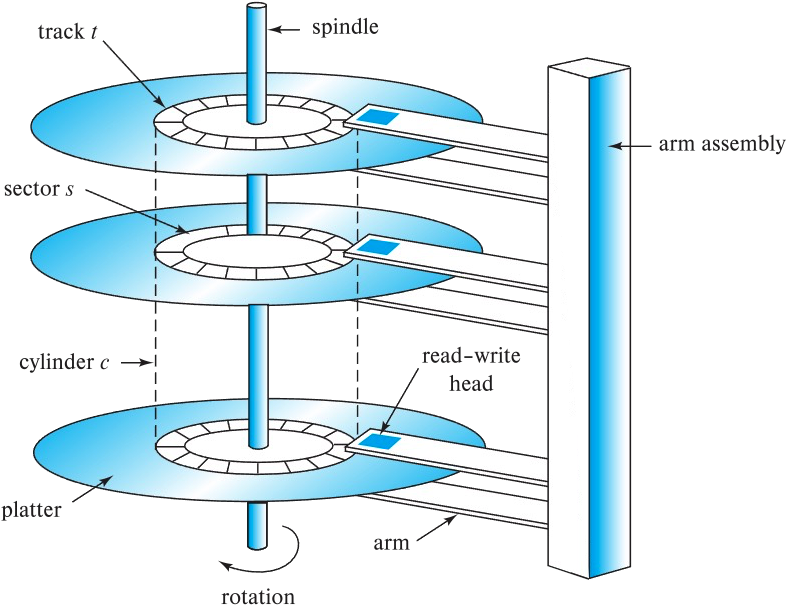


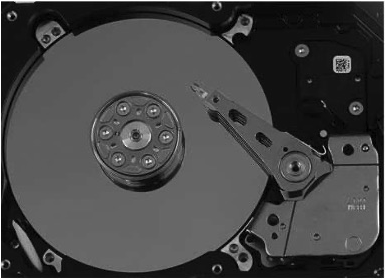

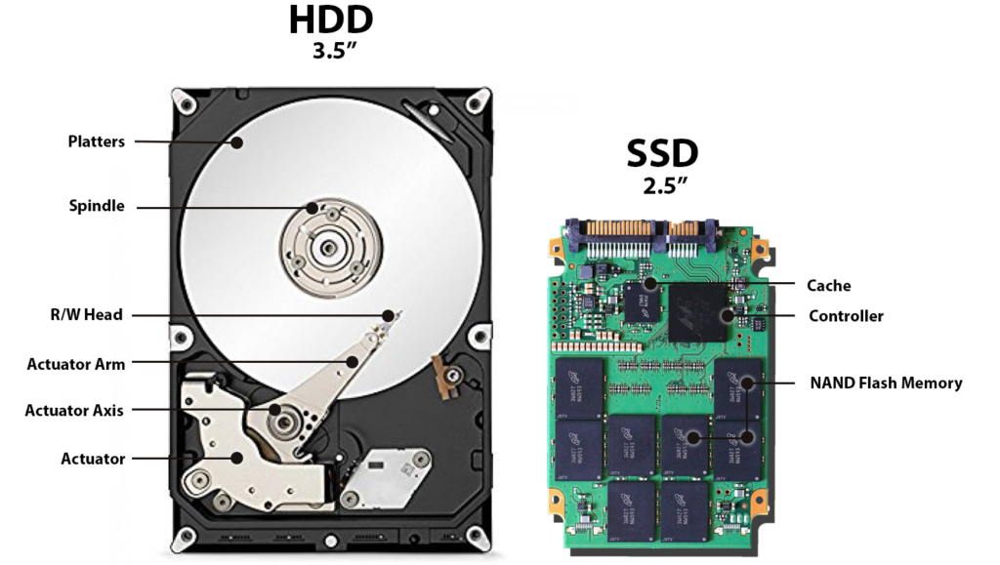


### 12.2.1 **Read-write head** ✅

* Surface of platter divided into circular **tracks**
  
  platter(盘片)的表面从逻辑上划分为tracks(磁道)
  
  * Over 50K-100K tracks per platter on typical hard disks
  
    每一个platter(盘片)有约50,000-100,000条tracks (磁道)
  
    > 磁盘的每一个盘片(platter)是扁平的圆盘. 它的两个表面都覆盖着磁性物质, 信息就记录在表面上. 盘片由硬金属或玻璃制成.
  
* Each track is divided into **sectors**.
  
  track(磁道)划分成为sector(扇区)
  
  * A sector is the smallest unit of data that can be read or written.
  
    sector(扇区)是从磁盘读出和写入信息的最小单位
  
  * Sector size typically 512 bytes
  
    sector(扇区)大小一般为512字节
  
  * Typical sectors per track: 500 to 1000 (on inner tracks) to 1000 to 2000 (on outer tracks)
  
    内侧每track(磁道)大约包含500-1000个sector(扇区), 而外侧每磁道大约包含1000-2000个扇区.
  
* To read/write a sector 
  * disk arm(磁盘臂) swings to position head on right track
  * platter spins continually; data is read/written as sector passes under head

* Head-disk assemblies (磁头-磁盘装置)
  
  安装在转轴上的所有磁盘盘片和安装在磁盘臂上的所有读写头统称为(head-diskassembly)

  * multiple disk platters on a single spindle (1 to 5 usually)
  * one head per platter, mounted on a common arm.
  
* **Cylinder** *i* consists of *i* th track of all the platters 

  所有盘片的第$i$条磁道合在一起称为第$i$个柱面(cylinder)


> Three steps 1. seek 2. rotate 3. read/write
>
> 1. lowest 
>
> 2. fastest
>
>    1 >> 3       roughtly thousand time

  


### 12.2.1 Disk controller ✅

Disk controller – interfaces between the computer system and the disk drive hardware.

Disk controller(磁盘控制器) - 作为计算机系统和实际的磁盘驱动器硬件之间的接口. 

* accepts high-level commands to read or write a sector 

  它接受高层次的读写sector (扇区) 的命令

* initiates actions such as moving the disk arm to the right track and actually reading or writing the data

  开始动作, 如移动disk arm(磁盘臂) 到正确的磁道, 并实际地读写数据.

* Computes and attaches **checksums**(校验和) to each sector to verify that data is read back correctly
  * If data is corrupted, with very high probability stored checksum won’t match recomputed checksum
  
    >磁盘控制器为它所写的扇区附加校验和(checksums), 校验和是从写到扇区中的数据计算得到的. 当读取一个扇区时, 磁盘控制器用读到的数据再一次计算校验和, 并且把它与存储的校验和比较. 如果数据被破坏, 则新计算出的校验和与存储的校验和不一致的可能性就很高.如果发生了这样的错误, 磁盘控制器就会重读几次; 如果错误继续发生, 磁盘控制器就会发出一个读操作失败的信号.
  
* Ensures successful writing by reading back sector after writing it

* Performs **remapping of bad sectors** (坏扇区的重映射)

  > 当磁盘初始格式化时, 或试图写一个扇区时, 如果磁盘控制器检测到一个损坏的扇区, 它会把这个扇区在逻辑上映射到另一个物理位置(从为此目的而留出的额外扇区中分配). 重映射记录在磁盘或非易失性存储器中, 而写操作在新的位置上执行.


### 12.2.2 Access time ✅

**Access time** – the time it takes from when a read or write request is issued to when data transfer begins. Consists of: 

访问时间(access time) 是从发出读写请求到数据开始传输之间的时间.

* **Seek time** – time it takes to reposition the arm over the correct track. 
  
  寻道时间(seek time) 磁盘臂重新定位的时间. 磁盘臂首先必须移动, 以定位到正确的磁道, 然后等待磁盘旋转, 直到指定的扇区出现在它的下方.
  
  * Average seek time is 1/2 the worst case seek time.
    * Would be 1/3 if all tracks had the same number of sectors, and we ignore the time to start and stop arm movement
    
      假设所有的磁道包含相同的扇区数, 同时我们忽略读写头开始移动和结束移动所花费的时间, 我们可以得到平均寻道时间是最坏情况下寻道时间的$\frac{1}{3}$. 考虑到前面忽略的这些因素, 平均寻道时间大约是最长寻道时间的$\frac{1}{2}$
    
  * 4 to 10 milliseconds on typical disks
  
* **Rotational latency** – time it takes for the sector to be accessed to appear under the head. 

  旋转等待时间(rotational latency time): 一旦读写头到达了所需的磁道, 等待访问的扇区出现在读写头下所花费的时间.

  * 4 to 11 milliseconds on typical disks (5400 to 15000 r.p.m.) 

    这是磁盘每转的时间

  * Average latency is 1/2 of the above latency. 

  现在一般的磁盘转速在每分钟5400转(每秒90转) 到每分钟15000转(每秒250转)之间, 或者等价地, 在每转4毫秒到每转11毫秒之间. 平均情况下, 磁盘需要旋转半周才能使所要访问的扇区开始处于读写头的下方. 因此磁盘平均旋转等待时间是磁盘旋转一周时间的1/2.

* Overall latency is 5 to 20 msec depending on disk model

  访问时间是寻道时间(seek time)和旋转等待时间(rotational latency time)的总和

* **Data-transfer rate** – the rate at which data can be retrieved from or stored to the disk.
  
  数据传输率(data-transfer rate): 是从磁盘或的数据或者向磁盘存储数据的速率.
  
  * 25 to 200 MB per second max rate, lower for inner tracks

>If you have 200 megabytes per second and you need to try first sector, how much time do you need?
>
>a sector : 512 bit
>
>$\frac{512}{200 \times 10^6} = 256 \ microseconds = 0.256 \ milliseconds$
>
>But as you see that when we read the data, moving a track is hundreds if not thousands of times lower.
>
>So it is worth that once you reach the track that you need with the sector that you need, you get a few sectors in
>
>
>
>1 byte = 8 bits
>
>1 Kiolobyte = 1024 bytes
>
>1 Megabyte = 1024 Kiolobytes
>
>1 Gigabyte = 1024 Megabytes
>
>1 Terabyte = 1024 GB
>
>1 Petabye = 1024 TB
>
>1 TB = 1024 GB = 1024 $\times 10 ^3$ MB = $1024 \times 10^6$ KB = $1024 \times 10^9$ B
>
> 


### 12.2.3 Disk block ✅

* **Disk block** is a logical unit for storage allocation and retrieval
  
  一个块(block) 是一个逻辑单元, 它包含固定数目的连续扇区. 数据在磁盘和主存储器之间以块为单位传输. 术语页page常用来指块block.
  
  * 4 to 16 kilobytes typically
    
    * Smaller blocks: more transfers from disk
    
    * Larger blocks: more space wasted due to partially filled blocks
    
      由于部分填充块, 浪费了更多的空间.
  
* **Sequential access pattern** 顺序访问模式
  
  * Successive requests are for successive disk blocks

    连续的请求会请求处于相同的磁道或是相邻的磁道上连续的块.
  
  * Disk seek required only for first block
  
    在顺序访问中读取块时, 第一块需要一次磁盘寻道, 但是相继的请求既不需要寻道, 也不需要对相邻磁道的寻道.
  
* **Random access pattern** 随机访问模式
  
  * Successive requests are for blocks that can be anywhere on disk
  
    相继的请求会请求那些随机位于磁盘上的块.
  
  * Each access requires a seek
  
    每一次请求都需要一次磁盘寻道
  
  * Transfer rates are low since a lot of time is wasted in seeks
  
* **I/O operations per second (IOPS)**
  
  * Number of random block reads that a disk can support per second
  
    磁盘每秒可支持的随机块读取数
  
  * 50 to 200 IOPS on current generation magnetic disks


#### Example ✅

* Consider the following numbers
  * Seek time = 7 ms
  * Rotational Latency = 5 ms
  * Data transfer rate = 50 MB per second      (megabye)

* Reading one 4KB block
  * Time = $\frac{4K}{50M}= 0.078125 ms $(1/100 times of seek/rotation)
  
    > $\frac{4KB}{50MB/s} = \frac{4KB}{50\times1024KB/s}=\frac{0.08}{1024}s=7.8125\times10^{-5}s = 7.8125\times10^{-2} milliseconds = 0.078125 milliseconds$
  
* So $reading\  one\  block = 7 + 5 + 0.078125ms = 12.078125ms$

* Reading 10 consecutive blocks same track $= 7 + 5 + 10 \times 0.078125 = 12.78125ms$

* Reading 10 blocks on different tracks = $10 \times (7 + 5 + 0.078125) = 120.78125ms$

> And you'd by say every microsecond car. If you are not doing fine carefully here, if you give me this number yourself, this you are dead. 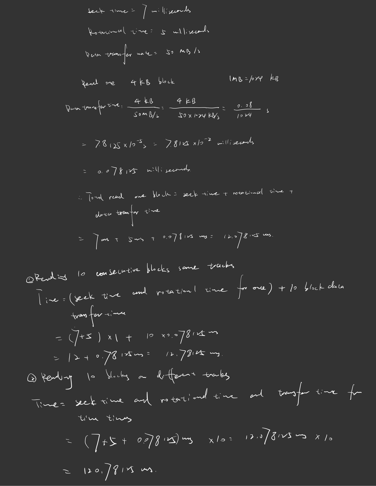


### Implication ✅

* Data that are accessed together should be store “adjacent”

  * Within the same track at the minimum

  * Usually means that each table is to be stored in a file
    * Operating Systems has tools to ==“defragment”== the files

* Data that is accessed often should be put into memory

  * Buffering(缓冲)
  
  缓冲(buffering) : 从磁盘读取的块暂时存储在内存缓冲区, 以满足将来的要求. 缓冲通过操作系统和数据库系统共同运作.

> Now these are all done behind the scene and an automatic, more important data need to be buffer and data need to be buffer correctly.
>
> So how to manage those buffers become a big, big deal in database systems.


### 12.2.3 **Mean time to failure (MTTF)** ✅

**Mean time to failure (MTTF)** :the average time the disk is expected to run continuously without any failure.

> That means how long do you think your hot this will run before it crash

Mean time to failure, MTTF(平均故障时间), 这是磁盘可靠性性的度量标准. 磁盘(或者其他任何系统)的平均故障时间是, 平均对我们来说可以期望系统无故障连续运行的时间量.

* Typically 3 to 5 years
* Probability of failure of new disks is quite low, corresponding to a
  “theoretical MTTF” of 500,000 to 1,200,000 hours for a new disk
  * E.g., an MTTF of 1,200,000 hours for a new disk means that given 1000 relatively new disks, on an average one will fail every 1200 hours

  据生产商声称, 现代磁盘的平均故障时间在500,000 - 1200,000小时之间(大约57-136年). 事实上, 这里声称的平均故障时间是基于全新磁盘发生故障的可能性计算的. 这里给出的数据的意思是说, 对于给定的1000张相对较新的磁盘, 如果MTTF是1200,000小时, 则平均来说, 在1200 小时内这些磁盘中将会有一张发生故障. 平均故障时间为1200,000小时并不意味着该磁盘预期可以工作136年.
  
* MTTF decreases as disk ages


### 12.2.4 Flash Storage ✅

* Non-volatile storage

* Evolved from EPROM/EEPROM

* Each unit is a ==“gate”==

  > gate    [ɡeɪt] n. 大门；登机口；闸门，阀门；（体育比赛的）观众人数；（体育比赛的）门票收入
  > comb. ……门事件（表示政治丑闻）(-gate)
  >
  > a gate you can think of a as starting a bit.

* Storage can be set (to 1) by passing electricity to form a second gate in the structure – that is stable

* Applying electricity in different way can “erase” the bit and allow it to be rewritten again

  * Erase first, than rewrite

  写一个闪存页面通常需要几微秒, 然而, 一旦写入, 闪存的页面不能直接覆盖, 它必须先擦出然后再重写.一次擦除操作可以在多个页面执行, 称为擦除块(erase block), 这种操作需要时约1-2毫秒.

* Two types of flash – ==NAND== and NOR (based on the logic used to set the bit)

  > NOR 快闪允许随机访问闪存中的单个字, 并且拥有和主存可媲美的读取速度.
  >
  > NAND则要读取需要将整个数据页从NAND快闪取到主存储器中, 该数据页通常包括512~4096字节. NAND快闪中的页和磁盘中的扇区十分相似.

* NAND bit are cheaper and more scalable as mass storage

  NAND快闪比NOR快闪便宜, 并且拥有更高的存储容量.
  
  * However, slower but **have to be erased in blocks**
  * **Each time a block need to be erased before** 

> Writing becomes an issue that you have to be careful of. And in fact, that also affects how your data should be organized. Because Erased is not something you want to do very often, because updating, erasing and overwriting is a costly operation. Just writing on the blank space is not costly. Because these still all you to connect all electrons. But update is something. Now obviously for queries you don't care. 
>
> Let's say you have to do a query that contains five or six step and your data are terabytes of terabytes and terabytes. So you cannot even store. 


#### NAND-based storage ✅

* NAND flash 

  * used widely for storage, cheaper than NOR flash

  * requires page-at-a-time read ==(page: 512 bytes to 4 KB)==

    * ==20 to 100 microseconds== for a page read
    * <u>Not much difference between sequential and random read</u>
    * Slower than RAM, but faster than the hard disk

    NAND则要读取需要将整个数据页从NAND快闪取到主存储器中, 该数据页通常包括512~4096字节. NAND快闪中的页和磁盘中的扇区十分相似.

  * Page can only be written once

    * Must be erased to allow rewrite

  * Solid state disks 
  
    * Use standard block-oriented disk interfaces, but store data on multiple flash storage devices internally
    * Transfer rate of up to ==500 MB/sec== using SATA, and 
      up to 3 GB/sec using NVMe PCIe
  
    > Still faster than hard drive


* Erase happens in units of **erase block**(擦除块)

  * Takes 2 to 5 millisecs
  * Erase block typically 256 KB to 1 MB (128 to 256 pages)

* **Remapping**(映射) of logical page addresses to physical page addresses avoids waiting for erase

  闪存通过Remapping逻辑页码到物理页码, 减少了满擦除速度和更新限制的影响.

* **Flash translation table** (转换表) tracks mapping

  * also stored in a label field of flash page
  * remapping carried out by **flash translation layer** (闪存转换层)

  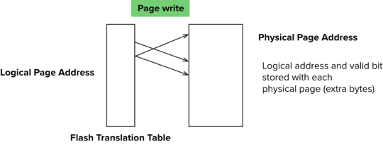

  

* After 100,000 to 1,000,000 erases, erase block becomes unreliable and cannot be used

  * **wear leveling** 损耗均衡

  > Then it's basically too much wear and tear on the on this silicone material for it to be useful.
  >
  > So for now, at least for the this class, we'll mostly assume our data they storage on a magnetic hard drive.

当一个逻辑页面更新时, 它可以重新映射到任何已擦除的物理页, 它原来的位置可以随后擦除. 每个物理页都有一个小的存储区域来保存它的逻辑地址; 如果逻辑地址重新映射到一个不同的物理页, 则原来的物理页被标记为已删除. 因此, 通过扫描物理页, 我们可以发现每个逻辑页的位置. 为了快速访问, 逻辑到物理的页面映射被复制到内存的**转换表(translation table)** 中.

包含多个删除页面的块会定期清除, 并注意先复制这些块中未删除的页面到不同块(转换表中对这些未删除的页面进行更新)中. 由于咩哥物理页面只能更新固定次数, 因此擦除多次的物理页面被标记成“冷数据“, 换句话说, 数据少更新; 没有擦除多次的页用来存储”热数据“, 即, 频繁更新的数据. 这种在物理块中均匀分布擦除操作的原则称作**损耗均衡(wear leveling)**, 而且通常是由闪存控制器透明地执行. 如果一个物理页由于过多次更新而损坏, 它可以不再使用, 而不影响整个闪存.

所有的上述动作通过一个叫做**闪存转换层(flash translation layer)** 的软件层完成. 在这一层之上, 闪存存储器看起来和磁盘存储器一样, 都有提供同样的面相页/扇区的接口, 除了闪存存储器快得多. 因此文件系统和数据库存储结构可以看到相同的底层存储结构逻辑视图, 无论是闪存存储器或磁盘存储器.


* Random reads/writes per second 
  * Typical 4 KB reads: ==10,000== reads per second (==10,000== IOPS)
  * Typical 4KB writes: ==40,000== IOPS
  * SSDs support parallel reads
    * Typical 4KB reads: 
      * 100,000 IOPS with 32 requests in parallel (QD-32) on SATA
      * 350,000 IOPS with QD-32 on NVMe PCIe
    * Typical 4KB writes:
      * 100,000 IOPS with QD-32, even higher on some models

* Data transfer rate for sequential reads/writes
  * 400 MB/sec for SATA3, 2 to 3 GB/sec using NVMe PCIe

* **Hybrid disks**: combine small amount of flash cache with larger magnetic disk

  Hybrid disk drive 混合硬盘驱动器是结合了小容量闪存存储器的硬盘系统, 对频繁访问的数据, 该驱动器作为缓存使用. 频繁访问但很少更新的数据最适合于缓存在闪存存储器中.

> Because you do have to understand at least the big picture to understand why they are doing certain things. Because for many hard drive to seek a row takes a killer. If you don't try to minimize that, you're dead.

https://www.geeksforgeeks.org/understanding-file-sizes-bytes-kb-mb-gb-tb-pb-eb-zb-yb/


## 12.3 RAID ✅

* **RAID: Redundant Arrays of Independent Disks** = Inexpensive

  独立磁盘冗余陈列

  事实上, RAID 中的I现在代表的意思是independent, 原先代表的是inexpensive的意思.

* Motivation
  * Suppose you have a hard disk with a reliability of 90%
  * You may apply engineering skills to make a more reliable one, but it tends to be expensive. 
  * However, if you take two hard drives with 70% reliability (which will likely be quite a bit cheaper than the first disk) and duplicate the data 
  * Then assuming independence
    * Probability of failure = $(1 – 0.7)^2 = 0.09 $
    * Achieve same reliability

> You spend 2 hours studying, you get you get from 0 to 90 in your exam. You spend two more hours. You get from 19 to 95, maybe the two afoul, if not worth it.


* What other advantage can we have with this set up?
  * Parallelism (Two process can read the disk at the same time)

* Does writing necessarily take longer?
  * Not necessarily, since we can write in parallel
  * However, scheduling constraints may affect when one can write
  * Need extra controller hardware to take care of the problem (not that expensive nowadays)

* Any other way that parallelism can help?
  * What if I request a large amount of data? 
  * How data is spread around the disks are important

> There's nothing stopping me from writing to the same location at the same time. Now, it doesn't always do that because they're scheduling.
>
> They can be done not very expensive. It is cheaper to do this than to make this even more elaborate. so that seems to be a win situation, right? We get more reliability, we get faster and potentially we because we have two to read the data from. We can use parallelism.
>
> What if I request a large amount of data and I say I have an operation, I want to record gigabyte of data for whatever reason. I can read the first 200 megabye on the first, second 200 megabyte on the second, third 200 megabyte on the third. Once again, we can do that in a pattern.
>
> One of the again, that argument is balanced out by the fact that, hey, yes, I'm wasting a lot of coin called wasting loss because of duplication. But you know what? Those are keys who care.
>
> This is probably one of the better innovation in database hardware, software, technology. It is becoming so mainstream nowadays that any server that is worth their money will at least have a system.


* The current main drawback

  * Storage efficiency is halved

    * As data is duplicated, you require double the storage

  * How to get around that problem?

    * Parity bits

      > 10101011  how many bit 1 here?       5
      >
      > 00001111  how many bit 1 here?       4
      >
      > I'm going to do is I'm going to add one to each of this back to beat pattern.
      >
      > 10101011 -- add 1 here          now have 6 
      >
      > 00001111 -- add 0 here          now have 4
      >
      > But the key thing is that they are both even.
      >
      > 
      >
      > 10101_011    I told you 1010101 and the previous one and I told you that the number one has to be even.
      >
      > So 101011011 
      >
      > So that means I have. So I'm paying the price of one pair of.
      >
      > Because if any one this fell, I'm only losing one bit. But I know in the video, the other piece, I can always figure out what that losing piece.
      >
      > So the key here is that now and the key point is I don't need to duplicate things.

    * An extra bit that is added to each byte, such that at the end the total number of 1s are even

    * So when we read a byte + the parity bit, we can check whether there is an error with the byte (assume at most one error) 

> Remember, I want to make things more reliable. So far I talk about basically duplicating everything.

https://www.computerhope.com/jargon/p/paritybi.htm


> Error conection code ❓ 
>
> Hamming code   ❓


> Let's say you have 8 bit original 
>
> 256
>
> 8 _ _ _           free extra bit here.    
>
> 2048        256*8 
>
> But the key idea is that if I am smart in choosing how to do the mapping, I have to be smart.
>
> Hamming code has be si not trivial data algorithm to explain that so that if there is an error I am not only know what is the error waster. I not only know whether there's error or not, I actually can tell you there is the area we beat this wrong. Now once again, you have to assume that only one is wrong. It could be wrong to do it, but only one. 
>
> And there is an algorithm in generating. How do you generate a free extra b ?
>
> The key things that if one of the bit shifted, there is an algorithm to actually determine which it is because you have so many redundant information. Those redundant information would acutally help you to pinpoint where the areas we want to look.


* The use of multiple disks and make it looks like a single disk to the users

* Advantages
  * **high capacity** and **high speed** by using multiple disks in parallel, 
  * **high reliability** by storing data redundantly, so that data can be recovered even if a disk fails 


### 12.3.3 RAID levels

* Various different level proposed
* Differs in
  * Amount of redundancy
  * How data are distributed through various disks

* Basic notion
  * We assume there are N disks storing data 
  * We will add K disks for redundancy purposes
    * Notice that N does not have to be equal to K
  * Various methods of organizing data on the disks (e.g. where to put the redundant data)
  * We assume chances of 2 disks failing at the same time is very small

>```mermaid
>graph TD;
>A(1);
>B(2);
>C(3);
>D(...);
>E(N);
>```
>
>```mermaid
>graph TD;
>A(1)
>B(2)
>C(...)
>D(K)
>```
>
>1...k for redundance purposes
>
>That's the game plan here.
>
>


* We can measure effectiveness of various RAID level in the following way:

  * Increased Reliability: how much reliability increased 

  * Overhead: How much extra disks are needed (expressed as ==K/N==)

  * I/O performance: How does I/O perform, do parallelism helps

  * Different kind of I/O

    * Short reads/write: reading/writing a few random blocks

    * Long reads/write: reading/writing a (large) file sequentially

      > But that means what you will affect a large number of two poles and that means that a large number of blocks but the we assume things are nice. Last time we talk about right sequential access is important. So we assume sequential access. We don't assume there's a lot of secret going on.

    * Read-modify-write: read a block, modify the content and then immediately write it back


#### RAID-0 ✅

* N disk in parallel
* No redundancy
  * No improvement in reliability

* How do parallelism help?
  * Short read/write: Yes, ==if data are spread across different disks==
  * Long read/write: Doesn’t help (since file reside on a single disk
    * Can we do anything about it?  


* Block Striping (块级拆分)
  
  将块拆分到多张磁盘
  
  * With $n$ disks, block $i$ of a file go to disk $(i \mod \ n) + 1$
  
    对于n张磁盘的陈列, 块级拆分将磁盘陈列逻辑上的第$i$个块存储到第$(i \mod n)+1$张磁盘上.
  
  * Now long reads can be parallized
    * Potential N times performance gain
    
    当读一个大文件时, 块级拆分可以同时从$n$张磁盘上并行地读取$n$个块, 从而获得对于大的读操作的高数据传输率. 当读取单块数据时, 其传输率与单个磁盘上的数据传输率相同, 但是剩下$n-1$张磁盘可以自由地进行其他操作.


>they will finger both storing a table into as well as most of the time you a storing a single table in the single file to make that decision easier.
>
>```sql
>update * 
>from student 
>where gpa = 4.0
>```
>
>change all students' gpa to 4.0
>
>Striping : Break out a file breaking into pieces. Store each piece on a different group. So that you can at least have a fighting chance to do a lot more things in part.  And in the most extreme case, if you are lucky enough, you can read everything at the same time. Which is significant. You get your money's worth, essentially.


#### RAID-1 ✅

指的是使用块级拆分的磁盘镜像

* N disk of data
* Block-level striping (as in RAID-0)
* Full redundancy / Mirroring 
  * Every data disk is duplicated 
* Overhead = 100% (N = K)
* How do parallelism help?
  * In addition to RAID-0
  * Now each block appear on two disks. 
  * Two requests on the same disk can be served in parallel
    * As a side benefit, tends to shorten wait queues
  * ==Does not hurt writing much:== as writing can be done in parallel
    * Although it is more likely that you have to seek at least one disk (even if in parallel)


> The magnetic material may lose its magnetic power. So if the magnet you've put there long. Now it may be youth. The good news is. But eventually losses many of you.

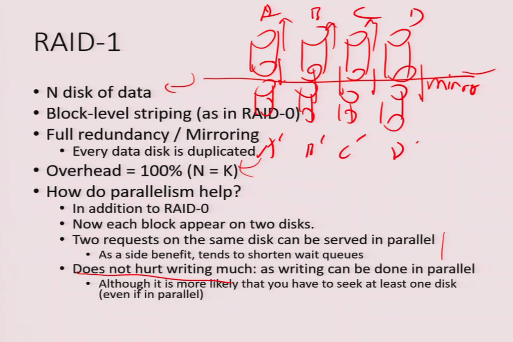

#### RAID-2, 3, 4 

* Problem with RAID-1: 100% Overhead

* Can we save the overhead 

* Notice we assume chance of two failures is low

* So if we can store enough information to handle one error, that may be good enough


#### RAID-2 ✅

* Use Hamming code 

  > 整体的数据容量会比原始数据大些
  >
  > RAID 2 是为大型机和超级计算机开发的带汉明码校验的磁盘阵列。磁盘驱动器组中的第1、2、4、......2n 个磁盘驱动器是专门的校验盘，用于校验和纠错。其它磁盘存数据。RAID 2对大数据量的读写具有极高的性能，但少量数据的读写时性能反而不好，所以RAID 2实际使用较少.
  >
  > 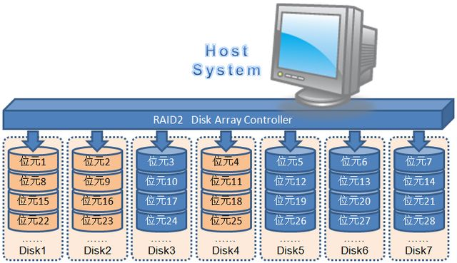
  >
  > https://zhuanlan.zhihu.com/p/541710292

* Given N bits, one can have an algorithm to add some bits (roughly logarithmic number of bits)

* If there is a single error, the Hamming code can determine which bit is the error bit and correct it automatically

* Use bit-striping (i.e. the bits of a word is striped across disks)

  例如, 如果我们有一个由8张磁盘组成的阵列, 我们将每个字节的第$i$位写到第$i$张磁盘上. 这8张磁盘组成的陈列可以被看成一张单一的磁盘, 这张磁盘的一个扇区的大小是通常大小的8倍, 并且更重要的是它的传输率是通常速率的8倍.

* The hamming code are stored in the extra disk

> 内存风格的纠错码（Error-Correcting-Code, ECC）组织结构。每个字节有都有一个与之联系的奇偶校验位，字节拆分存储到多张磁盘上，纠错位存储在其余磁盘中。
>
> 如果其中一张磁盘发生了故障，可从其他磁盘中读出字节的其余位和相关的纠错位，并用于重建被破坏的数据；
>
> 


内存系统中的每个字节都有一个与之相联系的奇偶校验位, 它记录了这个字节中为1 的位数是偶数(奇偶校验位=0) 还是奇数(奇偶校验位=1). 如果这个字节中有一位被破坏(1变成0, 或者0变成1), 那么这个字节的奇偶校验位就会改变, 而与存储的奇偶校验位不匹配. 同样地, 如果存储的奇偶校验位被破坏, 它就不能和计算出的奇偶校验位相匹配. 因此, 内存系统可以检测到所有的1位错误. 纠错码机制存储两个或更多的附加位, 并且如果有一位被破坏, 它可以重建数据.

通过把字节拆分存储到多张磁盘上, 纠错码的思想可以直接用于磁盘陈列. 例如, 每个字节的第一位存储在磁盘0中, 第二位存储在磁盘1中, 如此下去, 直到第8位存储在磁盘7中,纠错位存储在其余的磁盘中.

RAID 2: memory-style error-correcting codes 图显示了2级方案. 标记为P的磁盘存储了纠错位. 如果其中一张磁盘发生了故障, 可以从其他磁盘中读出字节的其余位和相关的纠错位, 并用它们来重建被破坏的数据. 该图显示了一个大小为4的磁盘陈列. 注意, 对于4张磁盘的数据, RAID 2级方案只需要3张磁盘的开销, 而不像RAID 1级需要4张磁盘的开销.

https://www.cnblogs.com/RDaneelOlivaw/p/8404407.html

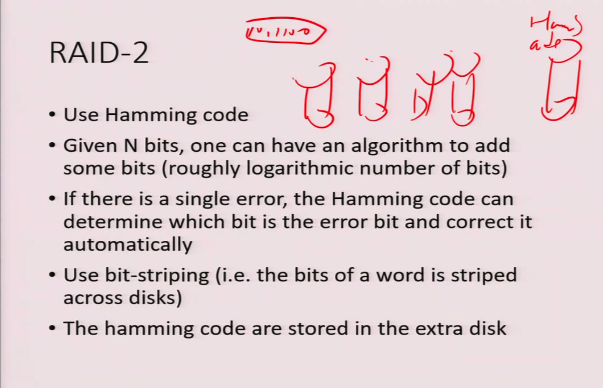

> 从概念上讲，RAID 2 同RAID 3类似， 两者都是将数据条块化分布于不同的硬盘上， 条块单位为位或字节。然而RAID 2 使用一定的编码技术来提供错误检查及恢复。这种编码技术需要多个磁盘存放检查及恢复信息，使得RAID 2技术实施更复杂。因此，在商业环境中很少使用


##### RAID-3, 4 ✅

* <u>Hamming code is overkill</u> also
* If there is an error, usually there is some other means (e.g. look at the hardware) to determine where the error is. 
* So just need to detect an error
* Use parity bit
  * Given a byte, add either a single 1 or 0 such that at the end the number of 1 bits are even
  * So now if a byte (+ parity) has odd number of 1s, then there is an error


* RAID-3: **bit-striping**

  位交叉的奇偶校验组织结构

* RAID-4: **block-striping**, each parity is parity of one block on a disk (not across all disk)
  
  块交叉的奇偶校验组织结构
  
  * Writes are more efficient
  
* Overhead: 1 / N (since **one disk** only to store the parity bit)

* Effeciency:
  * Reading is fine
  * Writing can be an issue
    * The disk holding the parity bit is overhead

> 
>
> RAID 3: 位交叉的奇偶校验组织结构。在RAID 2级的基础上改进，可用单一的奇偶校验位进行检错纠错。
>
> 可用奇偶校验位判断哪个扇区出错，通过计算其他磁盘上对应扇区的对应位的奇偶值来恢复被破坏扇区上的位。RAID 3级和RAID 2级一样好，但更节省额外磁盘的开销(它只有一张磁盘的开销)，因此在实际中并不使用RAID 2。
>
> 相比RAID 1级减少存储开销、提高传输率，但每秒钟支持的I/O操作数较少；
>
> RAID 3使用一个专门的磁盘存放所有的校验数据，而在剩余的磁盘中创建带区集分散数据的读写操作。当一个完好的RAID 3系统中读取数据，只需要在数据存储盘中找到相应的数据块进行读取操作即可。但当向RAID 3写入数据时，必须计算与该数据块同处一个带区的所有数据块的校验值，并将新值重新写入到校验块中，这样无形虽增加系统开销。当一块磁盘失效时，该磁盘上的所有数据块必须使用校验信息重新建立，如果所要读取的数据块正好位于已经损坏的磁盘，则必须同时读取同一带区中的所有其它数据块，并根据校验值重建丢失的数据，这使系统减慢。当更换了损坏的磁盘后，系统必须一个数据块一个数据块的重建坏盘中的数据，整个系统的性能会受到严重的影响。RAID 3最大不足是校验盘很容易成为整个系统的瓶颈，对于经常大量写入操作的应用会导致整个RAID系统性能的下降。


> 
>
> RAID 4: 块交叉的奇偶校验组织结构。块级拆分，并在一张独立磁盘上为其他N张磁盘对应的块保留一个奇偶校验块；
>
> 可使用奇偶校验块和其他磁盘上对应的块来恢复故障磁盘上的块；
>
> RAID4即带奇偶校验码的独立磁盘结构，RAID4和RAID3很象，它对数据的访问是按数据块进行的，也就是按磁盘进行的，每次是一个盘，RAID4的特点和RAID3也挺象，不过在失败恢复时，它的难度可要比RAID3大得多了，控制器的设计难度也要大许多，而且访问数据的效率不怎么好。


> **RAID4的主要特点**
>
> RAID 4 与RAID 3 最大的不同是：资料的切割单位由“位元组”变成了“区块”。RAID 4 按块存储可以保证单个磁盘上块的完整。当某磁盘损坏时，其它磁盘上部分文件还能顺利读出。
>
> 每个磁盘中同一柱面同一扇区位置的数据算是同级。各磁盘上同级数据的校验统一写入校验盘，读取时再即时进行校验。因此即使是当前硬盘上的数据块损坏，也可以通过XOR 校验值和其他磁盘上的同级数据进行恢复。
>
> RAID 4 在写入时要等一个硬盘写完后才能写一下个，且要写入校验数据，所以写入效率比较低。
>
> 每次读写任何一个磁盘，都要同时读写校验盘。校验盘使用太频繁，更易损坏。该盘坏很能恢复。
>
> RAID 4 最少需要3个磁盘。原则上要求所有磁盘容量大小相等。有效容量是总硬盘数减1乘以最小磁盘容量。
>
> 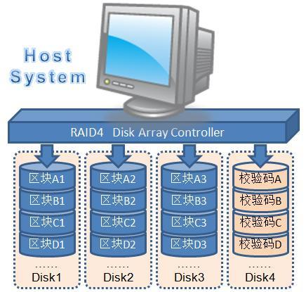
>
> https://zhuanlan.zhihu.com/p/541710292


#### RAID-5 ✅

块交叉的分布奇偶校验位的组织结构.

* To overcome the bottleneck

* Distribute the parity info across all disks

  > 将奇偶校验信息分布到所有磁盘上
  >
  > Parity info: 奇偶校验信息

  

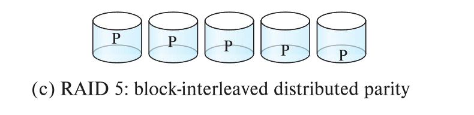

上图表示了方法的设置, 校验位p分布到所有的磁盘上. 例如, 在5张磁盘组成的陈列中, 逻辑块4k, 4k+1, 4k+2, 4k+3对应的奇偶校验块$P_k$, 存储在第$k\ mod\ 5$ 张磁盘中; 余下的4张磁盘中对应的块存储$4k$ ~$ 4k+3$ 这四个数据块.   

下面的表描述了0~19这前20个块和它们的奇偶校验块在磁盘中是如何排列的。对于以后的块重复这样的存储模式。

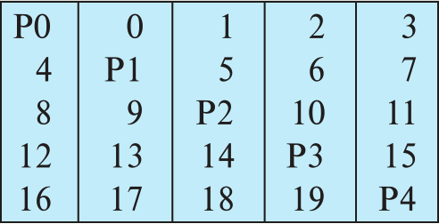

注意奇偶校验块不能和其所对应的数据块存储在同一张磁盘上, 如果这样, 一张磁盘发生故障会导致数据和奇偶校验位的丢失, 数据将是不可恢复的. RAID 5级包含RAID 4级, 因位它在相同的成本下提供了更好的读写性能, 所以 RAID 级在实际中未使用.

> RAID5: 块交叉的分布奇偶校验位的组织结构。在RAID 4的基础上改进，将数据和奇偶校验位分布到所有的N+1张磁盘中，而不是在N张磁盘上存储数据并在一张磁盘上存储奇偶校验位。
>


#### RAID-6 ✅

P+Q 冗余方案

* Similar to RAID-5

  它和RAID 5 级非常相似, 但是存储了额外的冗余信息, 以应对多张磁盘发生故障的情况. RAID 6 不使用奇偶校验的方法, 而是使用像Reed-Solomon码之类的纠错码.

* But store more error correction blocks to help detect more errors

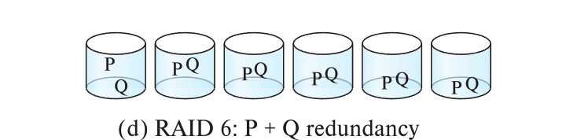

如图所示, 这种方法与RAID 5级对每4位数据存储1个奇偶校验位不同, 它为每4位数据存储2位的冗余信息, 这样系统可容忍两张磁盘发生故障.

>My data is very variable. I really want to make it more reliable. I can handle two this.
>
>So you can handle two errors. For example, to this failing, you'll find you pay the price of extra. You pay the overhead, of course, but you can do it and we won't go into detail. You pay the overhead, of course, but you can do it and we won't go into detail. I'm not going to ask you to detail how to do it. This is probably a computer architecture class. But you can add extra bits so that you can withstand two variables, for instance. And if your data require higher level reliability, that is the price to win.


> RAID6即带有两种分布存储的奇偶校验码的独立磁盘结构，它是对RAID5的扩展，主要是用于要求数据绝对不能出错的场合，使用了二种奇偶校验值，所以需要N+2个磁盘，同时对控制器的设计变得十分复杂，写入速度也不好，用于计算奇偶校验值和验证数据正确性所花费的时间比较多，造成了不必须的负载，很少人用。


### 12.3.1 RAID -- Redundancy ✅

* **Redundancy** – store extra information that can be used to rebuild information lost in a disk failure

  冗余(redundancy) 存储正常情况下不需要的额外信息, 但这些信息可在发生磁盘故障时用于重建丢失的信息.

* E.g., **Mirroring** 镜像 (or **shadowing** 影子)
  * Duplicate every disk. Logical disk consists of two physical disks.
  
    复制每一张磁盘, 一张逻辑磁盘由两张物理磁盘组成.
  
  * Every write is carried out on both disks 
    
    每一次写操作都要在两张磁盘上执行.
    
    * Reads can take place from either disk
    
  * If one disk in a pair fails, data still available in the other
    
    如果其中一张磁盘发生了故障, 数据可以从另一张磁盘读出
    
    * Data loss would occur only if a disk fails, and its mirror disk also fails before the system is repaired
      
      只有当第一张磁盘的故障被修复之前, 第二张磁盘也发生了故障时, 数据才会丢失.
      
      * Probability of combined event is very small 
        * Except for dependent failure modes such as fire or building collapse or electrical power surges
  
* **Mean time to data loss** depends on mean time to failure, and **mean time to repair**
  
  Mean time to data loss(平均数据丢失时间) 依赖于单张磁盘的平均故障时间和平均修复时间.
  
  Mean time to data repair(平均修复时间): 替换发生故障的磁盘并恢复这张磁盘上的数据所花费的(平均)时间.
  
  * E.g., MTTF of 100,000 hours, mean time to repair of 10 hours gives mean time to data loss of 500*106 hours (or 57,000 years) for a mirrored pair of disks (ignoring dependent failure modes)
  
    如果一张单独磁盘的平均故障时间是100000小时, 平均修复时间时10小时, 则镜像磁盘系统的平均数据丢失时间(mean time to data loss) 位$\frac{100000^2}{2*10} = 500 * 10 ^6$小时.


### 12.3.2 RAID -- Parallelism ✅

* Two main goals of parallelism in a disk system:
  
  磁盘系统中的并行有两个主要目的:

  * Load balance multiple small accesses to increase throughput
  
    负载平衡多个小的方位操作(块访问), 以提高这种访问操作的吞吐量
  
  * Parallelize large accesses to reduce response time.
  
    并行执行大的访问操作, 以减少大访问操作的响应时间
  
* Improve transfer rate by striping data across multiple disks.

  通过在多张磁盘上进行数据拆分(striping data) 来提高传输速率.

* **Bit-level striping** – split the bits of each byte across multiple disks
  
  比特级拆分(bit-level striping)-将每个字节按比特分开, 存储到多个磁盘上.
  
  * In an array of eight disks, write bit $i$ of each byte to disk $i$.

    有一个8张磁盘组成的阵列, 将每个字节的第$i$ 位写到第$i$张磁盘上.
  
  * Each access can read data at eight times the rate of a single disk.
  
    每次访问所读取的数据量时一张磁盘上的8倍.
  
  * But seek/access time worse than for a single disk
    * Bit level striping is not used much any more
  
* **Block-level striping** – with $n$ disks, block $i$ of a file goes to disk $(i \ mod \ n) + 1$
  
  块级拆分(block-level striping) - 对于$n$张磁盘的阵列, 块级拆分将磁盘阵列逻辑上的第i歌块存储到第$(i \ mod \ n) +1$ 张磁盘上
  
  * Requests for different blocks can run in parallel if the blocks reside on different disks
  * A request for a long sequence of blocks can utilize all disks in parallel


### 12.3.4 RAID levels ✅

* Factors in choosing RAID level
  * Monetary cost
  
    所需的额外磁盘存储带来的花费
  
  * Performance: Number of I/O operations per second, and bandwidth during normal operation

    在I/O操作数量方面的性能需求
  
  * Performance during failure
  
    磁盘故障时的性能
  
  * Performance during rebuild of failed disk
    * Including time taken to rebuild failed disk
    
    数据重建过程(即, 故障磁盘上的数据在新磁盘上重建的过程)中的性能.
  
* RAID 0 is used only when data safety is not important
  
  RAID 0 级用于数据安全性不是很重要的高性能应用.
  
  * E.g., data can be recovered quickly from other sources
  
    

* Level 1 provides much better write performance than level 5
  * Level 5 requires at least 2 block reads and 2 block writes to write a single block, whereas Level 1 only requires 2 block writes
* Level 1 had higher storage cost than level 5
* Level 5 is preferred for applications where writes are sequential and large (many blocks), and need large amounts of data storage
* RAID 1 is preferred for applications with many random/small updates
* Level 6 gives better data protection than RAID 5 since it can tolerate two disk (or disk block) failures
  * Increasing importance since latent block failures on one disk, coupled with a failure of another disk can result in data loss with RAID 1 and RAID 5.


### 12.3.5 Hardware Issues ✅

* **Software RAID**: RAID implementations done entirely in software, with no special hardware suppor

  软件 RAID(software RAID):RAID 可以在不改变硬件层, 只修改软件的基础上所实现.

* **Hardware RAID**: RAID implementations with special hardware
  
  硬件 RAID (Hardware RAID): 具有专门的硬件支持的系统.
  
  * Use non-volatile RAM to record writes that are being executed
  
    使用非易失性RAM在需要执行的写操作执行前记录它们
  
  * Beware: power failure during write can result in corrupted disk
    * E.g., failure after writing one block but before writing the second in a mirrored system
    * Such corrupted data must be detected when power is restored
      * Recovery from corruption is similar to recovery from failed disk
      * NV-RAM helps to efficiently detected potentially corrupted blocks
        * Otherwise all blocks of disk must be read and compared with mirror/parity block


> Raid 5: What's the main thing you do have to do? You have to calculate parity. You can either calculate parity by using a CPU.  Or you can actually had hardware built into your heart is to do the calculation. Not a totally like CPU chip, but just a couple. Functions that calculate parity. You can view it in circuitry, right?


* **Latent failures**: data successfully written earlier gets damaged

  * can result in data loss even if only one disk fails

* **Data scrubbing**: 数据擦洗

  * continually scan for latent failures, and recover from copy/parity

  为了尽量减少数据丢失的可能, 良好的RAID 控制器会进行擦洗(scrubbing), 也就是说, 在磁盘空闲时期, 对每张磁盘的每一个扇区进行读取, 如果发现某个扇区无法读取, 则数据从RAID组织的其余磁盘中进行恢复, 并写回道扇区中.

* **Hot swapping**: replacement of disk while system is running, without power down

  一些硬件RAID实现允许热交换(Hot swapping): 就是在不切断电源的情况下将出错磁盘用新的磁盘替换.

  * Supported by some hardware RAID systems, 

  * reduces time to recovery, and improves availability greatly

* Many systems maintain spare disks which are kept online, and used as replacements for failed disks immediately on detection of failure

  * Reduces time to recovery greatly

* Many hardware RAID systems ensure that a single point of failure will not stop the functioning of the system by using 

  * Redundant power supplies with battery backup
  
  * Multiple controllers and multiple interconnections to guard against controller/interconnection failures
  
    多个控制器和多个互连，防止控制器/互连失败


## Quiz 1 ✅

Which of the following about Solid State Drive  (SSD) is correct?

(a) Seek time for a SSD is the same as rotational latency ❌

(b) One cannot rewrite on the same spot of the SSD drive without erasing a larger block first ✅

(c) There is not much difference in reading sequentially and randomly in an SSD ✅

A. (b) and (c) ✅

B. (c) 

C. (a), (b) and (c) 

D. (a) and (b) 

My Answered: A

Correct Answer: A

> (a) SSD has no rotational latency.
>
> (b) SSD 
>
> Applying electricity in different way can “erase” the bit and allow it to be rewritten again
>
> * Erase first, than rewrite
>
> 写一个闪存页面通常需要几微秒, 然而, 一旦写入, 闪存的页面不能直接覆盖, 它必须先擦出然后再重写.一次擦除操作可以在多个页面执行, 称为擦除块(erase block), 这种操作需要时约1-2毫秒.
>
> (c) no need to seek time and rotational latency. 


## Quiz 2 ✅

Which of the following about RAID-1 is correct?

(a) Writing is always going to be at least twice at slow than RAID-0 ❌

==(b) RAID-1 should be more reliable than RAID-0==  ✅

(c) RAID-1 use parity bits ❌

A. (c)

B. (a) and (b) 

C. (b) ✅

D. (a), (b) and (c)

My Answered: B ❌

Correct Answer: C

> (a):  写入都是并行的 所以没有慢
>
> RAID-0: 块级拆分 
>
> RAID-1: 块级拆分 
>
> 两个可以并行
>
> (b): RAID-0: 多个disk 但没有备份
>
> RAID-1: 会把所有数据复制一份
>
> (c): RAID-1 是使用块级拆分的磁盘镜像 复制一份 没有用到 parity bit (校验位) 这个专有名词, 不是bit stripping的意思.不要搞混了. 论英文的重要性.
