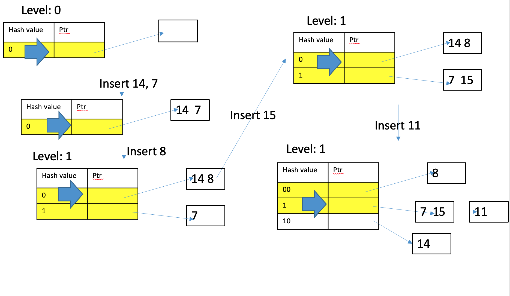
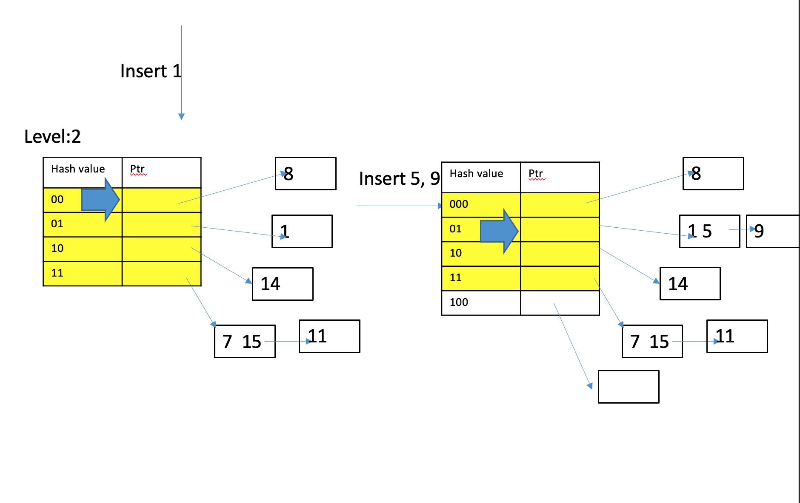

# ==Chapter 14 Indexing==

## Indexing ✅

> So you can only order by one attribute if you really want to order the file. But it doesn't mean that you can. But then it will love your search for more than one attribute. So how do we make this process faster for multiple attributes?
>
> So let's say you have a table call student, right.
>
> ```sql
> student(ID
>     name
>     age
>     height
>     gpa)
> ```
>
> Now you can order the tuples, pick an attribute you want to order to post based on. Let's say you pick an ID so you can store the files such that tuples are ordered by ID. Now searching for IDs. Probably. First, the binary search, whatever. But then if it turns out that a lot of your queries are based on gpa. Now, does that order help you to search based on GPA? Yes or no? NO
>
> But if I tell you your your GPA equal to I.D.Divided by 10,000. And then you like it at first like that.


> So I do have records just for the GPA. And they pointed to that record in the table that have that GPA that correspond to that student. I can order this whatever way I want and I can serve this whatever way I want, and I can.
>
> What you need to store in your index. The GPA and any pointer to the object rate debt will most likely be much smaller than a tuple.  So maybe the price is not too big to pay. There's no free lunch, but there's at least a reasonable lunch


> And as I say it, the good news, the values index always tends to be much smaller than your table, because the table where each tuple of 25 attributes, And as I say it, the good news, the values index always tends to be much smaller than your table, because the table where each tuple of 25 attributes, the index is always 1 to 1 that could build and some sort of upon the putting to the object, there is not going to be very expensive. 

> 

* So far storage discussed

  * Heap file : no ordering, easy to maintain, but provide no help (speedup) in queries
  * Sequential file : help in some cases, but can be tricky to maintain, also sorting from scratch 

* Need to have something that help searching but without too much overhead to maintain

* Indices (plural for index)

  索引(复数表示索引)


* Assume we have a table

* An index is defined by a search key

  * Typically an attribute of the table

    * Denote it as the key (attribute)

  * Does <u>NOT have to be unique</u> (e.g. one can index on salary)

    > if you really want, maybe an index on gender

* An index (file) ==consists of index entries: (search key, pointer)== 

  * Search key: the value of the attribute

    搜索码(search key): 用于在文件中查找记录的属性火属性集称为搜索码(search key). 注意这里的码的定义与主码、候选码以及超码中的定义不同. (遗憾的是)码在现实中具有多种广为接受的含义. 使用文本中搜索码的概念, 我们认为, 如果一个文件上有多个索引, 那么它就有多个搜索码.

  * <u>Pointer: pointer to the next location to access the record</u>

    > Noctice that I'm writing it somewhat cryptically, but I do need what you want


* Index structure assume the tuples in a file is on secondary storage (hard drive/SSD)

* They also make no assumption on how large the index is

  * The index structure is designed such that it can be stored on secondary storage also

  * Or some portion of it on storage while others in main memory

    或者一部分在存储中，而另一部分在主存中

    > Even though I say index typically much smaller than table, but itself can be pretty large. Because your original table have 10 trillion tuples, then your index might do have a lot of entries. And even though each entry small, it adds up. So moving that structure in the database context have to think about ways that I can store the index in the main memory as well as on the disk. So when we build an index, we have to keep that in mind.

* Since secondary storage is used, a page is a basic unit of storage and reference

  * E.g: pointer to a tuple typically only point to the page that store the data


* Two types of data structure used for indexing (called index structure)

  * Hash-based

    * Hash function is used to group data

    * Tuples are NOT sorted (since <u>hash function does not guarantee to maintain order</u>)

    * However, tuples that have the same key value will be grouped together

      > what is hash table? 
      >
      > 
      >
      > let's say you you you want to be indexed on GPA.  you put the GPA, you do a hash function. I'll put the location of. I'll put a unique value.  I'll put a value. It doesn't have to be unique. Let's say let's say I thought ten decimal well, five decimal point GPA. How many unique values are there. We are talking about 10,000 unique values. Are you going to have 10,000 buckets. Two different values, two different GPA. When you put all the hash for rate, new hash, the same number you do on the body. you will find out the unavoidable and debris system I will build will be but will will spend time on hash structure later on,

      > ```sql
      > select * 
      > from student
      > where id > "1234567"
      > ```
      >
      > How often do you think people will ask this query? Not very often. 
      >
      > How many of you have query tell me your I.D. My I.D. is larger than your ID, so I'm a better student than you. If more than my idea, you should buy me lunch. Now, this might happen in high school, but it. It happened here. Right. This is a joke, right? Nobody is going to do this in real life.

      > in so far as to build a hazard based structure is perfectly good enough.
      >
      > Now there are some attributes that are older and the ordinary is important right now.

  * Ordered

    * Key attributes can be ordered

    * Tuples in the table (file) are ordered via the key (like a sequential file)

    * The index structure exists to enable fast query while not being penalized for updates

      索引结构的存在是为了支持快速查询，同时不会因更新而受到惩罚

    * Typically tree-based (but not binary search tree!)

      通常是基于树的(但不是二叉搜索树!)

    > ```sql
    > select * 
    > from student
    > where gpa > 3.4
    > ```
    >
    > This will be a very often occurring in this case. And in this case order is important. So that means we do need in structure that somehow order the indexing attribute. 
    >
    > Binary search tree turns out to be very lousy structure for this. So we will look at different structures for those

    >  Whenever I insert a couple, I'll need to update the index too. So there's always an extra cost. And your hope is that remember to maintain the order. It can be costly. You have to find a location number. And then you can you have to create a space in the middle to put this in. Your index is not careful this a very costly. So you want to build systems like that. Do you still have to really go that far?
    >
    >  To give you a preview. This is typically done by something called the B plus three. There is a difference between the B tree and the B-plus tree. 

    

* Two ways of generating index record

  Index record(索引记录) 或 index entry(索引项) 由一个搜索码值和指向具有该搜索码值的一条或者多条记录的指针构成. 指向记录的指针包括磁盘的标识和标识磁盘块内记录的块内偏移量.

* Dense index 稠密索引

  稠密索引(Dense index): 在稠密索引中, 文件中的每个搜索码值都有一个索引项. 在稠密聚集索引中, 索引项包括搜索码值以及指向具有该搜索码值的第一条数据记录的指针. 具有相同搜索码值的奇遇记录顺序地存储在第一条数据记录之后, 由于是该索引是聚集索引, 因此记录根据相同的搜索码值排序.

  在稠密非聚集索引中, 索引必须存储指向所有具有相同搜索码值的记录的指针列表.

  * Each distinct value of key have at least one index record

    每一个搜索码值都有一个索引项

    * Recall for secondary index, each tuple will have one record

* Sparse index 稀疏索引

  在稀疏索引中, 只为搜索码的某些值建立索引项. 只有当关系按搜索码排序顺序存储时才能使用系数索引, 换句话说, ==只有索引是聚集索引时才能使用稀疏索引.== 和稠密索引一样, 每个索引项也包括一个搜索码值和指向具有该搜索码值的第一条数据记录的指针. 

  * Some values of key do not have any index record

    * Mostly for ordered index

    * Location of the tuples with such key can be inferred

      可以推断具有这种键的元组的位置

  


### 14.2.1 Dense index (example) ✅


该图为instructor 文件建立的Dense index (稠密索引)图.

假如我们现在要查找ID是“22222”的教师记录. 利用dense index, 我们可以顺着指针直接找到第一条所需记录. 因为ID是主码, 所以数据库中只存在一条这样的记录. 

>  So let's say we want to do an index on the ID. In this case, there is no choice because it is unique. Well, there's actually a choice. But for now, we think that there's no choice in this case.


假设搜索码值并不是一个主码. 上图表示以`dept_name`为搜索码的`	instuctor` 文件的稠密聚集索引. 在这种情况下, instructor文件按照搜索码dept_name排序, 而不是ID, 否则建立在dept_name上的索引将变成非聚集索引. 

假设我们正在查找历史系的记录, 利用dense index稠密索引, 我们按照指针直接找到历史系的第一条记录. 处理此记录, 按照该记录中的指针找到按搜索码dept_name排序的下一条记录. 继续处理记录, 直到我们遇到一条不是历史系的记录.

> We actually assume tuples based on the department. If I do that, then my index can look something like this.
>
> These are the biology student. This is the first of the computer science students. And then. The computer science students they are more than welcome to science students by only one key for a computer science value. If we are willing to assume that the main table is actually started by the department, you still need a valuable computer science. So this what we call a dense index.
>
> Basically every unique value. Of the indexing attribute has to have an index record.
>
> Now the question is, does it have to be this way? If we are willing to guarantee that this is thwarted by the department, do we really need to keep each record? Index for each value?
>
> 
>
> I only have two index work in biology and history. Can I still search for things? If I look for computer science, what do I have to do? Computer science is after biology, but before history. So that means if I start from this, I will eventually hit computer science before I hit this record. Let's say physics. Physics is after history. So do I need to go full to first record? No. I can go strictly to the history and look down. Now, obviously, we are trading things here, right?
>
> But remember we are talking about a disk. We are talk about datastore tuple storing the disk and each page typically store at least a few tuples.  let's say this four tuples store in the first page. And then this five tuples in the next page and then this three tuples in the third page.
>
> 
>
> every time I go to access data from this, I'm going to access on the unit page. So every time I go to read those five people see the main memory anyway. if I don't have the computer science record, I search for biology. I'm still going to only read one page. I'm not going to read more just because a computer science record is not there. So you are not gaining anything by having the computer science record in the index.

### 14.2.1 Sparse index (example) ✅


假如我们现在要查找ID是“22222”的教师记录. 利用Sparse index, 就找不到一个ID为“22222”的索引项. 因为“22222”之前的最后一项是”10101“(数字排序), 于是我们循着该指针查找, 然后按顺序读取instructor文件, 直到查找到所需的记录.

* Two different ways for tuples to be organized under an index 

  * The tuples are ordered exactly like the search key (==**clustering index / primary index**==)

    元组的顺序完全类似于搜索键(聚类索引/主索引)

    * The tuples themselves are typically ordered by the search key 

      元组本身通常按搜索键排序

      * For hash tables, it is not sorted, but tuples that have the same key values are typically stored together in same/adjacent page/s

        对于哈希表，它没有排序，但是具有相同键值的元组通常存储在相同/相邻的页/秒中

  * The tuple are not ordered as the search key (non-clustering index / secondary index)

    元组没有被排序作为搜索键(非聚类索引/辅助索引)

    * Need to have an index file,

      > Essentially you have to have an index file. The index file will basically be P pointer, T pointer, so on, so forth
      >
      > 
      >
      > And this itself said will be organized order or some some other way. This is important. This therm is of utmost importance in database systems. What is a primary and actually a secondary index? As I say, primary and clustering here are basically interchangeable terms. When I say cluster index, I mean primary index, but I mean non cluster index I mean secondary index. 

    * For each tuple in the table, have a index record (key, pointer), 

    * key value of the key attribute for that tuple

    * pointer points to where the tuple is (typically the page # of the page where the tuple resides

    * An index is then build on the index record

    >  if I have in this case. I want to now build an index on department. Now I have no choice.  because everything is getting around. So literally, each tuples, I will have to have a separate record pointing to it. So I will actually do a dense index, say biology. Ponting too here sees Ponting through here.
    >
    >  So in this case, which is called secondary index. We also current dense index
    >
    >  
    >
    >  ==Q: Question. Keeping the table. How many primary indexing we have?==
    >
    >  ==A: One==
    >
    >  But I will bet 99.9% of all the databases build your primary index based on your primary key. So most of the debate is done when you declare a primary key. They will automatically be an index. Based on this behind the scenes.


### 14.2.4 Secondary index (example) ✅

Non-clustering index(非聚集索引): 搜索码指定的顺序与文件中记录的物理顺序不同的索引称为非聚集索引(non-clustering index)或辅助索引(secondary index). 

常用的术语“聚集的”(clustered)和“非聚集的”(nonclustered) 来代替“聚集”(clustering) 和”非聚集“(nonclustering).

Secondary index(辅助索引)必须是稠密索引, 对每个搜索码值都有一个索引项, 而且对文件中的每条记录都有一个指针. 而聚集索引可以是稀疏索引, 可以只存储部分搜索码值, 因为正如前面所描述的那样, 通过顺序扫描文件的一部分, 我们总可以找到两个有索引项的搜索码值之间的搜索码值所对应的记录.


可以用一个附加的间接指针层来实现非候选码的搜索码上的辅助索引. 在这样的辅助索引中, 指针并不直接指向文件, 而是指向一个包含文件指针的桶. 上图给出了这样的一个Secondary index结构, 它在instructor文件的搜索码salary上使用了一个附加的间接指针层.

Notice that **<u>secondary index have to be dense</u>** (why?)


https://www.cnblogs.com/cxl-/p/15170494.html


## ==14. 2 Clustering vs. Non-clustering index== ✅

* What’s the significant difference between the two?

* Consider the case

  * Instructor table of 20,000 tuples

  * Assume each page can store 100 tuples

  * If there is no empty space, 200 pages

    > $\frac{20000}{100} = 200$

* Case 1: a clustered ordered index on salary

  * Notice that the tuples are sequentially ordered by salary

* Case 2: an unclustered ordered index on salary


Clustering index(聚集索引): 如果包含记录的文件按照某个搜索码指定的顺序排序, 那么该搜索码对应的索引称为聚集索引. 聚集索引也称为主索引(primary index); 主索引这个术语看起来是表示建立在主码上的索引, 但实际上它可以建立在任何搜索码上. 聚集索引的搜索码常常是主码, 尽管并非如此.

Non-clustering index(非聚集索引): 搜索码指定的顺序与文件中记录的物理顺序不同的索引称为非聚集索引(non-clustering index)或辅助索引(secondary index). 

常用的术语“聚集的”(clustered)和“非聚集的”(nonclustered) 来代替“聚集”(clustering) 和”非聚集“(nonclustering).


* Now consider the following query:

  ```sql
  SELECT * FROM instructor where salary > 100,000
  ```

* Case 1, for the clustered order index

  * First use the index to find all the page that have tuple that have the smallest salary > 100,000

  * Then read all the pages from that page onwards

  * Let say k tuples satisfies the query 

  * ==Then the number of pages read = $\frac{k}{100}$==

    * Cannot be larger than the size of the table

    > Why?
    >
    > Why can I be so sure if k over hundred. Remember, the index is cluster. On salary.
    >
    > the cluster here It's very important because the cluster index. The tuples are order by salary.  So once you find the list salary, let's say this page, unless it is all the way this order. All I have to do is read all these subsequent page and I am done. Every tuple in all subsequent pages will satisfy the query.


* Now consider the following query:

  ```sql
  SELECT * FROM instructor where salary > 100,000
  ```

* Case 2, for the unclustered order index

  * First use the index to find the page for each tuple that have the salary > 100,000

  * Then read all the pages from that page onwards

    然后从那一页开始读所有的页

  * Let say k tuples satisfies the query 

  * Then the number of pages read = k in the worst case

  * **If k = 2, then at worst 2 page read fine**

  * **If k = 200, then worst case one have to read the whole table**

    * The index is useless

  > It depends on different situation.
  >
  > Anybody see a chicken and egg problem here? You still tell me what the chicken and egg problem is.
  >
  > You need to know the to know the best way to execute a query. You have to know how many tuples you return, in order to know how many pupils to return. You better execute a query. Isn't there a chicken and egg? That is the overwhelming question that face database people all of these tech. so people have been spending like five decades trying to solve this problem.


clustering index

non-clustering index

中国新华字典里, 它按照字母abcdef....进行排序查找的 所以abcdef这个叫做clustering index

但是我们也可以通过笔画顺序来查找,但是它的索引页码并不是按照顺序的, 是乱序的, 但依旧能指引你到你需要查找的, 这个就叫做non-clustering index.


## Fundamental problem in query execution/optimization ✅

查询执行/优化中的基本问题

* Whether you want to use an index or not depend on the size of the result of a query

But

* You do not know the size of the result unless you run the query, which you will have to decide whether to use the index

> **Whenever you want to use an index or not, depend on the size of result the query.** **The query return two tuples then you say a non-clustering index is perfectly okay. If you return 2000 tuples then you want to think twice before you do it.** However, the problem is that you don't know the size, number of tuples to return until you actual execute a code. So that's essentially kind of a chicken and egg problem. You have to decide on how to do the query based on the size of the output. But you cannot get the size of the output and that you can execute it too.
>
> But at least I do want you to have some sense about this is the problem that we are facing that database.


## Index structures ✅

* Two most commonly used index structure for databases
  * B+-trees
    * Modification of B-trees for databases
    * Good for ordered data
  * Hash tables
    * Modification of main memory hashing function
    * Good for exact queries (WHERE attribute = value)


> But even nowadays in relational database system, this type of using these indexes is kind of stand the test of time.
>
> One: these things might be stored on the disk
>
> And one of the biggest thing we didn't thing about when we dealing storing data is that every time we read, we are reading how much data was the basic unit of access? It's a page.
>
> A page might not be just one byte or a few byte. Typically, as we mentioned, older systems page is 256 bytes and newer system might be four or take kilobytes. So your index structure has to take advantage of the fact that, hey, I'm going to read a bunch of bugs anyway. And if you think about let's compare to a binary tree, it might be turned to every time we actually read five nodes anyway. So how does it affect the best way of using the index becoming an interesting question. So that's why you see the adaptation of these index to a display set up is one of the main reasons that we are reading an writing to and from this. And each unit of access is not a bit or a single note but a page.


> 1 Byte = 8 bit
>
> 1 KB = 1024 B
>
> 1 MB = 1024 KB
>
> 1 GB = 1024 MB
>
> 1 TB = 1028 GB


## ==14.3 B+-tree== ✅


> this is a picture of $B^+$-tree.
>
> Because it's a sencondary index, right. So the leaf have to start index record basically key and pointer to the tuple. 
>
> This is not a binary tree.
>
> So B and $B^+$ tree do not stand for binary. They stand for balance. 
>
> So what does it mean that trees will be balanced? All the leaves are at the same level.

>Next question: Is there any key that is duplicated in the tree? Do you see any string to appear more than one thing in the tree? 
>
>Yes: "Mozart", "Einstein", "Gold"
>
>Some of you may have B-trees. So in something is simliar, but it's one key **==difference in B-tree and $B^+$-tree is that B-tree every nodes is only store once. B-tree there's no such duplication between modes that only appear once every leaves, every tuple.==**

>Some leaf have two records  some leaf have three records. For these three, we assume a node can hold a free record.
>
>Here things are a little bit tricky. So Notice that we also consider the root is not internal nodes.
>
>Can you tell me what does it internal look have? It has parents and children.
>
>What do you think the relation between the children? 
>
>one key two groups. Two keys three groups.

> root. one key. and how many children does it have?  one key two children.

> So does it give you a sense what the internal node and key value are use. <u>**Now a binary tree only have one number in the node and it divides things into left and right. $B^+$-tree allows you to have multiple key values.**</u> And as you say, we cut the list of things into multiple consecutively and pointers will tell you where you go to. So in this sense, there are some similarities with the binary tree. But we take advantage of not just having one item in the left index, not just have one key value.

> **<u>Notice that $B^+$ tree is a ordered tree.</u>** It is ordered based on attribute you use to index. So in this case, before and after had nothing to do with the location of this table, having to do with what the alphabetical order offers. But it's not order by what's on the table. It's it's order by the value of the key.
>
> Now, I'm not telling you how we come up with this tree. I just want you to make sure. I just want to make sure if you see a $B^+$-tree, you know what's going on. How do we come up with this tree? We'll talk about it as we go along. Notice that the tree is balance. And when I say balance, I do not mean both subtree have the same number of elements.
>
> 


> **==Why do you think we want everybody not to be at the same level? What's so good about balance tree?==**
>
> e.g. if there are 4 people in the room, tell you the average people is 25. It's can be 92, 2, 2, 2
>
> ==**Stable**==
>
> If I guarantee the tree to balance the tree, the height of a tree will have to be logarithmic. you're guaranteed to have logarithmic height. If the tree is not balance what the worst that linear height. So a one of the main basically all the everything you see involving the $B^+$-tree has one overriding goal making sure the tree balance period.

* Tree-based structure
* Tree is made up of nodes
  * Typically each node corresponds to a page on secondary storage

* Data are stored at leaves only
  * Different from B-tree
  * If primary index, then tuples themselves are stored
  * If secondary index, then store index records (key, pointer)

> people can use both as a primary index or as a secondary index. If we use $B^+$-tree as a primary index, we might as well actually store the tuples in the leaf for the $B^+$-tree. Each node can store a few tuples. If it is a secondary index, then you just store the index record for each tuple, like for example, key and pointer. So at the least level. Each of them is actually the Brant and the pointer to the location where Grant actually stole
>
> 
>
> If you use a primary index, you don't have to worry about whether you should use the index. You should pretty much always use as long as the query involved at. If you a secondary index that go back to the fundamental chicken egg problem. So just because you need to store a lot more things that are probably index doesn't mean you should not use the primary index.

> 


* Each node can store multiple items

  * Assume a page has 1000 bytes

  * Now if a tuple is 100 bytes, then a leaf can store 10 tuples

    > $\frac{1000}{100} = 10 \ tuples$

  * Now if the $B^+$-tree is used as secondary index, each node will store `key + pointer`, typically around 20-25 bytes total. So each leaf can store 40-50 records

    > $\frac{1000}{20}=50 \ records$
    >
    > $\frac{1000}{25} = 40 \ records$


* Internal node: 内部结点

  

  * $K_i$ are the search-key values 搜索码值

  * $P_i$ are pointers to children (for non-leaf nodes) or pointers to records or buckets of records (for leaf nodes).

    $P_i$ 是指向子节点的指针(对于非叶节点)或指向记录或记录桶的指针(对于叶节点)。

* The search-keys in a node are ordered 

  $K_1 < K_2 < K_3 < . . . < K_{n–1}$

> Pointers are pointing to the children, to the child nodes
>
> If we use $B^+$-tree as a primary index, then the leaf node will actually store the whole tuple, but the internal node will be unchanged. The internal note will only store that key that you used to index it. So if you change from a binary tree as a $B^+$- tree for primary index versus a $B^+$-tree for a secondary index. The ==only difference== is what is being stored in the leaf, not the internal node will not follow the tuples. Once again, that's the key difference between B-tree and $B^+$-tree.


* Internal node: 内部结点

  

Interpretation: 

* All data that is stored under the subtree pointed by $P_j$ has $K_{j-1}$ ≤ key value < $K_j$

  * All data under $P_1$ is < $K_1$

  * All data under $P_n$ is >= $K_{n-1}$

  * equal sign can shift from left to right

    等号可以从左向右移动

  * If duplicates are allowed (e.g. secondary index on non key attributes), it is possible for equal sign to be on both sides

> 


### 14.3.2 B+-tree: Query ✅

* Query is just like any tree search
* To find the tuple/index record with key value x
* Then starting at the root node, 
  * For each internal node, find j such that $K_{j-1} \leqslant x < K_j$
  * Then follow the pointer of $P_{j-1}$ to the next internal node
  * Repeat the process until a leaf node is reached
  * Search the leaf node to see if the tuple/index record is present
  * Boundary cases, when $x < K_1$ and $x \geqslant K_{n-1}$ (go to $P_1$ and $P_n$ respectively)

> ```c
> function find(v)
> /* Assumes no duplicate keys, and returns pointer to the record with 
>   * search key value v if such a record exists, and null otherwise */
>   Set C = root node
>   while(C is not a leaf node) begin
>     Let i = smallest number such that v<=C.Ki
>     if there is no such number i then begin
>       Let Pm = last non-null pointer in the node
>       Set C = C.Pm
>     end
>     else if (v = C.Ki) then Set C = C.P_{i+1}
> 		else Set = C.Pi /* v < C.Ki */
>   end
>   /* C is leaf node */
>   if for some i, Ki = v
>     then return Pi
>     else return null; /* No record with key value v exists*/
> ```
>
> 


* Similar case for a range query

  范围查询也有类似的情况

* Find all tuples with key value between a and b

  查找键值在a和b之间的所有元组

* For each internal node, check if the range ($K_{j-1}$, $K_j$) intersect with the range (a, b); if so, continue on pointer $P_{j-1}$.

  对于每个内部节点，检查范围($K_{j-1}$， $K_j$)是否与范围(a, b)相交;如果是，继续处理指针$P_{j-1}$。

  * Once again, consider boundary cases ($K_1 < a$, $b < K_{n-1}$)

* Also, often the leaf nodes are either stored as a sequential file, or have links connected them in order

  而且，通常叶节点要么以顺序文件的形式存储，要么用链接按顺序连接它们

  * Then only need so search for a, and then follow the order / links

* Query time (not counting time to retrieve the data) is proportional to the height of the tree

  查询时间(不计算检索数据的时间)与树的高度成正比


### 14.3.1 $B^+$-tree: Structure ✅

* Recall all data are store in the leaves

  * Internal nodes’ key value are used to guide the search

* Goal of updates, to maintain two conditions

  * The tree remain balanced (i.e. all the leaf nodes are at the same level)

    > Make sure that stable of log height tree

  * Ever<u>y node (except the root) has to be at least half full</u>

    每个叶几点最多可有n-1个值, 允许叶结点包含的值的个数最少为$\left\lceil \frac{n-1}{2}\right\rceil$

    > If your node can hold nine items, your tree has to be at least four items.
    >
    > So if internal node can have at most ten children, then basically each internal look have to hold at least five children, except the root. The root can hold as little as two children.

* The two conditions combined <u>ensure the height of the tree to be logarithmic to the number of items</u>

  > That means search can be done very efficiently. So that requires that every node has to be at least half full.
  >
  > 
  >
  > So the price you are paying for all kind of the main price to pay for all these is that you made waste of space. You need to store $B^+$-tree


插入和删除要比查找更加复杂, 因为结点可能因为插入而变得过大而需要分裂(split)或因为删除而变得过小(指针数少于$\left\lceil \frac{n}{2}\right\rceil$) 而需要合并(coalesce)(即合并结点)


#### ==14.3.3.1 $B^+$-tree: Insertion== ✅

Insert(插入): 在函数find()中使用和查找的一样的技术, 我们首先找到搜索码值将出现的叶结点. 然后在叶结点中插入一条新记录(即一对搜索码值和记录指针), 使得插入后搜索码仍然有序. 

从叶节点向上操作 不要中途从中间像是个先知向下操作!

* Suppose one want to insert a tuple (or record, same below) of key value x
* First, run a query to find the leaf node where x would have been located
* If that leaf node is not full, then insert the tuple into the leaf node, and insertion is done
* What if the node is already full?


* If the node is full
  * Need more space to store the data
  * Create a new node
  * Distribute the data evenly across both nodes, in order
  * Now the new node also need to be referenced
  * So the original node’s parent need to create a new entry 


**Example:**

* assume leaf node can hold 5 records, internal nodes can hold 5 pointers & 4 numbers

* Leaf node contain tuple/index records that are not shown


* What if the parent is full?

  * Need more space for the parent
  * Create a new internal node
  * Distribute the (key, pointers) evenly
  * Need to create a new entry for the parent’s parent to insert

* <u>Essentially the same code for the leaf split</u>

* The split will continue propagate upwards if necessary

  如果有必要，分裂将继续向上传播

* When the propagation reaches the root, the root is split, and a new root is build on top to be the parent of the two nodes

  * This is where the tree grows in height
  * This is also the reason why the root may be less than half full


**Example:**


Insert Lamport


#### 14.3.3.2 $B^+$-tree: Deletion ✅

* Similar approach
* First find the leaf node storing the item to be deleted
* Then remove it
* **If the node still is at least half-full, then done**

* Otherwise:
  * Examine the node’s neighbor
  * If anyone of its neighbor has is more than half-full, then move some data around to fill all the nodes to half-full
    * Will need to <u>update the parent’s key value to maintain the correctness</u>
  * Otherwise (all the neighbors are exactly half-full), merge the node with one of its neighbor 
    * Remove the corresponding key/pointer from the parent
    * <u>If at the top level, the root will only have one child – remove the root</u>


Example: 


* Node with Gold and Katz became underfull, and was merged with its sibling 
* Parent node becomes underfull, and is merged with its sibling
  * Value separating two nodes (at the parent) is pulled down when merging
* Root node then has only one child, and is deleted


> The example from textbook
>
> 1. delete "Srinivasan".


> ```mermaid
> graph TD;
> A(Monzart ,__ ,__)
> A --> B(Califierir, Einstein, Gold)
> A --> C(__, __, __)
> B --> D(Adams, Brandt, __)
> B --> E(Califleri, Crick, __)
> B --> F(Einstein, El Said, __)
> B --> I(Gold, Katz, Kim)
> C --> G(Mozart, Sigh, __)
> C --> H(__, Wu, __)
> 
> ```
>
> ```mermaid
> graph TD;
> A(Monzart ,__ ,__)
> A --> B(Califierir, Einstein, Gold)
> A --> C(Wu, __, __)
> B --> D(Adams, Brandt, __)
> B --> E(Califleri, Crick, __)
> B --> F(Einstein, El Said, __)
> B --> I(Gold, Katz, Kim)
> C --> G(Mozart, Sigh, __)
> C --> H(Wu, __, __)
> ```
>
> Since $n = 4 \ and \ 1 < \left \lceil \frac{n-1}{2} \right \rceil$ , we must either merge the node with a sibling node or redistribute the entries between the nodes, to ensure that each node is at least half-full. Therefore, Wu can be merged with its left sibling node.
>
> ```mermaid
> graph TD;
> A(Monzart ,__ ,__)
> A --> B(Califierir, Einstein, Gold)
> A --> C(Mozart, __, __)
> B --> D(Adams, Brandt, __)
> B --> E(Califleri, Crick, __)
> B --> F(Einstein, El Said, __)
> B --> I(Gold, Katz, Kim)
> C --> G(Mozart, Sigh, Wu)
> 
> ```
>
> Since $1 < \left \lceil \frac{n}{2} \right \rceil \ for \ n =4$ , the parent is not under full. In this case, we look at a sibling node; the nonleaf node containing the search keys "Califieri", "Einstein", and "Gold". We try coalesce the node with its sibling. But in this case, coalescing is not possible, since the node and its sibling together have five pointers, against a maximum of four. The solution in this case is to redistribute the pointers between the node and its sibling, such that each has at least $\left \lceil \frac{n}{2} \right \rceil =2$ child pointers. To do so, we move the right most pointer from the left sibling (the oen pointing to the leaf node containing "Gold") to the underfull right sibling. 
>
> ```mermaid
> graph TD;
> A(Gold ,__ ,__)
> A --> B(Califierir, Einstein, __)
> A --> C(Mozart, __, __)
> B --> D(Adams, Brandt, __)
> B --> E(Califleri, Crick, __)
> B --> F(Einstein, El Said, __)
> C --> H(Gold, Katz, Kim)
> C --> G(Mozart, Sigh, Wu)
> ```


> Now we delete the search-key values "Singh" and "Wu".
>
> The deletion of "Singh" does not make the leaf node underfull.
>
> ```mermaid
> graph TD;
> A(Gold ,__ ,__)
> A --> B(Califierir, Einstein, __)
> A --> C(Mozart, __, __)
> B --> D(Adams, Brandt, __)
> B --> E(Califleri, Crick, __)
> B --> F(Einstein, El Said, __)
> C --> H(Gold, Katz, Kim)
> C --> G(Mozart, Wu, __)
> 
> ```
>
> But the delection of "Wu" it will make the node underfull.
>
> ```mermaid
> graph TD;
> A(Gold ,__ ,__)
> A --> B(Califierir, Einstein, __)
> A --> C(Mozart, __, __)
> B --> D(Adams, Brandt, __)
> B --> E(Califleri, Crick, __)
> B --> F(Einstein, El Said, __)
> C --> H(Gold, Katz, Kim)
> C --> G(Mozart, __ ,__ )
> ```
>
> It is not possible to merge the underfull node with its sibling, so a redistributiong of values is carried out. 
>
> ```mermaid
> graph TD;
> A(Gold ,__ ,__)
> A --> B(Califierir, Einstein, __)
> A --> C(Kim, __, __)
> B --> D(Adams, Brandt, __)
> B --> E(Califleri, Crick, __)
> B --> F(Einstein, El Said, __)
> C --> H(Gold, Katz, __)
> C --> G(Kim, Mozart, __ )
> ```
>
> 

> Now we delete "Gold" from the above the tree.
>
> ```mermaid
> graph TD;
> B(Califierir, Einstein, __)
> C(Kim, __, __)
> B --> D(Adams, Brandt, __)
> B --> E(Califleri, Crick, __)
> B --> F(Einstein, El Said, __)
> C --> H(__, Katz, __)
> C --> G(Kim, Mozart, __ )
> ```
>
> This result is an underfull, which can now be merged with its sibling. 
>
> ```mermaid
> graph TD;
> B(Califierir, Einstein, __)
> B --> D(Adams, Brandt, __)
> B --> E(Califleri, Crick, __)
> B --> F(Einstein, El Said, __)
> 
> G(Katz, Kim, Mozart)
> ```
>
> The resultant delection of an entry from the parent node (the nonleaf node containing "Kim") makes the parent underfull (it is left with just one pointer). This time around, the parent node can be merged with its sibling. This merge results in the search-key value "Gold" moving down form the parent into the merged node.
>
> ```mermaid
> graph TD;
> B(Califierir, Einstein, Gold)
> B --> D(Adams, Brandt, __)
> B --> E(Califleri, Crick, __)
> B --> F(Einstein, El Said, __)
> B-->H(Katz, Kim, Mozart)
> ```
>
> 


#### $B^+$-tree: Update cost ✅

* Cost (in terms of number of I/O operations) of insertion and deletion of a single entry proportional to height of the tree

  插入和删除单个条目的成本(以I/O操作的数量表示)与树的高度成正比

  * With K entries and maximum fanout of n, worst case complexity of insert/delete of an entry is O($log_{\left\lceil\frac{n}{2}\right\rceil}(K)$)

    当有K个记录条数，n是结点中指针的最大值，插入/删除条目的最坏情况复杂度为O($log_{\left\lceil\frac{n}{2}\right\rceil}(K)$)

* In practice, number of I/O operations is less:

  实际上，I/O操作的数量更少:

  * <u>Internal nodes tend to be in buffer</u>

    内部节点往往位于缓冲区中

  * Splits/merges are rare, most insert/delete operations only affect a leaf node

    分割/合并很少，大多数插入/删除操作只影响一个叶节点

* Average node occupancy depends on insertion order

  平均节点占用率取决于插入顺序

  * $\frac{2}{3}$rds with random, $\frac{1}{2}$ with insertion in sorted order

> remember, if you have to insert a node, you have to travel through all node first. So all the internal look is probably already in the buffer anyway. You don't have to read it twice. Even you have to do a spread.


### 14.4.1 & 2 $B^+$-tree as the clustering index / file organization ✅

不仅把$B^+$-tree结构作为索引使用, 而且把它作为一个文件中的记录的组织者. 在$B^+$-tree文件组织($B^+-tree$ file organizaiton) 中, 树的叶结点存储的是记录而不是指向记录的指针.

* $B^+$-Tree File Organization: $B^+$ -tree 文件组织

  * Leaf nodes in a $B^+$-tree file organization store records, instead of pointers

    在$B^+$-tree文件组织($B^+-tree$ file organizaiton) 中, 树的叶结点存储的是记录而不是指向记录的指针.

  * Helps keep data records clustered even when there are insertions/deletions/updates

    即使存在插入/删除/更新，也有助于将数据记录聚集

* Leaf nodes are still required to be half full

  * Since records are larger than pointers, the maximum number of records that can be stored in a leaf node is less than the number of pointers in a nonleaf node.

    由于记录比指针大，所以可以存储在叶节点中的最大记录数小于非叶节点中的指针数。

* Insertion and deletion are handled in the same way as insertion and deletion of entries in a B+-tree index.

  $B^+$-tree文件组织中记录的插入和删除与$B^+$树索引中索引项的插入与删除的处理方式一样.

* To improve space utilization, involve more sibling nodes in redistribution during splits and merges

  为了提高空间利用率，在拆分和合并期间在重新分配中涉及更多的兄弟节点

  * Involving 2 siblings in redistribution (to avoid split / merge where possible) results in each node at least half full

    在重新分配中使用两个兄弟节点(尽可能避免分裂/合并)会导致每个节点至少一半满

> The example I show is the $B^+$- tree as a secondary index. There's nothing stopping you from hey, in cell phone, in my table, in the file. I'll just pull my table in the $B^+$- tree.  I basically took the leaving of the tuple, the leaf in the tree now if filled whole tuples. There's nothing stopping us from doing it. There's some limitation to it because people seem to have some expectation of size and you got to point the watch out. But simple things can get a bit dicey. Okay. So so it's not always ideal to do that, but, you know, not to have a fixed size. This actually is and, you know, low key, have some order to it. It is actually quite attractive. Doing this as a B plus three as A as your cluster index or excel basically as a file. So instead of storing a table in a file, store my table in the $B^+$- tree.


### 14.4.3 Indexing Strings ✅

在字符串属性上创建$B^+$-tree索引会引起两个问题. 第一个问题是字符串是变长的. 第二个问题是字符串可能会很长, 导致结点扇出降低以及相应地增加树的高度.

* Variable length strings as keys

  * Variable fanout

  * Use space utilization as criterion for splitting, not number of pointers

    使用空间利用率作为分割的标准，而不是指针的数量

* **Prefix compression** 前缀压缩

  * Key values at internal nodes can be prefixes of full key

    内部节点上的键值可以是全键的前缀

    * Keep enough characters to distinguish entries in the subtrees separated by the key value

      保留足够的字符来区分由键值分隔的子树中的条目

      * E.g., “Silas” and “Silberschatz” can be separated by “Silb”

  * Keys in leaf node can be compressed by sharing common prefixes

    叶节点中的键可以通过共享公共前缀进行压缩

> So as I say, typically one trouble with B plus three is that we're dealing with strength because strings can be different size. So now one way of getting around this problem is to not use the number of child, but use how much space is being used as a criterion. And that itself can still be problematic. There are a couple of other tricks. Maybe instead of storing the full name in the notice deck for the leave that we have to store everything. That's no tricks. We can go around for the internal nodes. We can play some tricks because, oh, I know it has to be lateral. You call them. I don't have to store the whole string as a key. Maybe I can spot prefix. Maybe I can install this one as a compact SUV or as Aldi. So that can be a alternative for gathering strings.


### 14.4.4 $B^+$-tree : Bulk loading ✅

正如我们先前看到的, 在$B^+$树中插入一条记录需要一些I/O操作, 并且在最坏情况下与树的高度成正比, 这通常还是比较小的(即便对于比较大的关系, 一般为5次或者更少)

* Inserting entries one-at-a-time into a $B^+$-tree requires $\geqslant$ 1 IO per entry 

  每次插入一个条目到$B^+$-树需要$\geqslant$ 1 I/O每个条目

  * assuming leaf level does not fit in memory

  * can be very <u>inefficient</u> for loading a large number of entries at a time (**bulk loading**)

    将大量项一次插入到索引中称为索引的批量加载(bulk loading)

  > one-at-a-time, so if you insert entries one at a time, this can be quite inefficient. 
  >
  > When i say bulk loading, that I already have a large set of tuples in my table. I suddenly want to fill a $B^+$- tree on it
  >
  > So it's not like I'm starting from scratch, starting with zero tuples. So maybe I have only 10,000 tuples in my table. And suddenly I realize that I really do need a $B^+$ - tree on each. How can I do it efficiently?  So there are a couple of alternative from inserting a tuple one by one.

* Efficient alternative 1:

  * sort entries first (using efficient external-memory sort algorithms discussed later in Section 12.4)

    首先对条目进行排序(使用12.4节稍后讨论的高效外部内存排序算法)

  * insert in sorted order

    * insertion will go to existing page (or cause a split)

      插入将转到现有页面(或导致分离)

    * much improved IO performance, but most leaf nodes half full

      很大程度上提高了I/O性能，但大多数叶节点是半满的

      如果连续的叶结点被分配到连续的磁盘块哈桑,那么这些I/O操作可以是顺序的, 并且需要很少的磁盘寻道.

  > Now why do we think about this way? Because if you think about it right, the leaves node on $B^+$-tree are actually ordered. So if you are building a $B^+$-tree. You are purposefully inserting two tuples to a index from left to right. Then you won't have the problem of suddenly have a leaf in the middle of the trees, the thing about worst become much less, because you always extending things to the right. And furthermore, because you are inserting things on left to right. The first few things insert it's going to be in the same leaf.  Because at least most likely a bunch of consecutive not things that you think he's going to be on the same leaf. That means if you are using some buffers, your looks will remain the buffers.

* Efficient alternative 2: **Bottom-up $B^+$-tree construction** 自顶向上

  * As before sort entries
  * And then create tree layer-by-layer, starting with leaf level
    * details as an exercise
  * Implemented as part of bulk-load utility by most database systems

  在自底向上$B^+$树构建(Bottom-up $B^+$-tree construction)中, 通过我们所描述的对项进行排序后, 我们将排好的项分解到块中, 并保证每个块中有尽可能多的项, 由此产生的块形成$B^+$树的叶级. 每个块中的最小值以及指向块的指针用来构建下一级的$B^+$树顶, 并且指向叶块. 更深一级的树可以类似地利用下层每个结点中最小值来构建, 直到创建根结点.

> So remember, in this case, you already know how many tuples are there. So you can actually calculate how many leafs do you need. Because you know how many data you can fit in a leaf node. You know how many entries are there? Do a simple division, you figure out how many leaves are there. Some time most system when you do this will leave the leaf node like 75% full. Just in case, when you insert new things, you don't want to do a lot of split right off the that. But still, you can simply calculate how many nodes are dead?  Let's say it turns out that our leave. 12 leave nodes. ??? Then I will first create the 12 leaves notes. Group the data. Now still do have sorted things that you cannot get away. But now I can ask the same question. I have 12 node. I know that I have 12 nodes. 
>
> 
>
> How many internal nodes at my upper level do I need? Well, again, you know, internal looks can hold. Let's see. About several can have between two and three child. Then maybe I need four parents. Or I may want to relax. I may want to have six parent if two child. So I don't have to split immediately. Then you build all these things and have them point to the right children.
>
> 
>
> So until you can and then you can recursively repeat the process.
>
> I have six internal node so what the next up level high how many nodes do I need? Maybe two, maybe three. So once again, you can continue to build go on top one level and build things. It will require a separate set of code. You can't quite reuse your standard circle street code, you have to write your extra code for that. But it's just really writing the code once and you can use this subsequent. So that's why this actually become a quite attractive way of building it up willing $B^+$-tree from scratch, assuming you already have all the data available.


### 14.4.6 $B^+$-tree: Other issues ✅

* SSD / Flash memory

  * <u>Random I/O cost much lower on flash</u>

    随机I/O在闪存上的成本要低得多

  * Writes are not in-place, and (eventually) require a more <u>expensive erase</u>

  * <u>Optimum page size therefore much smaller</u>

    因此，最佳页面大小要小得多

  * Bulk-loading still <u>useful since it minimizes page erases</u>

    批量加载仍然很有用，因为它最小化了页面擦除

  * Need specialized write-optimized tree structures have been adapted to minimize page writes for flash-optimized search trees

    需要专门的写优化树结构已经适应，以减少页面写闪存优化搜索树

  > Now this is where SSD come into play and in a somewhat negative way. If you keep updating $B^+$-tree, what happened? If you insert to a tuple, you have to update a new leaf regularly, put a new item to leaf. If you swift the node, that means you have to create a new node, but the existing will also likely be updated, then more things are being updated and change. And what's the problem <u>if you use SSD? You cannot update until you erase everything.</u> That means if your tree is really dynamic, you reall y to think about a lot of extra space for moving things around and pray that you can garbage collection very effectively. That make a dynamic index structure. We won't go into detail in this class. Maybe in two or three years time we will start. Need to talk about these because flash memory will become much more popular. And this is a real problem that we need to deal with. Every index structure, especially you expect your database to be somewhat dynamic. That means there's quite a lot of update. If you put on a solid state drive, it is always an issue that we need to deal with. 

* Main memory

  * Random access in memory 

    * Much cheaper than on disk/flash

    * But still expensive compared to cache read

    * Data structures that make best use of cache preferable

    * Binary search for a key value within a large $B^+$-tree node results in many cache misses

      在一个大的$B^+$-tree节点中对键值进行二叉搜索会导致许多缓存丢失

  * $B^+$- trees with small nodes that fit in cache line are preferable to reduce cache misses

    具有小节点的$B^+$-树适合缓存线，以减少缓存丢失

  * Key idea: use large node size to optimize disk access, but structure data within a node using a tree with small node size, instead of using an array

    关键思想:使用大节点大小来优化磁盘访问，但使用小节点大小的树来构造节点内的数据，而不是使用数组

> Many systems have been using what we call `log-based file structure`. Bascially what happened is that I'll give you a brief overview. I won't go into detail. Let's see. I need to update a page. What I do is I actually don't update the page. I instead of requesting  that, hey, this page needs to be updated. So what happened? So? So then I minimize the update, right? 
>
> I'm just waiting for that. So you think there's a lot entry?  I keep having a new pace, ending all these things. Only when there's too many things out there. Then I modify the file structure once. Now, of course, the problem is what your file structure takes. You may you may still want to query the index before all the all the update entries have been actually apply. So there are special commands and special data structure out there. So I tried to make the life easier. There we go. But it is a very different way of thinking about file system because of the limitation of necessity. And in a in a very dynamic file structure like index, things can be useful over there. Once again, we won't go through in this class. We will go over an operating system because typically offerings some classes have too many things to cover that we have no time to talk about our systems. But this is certainly something we will probably need to talk about it sometime down the road, maybe an advanced OS or an advanced database class. but I do at least want you to think about, Hey, this is something we need to think about. If I have to go out to work and have to work with something like this, I better look at the current literature. What is being done actually being done with it? So I don't want you to go I don't want to go to solution. I want you to at least remember that this is something that we need to deal with. And if I have to do it, I better look up the current literature to see what is being done currently.

> I want you to read it yourself to get a sense of, Hey, let's get this is something I need to worry about if I work in tech view. So so keep that in mind. These are interesting research problem. If you are interested in doing the database research kind of somewhere between database and system research. I don't think we have the final answer yet. And anyway, this is actually a big challenge for database companies. Everybody want to outdone their opposition by five microseconds.


## 14.5 Hashing based techniques ✅

> What is hashing? So you have items you want to store, and then whenever you want to insert something, you apply a hash function to that item. The hash function will tell you which location you should store it, and then you go ahead and start. Ideally, your hash function should avoid collision. What is a collision? Two different things hash the same value. Now on the other hand, somtimes these are just simply unavoidable.
>
> If you have ten buckest and you are storing eight, then good luck or your target social security number then really good luck. So and if you are in database , if you are in data structure class, there is a lot of different techniques to handle collisions. In fact, if you have nothing to do.
>
> "The art of computer programming", the books are written in the seventies. When you have 64 bytes of memory, you are very cool. Because you don't have any memory, then managing a hash table become very paramount, because I can't create two million buckets. So how do you handle collision? I think the volume two actually talked about hashing. I strongly encourage you to if you have nothing to do, uh, read those kept on hashing. The collison manament techniques are very very smart. And and sometimes I'm sure there is a philosophical lesson out there. If you have nothing in life or where is the pain that you know how to make the best out it. If you are militate just say let's spend money to solve the problem. But if you do not have money to solve the problem that you need to solve the problem in some very very clever way.

* Recall basis of hashing

* You want to store items. Each item has a key value x

* Create a hash function **h(x)** to map x to an integer between [0..n-1]

  > For the sake of this class we are assuming the thing to be has integers, although it works for every other thing. But typically that description make life a bit easier.

* Have a hash table of n slots.

  有一个包含n个槽的哈希表

* Item x will be stored in slot h(x)

  * Multiple techniques are used to handle collisions (multiple) 

> In database. Once again, things are little bit different here. Assuming we are storing the hash table into a secondary story right into a disk, once again was the basic unit of access on a this far? It's a page. And a page typically of how many bytes? 256 bytes. So if you have a 256 bytes, let's assume we are storing integers: $\frac{256}{8} = 32$
>
> If we think of a page as a single bucket. By default, a bucket can store more than one thing. You still have collision, but collision is not scary as before. Because by default you're going to even if there's eight things that have the same cash value. You're going to store them in the page. It will make no difference because you are reading a page at a time anyway. You don't want everything hatch the same value. But it's not like the end of the world, and they decide to take a very easy approach in coalition management.


Modification for database system

* Each entry of a hash table is now a “bucket”

  将用术语桶(bucket) 来表示能存储一条或多条记录的一个存储单位. 通常一个桶就是一个磁盘块, 但也可能小于或大于一个磁盘块.

  * Typically size of a page

    通常是页面大小

  * Thus more than one element 

  * All items with the same hash values (even different keys) stored in the same bucket

    所有具有相同哈希值(甚至不同键)的项都存储在同一个bucket中

* <u>Overflow still possible</u>

  * Instead of using complicated schemes, simple <u>add overflow buckets</u> 

    * Essentially building a link list of buckets for each entry

    > We assume each entry is detected within a bucket that a bucket correspond to a single page on the dish. So that means each entry can now store more than one thing. And if you are so unlucky that you have so many things that have to, the same bucket database may say, you know what? Let's start worry about all those fancy coalition techniques. Let's just do over four buckets. So basically a linked list of buckets. 

    * Notice that in secondary storage, this can be a file itself

      注意，在辅助存储中，它可以是一个文件本身

    * This is known as chaining

  * Other techniques are not used 

> And you think that all of the things that you talk about in building high functioning in data structure apply to you. so we'll even sweep that under the rug.

> Q:  So in Java, there is a structure called hash, is there anything to do with? 
>
> A: No, not here. It turns out a very important problem in the database is how many buckets do you need? If you have two filled buckets what happened?  Coalition. That's fine. We said we go to build list, but this linked list can be very large.
>
> Let's say you have 4 buckets, even your data is nicely distributed, but it will be one quarter of a whole table. You don't save a lot of time. If you do hacking, you expect it only take one or two operations to get your data. If you have too many buckets, let's say, what if I have 100 tuples in my hash table and I define 2 million buckets. A lot of overhead, a lot of waste space.
>
> So how do we find the right number of buckets? More interestingly, when you design database, many times you have no clue how many tuples are there.  And even if you have some idea, you still do not know how do the tuples behave respect to the hash function. Is the hash function good on this data set? Or the hash function really stick. How do we account for that? Now, typically your hash function is predefined without knowing data. So that's another limitation.
>
> Remember when you hear word hash table, your excectation is what I calculate hash function, hash function should get me to the bucket, I should immediately be able to retrieve the data. 
>
> At least a user expectation is that I have a bucket I should get the thing. Not reading one quarter of a whole table. Then bucket size become an issue. On the other hand, you don't want to have to make too many buckets in the beginning. Beacuse you have so many overhead. So how do we balance these things out without knowing anything? Become an interesting challenge in hashing. In fact, from database point this is probably the biggest challenge in hashing and that will keep us busy for the rest of lecture.


Example

* Hash file organization of *instructor* file, using *dept_name* as key 

  使用 *dept_name*作为码的 *instructor*文件的散列组织

  * There are 8 buckets

    具有8个桶

  * The binary representation of the $I^{th}$ character is assumed to be the integer $i$.

    字符$I^{th}$的二进制表示形式被假设为整数$i$.

  * The hash function returns the sum of the binary representations of the characters modulo 10

    * E.g. h(Music) = 1    h(History) = 2  
          h(Physics) = 3  h(Elec. Eng.) = 3

  > 此部分可以理解为: 通过hash方程特定的计算机 使得 h(Music) = 1 h(History) = 2  h(Physics) = 3  h(Elec. Eng.) = 3


* The above technique is also known as **static hashing**

  上述技术也称为静态哈希

  * Static as in the <u>number of buckets is fixed</u>

    静态中<u>的桶数是固定的</u>

    >Notice that the size of the bucket can grow that overflow. 

  * The size of each bucket can grow (overflow)

    每个桶的大小可以增长(溢出)

* Problem with database with a lot of insert/delete

  数据库存在大量插入/删除的问题

  * If initial number of buckets is too small, and file grows, performance will degrade due to too much overflows.

    如果初始桶数过小，且文件数量不断增加，则会因为溢出过多而导致性能下降。

  * If space is allocated for anticipated growth, a significant amount of space will be wasted initially (and buckets will be under-full).

    如果为预期的增长分配空间，那么最初将浪费大量的空间(并且桶将不够满)。

  * If database shrinks, again space will be wasted.

    如果数据库缩小，空间将再次被浪费。

* One solution: periodic re-organization of the file with a new hash function

  一种解决方案:使用新的散列函数定期重新组织文件

  * Expensive, disrupts normal operations

    昂贵，扰乱正常操作

    > But that will take a long time.

* Better solution: allow the number of buckets to be modified dynamically: ==**dynamic hashing**==

  更好的解决方案:允许动态修改桶的数量:==**动态哈希**==

  > Basically, the key thing is that you allow the number of buckets to be changed along the way. So now you have two buckets and them in the database. Go out at a bucket. If database grow even more out, another set of buckets and then the database straight out combined buckets to get.
  >
  > In order for you to do Dynamic Pershing, you have to have a hash function that allows you to do that. So let's say you have a hash function, hash on something. We assume this to actually generate an integer actually a non negative integer
  >
  > 基本上，关键是您允许在此过程中更改桶的数量。现在你有了两个桶，它们都在数据库中。在桶里出去。如果数据库增长得更大，再出另一组桶，然后数据库直接出组合桶来取。
  >
  > 为了实现动态潘兴，你必须有一个哈希函数来实现。假设你有一个哈希函数，哈希某个东西。我们假设这会产生一个整数一个非负整数


> The hash function is going to dependent on the number of bucket and the number of bucket will depend. The number of buckets will tell you how many bits you need to represent. 
>
> And the point for the rest of this class is that the number of buckets will change based on how many tuples are there
>
> You must have to address. And the address is represented by digit. You cannot represent address by real name. So the output will always be a binary. And we write it in binary because it make a lot of our algorithm description much easier. So the idea is that you will have written a function so that when you see a it will be mapped to some integer. How do you do that? That's not my business. ASCII values, ASCII value, whatever. You may have a fancy geometric function or whatever.  the point is, is that it outputs a binary. It has always had the output by number because you always have to output a location and location can only be an integer.
>
> 哈希函数取决于桶的数量而桶的数量也会变化。桶的数量会告诉你需要表示多少位。
>
> 这门课的重点是桶的数量会根据有多少元组而改变
>
> 你必须解决。地址用数字表示。您不能用真实姓名表示地址。所以输出总是二进制的。我们把它写成二进制因为它使我们的算法描述更简单。这个想法是，你写了一个函数当你看到a时它会映射到某个整数。你是怎么做到的?那不关我的事。ASCII值，ASCII值，等等。你可能有一个奇特的几何函数。关键是，它输出的是二进制。它总是以数字为输出因为你总是要输出一个位置而位置只能是一个整数。
>
> 


## 14.7 Dynamic hashing 动态散列 ✅

几种动态散列(dynamic hashing) 技术允许散列函数动态改变, 以适应数据库增大或缩小的需要. 本节介绍一种动态散列技术, 称为可扩充散列(extendable hashing).

* Key idea: the number of buckets can increase and decrease with the amount of data

  关键思想:桶的数量可以随着数据量的增加或减少

* Implication: the hash function has to be able to adapt to the number of buckets available

  含义:哈希函数必须能够适应可用的桶的数量

* General approach 一般方法

  * Convert the key (via some function) to a number x

    将键(通过一些函数)转换为数字x

  * Bucket for the item = x MOD (current # of buckets)

    > **11** mod **4** = **3**, because 11 divides by 4 (twice), with **3** remaining.
    >
    > **25** mod **5** = **0**, because 25 divides by 5 (five times), with **0** remaining.
    >
    > **3** mod **2** = **1**, because 3 divides by 2 (once), with **1** remaining.
    >
    > **5** mod **2** = **1**, because *all odd numbers* yield a remainder of **1** when divided by **2**.

    > To be more precise, your hash function has two steps process. 1. The first step is take whatever you have and convert it to an integer to a location 2. and then you do the take the right most bit thing that we do to and and if you think about it, if you remember your binary metric, take the rightmost bit. It's nothing more than doing a modulo

* Another important issue

  * Need to keep track of location of each bucket

    需要跟踪每个桶的位置

  * Need some form of table to keep track of it (or some other convention, see later)

    需要某种形式的表来跟踪它(或其他约定，稍后见)

    * Usually a table, with each entry pointing to the first page of a bucket

      通常是一个表，每个条目都指向一个bucket的第一页


* Start with 1 bucket (so no hashing)

  从1个桶开始(所以没有哈希)

* At any given time

  * When an insertion make a bucket overflow

    当插入操作导致桶溢出时

  * Double the number of buckets

    桶的数量翻倍

    * The table storing pointers need to be doubled

      存储指针的表需要加倍

    * Each bucket will start with a single page

      每个桶都从一个页面开始

    > when you introduce an extra bit, you always double the number of buckets.

  * Rehash the whole file (Some data will need to go to a new bucket)

    重新散列整个文件(有些数据需要存储到一个新的存储桶中)

* This implies at any stage, the hash function becomes looking at the rightmost bits of the number (written in binary) converted from the key

  这意味着在任何阶段，散列函数都会查看由键转换而来的数字(以二进制表示)的最右侧

> 
>
> 

>This method, Every time you have the double things, you should have a red alert. Doubing things means growing exponentially. So that's the drawback. You keep inserting things and your function is not very nice in the sense that a skill and overflow become often. Then your number buckets grow exponentially. And that's not cool.
>
>这个方法，每次你有双东西，你应该有一个红色警报。加倍意味着指数级增长。这就是缺点。你不断地插入东西，你的函数不是很好，因为经常会出现技能和溢出。然后你的数字桶呈指数级增长。这可不酷。


Example: 

* Items to be stored are numbers 

* Assume each bucket store 2 numbers


> Notice that we will have kind of a head table to tell the system where each bucket is.
>
> So if you absolutely do not want to have overflow bucket, you will have to immediately create or sell buckets. Now that means what? That means you have a lot of empty buckets.


> Now, so obviously this grow exponentially. And when you grow fast, you will create a lot of empty buckets.


* Limitation 限制

  * Double of number of buckets – exponential growth

    桶数翻倍-指数增长

  * A lot of empty buckets potentially

    可能有很多空桶

* Variations 变化

  * One does not have to immediately rehash when a bucket is overflown

    当存储桶溢出时，不必立即重新计算散列值

    * Allow <u>some overflow bucket, can slow down the growth</u>

      允许<u>一些溢出桶，可以减慢>的增长</u>

    * Also avoid empty buckets

      也要避免空桶

    * Price : slow down access

      价格:减慢访问速度

    > Space or time
    >
    > No free lunch


## Extensible hashing 可扩充散列 ✅

> You can actually do things about empty buckets. By a method, what we call extensible hashing.

* One problem with dynamic hashing

  动态哈希的一个问题

  * When rehashing, the number of buckets are doubled 

    重新散列时，桶的数量增加了一倍

  * Some buckets may be unnecessary

    有些桶可能是不必要的

* One way to get around it, extensible idea

  一种解决方法，可扩展的想法

* Key idea: 

  * <u>==When you rehash, only create new buckets when necessary==</u>

    <u>==重新散列时，只在必要时创建新桶==</u>


Example: 

* Items to be stored are numbers 

* Assume each bucket store 2 numbers

  > 0000    0
  >
  > 0001	1
  >
  > 0010	2
  >
  > 0011	3
  >
  > 0100	4
  >
  > 0101	5
  >
  > 0110	6
  >
  > ==0111	7==
  >
  > ==1000	8==
  >
  > 1001	9
  >
  > 1010	10
  >
  > ==1011 	11==
  >
  > 1100	12
  >
  > 1101	13
  >
  > ==1110	14==
  >
  > ==1111	15==

  > insert 11 = 1011     so it is hash value 1
  >
  > the 1 should be splitted.     1 add 0 left = 01 , 1 add 1 left =11
  >
  > 00 and 01 do not change  still the same      which means the bucke of 0  (14, 8) do not do anything.
  >
  >  


## ==Linear Hashing== ✅

> So there is a super smart algorithm that even stopped this called linear hashing.

* Why?

  * Most extensible hashing techniques require <u>some sort of exponential growth</u>

    大多数可扩展哈希技术都要求<u>以某种指数形式增长</u>

    * Introducing one more bit will double the size of the hash table/index

      再增加一个比特位，散列表/索引的大小就会翻倍

    * Massive rehashing slow things down

      大量的重排会减慢速度

> So linear hashing is a third technique that we use.


* Key ideas

  * Hash table entries <u>grow in a linear fashion</u>

    散列表项<u>以线性方式增长</u>

  * ==Have a pre-defined order of splitting the bucket, **regardless of which bucket is overflowing**==

    有预定义的划分桶的顺序，而不管哪个桶溢出

    就像example 中的, 使用了overflow bucket 就让它的另一半拆分 然后重新散列

    * A overflow bucket must wait for its turn to be split (rehashed)

      溢出桶必须等待轮到它拆分(重新散列)

    * Need overflow buckets (linked list)

      需要溢出桶(链表)

    > And the key thing about linear hashing is this statement, which is quite counter intuitive to your traditional hashing techniques. 
    >
    > In traditional hashing. What happened? You split a bucket when the bucket is overflow. Because the bucket overflow, then you had the split, then hopefully distribute the overflow stuff in the two separate buckets.
    >
    > in linear hashing. Basically, they say, who cares? I can care less which bucket overflow. Basically what I'm saying is that I have a pre-defined order, all of them on which thing to split regardless of which bucket overflow.
    >
    > So it is the term for bucket 2 to split. I don't care which bucket overflow I'm going to spit bucket 2. Even bucket 2 have nothing, I still split bucket 2.
    >
    > It turns out by doing this, I make a lot of things legal. I get rid of every exponential things that we talked about earlier, and that's worth looking at. 
    >
    > 线性哈希的关键就在于这个表述，这与传统的哈希技术背道而驰。
    >
    > 在传统的哈希中。发生了什么事?当桶溢出时，需要分割桶。因为桶溢出了，然后你有了分裂，然后把溢出的东西分配到两个桶里。
    >
    > 在线性哈希中。基本上，他们会说，谁在乎呢?我不在乎哪个桶溢出。基本上我说的是，我有一个预定义的顺序，所有的东西都要拆分，不管哪个桶溢出。
    >
    > 所以它是第2桶拆分的术语。我不在乎哪个桶溢出我要吐2号桶。即使桶二什么都没有，我还是拆了桶二。
    >
    > 事实证明，通过这样做，我让很多事情合法化了。我消去了之前讨论过的所有指数项，这很值得一看。

  * This ensure the growth is linear

    这确保了增长是线性的

  * Price to pay: overflow bucket slow down access

    付出代价:溢出桶减慢访问速度

    * Can be serious is hash function is lousy / data distribution is lousy

      可严重的是哈希函数糟糕/数据分布糟糕


* Assume Hash function = rightmost k bit of the number (k changes with the algorithm)

  假设哈希函数=数字的最右k位(k随算法变化)

* For linear hashing, maintain two variables

  对于线性哈希，维护两个变量

  * Level: the current level of hashing,

    Level:散列的当前级别，

    * Starts at 0

    * ==At the start of level k, there will be $2^k$ buckets==

      在第k level开始时，会有$2^k$个桶

      * E.g. k = 2, then buckets are 00, 01, 10, 11

    * A level finishes when all the buckets at the start of the level is split

      当level开始的所有桶被分割时，level就结束了


* Assume we are hashing function

  假设我们正在使用散列函数

* Hash function = rightmost k bit of the number (k changes with the algorithm)

  哈希函数=数字的最右k位(k随算法变化)

* For linear hashing, maintain two variables

  对于线性哈希，维护两个变量

  * Ptr: Points to the next bucket to be split

    Ptr:指向下一个要分割的桶

    * Whenever ANY bucket overflows, it is the bucket that ptr points to that split

      每当有桶溢出时，ptr就会指向该分割的桶

    * When a bucket is split, it split into 2 buckets by adding 0 and 1 as the new leftmost bit

      当一个桶被拆分时，通过添加0和1作为新的最左边的位，它被分成两个桶

      * E.g. bucket 01 is split into bucket 001 and 101

        桶01分为桶001和桶101

      * Only the bucket that is split need to be rehashed

        只有被拆分的桶需要重新散列

    * Reset to 0 at the start of each level

      在每一层开始时重置为0

    * Once the bucket is split, increment ptr by 1 (until end of level, by then it reset back to 0)

      一旦桶被分割，将ptr加1(直到关卡结束，这时它会重置为0)


* Ptr also help us to determine which bucket should one search

  Ptr还帮助我们确定应该搜索哪个桶

  * Consider we are at level k

    假设我们处于k层

    * All buckets that are not split are represented by k bits

      所有没有拆分的桶用k位表示

    * All buckets that are split are represented by k+1 bits

      所有被拆分的桶都由k+1个比特表示

  * When I search for a number

    * Look at the rightmost k bit of the hash value

      查看哈希值的最右边的第k位

    * If it is >= ptr, then go straight to this bucket

      如果是&gt;= ptr，则直接进入这个桶

    * If it is < ptr, than look at one more bit at the left, and that will denote the bucket to search

      如果是&lt;Ptr，然后再看左边的比特位，这将表示要搜索的桶


* Splitting occurs when one inserted into a bucket that is full (or overfull). 

  当一个元素插入到满桶(或满桶)时，就会发生拆分。

* Remember that the bucket that is overfull may not be the one that is split

  请记住，满的桶可能不是被拆分的桶

  * In such case, we use overflow buckets (building a link list) to store the extra value

    在这种情况下，我们使用溢出桶(构建链接列表)来存储额外的值

* When a bucket is split, it is split into two

  当一个桶被拆分时，它被分成两部分

  * Even if the split bucket is overfull, we do NOT continue the splitting 

    即使拆分桶已经满了，我们也不会继续拆分

  * Rehashing is done on the split bucket only (and only that is needed)

    重新散列只在拆分桶上进行(而且只在需要的时候)

* More advanced versions of linear hashing will change when splitting occurs (e.g. do not wait till a bucket overflows). 

  线性哈希的更高级版本将在拆分发生时发生变化(例如，不要等到桶溢出)。


Example: 

* Items to be stored are numbers 

* Assume each bucket store 2 numbers

  

  



0000    0

0001	1

0010	2

0011	3

0100	4

0101	5

0110	6

==0111	7==

1000	8

1001	9

1010	10

==1011 	11==

1100	12

1101	13

1110	14

==1111	15==


## Quiz 2 ✅

4. Which of the following about selection queries using indices are correct?

   (a) A secondary index should always be used

   ==(b) One cannot know whether a secondary index should be used without knowing how many tuples are going to be returned==

   ==(c) If the attribute that is used to build a secondary index is distinct, a query such as "SELECT * FROM A where A.att = 1" should (nearly) always benefit from a secondary index.==

   A. (b) and (c) ✅

   B. (a), (b) and (c) 

   C. (c) 

   D. (a) and (b) 

   My Answered: A

   Correct Answer: A

   > (a) ❌ 我有, 但我可以不用
   >
   > (b) ✅ 先有鸡还是又蛋问题
   >
   > (c) ✅ 是的, 可以直接返回该值


5. Which of the following about non-clustering index is correct? ✅

   ==(a) A non-clustering index cannot be sparse== ✅

   (b) A non-clustering index cannot only be used on an integer attribute

   A. Neither (a) nor (b) ❌

   B. (a)  ✅

   C. (a) and (b) 

   D. (b) 

   My Answered: A

   Correct Answer: B

   > (a) ✅ 
   >
   > 稀疏索引必须是clustering的, 它需要排序的
   >
   > 所以非聚集索引不能称为稀疏索引, 它不是排序的
   >
   > Indices whose search key specifies an order different from the sequential order of the file are called nonclustering indices, or secondary indices.
   >
   > Sparse indices can be used only if the relation is stored in sorted order of the search key; that is,if the index is a clustering index.
   >
   > * Case 1: a clustered ordered index on salary
   >   * Notice that the tuples are sequentially ordered by salary
   > * Case 2: an unclustered ordered index on salary
   >
   > 
   >
   > Clustering index(聚集索引): 如果包含记录的文件按照某个搜索码指定的顺序排序, 那么该搜索码对应的索引称为聚集索引. 聚集索引也称为主索引(primary index); 主索引这个术语看起来是表示建立在主码上的索引, 但实际上它可以建立在任何搜索码上. 聚集索引的搜索码常常是主码, 尽管并非如此.
   >
   > Non-clustering index(非聚集索引): 搜索码指定的顺序与文件中记录的物理顺序不同的索引称为非聚集索引(non-clustering index)或辅助索引(secondary index). 
   >
   > (b) ❌
   >
   > 非聚集索引可以用在整数属性上, 如salary. 但是他只是不是排序的而已.


## Quiz 3

Which of the following statements about B+-tree is correct? ✅

(a) Every node of the B+-tree has to be at least half full ❌

(b) All data in a B+-tree are stored in internal nodes ❌

A. Neither (a) nor (b)

B. (a) and (b)

C. (a)

D. (b)

A ✅

> (a) only leaf node; internal node do not need that
>
> (b) no, just store the key and pointer. And leaf node can store data as the whole tuple, but few to do that.

 

Which of the following about the B-tree is correct? ✅

**==(a) All leaf nodes are at the same level==**

(b) All elements that are stored are evenly distributed among the leaf nodes (to the best extent possible)

存储的所有元素都均匀地分布在叶节点中(尽可能地最好) 

A. (a) and (b)

B. (b)

C. (a)

D. Neither (a) nor (b)

(a). balance

(b) 那肯定

My answer: A ❌

Correct answer: C ✅

> (a) B-tree is balanced
>
> (b) ❌ 无中生有, 就算所有元素没有均匀地分布在叶节点中, 只要满足条件的B-tree的就行. 它不是B-tree的必须. 无此要求.

 

What do we mean by decorating a parse tree?  ✅

我们所说的装饰解析树是什么意思?

==A. Deciding the algorithm to be used for each operation==

B. Ordering the operations in the query

C. All of the other answers are correct

D. Translating the SQL statement <u>into a set of relational algebra operation</u> ❌

My answer: B ❌

My answer: A ✅

> A.  决定每个操作使用的算法
>
> Optimization:
>
> * Decorating the nodes of a parse
>
>   * ==For each node, determine how that operation is to be executed==
>
> * Select the best parse tree
>
>   * For all the parse tree generated, pick the one that will execute the query fastest
>
>   >  Just because you have an index doesn't mean you have to use it. Does that mean it's worth it to use it? To make it even stronger.
>
> B. 排序查询中的操作
>
> C. D❌ 这个秒排
>
> D. 使SQL变成关系代数运算, 并不需要解析树 several databases use an annotated parse-tree representation based on the structure of the given SQL query. 而是使用parse tree 使得 SQL 查询更加视觉化,更好理解.


For level k in linear hashing, how many buckets need to be split before we enter level k+1?

A. $2^k$

B. $2^{k+1}$

C. $k$

D. $2k$

 My answer: A ✅

Correct answer: A ✅

注意读题的意思, 对于线性哈希中的级别k，在我们进入级别k+1之前，需要划分多少个桶? 所以它问的还是klevel的,不要被k+1层迷惑了.

>* Assume Hash function = rightmost k bit of the number (k changes with the algorithm)
>
>  假设哈希函数=数字的最右k位(k随算法变化)
>
>* For linear hashing, maintain two variables
>
>  对于线性哈希，维护两个变量
>
>  * Level: the current level of hashing,
>
>    Level:散列的当前级别，
>
>    * Starts at 0
>
>    * ==At the start of level k, there will be $2^k$ buckets==
>
>      在第k level开始时，会有$2^k$个桶
>
>      * E.g. k = 2, then buckets are 00, 01, 10, 11
>
>    * A level finishes when all the buckets at the start of the level is split
>
>      当level开始的所有桶被分割时，level就结束了


In linear hashing, whenever a bucket overflows when an iterm is inserted to it, the next bucket to be splited is:

A. The bucket that just has the item inserted

B. Bucket 0

C. Pre-determined, unrelated to which bucket is full 

D. The current bucket that has the most overflow buckets

C ✅

> Key ideas
>
> * Hash table entries <u>grow in a linear fashion</u>
>
>   散列表项<u>以线性方式增长</u>
>
> * ==Have a pre-defined order of splitting the bucket, **regardless of which bucket is overflowing**==
>
>   有预定义的划分桶的顺序，而不管哪个桶溢出
>
>   就像example 中的, 使用了overflow bucket 就让它的另一半拆分 然后重新散列
>
>   * A overflow bucket must wait for its turn to be split (rehashed)
>
>     溢出桶必须等待轮到它拆分(重新散列)
>
>   * Need overflow buckets (linked list)
>
>     需要溢出桶(链表)
>
>
> A. a bucket overflows when an item inserted, 这个bucket使用了overflow bucket 所以它不会splited. 而它的另一半则会splited. 在example中使用的是另一半 即 01 的另一半为00, 这个是根据提前设置的, 它的另一半的可以根据某种规律设置成其他的.
>
> B. 无中生有
>
> C. 正确✅
>
> D. 使用了overflow bucket 就是为了减少分裂, 该选项与逻辑不符合.


## Homework 1

1. **(20 points) Consider building a B+-tree to store numbers. You are given the following constraints on the B+-tree.**

* Each leaf node can store at most 4 numbers

* Each internal node can store at most 2 numbers (how many children maximum?)

* Suppose an internal node stores (14, 28). The three children correspond to number with value strictly less than 14, greater than or equal 14 and strictly less than 28, and greater than or equal to 28 respectively.

* If a node is split, and the number of items of the nodes are odd – this implies one of the split node will have one more item then the other. In such case choose the node on the “right” (containing larger numbers) to be the one who get one more item.

  a. Suppose 100 is inserted into the tree. This will cause nodeK to be split. That means a new key value need to be installed into node D. What is (in theory) the range of the value that can be used there? Explain your answer. (Notice that even though the algorithm use a certain number, but in theory there are other numbers that can be used without violating the B+-tree’s requirements).

  b. Fill in the key values of all nodes A to D, assuming we take the largest possible value for each key value. (Assume the insertion of 75 in part (a) did not happen).

  c. (Ignore part a) Suppose the following numbers are inserted (in order): 57, 4, 99, 12, 53, 5, Every time a node is split, listed the contents of all the nodes being affected. Use the following convention:

  * For any leaf nodes that has changes, list its content after the insertion
  * If a node is split, name the two new nodes by added letter A and B to it. For example, if node K is split, the two new nodes should be named KA and KB. Later if KB is split, then the two nodes should be named KBA and KBB etc.
  * If a new root is created, name the new root N. If subsequently another new root is created then name it NN etc.

----

**Solution:**

Each internal node can store at most 2 numbers, three children maximum.

a. In theory the range of the value is $[84,88]$, which is $84, 85, 86, 87, 88$ these five numbers can be uesed there.

Explain: $100 > 92$ which means $100$ should ineserted after the $92$, but the Node $K$ is full. So the Node $K$ should be spitted. Because Node $D$ is an internal node, so it can stores two numbers, but it only have two children $J$ and $K$, which means $D$ only have one number and is not full. So spitting the Node $K$ into $KA$ and $KB$ and then add one number to the Node $D$. Because of contraints, when spitted the "right" has to get one more items, so it must have three items. Therefore, $KA \ \ (80,83)$ and $KB \ \ (88, 92, 100)$ . Therefore , D just add a new key which range is $>83$ and $\leqslant 88$, can be used without violating the B+-tree’s requirements.


b. A(50, 80)  B(11, 25) C(50) D(80) ✅


c.  

* 57 is inserted to node $I$ ✅

  * Node $I$ is splitted. New values for $IA(50, 55)$ ,$IB(57, 58, 50)$
  * Node $C$ is affected. New values for keys of $C$ is (50, 57)

  ```mermaid
  graph TB
  A(A 40,71)
  A-->B(B 11,25)
  A-->C(C 50,57)
  A-->D(D 80)
  B-->E(E 1,6,7)
  B-->F(F 11,13,18,20)
  B-->G(G 25,30,31)
  C-->H(H 40,44,47)
  C-->IA(IA 50,55)
  C-->IB(IB 57,58,50)
  D-->J(J 71,74,78)
  D-->K(K 80,83,88,92)
  ```

  

* 4 is inserted to node $E$ ✅

  * Node $E$ is afftected. New values for keys of $E$ is (1,4,6,7)

    ```mermaid
    graph TB
    A(A 40,71)
    A-->B(B 11,25)
    A-->C(C 50,57)
    A-->D(D 80)
    B-->E(E 1,4,6,7)
    B-->F(F 11,13,18,20)
    B-->G(G 25,30,31)
    C-->H(H 40,44,47)
    C-->IA(IA 50,55)
    C-->IB(IB 57,58,50)
    D-->J(J 71,74,78)
    D-->K(K 80,83,88,92) 
    ```

* 99 is inserted to node $K$ ✅

  * Node $K$ is splitted. New values for $KA(80,83), KB(88,92,99)$ 

  * Node $D$ is affected. New values for keys of $D$ is $(80, 88)$.

    ```mermaid
    graph TB
    A(A 40,71)
    A-->B(B 11,25)
    A-->C(C 50,57)
    A-->D(D 80,88)
    B-->E(E 1,4,6,7)
    B-->F(F 11,13,18,20)
    B-->G(G 25,30,31)
    C-->H(H 40,44,47)
    C-->IA(IA 50,55)
    C-->IB(IB 57,58,50)
    D-->J(J 71,74,78)
    D-->KA(KA 80,83)
    D-->KB(KB 88,92,99)
    ```

    

* 12 is inserted to node $F$ ❓

  * Node $F$ is splitted. New values for keys of $FA(11,12), FB(13, 18, 20)$
  * Node B is affected, and B is also splitted. $BA (11), BB(25)$
  * Node A is affected, and A is also splitted. $AA(13), AB(40)$
  * Create new root $N(40)$ 

  ```mermaid
  graph TB
  N(N)
  AA 
  AB
  
  
  AA(AA 13)
  AB(AB 40)
  N(N 40)
  N-->AA
  N-->AB
  AA-->BA
  AA-->BB
  AB-->C
  AB-->D
  BA(BA 11)
  BB(BB 25)
  BA-->E(E 1, 4, 6, 7)
  BA-->FA(FA 11, 12)
  BB-->FB(FB 13,18,20)
  BB-->G
  G(G 25,30,31)
  H(H 40,44,47)
  IA(IA 50,55)
  IB(IB 57,58,50)
  J(J 71, 74, 78)
  KA(KA 80, 83)
  KB(KB 88, 92, 90)
  C(C 50, 57)
  D(D 80, 88)
  C-->H
  C-->IA
  C-->IB
  D-->J
  D-->KA
  D-->KB
  
  ```

  

* 53 is inserted to node $IA$ ✅

  * Node $IA$ is affected. New values for keys of $IA$ is $(50, 53, 55)$

    ```mermaid
    graph TB
    N(N)
    AA 
    AB
    
    
    AA(AA 13)
    AB(AB 40)
    N(N 40)
    N-->AA
    N-->AB
    AA-->BA
    AA-->BB
    AB-->C
    AB-->D
    BA(BA 11)
    BB(BB 25)
    BA-->E(E 1, 4, 6, 7)
    BA-->FA(FA 11, 12)
    BB-->FB(FB 13,18,20)
    BB-->G
    G(G 25,30,31)
    H(H 40,44,47)
    IA(IA 50,53,55)
    IB(IB 57,58,50)
    J(J 71, 74, 78)
    KA(KA 80, 83)
    KB(KB 88, 92, 90)
    C(C 50, 57)
    D(D 80, 88)
    C-->H
    C-->IA
    C-->IB
    D-->J
    D-->KA
    D-->KB
    
    ```


* 5 is inserted to node $E$    ❓

  * Node E is splitted. New values for $EA(1,4)$ $EB(5,6,7)$

  * Node BA is affected. New values for $BA(5, 11)$ 

    ```mermaid
    graph TB
    N(N)
    AA 
    AB
    
    
    AA(AA 13)
    AB(AB 40)
    N(N 40)
    N-->AA
    N-->AB
    AA-->BA
    AA-->BB
    AB-->C
    AB-->D
    BA(BA 5,11)
    BB(BB 25)
    BA-->EA
    BA-->EB
    EA(EA 1,4)
    EB(EB 5,6,7)
    BA-->FA(FA 11, 12)
    BB-->FB(FB 13,18,20)
    BB-->G
    G(G 25,30,31)
    H(H 40,44,47)
    IA(IA 50,53,55)
    IB(IB 57,58,50)
    J(J 71, 74, 78)
    KA(KA 80, 83)
    KB(KB 88, 92, 90)
    C(C 50, 57)
    D(D 80, 88)
    C-->H
    C-->IA
    C-->IB
    D-->J
    D-->KA
    D-->KB
    ```

    

