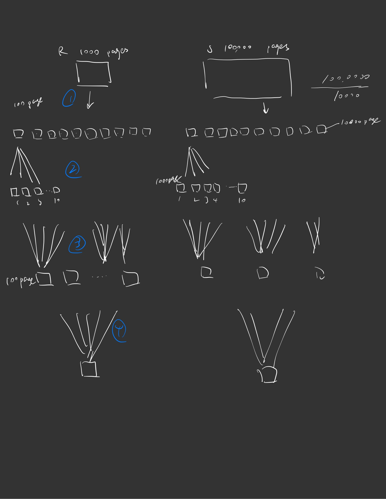

# Chapter 15 Query Proceesing

> 中文chapter 12

## Query Process/ Optimization ✅

* Study how database process query internally

  研究数据库内部如何处理查询

  * i.e. Once a database system received an SQL query, what happens (until the database return the results)

    数据库系统接收到SQL查询后，会发生什么(直到数据库返回结果)?

* Why study?

  * Database project manager – understand whether the queries being written will likely be executed effectively by the database

    数据库项目经理——了解正在编写的查询是否可能被数据库有效地执行

  * Database administrator – able to restructure database / provide hints to the database system to speed up queries
  
    数据库管理员——能够重构数据库/向数据库系统提供提示以加快查询速度
  
    > You'd only tell the database what you want. The database itself have to figure out how to get it right. And remember the earlier example, we talk about using an index. Doesn't mean you should use it. Remember the fundamental problem. The chicken and egg problem was the chicken and egg problem. Which came first? You need to know the answer the size of your answer to the query to figure out the best way to execute a query. But you cannot get the size of the result until you actually execute a query. So you have to decide what to do before, you know, a crucial piece of information so that you can do the best you
    >
    > You clearly have returned to two tuples. By all means, you use a non cluster index.
    >
    > 2000 tuples --> index.
    >
    > But you don't know about the result whether is 2 tuples or 2000 tuples.
    >
    > But in order for you to provide hints effectively, you need to understand how things work underneath.
    >
    > 你只需要告诉数据库你想要什么。数据库本身必须弄清楚如何把它做好。还记得之前的例子吗，我们讨论过使用索引。并不意味着你应该使用它。记住最基本的问题。鸡和蛋的问题就是鸡和蛋的问题。哪一个先来?你需要知道答案答案的大小，以找出执行查询的最佳方法。但是在实际执行查询之前，你无法获得结果的大小。所以你必须决定要做什么，你知道，一个至关重要的信息，这样你就可以做到最好
    >
    > 显然，你回到了两个元组。无论如何，都要使用非集群索引。
    >
    > 2000元组——&gt;索引。
    >
    > 但是你不知道结果是2元组还是2000元组。
    >
    > 但为了让你有效地提供提示，你需要了解底层的工作原理。
  
  * Database developer – you may be hired by a database systems company to build the next version of a DBMS
  
    数据库开发人员——你可能被数据库系统公司雇佣来构建DBMS的下一个版本
    
    

## 12.1 Query Processing ✅

查询处理(query processing)是指从数据库中提取数据时涉及的一系列活动.

* What happen when a DBMS received a query 

  当DBMS收到一个查询时会发生什么


>  So when you receive a query, it will first go for a parser and translator. The goal is to convert your SQL query into a bunch of relational algebra operators.
>
>  所以当你收到一个查询时，它首先会请求一个解析器和翻译器。目标是将SQL查询转换为一堆关系代数操作符。
>
>  Because the database engine works best with a set of relational algebra operators. make the task of developing a delivery system more modular and more easy to handle. And that makes the optimization job better.
>
>  因为数据库引擎最适合使用一组关系代数操作符。使开发交付系统的任务更模块化，更容易处理。这使得优化工作更好。

> algorithm select
>
> Relational-algebra expression: Notice that at this date it typically I did give you a very preliminary list of those.
>
> 算法的选择
>
> 关系代数表达式:请注意，到目前为止，我通常会给你一个非常初步的列表。
>
> 


### Parser and translator ✅ 语法分析器与翻译器

* Parser and translator

  解析器和翻译器

  翻译器translator: 把查询语句翻译成系统的内部表示形式. 该翻译过程类似编译器的语法分析器所做的工作

  解析器: 在产生查询语句的内部表示形式的过程中, 语法分析器检查用户查询的语法, 验证查询中出现的关系名是数据库中的关系名等. 系统构造该查询语句的语法分析树表示, 然后将之翻译成关系代数表达式.

* Read the query

  读取查询

* Check for syntax

  检查语法

* Collect all relevant information about tables involved

  收集有关表的所有相关信息

* Break the query down into a set of basic operations (relational algebra + others)

  将查询分解为一组基本操作(关系代数+其他操作)


>This step are quickly step. It just tell you, hey, you need to do these things. You need to do that thing. They didn't tell you what should be the best order. They didn't tell you that what is the best algorithm to do each of these? They just tell you you have to do this.
>
>这一步是快速的一步。它只是告诉你，嘿，你需要做这些事情。你需要做那件事。他们没有告诉你最好的顺序是什么。他们没有告诉你完成这些任务的最佳算法是什么?他们只是告诉你，你必须这么做。


* Recall

  

> `from` : is essentially Cartesian product.
>
> `where` : is basically selection. 
>
> `select` : is projection


* Query is converted to a list of operators ($\sigma, \prod, \Join, Group, Order, ...$) 

  Query被转换为一个操作符列表($\sigma， \prod， \Join, Group, Order，…$)

* Thus running the query becomes execution of a list of operators

  因此，运行查询就变成了执行一系列操作符
  
  > running a query equivalent to executing a list of operate, and once again, that's why you learn relational algebra not necessarily to write a relational algebra query, because you don't have to do it in real life. But you understand how a query be executed.
  >
  > 运行一个查询等同于执行一个操作列表，同样，这就是为什么你学习关系代数不一定要写一个关系代数查询，因为你在现实生活中不需要这样做。但是你知道查询是如何执行的。


* Example

```sql
SELECT ssn, age           // And then all I need is to attribute, so I need to project
FROM Instructor
WHERE age > 25          // this is a selection 
```

Becomes

1. $A = \sigma_{age> 25} (Instructor)$
2. $Result = \prod_{ssn, age} (A)$

> So for the parser and translator you stop here. I don't it this not necessarily the ideal order. They definitely don't tell you which algorithm you should use.
>
> 解析器和翻译器就停在这里。我不认为这不一定是理想的顺序。它们绝对不会告诉你应该使用哪种算法。


### Optimizer ✅

构造具有最小查询执行代价的查询执行计划应当是系统的责任. 这项工作叫做查询优化

* For each operation, determine how it will be executed

  对于每个操作，确定它将如何执行

* Determine the order of operations

  确定运算的顺序

* Other tasks (to be discussed later)


Execution plan 执行计划

Example: 

* 1. $A = \sigma_{age> 25} (Instructor)$

  * Use the secondary index on A to retrieve the tuples

    使用A上的辅助索引来检索元组

  * Do not store A on to the disk

    不存储A到磁盘上

  > We will do this step first.  Let's say that system said they say index on on each instructor. It is actually worth it to use it in this case and do not store it onto the disk.

* $Result = \prod_{ssn, age }(A)$

  * Directly pipe the result from 1 to execute the project

    直接通过流水线pipeline 1的结果来执行项目

    > What do you mean by pipe? We'll talk about it later in the later in probably the weeks. 

  * Just pick the attributes and output them
  
    只需选择属性并输出它们
  
  > These two will be extra infromation decided by the optimizer.这两个是由优化器决定的额外信息


### ==Evaluation engine== ✅ 

Exvaluation engine 执行引擎

* Actual execute the plan

  实际执行计划

* Return the tuples to the output 
  
  将元组返回到输出
  
  * Can be on screen, as a file, or as a stream through a network
  
    可以显示在屏幕上，作为文件，还是作为通过网络的流


> Now the executinon engine have all the information very specific enough they don't leave it to ask questions, just execute it. 
>
> we will spend a lot of time looking at `parser and translator` and some time lookting at `optimizer` and we will also spend a lot of time at `evaluation engine`.
>
> 现在，executinon引擎有了所有非常具体的信息，他们不需要问问题，只需要执行它。
>
> 我们会花很多时间研究`解析器和转换器`，还有`优化器`，我们也会花很多时间研究`评估引擎`。


* Notice that more often, a query can be represented as a parse tree: 

  请注意，更多情况下，查询可以表示为解析树:
  
  ```sql
  SELECT ssn, age
  FROM Instructor
  WHERE age > 25
  ```

  

  >
  
  ```sql
  SELECT I.name, S.name
  FROM Instructor I, Advise A, Student S
  WHERE A.i_id = I.ID AND S.id = A.s_id 
  AND I.dept_name = “CS” 
  AND S.dept_name != “CS”
  ```
  
  

> So very often, at least conceptually, it is not a bad idea to represent a query as a tree.
>
> 所以通常，至少在概念上，将查询表示为树并不是一个坏主意。
>
> 


* Query Processing/Optimization in terms of parse trees:

  基于解析树的查询处理/优化:

  * Parsing: Generate parse trees for the query

    解析:为查询生成解析树

    * Notice that a query may generate MANY (TOO MANY) valid parse trees
    
      请注意，查询可能会生成许多(太多)有效的解析树
    
      > join - associative
      >
      > selection - commutative - combine
      >
      > Projection - cometative - combine
      >
      > selection / projection - may be commutative
      >
      > So that means. There are many, potentially many potential risks.
      >
      > > for example $A\Join B \Join C$ 
      > >
      > > I don't care which of John you do first, you are going to get this. 
      > >
      > > So, once again, the same chicken and egg problem again. You need to figure out the best way to do join. You need to know how many pupils are you to return for each join. But you don't exactly know this until you've executed the query.
      > >
      > > 我不管你先做哪个join，你都会得到这个。
      > >
      > > 再一次，鸡和蛋的问题。你需要找出加入的最佳方式。你需要知道每次加入有多少学生。但在执行查询之前，你不会确切地知道这一点。
    
    * Each node correspond to an operation
    
      每个节点对应一个操作
    
    * Evaluation of query is from bottom to top (think post order)
    
      查询的评价是从下到上(想想post order)

* Optimization:

  * ==Decorating the nodes of a parse==

    装饰解析的节点

    * ==For each node, determine how that operation is to be executed==

      对于每个节点，确定如何执行该操作 = Deciding the algorithm to be used for each operation 确定每个操作使用的算法

  * Select the best parse tree

    选择最好的解析树

    * For all the parse tree generated, pick the one that will execute the query fastest

      对于所有生成的解析树，选择执行查询最快的解析树

    >  Just because you have an index doesn't mean you have to use it. Does that mean it's worth it to use it? To make it even stronger.
    >
    >  仅仅因为你有一个索引，并不意味着你必须使用它。这是否意味着值得使用它?让它更强大
    
    
    
    

* Challenges

  * Combinatorics explosion

    组合爆炸
  
    > combinatorics [kəm,bainə'tɔ:riks] 
    >
    > n. [数]组合学；组合数学（等于 combinatorial analysis, combinatorial mathematics
    >
    > explosion [ik'spləuʒən] 
    >
    > n. 爆破，爆炸（声）；激增；爆发，迸发；突发的巨响；某事证实是错误的，推翻
  
    * There are many valid parse tree for a query

      一个查询有许多有效的解析树
  
    * There are many possible ways to decorate each node
  
      装饰每个节点的方法有很多种

    * The total number of options <u>grows exponentially</u> (since most combinations of parse tree and decorations are valid)

      选项总数呈指数级增长(因为大多数解析树和装饰的组合是有效的)

    > What are the total number of ways of doing the join?  $A \Join B\ \Join C$
    >
    > $3! = 3 \times 2 \times 1$
    >
    > Each Join I have 4 different algorithms. $4 \times 4 \times 4 = 64$
  
  * Limited time
  
    有限的时间
  
    * You do not want to spend 2 hours optimizing a query such that you save 2 seconds. 
  
      你不希望为了节省2秒而花2小时来优化一个查询。
  
  * Information needed
  
    所需的信息
    
    * A lot of information is needed for the optimizer to work properly
    
      优化器需要大量的信息才能正常工作
    
    * Recall the fundamental problem of query optimization? 
    
      还记得查询优化的基本问题吗?
    
    > You don't know the best way to execute a query until you know the size of the Q result. But you don't know the result until you actually have to execute a query by that time. That is the fundamental problem that every database system has to solve one way or the other.
    >
    > 除非你知道查询结果的大小，否则你不会知道执行查询的最佳方式。但是直到你执行查询时，你才知道结果。这是每个数据库系统都必须解决的基本问题。
    
    

## Quiz 3

What do we mean by decorating a parse tree? 

我们所说的装饰解析树是什么意思?

A. Deciding the algorithm to be used for each operation

B. Ordering the operations in the query

C. All of the other answers are correct

D. Translating the SQL statement <u>into a set of relational algebra operation</u> ❌

My answer: B ❌

My answer: A ✅

> A.  决定每个操作使用的算法
>
> Optimization:
>
> * Decorating the nodes of a parse
>
>   * ==For each node, determine how that operation is to be executed==
>
> * Select the best parse tree
>
>   * For all the parse tree generated, pick the one that will execute the query fastest
>
>   >  Just because you have an index doesn't mean you have to use it. Does that mean it's worth it to use it? To make it even stronger.
>
> B. 排序查询中的操作
>
> C. D❌ 这个秒排
>
> D. 使SQL变成关系代数运算, 并不需要解析树 several databases use an annotated parse-tree representation based on the structure of the given SQL query. 而是使用parse tree 使得 SQL 查询更加视觉化,更好理解.


### Quiz 4  ✅

Which of the following about the parse tree notation of a query is correct?

(a) Each node can have at most 2 children

(b) The leaves corresponds to tables

(c) For nested loop, the right child is the inner loop.

A. (b) and (c) 

B. (a) and (b)

C. (b)

D. (a), (b) and (c) ✅


## 15.2 Measuring cost of a query ✅

* Many factors contribute to time cost 

  造成时间成本的因素有很多

  * *disk access, CPU*, and network *communication*

    *磁盘访问、CPU*和网络*通信*

* Cost can be measured based on 

  成本可以根据

  * ==**response time**==, i.e. total elapsed time for answering query, or

    ==**响应时间**==，即回答查询消耗的总时间，或

  * total **==resource consumption==**

    总**==资源消耗==**

* We use total resource consumption as cost metric

  我们使用总资源消耗作为成本指标

  * Response time harder to estimate, and minimizing resource consumption is a good idea in a shared database

    响应时间难以估计，在共享数据库中最小化资源消耗是一个好主意

* <u>We ignore CPU costs for simplicity</u>

  <u>为简化起见，我们忽略CPU成本

  * Real systems do take CPU cost into account

    真实的系统确实会考虑CPU成本

  * Network costs must be considered for parallel systems

    并行系统必须考虑网络开销

  > For now we go to ignore CPU time. We are we are assuming all the cost created are the time reading the data from the disk.
  >
  > in most database systems, they support certain kind of this.
  >
  > ```sql
  > select f1(s,age)
  > from student 
  > ```
  >
  > `f1`: is a user defined function 
  >
  > Many data based systems support some version of this. Not all, but some 

* We describe how estimate the cost of each operation

  我们将描述如何估计每个操作的成本
  
  * We do not include cost to writing output to disk
  
    我们不包括将输出写入磁盘的成本


* Disk cost can be estimated as:

  磁盘成本可以估算为:

  * Number of seeks/rotates   $\times$ average-seek-cost
  * Number of blocks read   $\times$ average-block-read-cost
  * Number of blocks written  $\times $ average-block-write-cost

* For simplicity we just use the ==**number of block transfers**== *from disk and the* **==number of seeks==** as the cost measures

  为简单起见，我们只使用从磁盘传输的块数和寻求的次数作为成本度量
  
  * $t_T$ – time to transfer one block 传输一个块的平均消耗时间

  * Assuming for simplicity t<u>hat write cost is same as read cost</u>

    简单起见，假设t<u>hat写入开销与读取开销</u>相同
  
  * $t_S$ – time to move from one block to a non consecutive block 

    $t_S$—从一个块移动到非连续块的时间
  
    * If on the same track, then rotate
    
    * If on different track, then seek + rotate
    
  * Cost for $b$ block transfers plus $S$ seeks
        $b \times t_T+ S\times  t_S$ 
  
  > I'm saying if you've once you find the right rotate location, reading from it and writing to it take the same amount, of course. Make your discussion easier. Make the formula shorter. 
  >
  > But remember, we might have to write something in the middle. Remember merge sort. So because just because we are not writing the result of this doesn't mean we don't have to write anything to do this. Because remember, we are all. Most likely we are going to assume the data base too large. Your database outputs ten terabytes. You just cannot hope that you read the whole thing into memory. Now. Luckily, in real life, most of a database you deal with are small enough.
  >
  > 我的意思是，如果你找到了正确的旋转位置，读取和写入的量是一样的。让你们的讨论更容易。简化公式。
  >
  > 但是记住，我们可能需要在中间写一些东西。还记得归并排序吗。因为仅仅因为我们没有写出结果并不意味着我们不需要写任何东西来做这个。因为记住，我们都是。我们很可能会假设数据库太大。数据库输出10tb的数据。你不能指望你把整个东西都读到内存里。现在。幸运的是，在现实生活中，您所处理的大多数数据库都足够小。
  
* $t_S$ and $t_T$ depend on where data is stored; with 4 KB blocks:

  $t_S$和$t_T$取决于数据存储的位置;4 KB大小的数据块:
  
  * High end magnetic disk: $t_S$ = 4 msec and $t_T$ =0.1 msec
  
    高端磁盘:$t_S$ = 4毫秒和$t_T$ =0.1 毫秒
  
  * SSD: $t_S$ = 20-90 microsec and $t_T$ = 2-10 microsec for 4KB 
  
    SSD: $t_S$ = 20-90微秒，$t_T$ = 2-10微秒4KB


* Required data may be buffer resident already, avoiding disk I/O
  
  所需数据可能已经驻留在缓冲区中，从而避免磁盘I/O
  
  * But hard to take into account for cost estimation
  
    但是很难考虑成本估算
  
* Several algorithms can reduce disk IO by using extra buffer space 
  
  有几种算法可以通过使用额外的缓冲区空间来减少磁盘IO
  
  * Amount of real memory available to buffer depends on other concurrent queries and OS processes, known only during execution
  
    缓冲区可用的实际内存数量取决于其他并发查询和操作系统进程，只有在执行过程中才能知道

> What's buffer? You can store data temporaty into main memory. Typically, a database system will actually use some memory for you to store temporary data.
>
> 缓冲区是什么?你可以将数据临时存储到主内存中。通常，数据库系统实际上会使用一些内存来存储临时数据。
>
> For example
>
> ```sql
> select *
> from student
> ```
>
> We will not assume, in the way to the students always in memory of enough.

>Let's say let's use YouTube as example. 
>
>For example:
>
>Maybe a previous query also asked about the student table. That previous query the database, decide to actually load the student table and if no significant part of student table in the main memory. So next time you asked another used to ask the query on the student table. It doesn't have to go to the disk to fetch the whole table. Typically we don't take that into account even between queries. So if we want to do something we do not know and we do not assume that one will leave something in the buffer. Now a smart query system will take that into account. A smart grid optimization system will take that into account. For the sake of this class, we don't. Once again, we want to make caculation simpler.
>
>例如:
>
>前面的查询也可能是关于student表的。前一个查询数据库，决定实际加载学生表，如果学生表的重要部分在主内存中。所以下次你问另一个用来在学生表上问问题的人。它不需要去磁盘获取整个表。通常情况下，我们甚至不会考虑两次查询之间的差异。因此，如果我们想做一些我们不知道的事情，我们不会假设有人会在缓冲区中留下一些东西。现在一个智能的查询系统会考虑到这一点。智能电网优化系统会考虑到这一点。为了这门课，我们不这样做。同样，我们想让计算更简单。

> And however, later on, you will see a something like this.
>
> ```sql
> select
> from A,B
> ```
>
> If I have two tables, we are doing a join. And within that, we in this query, we may make use of buffer to speed things up. So I may actually read table A into some buffer and then do the calculations that we will actually keep into account. We will actually put that in now. So we do not concern buffer management between different queries
>
> 如果有两张表，我们进行联结操作。在这个查询中，我们可以利用buffer来加速。所以我可以把表A读入缓冲区，然后进行计算，我们会把它考虑进去。我们现在把它放进去。因此，我们不关心不同查询之间的缓冲区管理

* Worst case estimates assume that no data is initially in buffer and only the minimum amount of memory needed for the operation is available 假定缓冲区只能容纳数目不多的数据块
  * But more optimistic estimates are used in practice
  
    执行一个查询计划过程中的实际磁盘存取代价可能比估算的代价要小


## 15.3 Query processing for individual operations ✅

* Selection  - $\sigma$

* Joins - $\Join$

* Projection - $\prod$

* Ordering - `ODEAR BY`

* Group By - `Group By`

> So before we can talk about optimization, we need to first look at how would a database system execute its operations.
>
> 因此，在讨论优化之前，我们需要先看看数据库系统如何执行其操作。


## 15.3 Selection ✅

* $\sigma_{scondition} (Table)$

  > when I say I do selection, I do selection on a single table. If you want if you want to leave multiple table, we do a join. So selection is always on a single table and then it's always based on a condition.
  >
  > 当我说selection时，我是在单个表上选择。如果你想如果你想留下表，我们做一个联合。所以选择总是在一个表上，它总是基于一个条件。

* A few considerations

  几个注意事项

  * Condition

    * Can be “attribute = value” (equality)

      >  The simplest type is what we call a equality condition.
      >
      >  最简单的类型是相等条件。

    * Or “attribute <= value” (or <, >, >=) (range/comparison)

      > This has to be something that you can order, right? Like integers through numbers, string, even string. You can order it, but typically alphabetical order. This is what we call typically a compression career, and more often we call it range query.
      >
      > 这一定是你可以点的东西，对吧?比如整数，通过numbers, string, even string。你可以按顺序排列，但通常是按字母顺序排列。这就是我们通常所说的压缩职业，我们更常称之为范围查询。
  
    * Single condition or multiple condition 单条件或多条件
  
      * E.g. $(x = 1\ AND \ y = 3), (x = 3 \ OR \ y = 4)$
  
      > $x > y$  
      >
      > This will be super interesting.
      >
      > ```sql
      > select gpa > age/5 from (Student)
      > ```
      >
      > It's a trick question to ask you to reveal your age.  If a guy asked you this query, make sure you don't answer this query. 
      >
      > 这是一个让你暴露年龄的问题。如果一个男人问你这个问题，确保你不回答这个问题。
  
  * Attribute 属性
  
    * Primary key or not
  
      > So the attribute that you are asking, whether it's a primary key or whether it is part of a primary key, whether it is unique or not, these things also affect it.你问的属性，它是主键还是主键的一部分，它是否唯一，这些都会影响它。
      >
      > Q: Why do you think knowing that this actually is unique is can be important?
      >
      > 问:为什么你认为知道这是独一无二的是很重要的?
      >
      > $\sigma_{a=1} (Student)$
      >
      > If I know execution is unique, what can I immediately see? How many tuples will this query return? It will return 1 or 0; But remember, always consider possibly that you don't return anything. Then you have to ask, do we have an index? If we have an index on attributes that they have and what kind of? Is it $B^+$ tree? Is it a hash table?
      >
      > 如果我知道执行是唯一的，我可以立即看到什么?这个查询将返回多少元组?它将返回1或0;但请记住，始终考虑不返回任何值的可能性。然后你会问，我们有索引吗?如果我们对它们的属性有一个索引，是什么类型的?它是$B^+$ tree吗?它是一个散列表吗?
      >
      > 
      >
      > Q: Why does why is it important to check whether an index is the best really hash table?
      >
      > 问:为什么检查索引是否是最好的散列表很重要?
      >
      > $\sigma_{age>25}(Student)$ Do you think a hash table on `age` will help in this query. 
      >
      > $\sigma_{age>25}(Student)$你认为包含' age '的散列表对这个查询有用吗?
      >
      > A: No, It's hash table, no requirement for ordering. You just have the same value being hash, the same bucket. But that's no guarantee. Like, one, two, three, four, five will be in order. So if you see a query and you say, hey, that's a hash table, there has to be is probably not going to be helpful.
      >
      > But $B^+ tree$ can still be very useful. You'll find the first page. If it is part of the index, you just scan through. Go through the leaves. Because $B^+$-tree you have the links between consecutive.
      >
      > But on the other hand, if this is the case $\sigma_{age=25}(Student)$, then certainly you should at least consider a hash table. Because now all I need is all tuples put aside by one condition.
      >
      > A:不，这是散列表，没有排序要求。相同的哈希值，相同的桶。但这并不能保证。一，二，三，四，五。所以如果你看到一个查询，你说，嘿，这是一个散列表，那可能就没什么用了。
      >
      > 但是$B^+ tree$仍然非常有用。你会找到第一页。如果它是索引的一部分，您只需扫描。穿过树叶。因为$B^+$-tree是连续的。
      >
      > 但另一方面，如果是$\sigma_{age=25}(Student)$，那么你至少应该考虑使用散列表。因为现在我只需要把所有的元组放在一个条件中。
  
  * Organization
  
    * Index available?
  
    * What kind of index?


* Basic case: File scan / sequential scan 文件扫描

  在查询处理中, 文件扫描是存取数据最低级的操作. 文件扫描是用于定位、检索满足选择条件的记录的搜索算法. 在关系系统中, 若关系保存在单个专用的文件中, 采用文件扫描就可以读取整个关系

  > Q: What's the basic? What's brute force method? 问:基本功是什么?什么是暴力法?
  >
  > A: you just read the whole table from beginning to end and just examine every to potentially very satisfied position.
  >
  > 答:你只需要从头到尾读整张表，然后检查每一个可能非常满意的位置。
  >
  > 
  >
  > Q: So why? why do we conside this? Now, obviously, this work, this will give you the right answer. This does sound stupid?  But why do we even think about it?
  >
  > 问:那为什么呢?我们为什么要考虑这个?很明显，这个会给你正确的答案。这听起来很愚蠢?但我们为什么要考虑它呢?
  >
  > A: Because sometimes there's no other way, right? If you have no index, no whatever. That's the only thing you can do. Read the whole tabletop beginning to end. And there are some cases where even you have indexes or whatever, you don't want to use it.  We call this typically we use the term `sequential scan` to describe this. No trick. No optimization, just we're forced to thing.
  >
  > Good thing: you don't need to care about the condition. It works.
  >
  > A:因为有时候没有别的办法，对吧?如果没有索引，什么都没有。这是你唯一能做的。从头到尾阅读整个桌面。有些情况下，即使你有索引之类的东西，你也不想使用它。我们通常称之为“顺序扫描”。没有技巧。没有优化，只是我们被迫的事情。
  >
  > 好消息是:你不需要关心病情。它的工作原理。

* Just read the whole file block-by-block from beginning to end and check if each tuple satisfy conditions

  只需从头到尾逐块读取整个文件，并检查每个元组是否满足条件

  * Cost estimate = $b_r * t_T + b_s *  t_S$

    * $b_r$ denotes number of blocks containing records from relation $r$

      $b_r$表示包含关系$r$中记录的块的数目

    * $b_s$ denotes number of tracks that store the table 

      $b_s$表示存储表的tracks数目
      
      > $t_T$ – time to transfer one block
      >
      > $t_S$ – time to move from one block to a non consecutive block
      
      >

  * If selection is on a key attribute, can stop on finding record 码属性等值比较.

    * Average cost = $ \frac{b_r} {2}  * t_T + ? * t_S* $

    * ? Is harder to predict, is roughly max$(1, \frac{b_s}{2})$

      > ```sql
      > select ssn= '12345678' from Student
      > ```
      >
      > Let's say ssn is your primary key. You keep reading, and once you find the tuples you can stop. Because it is a key, that means 1 or 0 tuples. But now you find the one->stop.
      >
      > So that means now the actual cost may differ depending on whether you are lucky or not.
      >
      > And it is whether you are lucky or not. We usually call the average. So avareage is the half  (1+0)/2
      >
      > But how many tracks you want to read can be a bit tough to estimate because you don't know which you are going first and so on. So that can be a bit tricky. Typically, we assume we do have a track. Therefore, 1 is limit.

  * Linear search can be applied regardless of 

    * selection condition or
    * ordering of records in the file, or 
    * availability of indices

    线性搜索可以用于任何文件, 不管该文件的顺序、索引的可用性, 以及选择操作的种类.
    
    > This linear search says sequential scan can be executed on any condition, any attribute. So every database engine, when they try to estimate what is the best way to do a query, they always calculate this cost as a baseline. So if I want to do something else. I need to make sure that that method beat these methods. If not, you know what? Let's not do anything. Fancy that. Just read the whole table. Boring. But it works.
    >
    > 这种线性搜索意味着顺序扫描可以在任何条件下执行，任何属性。所以每个数据库引擎，当他们试图估计执行查询的最佳方法时，他们总是计算这个成本作为基准。如果我想做点别的。我需要确保这个方法优于这些方法。如果没有，你知道吗?我们什么都不要做。真想不到。请阅读整张表。无聊。但它是有效的。

* Note: binary search generally does not make even if data is sorted except when there is an index available, as each step will require a rotation

  注意:二分查找通常不会执行，即使数据是有序的，除非有可用的索引，因为每个步骤都需要旋转
  
  > You start searching in the middle and then you jump to halfway. That jump to half way is a rotation. Remember, that is actually quite costly, So even though your table is sorted on the attribute, binary search it's not often use. Unless your track have a very large capacity. 
  >
  > So that makes justifying a binary search much more complicated. So most system don't even consider that even if your data is maybe you have a $B^+$ tree, A clustering $B^+$ tree. Even that your data is spread into multiple this, hat it is a risk because when you jump from the middle to the next stop, it may be on a different track. Then you have to do a seek plus  a rotate. And when you jump from the second half to the next half, it might be another track. Then that's another seek. So that's where I hope that you start to see the difference between accessing data from database versus accessing data directly from public memory. Because it's not just the problem of complexity.
  >
  > Obvisouly binary search is logn, sequential search is n, but that logn can be very large 
  >
  > 你从中间开始搜索，然后跳到中间。跳到一半就是旋转。记住，这实际上是非常昂贵的，所以即使你的表是按属性排序的，二分查找也不常用。除非你的轨道容量很大。
  >
  > 这使得二分查找的正当性变得更加复杂。所以大多数系统甚至不会考虑即使你的数据可能是一个$B^+$树，一个聚类$B^+$树。即使你的数据分散到多个this，这也是一种风险，因为当你从中间跳到下一站时，它可能在不同的轨道上。然后你要做一个寻道加上一个旋转。当你从下半部分跳到下半部分时，它可能是另一个轨道。那是另一种寻求。这就是我希望你们开始看到从数据库中访问数据和直接从公共内存中访问数据的区别。因为这不仅仅是复杂性的问题。
  >
  > 二分查找的时间是logn，顺序查找的时间是n，但logn可能非常大

> ```sql
> select * 
> from student
> ```
>
> the index will not helpful
>
> ```sql
> select * 
> from student
> where age > 25
> ```
>
> If you have a clustering index on age will be helpful. If you have a non cluster index on a then if age is not a primary key, then probably no help. Unless the student is a student of kindergarten.
>
> For example, if your database system to say hey what is the range of value? The range of age is between three and five. So that's where DBA earned their money. By able to working out the query and having the database. Obviously you can not tell database every time you ask the query of the terror database beforehand. Obviously you can not tell database every time you ask the query of the terror database beforehand. If you tell the database too many things, your database need a lot of space to store that thing and a lot of time could retrieve the things that query. So that's another debate. There's no free lunch. There's absolutely no free lunch here. But you also need to know that there are things that the database system are supposed to do.


* If you have an index: Index scan 索引扫描

  * Use an index to search. 

  * Attribute of index needs to match condition

  * Also hash table is not useful for range queries

    > ```sql
    > select age>=25 
    > from Student
    > ```
    >
    > If you have a index on GPA, that index is helpless. So you have to match the attribute. Also, as we talk about hash table, it's not useful for each query we talk about that to.

* Assume that the query return $t$ tuples, stored in $b_r$ blocks (notice that $t > b_r$ – often by at least one order of magnitude)

  假设查询返回$t$元组，存储在$b_r$块中(注意$t > b_r$ -通常至少一个数量级)

  * $t = 1$ if equality search on an unique attribute

    $t = 1$如果在唯一属性上进行相等搜索
    
    > because there's only one to that match.

* Clustering index: 聚集索引 

  * $Cost = time\ for \ searching \ the \ index + b_r \times  t_T + \alpha \times t_S$ 

    * $\alpha$ is the number of tracks that contains retrieved tuples (if $t = 1, \alpha = 1$)
    
      $\alpha$是包含检索到的元组的曲目数量(如果$t = 1， \alpha = 1$)
    
    * $\alpha$ grow slowly (if at all) with $t$ (since data is clustered)
    
       $\alpha$与$t$增长缓慢(如果有的话)(因为数据是聚类的)
    
    > $b_r$ denotes number of blocks containing records from relation $r$
    >
    > $b_s$ denotes number of tracks that store the table 
    >
    > $t_T$ – time to transfer one block
    >
    > $t_S$ – time to move from one block to a non consecutive block
  
  > that means what the data is store. So in the order or at the very least everything that has the same value is on the same page. Then you can actually calculate based on $b_r$ . Based on number of blocks. Right now you have to worry about obviously, the number of tracks. The good news is that your data is really cluster nicely, then it is far less likely you have to seek multiple tracks unless you're clearly told a lot of things.
  >
  > 这意味着数据存储的是什么。所以按照顺序或者至少所有值相同的都在同一页上。然后你可以基于$b_r$进行计算。基于块的数量。现在你需要担心曲目的数量。好消息是，你的数据确实很好地聚类了，那么你不太可能需要寻找多个轨迹，除非你清楚地知道很多事情。


* If you have an index: Index scan 索引扫描

  * Use an index to search. 

    使用索引进行搜索。

  * Attribute of index needs to match condition

    属性索引需要匹配条件

* Assume that the query return $t$ tuples, stored in $b_r$ blocks (notice that $t > b_r$ – often by at least one order of magnitude)

  假设查询返回$t$元组，存储在$b_r$块中(注意$t > b_r$ -通常至少一个数量级)

  * t = 1 if equality search on an unique attribute

    如果在唯一属性上进行相等搜索，则T = 1

* Non-Clustering index:

  * $ Worst\ case \ Cost = \ time\  for\ searching \ the \ index + t\times  (t_T +  t_S) $

    > 每条记录可能存在于不同的磁盘块中, 可能导致每检索到一条记录需要一次I/O操作, 以及一次I/O操作需要一次搜索和一次磁盘块传输. t是所取的记录数目

    > 
    
    * It may be faster if the DBMS read all the index record and determine which tracks the data are stored before fetching the record
    
      如果DBMS读取所有索引记录，并在获取记录之前确定存储哪些跟踪数据，那么速度可能会更快
    
    * Even this can be infeasible
      
      即使这样也可能是不可行的
      
      *  For example, if there is an ORDER BY clause and there are too many records being selected to fit in main memory
         
         例如，如果有一个ORDER BY子句，而要选择的记录太多，无法装入主内存
         
         * Cannot bring them all in to sort
         
           不能把它们都拿进来分类

> But in virtually all database system, if you define primary key, that data will be organized at least based on the by primary key. You have a clustering, B plus three on the on the primary key, or you actually start the table based on the primary key, whatever that means. If you ask an extra bill on a secondary index, for example, your primary key SSN and then you are backing, that's how you carry over the GPA. You are backing the GPA is ordered the same as your SSN.
>
> The number of tuples return become of primary  importance. If this could return to two tuples, I'm betting you'll fine. It return 2000 tuples, I think you should forget index.
>
> 但是在几乎所有的数据库系统中，如果你定义了主键，那么数据至少会按照by主键进行组织。你有一个聚类，B + 3在主键上，或者你实际上是基于主键开始的表，不管这是什么意思。如果你在次要索引上要求额外的账单，例如，你的主键SSN，然后你支持，这就是你如何carry over GPA。你的GPA和SSN是一样的。
>
> 返回元组的数量变得最重要。如果这可以返回到两个元组，我打赌你会没事的。它返回2000元组，我认为你应该忘记索引。


### ==15.3.3 Implementation of Complex Selections ✅==

* Conjunction: $\sigma_{\theta_1} \wedge_{\theta_2} \wedge \dots \wedge _{\theta_n}(r)$ 合取

  * Now multiple indices may be available

    现在可能有多个索引可用

  * Option 1: Single index 一个索引的合取选择
  
    * Use one of the available index

      使用一个可用的索引

    * Read in tuples into main memory, then apply other conditions
  
      将元组读入主内存，然后应用其他条件
  
    * Some cost estimation as before, only with $t$ (and $b_r$) are tuples/blocks that contain tuples that satisfy the condition that the index is correspond to 
  
      一些成本估计和之前一样，只有$t$(和$b_r$)是元组/块，包含满足索引对应条件的元组
  
    首先我们判断是否存在某个简单条件中的某个属性上的一条存取路径, 若存在,然后在内存缓冲区中, 通过测试每条检索到的记录是否满足其余的简单条件.
  
  * Option 2: Clustering ==multiple-attribute index== (if available) 使用组合索引的合取选择
  
    > There is also another option or what we call a multi attribute index, which probably is a good time to interpret any question the previous conflicts.  So we talk about having an index on GPA, having an index on SSN and have an index on age. There's nothing stopping up to having an index on a combination of all. In the key restrictions that is still, let's say you want to use a, B plus tree, you still need to be able to order the thing. So, for instance, I can actually create index on the combination of age and GPA. 
    >
    > 还有另一种选择，我们称之为多属性索引，它可能是解释前面冲突的任何问题的好时机。我们讨论了GPA指数，SSN指数和年龄指数。在所有的组合上有一个索引是没有什么可以阻止的。在关键约束条件下，假设你想用(a, B +)树，你仍然需要排序。例如，我可以在年龄和GPA的组合上创建索引。
    >
    > So for each tuple, I'm going to create index record on age and GPA.
    >
    > \[(age, gpa)] Now the question becomes, how do we order them? Oder by age first. For example, (19, 2.1) , (19, 2.2), (19. 3.0), (20, 2.7), (20, 3.4) so on. Most database system now they allow you to create index like this. What do you think are the pros and cons of such kind of index? Once again, no free lunch. It obviously is a bit more expensive because obviously each index record is now having a larger number of bits. Notice that even though if I have this. If I want to ask the query that say select start from student where GPA is greater than 3.5.
    >
    > 对于每个元组，我将创建年龄和GPA的索引记录。
    >
    > 现在的问题是，我们如何对它们进行排序?先按年龄排序。例如，(19,2.1)，(19,2.2), (20, 2.7)，(20, 3.4)等。现在大多数数据库系统都允许你像这样创建索引。你认为这种指数的优点和缺点是什么?再一次，没有免费的午餐。显然，这样做的开销更大，因为每个索引记录的比特数都变大了。注意，即使我有这个。如果我想问select start from student where GPA is greater than 3.5。
    >
    > ```sql
    > select * student from 
    > where gpa >= 3.5
    > ```
    >
    > you cannot use this index. Because the records are not sorted by GPA. It is sorted by a first and only if they have the same age. So it is actually quite limited.
  
  * ==Option 3: Intersection of identifiers==  标识符
  
    > A9 conjunction selection by intersection of identifiers. 通过标识符的交实现合取选择
  
    * Consider all secondary indices that associate with an attribute in the condition 
  
      考虑条件中与属性关联的所有辅助索引
  
    * Query the index, read in all index records into main memory (do not go to database yet)
    
      查询索引，将所有索引记录读入主内存(先不要转到数据库)
    
    * Only select pages that are in the answers for all indices
    
      只选择所有索引的答案中的页面
    
    * Read the tuples and subsequently apply other conditions
    
      读取元组，然后应用其他条件
    
    通过表示符的交实现合取选择: 利用记录指针或记录表示符. 该算法要求各个条件所涉及的字段上有带记录指针的索引. 该算法对每个索引进行扫描, 获取那些指向满足单个条件的记录的指针. 所有检索到的指针的交集就是那些满足合取条件的指针的集合. 然后算法利用该指针集合获取实际的记录. 如果并非各个条件上均存在索引, 则该算法要用剩余条件对所检索到的记录进行测试.

> ```sql
> select * 
> from student 
> where age >= 19 AND 
> 			 gpa >= 3.5
> ```
>
> Notice that you have two conditions, right, in this case. You have a condition on age. You have a condition on gpa. Now assume the primary keys to their I.D. So the clustering index is going to be on student ID, any other index fund cluster.
>
> 注意这里有两个条件。你有年龄限制。你的gpa是有条件的。现在假设ID是主键所以聚类指数会在学生证上，任何其他指数基金集群上。

> Now you have one index on age. Now you have two options. You either do use the index or don't use.
>
> Students might from smu, high school. Therefore it depends.
>
> What if I have both index? I have a secondary index of age as well as a secondary index of GPA. What are my options?
>
> 现在你有了一个关于年龄的指数。现在你有两个选择。要么使用索引，要么不使用。
>
> 学生可能来自新大，高中。因此要视情况而定。
>
> 如果我有两个索引呢?我有一个关于年龄的次要指标，以及GPA的次要指标。我有什么选择?


> ```sql
> age >= 19 AND gpa >=3.5
> ```
>
> What does and mean? That means I have for any tuples to be selective, it has to satisfy both conditions. So let's say we have 10,000 students age>= 19. And 50,000 students gpa at least 3.5. How many student will satisfy the condition? => less than 50,000. 10,000 at most. Or it can be very small. 
>
> 是什么意思? 这意味着任何元组都是有选择性的，它必须满足两个条件。假设我们有10000名学生，年龄&gt;= 19。5万名学生平均绩点至少在3.5分。有多少学生满足条件?=>少于5万。最多一万。也可以非常小。
>
> ```sql
> aga >= 19 AND gpa >= 3.975
> ```
>
> age>= 19, we have 10,000 students; gpa >= 3.975 we have 5,000 students
>
> Now the question NO.1is that you have to guess how small thing you have.  How do you guess whether this is actually small? We'll talk about that later on. But let's assume if this is more and you think this is small enough, what is my fault option? Now all I have is non-clustering index on both table both attributes.  I don't have a clusering index for this attribute.
>
> 我们有age >=19 ,1万名学生;我们有gap>=3.975, 5000名学生
>
> 第一个问题是你要猜你的东西有多小。你怎么猜它是不是小呢?我们稍后再谈。但我们假设，如果这个更多，你认为这个足够小，我的错误选项是什么?现在我只有两个表和两个属性上的非聚类索引。我没有这个属性的聚类索引。
>
> What is my fault option? 
>
> The point here is that you still have to get these tuples, you might have to get a lot of tuples before you can actually in the set or regret maybe even the whole table. But, there is a bug here. I do not have to retrieve tuple immediately after I looked at the first index. So I look at the first index, let's say the first index will tell me what where each tuple says, find these conditions. So you can least say \<page 1, page 2, page 10, page 12, page 13 .... > so on so forth. I do not go to those page immediately. I go to now look at that index from the GPA. That index also tell me where are the tuple? Just satisfy this condition `gpa >=3.975`     \<page 4, page 10, page 14 ... >  If these are the list, what do I mean? I don't need to go to page 1. I don't need to go to page 4, page 12, page 13, page 14. There is at least some hope it will cut down on the number of pages to read. Notice that page 10 in the both, doesn't mean you have a duplicate and satisfied condition. Because they may be two separate tuples. But it also may be turn out the same too.
>
> 我的错误选择是什么?
>
> 这里的要点是，你仍然需要得到这些元组，你可能需要得到很多元组才能在集合中，甚至在整个表中。但是，这里有一个bug。我不需要在看到第一个索引后立即检索元组。我看第一个索引，假设第一个索引会告诉我每个元组说什么，找到这些条件。所以你可以说<第1页，第2页，第10页，第12页，第13页....>;等等。我不会马上去那一页。我现在去看看GPA的指数。这个索引还能告诉我元组在哪里?只要满足这个条件`gpa >=3.975`  <page 4, page 10, page 14…>; 如果这些是列表，我是什么意思? 我不需要翻到第一页。我不需要翻到第4页，第12页，第13页，第14页。至少有人希望它能减少阅读的页数。请注意，这两页中的第10页，并不意味着你得到了一个重复且满足的条件。因为它们可能是两个独立的元组。但结果也可能是一样的。
>
> But the idea is that there is at least hope that you can cut down on the number of pages. And you have some confidence that this condition actually returned very few tuples, even though in the week your conditions return a lot of tuples.  Remember, you don't access tuples until the very end, you don't go to the main table until you figure out what other pages. So if you believe that this condition where you feel tuples satisfy both conditions simultaneously, this is a risk that a database system might want to take. Instead of just forget about it and go without it.
>
> 但我们的想法是，至少有希望减少页数。你有信心这个条件实际上返回很少的元组，即使你的条件在一周内返回很多元组。请记住，直到元组的最后才访问元组，在弄清楚其他页面之前，不需要访问主表。因此，如果你相信元组同时满足这两个条件，这是数据库系统可能想要承担的风险。而不是忘记它，不去想它。

> It is not that rare that in a real application you will after query like select start from table A
>
> 在实际的应用程序中，在执行select start from table a这样的查询之后，这样做并不罕见
>
> ```sql
> select * 
> from A
> where condition 1
> and condition 2
> and condition 3
> ...
> ```
>
> So there might be a lot of condition. It happens less read than you think. If that's the case. What you hope is that the career optimizer who at least be smart enough to consider that option. 
>
> 所以可能会有很多条件。它比你想象的要少。如果是这样的话。你所希望的是，职业优化者至少聪明到可以考虑这个选择。


> However, there is one situation where this index is a deal.
>
> ```sql
> select A.gpa, A.age
> from A
> where A.age>= 19
> 			And A.gpa >= 3.567
> ```
>
> I will actually use this index. Why? I don't care how many tuples I'm going to be, I'm still going to return,  I'm still going to use datas. So I actually have an index that I talk about earlier. Do I even need to bother to go to the main table? I'm not going to go to the table. Right. Even if we actually keep it for everything that I need. 
>
> So your database system need to figure out, hey, for this query, I'm going to use an index, I don't care about how many people are going to return because I don't even need to touch the main table.
>
> So that means what? That means, if you have application, if you feel like these kind of queries like this query are going to be asked a lot, then there might be a reason for you to actually create that index, even if they eat up quite a bit of space. Now, of course, there's still no free lunch. Because why? Because your table is being updated often. Then the cost update will be. So always no free lunch. But you can get a cheap lunch.
>
> 我会用这个索引。为什么?我不管有多少元组，我仍然会返回，我仍然会使用数据。我实际上有一个我之前说过的索引。我还需要去主桌吗?我不会去那桌的。正确的。即使我们留着它来买我需要的东西。
>
> 你的数据库系统需要弄清楚，对于这个查询，我要使用索引，我不关心有多少人会返回因为我甚至不需要碰触主表。
>
> 这意味着什么?这意味着，如果你有应用程序，如果你觉得像这样的查询会被问得很多，那么你可能有理由创建那个索引，即使它们会占用相当多的空间。当然，世界上仍然没有免费的午餐。因为为什么?因为你的表经常更新。那么成本更新将是。所以永远没有免费的午餐。但你可以吃到便宜的午餐。

> $\sigma_{\theta_1} \wedge_{\theta_2} \wedge \dots \wedge _{\theta_n}(r)$: or 
>
> ```sql
> select * 
> from student
> where age >= 20
> 	 OR	gpa >= 3.5
> ```
>
> If I have an index of age, let's just say that's the only index I have. Should I use it? That does not seem attractive.
>
> So if you look at a single index on a single attribute, a bunch of all query, that single index is practically useless. Now, on the other hand, you still can kind of pull district a little bit. Because what you can do is that you can once again look at the index for all one quotation. Now if a page in any one of the index. I said, read those take. But if each of them is small enough, maybe the total result is still going to be small enough that make it worth. So you can still kind of pull this trick. Is it going to be effective? Probably not very likely, but at least something if you got this query.
>
> 如果我有一个年龄的指数，假设这是我唯一的指数。我应该用它吗? 这似乎并不吸引人。
>
> 所以如果你只看一个属性的一个索引，一堆查询，这个索引实际上是无用的。现在，另一方面，你仍然可以稍微拉动一些地区。因为你能做的就是再次查看所有引用的指数。现在如果页面在任何一个索引中。我说，读一下这些。但如果每一个都足够小，也许总结果仍然会足够小，使它值得。所以你仍然可以使用这个技巧。它会有效吗?可能不太可能，但如果你得到这个查询，至少会有一些。
>
> ```sql
> select * 
> from student        // from dallas middle school
> where age >= 20
> 	 OR	gpa >= 3.5
> ```
>
> Each of these conditions returns very few to tuples, very few pages. Even if you combine them together. Remember, in this case, we combine we have to take every page that of here. See the point here? So but you have to be once again very sure that each of these query actually returned a very few number of tuples. But the point is you have it all query. If you just have a single index, forget.
>
> 这些条件返回很少的元组，很少的页面。即使你把它们结合在一起。记住，在这种情况下，我们合并我们要取这里的每一页。明白了吗?但是你必须再次确定每个查询实际上返回的元组数量很少。但关键是你有所有的查询。如果你只有一个索引，忘记。


* Disjunction:$\sigma_{\theta_1} \vee_{\theta_2} \vee \dots \vee _{\theta_n}(r)$ 析取

  * Now multiple indices may be avaiable 现在可以使用多个索引
  
* Option 1: Intersection of identifiers 标识符

  > A10 disjunctive selection by intersection of identifiers 通过标识符的并实现析取选择
  
  * Assume indices present for ALL attributes in the condition 
    
    假设条件中所有属性都有索引
    
    * Query the indices, read in all index records into main memory (do not go to database yet)
    
      查询索引，将所有索引记录读入主内存(暂时不要转到数据库)
    
    * Only select pages that are in at least on of the indices
    
      仅选择至少在其中一个索引中存在的页面
    
    * Usually is expensive
    
      通常都很贵
    
    * Notice that it doesn’t work if indices for some attributes in the condition is not available
    
      请注意，如果条件中某些属性的索引不可用，它将不起作用
    
  * Option 2: Sequential scan, apply condition when tuple is read
  
    选项2: 顺序扫描，在读取元组时应用condition
  
  通过表示符的并实现析取选择: 如果在析取选择中所有条件上均有相应的存取路径存在, 则逐个扫描索引获取满足单个条件的元组指针. 检索到的所有指针的并集就是指向满足析取条件的所有元组的指针集. 然后利用这些指针检索实际的记录.


>  In fact, if you do not have an index for every condition you should forget. And just do a sequential step. So kind of a query, is that all query is very hot to optimize in the database system. If you ask a query, that is all conditions, you probably should not expect the database to execute fast. You probably should expect they just to a sequential scan it.
>
>  事实上，如果你没有为每个条件建立索引，你就应该忘记。按顺序进行。所有的查询都是数据库系统中需要优化的热点。如果你问了一个查询，这就是所有的条件，你可能不应该期望数据库执行得很快。你可能应该期望他们只是顺序扫描它。

> Now, once again, semantics over semantics and database design go first. Don't cut corners just because it's less efficient, very dangerous. But you at least have a sense or query. There's really nothing much to criticize I can do.
>
> 现在，再一次地，语义优先于语义和数据库设计。不要因为效率低、很危险就偷工减料。但你至少有一种感觉或疑问。我真的没什么好批评的


## Quiz 4 ✅

Consider we have a table A that has attributes A.a, A.b, A.c, A.d. with non-clustering indices on attributes A.a, A.b, A.c separately. Consider the following query

```sql
SELECT *
FROM A
where <condition>
```

For which condition below we can use the "intersection of identifiers" option to execute the query? (Notice I do not claim that the option will be the best, just a feasible one). 

==(a) condition is : A.a = 10 and A.b > 10 and A.c = 5==

(b) condition is : A.a = 10 or A.b > 10 or A.d = 5  

> because the d do not have the non-clustering indices therefore there is no intersection of identifiers for it. By the way it is or therefore we have to check every A.d =5

==(c) condition is : A.a = 10 and A.b = 10== 

==(d) condition is : A.a = 10 or A.b = 10==

A. (a) and (c) and (d) ✅

B. (a) and (c) ❌

C. (c) and (d)

D. (a), (b), (c) and (d) 

> Intersection of identifiers: 标识符的意思, 不是什么交标识.


## 15.5 Joins ✅

> What is the worst case scenario if you do a join in terms of efficiency across. Every pair matches. Then you have an tuple in the first table and an tuple in the second table you are returing and squred tuples. So in the worst case, it's going to be contracted operations. Unless you do some of the techniques, at least blindly speaking, at least if you don't, you don't play any tricks. But the reality is the number of tuples we've touched is actually, I don't get how efficient you are in the midst of this.
>
> People spend a lot of time optimizing this query. 
>
> 从效率的角度来看，最坏的情况是什么。每一对都是匹配的。然后你在第一个表中有一个元组，在第二个表中有一个元组，并将元组平方。所以在最坏的情况下，这是收缩手术。除非你做一些技巧，至少是盲目地说，至少如果你不做，你不会玩任何把戏。但实际情况是，我们接触的元组的数量实际上，我不知道你们的效率有多高。
>
> 人们花了很多时间来优化这个查询。

* $R\Join_{cond} S$

  > Now this condition is really important.
  >
  > Query 1:
  >
  > ```sql
  > select *
  > from A, B
  > where A.a = B.b
  > ```
  >
  > Query 2:
  >
  > ```sql
  > select *
  > from A, B
  > where A.c <= B.d
  > ```
  >
  > Query 3:
  >
  > ```sql
  > select *
  > from A, B
  > where A.e != B.f
  > ```
  >
  > Just a blind guess which of these three queries returned the most number of tuples?
  >
  > Query 3
  >
  > 

* Most common case: condition is an equality condition between attributes of $R$ and $S$

  最常见的情况:condition 是$R$和$S$属性之间的相等条件

  * We call this equi-join(等值连接)

    > ```sql
    > select *
    > from A,B
    > where A.a = B.b
    > ```
    >
    > `=`  this is the equi condition. We are going to focus our discussion on this mostly, probably nearly exclusively. I will probably make a passing remark. It is less than or equal to and it is not equal then. There are a lot of ways for you to execute this query in this non-equity join then really that you only have really few options now.
    >
    > So give me a can you think of a algorithm that will work no matter what the condition is?
    >
    > `=`这是条件语句。我们的讨论将主要集中在这一点上。我可能会随口说说。它小于等于，不等于。在这种非公平联结中，有很多方法可以执行这个查询，而现在你只有很少的选择。
    >
    > 给我一个算法你能想出一个无论条件是什么都有效的算法吗?

  * Example: linking an attribute with its foreign key

    例如:将属性与其外键链接起来
    
    等值连接(equi-join) 这个词用来表示形如$r\Join_{r.A=s.B} s$ 的连接, 其中A, B分别为关系r与s的属性火属性组

* With equi-join there are a lot of options

  对于等值连接，有很多选择

* With non equi-join there are very few

  对于不相等连接，则很少


>  $t_r$ and $t_s$ are tuples;
>
>  $t_r⋅t_s$:  denotes the tuple constructed by concatenating the attribute values of tuples $t_r$ and $t_s$
>
>  $n_r$: the number of tuples in $r$
>
>  $n_s$: the number of tuples in $s$ 
>
>  $n_r * n_s$: the number of pairs of tuples.

> **join 是两张表根据条件相同的部分合并生成一个记录集。**
>
> SELECT Websites.id, Websites.name, access_log.count, access_log.date
> FROM Websites
> INNER JOIN access_log
> ON Websites.id=access_log.site_id;
>
> 
> **union是产生的两个记录集(字段要一样的)并在一起，成为一个新的记录集 。**
>
> 其中两种不同的用法是UNION和UNION ALL，区别在于UNION从结果集中删除重复的行。如果使用UNION ALL 将包含所有行并且将不删除重复的行。
>
> UNION和UNION ALL的区别：
> union 检查重复
> union all 不做检查
> 比如 select 'a' union select 'a' 输出就是一行 a
> 比如 select 'a' union all select 'a' 输出就是两行 a
>
> https://www.cnblogs.com/zhaodagang8/p/10855926.html


### 15.5.1 Joins – Nested loop 嵌套循环连接 ✅

* The naïve algorithm

* $R\Join_{cond} S$

  ```pseudocode
  for each tuple tr in R do begin 
  	for each tuple ts in S do begin
  		test pair (tr,ts) to see if they satisyf the join condition cond
  		if they do, add tr•ts to the result               
  	end
  end
  ```

  > I'm not calling this smart. But I'm calling this always will. Notice that this work, no matter what the condition is. This is naive, but it will work. 
  >
  > 我不认为这是聪明。但我把它叫做always will。请注意，无论条件是什么，这种方法都是有效的。这很天真，但它会起作用。

  该算法使用了$t_r •t_s$  这个记号, 其中$t_r$ 和$t_s$ 表示$r,s$ 的元组,  $t_r •t_s$ 表示将$t_r$ 和$t_s$元组的属性值拼接而成的一个元组.

* $R$ is called the outer relation (outer loop), $S$ is the inner relation (inner loop)

  $R$ 被称为外层关系, 而$S$ 被称为内层关系

  * Either relation can be in the outer loop

    任何一种关系都可以位于外层循环中

  * Flipping $R$ and $S$ will give you the same results

    翻转$R$和$S$会得到相同的结果
    
    > ```pseudocode
    > for each tuple ts in S do begin 
    > 	for each tuple tr in R do begin
    > 		test pair (tr,ts) to see if they satisyf the join condition cond
    > 		if they do, add tr * ts to the result                
    > 	end
    > end
    > ```

* Works for any condition

  适用于任何情况

> What if both tables are too big for many members. Now you have some memory of it. Remember, in order for me to process things. I have to make sure both tuples. Have to be minimum before we can process. But why does it matter? Well, we have to actually look deeper in.
>
> 如果两个表对于许多成员来说都太大了怎么办?现在你有了一些记忆。记住，为了让我处理事情。我必须确保两个元组。在我们处理之前，必须是最小值。但这有什么关系呢?我们得深入调查一下。


> 


### 15.5.2 Blocked Nested loop 块嵌套循环 ✅

因缓冲区太小而内存不能完全容纳任何一个关系时, 如果我们以块的方式而不是以元组的方式处理关系, 仍然可以减少不少块读写次数.

* Modify the algorithm for secondary storage修改二级存储算法

* ```pseudocode
  for each block br in R do begin
  	Read br from disk into main memory
  	for each block bs in S do begin
  		Read bs from disk into main memory
  		do a nested loop for each pair(tr,ts)[tr ∈ br, ts ∈ bs) to see if they satisfy the join condition cond
  		if they do, add tr • ts to the result.
  	end
  end 
  ```
  
  > More detail
  >
  > ```pseudocode
  > for each block Br in r do begin
  > 	for each block Bs of s do begin
  > 		for each tuple tr in Br do begin
  > 			for each tuple ts in Bs do begin
  > 				test pair(tr, ts) to see if they satisfy the join condition
  > 				if they do, add  tr • ts to the result;
  > 			end
  > 		end
  > 	end
  > end
  > ```
  >
  > 所示过程时嵌套循环连接(block nested-loop join), 它是嵌套循环连接的一个变种, 其中内层关系的每一块与外层关系的每一块形成一对. 在每块对中, 一对块中的每一个元组与另一块的每一元组形成元组对, 得到全体元组对. 和前面一样, 把满足连接条件的所有元组对添加到结果中.


* Running time depends on amount of main memory buffers available
  
  运行时间取决于可用的主内存缓冲区的数量
  
  * Need at least 2.1 for R and 1 for S
  
* Case 1: Buffer large enough to hold all blocks for both tables
  
  情况1:缓冲区足够大，可以容纳两张表的所有块
  
  * Read both tables into main memory and then loop all the tuples inside
  
    将这两张表读入主内存，然后循环其中的所有元组
  
  * Cost = cost for sequential scan for R + cost for sequential scan for S
  
    Cost = R的顺序扫描开销+ S的顺序扫描开销

>  if the two tables are actually small enough such that both men memory, well, the solution is simple. Just everything in memory and just let the CPU do its thing. 
>
>  Cost for doing the sequential scan plus the cost of doing this scan of this.
>
>  如果这两张表真的小到两人都能记住，那么解决方案很简单。只是内存中的所有东西，让CPU做它自己的事情。
>
>  顺序扫描的成本加上这个的扫描成本。

✅


* Running time depends on amount of main memory buffers available

  运行时间取决于可用的主内存缓冲区的数量

  * Need at least 2. 1 for R and 1 for S

* Case 2: Minimum number of buffers (ctd)

  情况2:缓冲最少数量(ctd)

  * Separate cost into page access and seeks

    将成本分为页面访问和查找

  * For page access, each block in the outer loop need to be read once

    对于页访问，外层循环中的每个块都需要读取一次
  
  * For inner loop, each block has to be read once for each block of the outer loop

    对于内循环，每个块都必须为外循环的每个块读取一次
  
  * Number of block access = $b_r + b_r \times b_s$
  
    > $b_r$ : R has $b_r$ pages
    >
    > $b_s$ : S has $b_s$ pages
  
    使用较小的关系作为外层关系更有效
  
  * Question: given R and S, which table should be in the outer loop
  
    问题:给定R和S，哪个表应该在外层循环中
    
    A: Smaller table should be outer loop.
    
    A:较小的表应该是外循环。

> Once again, these are things that as a user, don't worry about this, but as database system means the who want to build the next version of database system them met.
>
> 同样，这些是作为用户不用担心的事情，但是作为数据库系统意味着谁想建立他们遇到的下一个版本的数据库系统。

✅


* Running time depends on amount of main memory buffers available

  运行时间取决于可用的主内存缓冲区的数量

  * Need at least 2.1 for R and 1 for S

* Case 2: Minimum number of buffers

  情况2:缓冲区的最小数量

  * For seeks/rotate 为寻求/旋转

  * Each page in the outerloop need to be seeked 

    需要查找外层循环中的每一页

  * Assume query is not being interrupted, the inner loop is being read in consecutively

    假设查询没有被中断，内层循环是连续读取的

    * So only the minimum number of seeks

      所以只有最小的寻道次数

  * Number of seeks = $b_r \times b_{number \ of \ seeks \ to \ read \S}$ 

    寻道次数= $b_r \times b_{读取S的寻道次数}$
  
    * However, it is more than likely that there will be interruptions 
  
      然而，很有可能会出现中断
  
    * For example: the disk head may have moved pass while the joining is in process
  
      例如:在连接过程中，磁头可能已经移动过头了
  
    * Worst case scenario: $b_r* b_s $
  
      最坏的情况:$b_r* b_s $
  
  * Which table should be in the outerloop?

> So now we look at two extremes, right? One extremely is that I have so much memory. I read the two tables in my memory. Who case? Second extreme, he said, I really have no memory. There's only one package for each table. I better put the smaller table in the outer loop. So let's take some middle of the road case. So there are, let's say, a few blocks. It's not big but enough to read either of the table. So in addition, a weak table is in outer loop. I have one more thing to worry about. How many pages devoted to the outer loop, how many pages do I need to be able to inner loop? Now my algorithms like this.
>
> 现在我们来看两个极端，对吧?一个极端的原因是我的记忆力非常好。我凭记忆读过这两张表。情况下谁?第二个极端，他说，我真的没有记忆。每个表只有一个包。我最好把小的表放在外层循环中。我们来看一个中间的例子。假设有几个街区。它不是很大，但足以阅读任何一个表格。此外，弱表在外层循环中。我还有一件事要担心。外循环占用多少页，内循环需要多少页?我的算法是这样的。


* Case 3: Enough buffer to fit either R and S (plus k buffers for the other table), but not both
  
  情况3:有足够的缓冲区来容纳R和S中的任意一个(加上k个缓冲区用于另一个表)，但不能同时容纳两个表
  
  * (Assume the buffer fits table S) (假设缓冲区与表S匹配)
  
  * Read S into main memory
  
    将S读入主内存
  
  * Then read R into main memory (in steps, because not enough memory to read it all at once)
  
    然后将R读入主内存(要分步骤读入，因为内存不够一次读入全部)。
  
  * Join pairs of tuples in R and S 
  
    连接R和S中的元组对
  
  * Cost = cost of reading S (sequential scan) + cost of reading R
    
    Cost =读取S(顺序扫描)的开销+读取R的开销
    
    * Depends on whether the query get interrupted, it can be as little as the same as sequential scan or as much as $\left\lceil \frac{b_r}{k}\right\rceil$, where k is the number of buffers allocated to R
    
      取决于查询是否被中断，它可以和顺序扫描一样少，也可以和$\left\lceil \frac{b_r}{k}\right\rceil$一样多，其中k是分配给R的缓冲区数量

✅


* Running time depends on amount of main memory buffers available

  运行时间取决于可用的主内存缓冲区的数量

  * Need at least 2.1 for R and 1 for S

* Case 4: None of the above (k buffers available between the two tables)

  情况4:以上都没有(两个表之间有k个缓冲区可用)

  * We will need to assign buffers to each table

    我们需要为每个表分配缓冲区

  * Assume we assume $k’$ buffers to R
  
    假设有$k'$个缓冲区到R
  
    * Then $k-k’$ buffers to S
    
      然后$k-k'$缓冲区到S
      
      ```pseudocode
      for each k' blocks in R do begin
      	Read k' blocks of R from disk into main memory
      	for each (k-k') block bs in s do begin
      		Read (k-k') blocks of S from disk into mian memory
      		do a nested loop for each pair (tR ts) [tr ∈ br, ts ∈ bs] to see if they satisfy the join condition cond
      		if they do, add tr • ts to the result
      		
      ```

> 
>

✅


* Running time depends on amount of main memory buffers available

  运行时间取决于可用的主内存缓冲区的数量

  * Need at least 2. 1 for R and 1 for S

* Case 4: None of the above (k buffers available between the two tables)

  情况4:以上都没有(两个表之间有k个缓冲区可用)

  * Cost: Consider number of blocks read

    开销:考虑读取的块数

    * Outer loop: every block in R need to be read once – cost = $b_r$

      外循环:R中的每个块都需要读取一次—cost = $b_r$

      > the outer loop is read once 

    * Inner loop: for each iteration of the outer loop, the whole table in the inner loop need to be read

      内循环:对于外循环的每次迭代，内循环需要读取整个表
  
    * The outer loop executed ceiling($\frac{b_r}{k'}$) times

      外层循环执行了ceiling($\frac{b_r}{k'}$)次
  
    * So the total number of block reads for inner loop = $\frac{b_r}{k'} * b_s$
  
  * Given that, what should be the value of $k'$’? 
  
    > because you have k' blocks for inner loop.
    >
    > 
  

✅


> Number of 4 acutally become a big trick here.

* Running time depends on amount of main memory buffers available

  * Need at least 2.1 for R and 1 for S

* Case 4: None of the above (k buffers available between the two tables)

  以上都没有(两个表之间有k个缓冲区可用)

  * Cost: Consider number of seeks

    * Outer loop: every time the outerloop executes there need to be a seek (why? – similar to case 2)

      外循环:每次执行外循环时都需要进行一次查找(为什么?-类似案例2)

      * Number of seeks = ceiling($\frac{b_r}{k'}$)

        > Each iteration, there will be one seek
  
    * Inner loop: Similar to case 2
  
      * Best case scenario = $ b_r * \frac{(number \ of\  seeks\ for \ sequential\  read \ S)}{ k’}$
      * Worst case = $\frac{b_r}{k'} * \frac{b_s}{k - k'}$
  
  * Now what should the value of k’ be? 
  
  > Now, this is a very pessimistic estimate because we assume each time we read a segment of the inner loop that's going to be a seek and it may or may not be the case. So this is a very pessimistic calculation. so once again, if you want to be optimistic this way, you might be smaller than this is `k' * (k-k')` But then once again, then it depends on whether your system want to be willing to be pessimistic or not. But these are some initial calculations.
  >
  > I may or may not allow you to do differentiation in the final.
  >
  > 现在，这是一个非常悲观的估计，因为我们假设每次读取内循环的一个片段时，那将是一次寻道，它可能是，也可能不是。所以这是一个非常悲观的计算。同样，如果你想用这种方式乐观，你可能会比这是k * (k-k') '小但同样，这取决于你的系统是否愿意悲观。但这只是一些初步的计算。
  >
  > 我可能允许，也可能不允许你们在期末做微分。


### 15.5.3 Indexed Nested-Loop Join ✅

索引嵌套循环连接

* Should we use an index?

  我们应该使用索引吗?

* Index for outer loop is useless 

  外循环的索引是无用的

  * Unless clustering index on join attribute where you can read the table based on the join attribute, and that attribute is not unique (why?)        ==> always never happens==

    除非聚类索引在连接属性上，你可以根据连接属性读取表，并且该属性不是唯一的(为什么?)  >==永远不会发生==
    
    > Because you have to root for every atom anyway. You have to go through every tuple in the outer loop. So index ultimately is pretty much useless
    >
    > 因为你必须支持每一个原子。必须遍历外层循环中的每个元组。所以index基本上没什么用

* How about inner loop

  * To use an index, that means for each **tuple** there need to be a search 
    
    要使用索引，意味着需要对每个**元组**进行搜索
    
    * Number of tuples is larger than number of blocks
    
      元组的数量大于块的数量
    
    * If each tuples only match with very few tuples, it’s fine
    
      如果每个元组只匹配很少的元组，也没有问题
    
    * However, if there are potential large number of matches with a secondary index, things can get dicey…. (exercise) 
    
      然而，如果有潜在的大量匹配与二级索引，事情可能会变得不可靠....(运动)

> ```sql
> select * 
> from A,B
> where A.a = B.b
> ```
>
> If we decide to do nested loop on A, B and A is outer and B is inner loop
>
> 如果我们决定对A进行嵌套循环，那么B和A是外部循环，B是内部循环

> We have clustering, that means data that have the same value is going to be the same page. But when we match on values.
>
> Let's say, we have 1,000 tuples and there duplicate on the attribute how many values are there, must be less than 1,000 , right?  1,000 tuples can only have a thousand variables in that. I would not distinguish that. At the very least you have potential to join less than.
>
> 我们有聚类，这意味着具有相同值的数据将位于相同的页面。但当我们匹配值时。
>
> 假设我们有1000个元组属性上有重复值有多少个值，一定小于1000，对吧?1000个元组中只能有1000个变量。我不会区分这一点。至少你有潜力加入少于。


### 15.5.4 Joins – Sort-merge 归并连接 ✅

归并连接(merge join)算法(又称排序-归并-连接(sort-merge join)算法)可用于计算自然连接和等值连接.

* Consider an equi-join:  $R\Join_{R.a = S.b} S$

  考虑一个等价连接:$R\Join_{R。a = S.b} S$

  > Notice that this parctically only work with equi-join: =

* Assume 

  * R is a sequential file ordered by attribute a

    R是一个按属性a排序的顺序文件

  * S is s sequential file ordered by attribute b

    S是按属性b排序的S个顺序文件

* Now to join the two tables 

  现在来合并两个表
  
  * We can use the merge algorithm from merge sort 
  
    我们可以使用归并排序中的归并算法


> If there is 100 page of table R with d, and 2,00 page of table S with d, then you essentially do nested loop for those pages. So you can not guarantee linear. So it will be perfect if there's no duplication. Let's say you're joining primary keys, for instance. Both table is primary key. But even if only one table is primary key, there's still a danger that you have to go back and forth a little bit.
>
> 如果有100页的表格R和d，有200页的表格S和d，那么实际上是对这些页面进行嵌套循环。所以你不能保证线性。如果没有重复，那就太完美了。例如，假设你要关联主键。两个表都是主键。但即使只有一张表是主键，也会有一些来回切换的危险。

>  <u>If there's one table in the data that is unique, you probably want to put the non unique table in the outer loop. So each time you go inner loop, you're moving the outer loop, but not the inner loop.</u>
>
>  如果数据中有一张表是唯一的，你可能想把非唯一的表放在外循环中。所以每次进入内循环时，你移动的是外循环，而不是内循环.

✅


* Key difference

  * If attributes have duplicate values then one may have to go “back and forth”

    如果属性有重复的值，则可能需要“来回切换”
    
    > The only difference from merge sort is this.

* Cost for the merge

  * Assume we have $k’$ buffers for $R$ and $k – k’$ buffers for $S$

  * Blocks read = $b_r + b_s$ (best case, or unique value of attributes) 

    > In the best case, every page only need to be read once.

    * In general, may multiply by some factor m to take account for duplicates

      一般来说，可以乘以某个因子m来考虑重复的情况

  * Seeks = $ceiling(b_r / k') + ceiling(b_s / (k – k’))$  (why?)
  
    > And the seats are basically nothing special 


✅


* What if the tables are not sorted?

  如果表没有排序怎么办?

  > If the table is not sorted and you still want to do it, there's only one way to go. -> sorted.
  >
  > 如果表没有排序，但你仍然想要排序，只有一种方法 -> 先排序

* Sort them (!) and store the sorted table temporarily

  对它们进行排序(!)，并临时存储排序后的表

* Then apply the merge algorithm

  然后应用合并算法

* This is known as the sort-merge algorithm

  这就是所谓的排序合并算法(sort-merge algorithm)

  > You sort firs then you merge . Not merge sort
  >
  > Sort-mege is an algorithm that you join two tables. Merge sort is an sorting algrorithm. 
  >
  > So how do we start sort? -> use merge-sort
  >
  > 先排序，再归并。非归并排序
  >
  > Sort-mege是一种连接两个表的算法。归并排序是一种排序算法。
  >
  > 那么我们如何开始排序呢? -> 用合并排序

* Cost = cost to sort the tables + merge cost (as previous slide)

✅


* Example: Consider joining to tables R (1000 pages), S (100000 pages)

  示例:考虑joining到表R(1000页)、S(100000页)

* Assume we have 11 pages of buffers

  假设我们有11页的缓冲区

* Consider sorting R

  考虑对R排序

  * First step: Divide page into segments of 10 pages = 100 segments (to make analysis easier) 

    第一步:将页面分成10个页面的为一个片段= 100个片段(以便于分析)

    > You can do 11, I just want the number look nice. in the test you have do 11. 

  * Merging step: assume merge 10 segment as a time 
  
    合并步骤:假设每次合并10段
  
    * Two iterations: 100 segments, 10 page each -> 10 segments, 100 page each -> sorted, 1000 pages
  
      两次迭代:100段，每个10页-&gt;10段，每段100页-&gt;排序完毕，1000页
  
  * Total number of read/writes = 3 (total iterations) * 2 (read/write) * 1000 = 6000 read/writes

> The first iteration to create this then two steps to merge. So total time is three times two because you have to do and write a thousand.
>
> 第一次迭代创建这个，然后两步合并。总时间是3乘以2因为你要写1000个。
>
> ```mermaid
> graph TB;
> A(A) --> B1(B1) 
> A--> B2(B2)
> A--> B3(B3)
> A--> B4(B4)
> B1--> C1(C1)
> B2--> C1
> B3--> C2(C2)
> B4--> C2(C2)
> C1--> D(result)
> C2--> D(result)
> 
> 
> 
> ```


* Example: Consider joining to tables R (1000 pages), S (100000 pages)
* Assume we have 11 pages of buffers
* Consider sorting S
  * First step: Divide page into segments of 10 pages = 10000 segments (similar as R)
  * Merging step: assume merge 10 segment as a time 
    * Four iterations : 10000 segments, 10 page each -> 1000 segments, 100 page each -> 100 segments, 1000 page each -> 10 segments, 10000 pages -> sorted, 100000 pages 
  * Total number of read/writes = 5 (total iterations) * 2 (read/write) * 100000 = 1000000 read/writes


* Example: Consider joining to tables R (1000 pages), S (100000 pages)

* Assume we have 11 pages of buffers

* Total cost = Cost of sorting R + Cost of sorting S + cost of merge = 60000 + 1000000 + (1000 + 100000) = 1161000 pages read/write


> What is the weakness of a solid state drive? About update. And you have to write you have to do quite a lot of update temporary tables. Databases have to balance between the two things. Are you willing to do a lot of updates to kind of shorten the lifespan of a solid state drive? Maybe in ten years when the solid state drive technology, a much better may be worth it.
>
> Now a good exercise. We have 101 pages of buffer where there is still that much work. Something you might want to think about just to the back of the envelope calculation and ignore the seek time and see if this is working.
>
> 你需要做很多更新临时表。数据库必须在这两者之间取得平衡。你愿意做很多更新来缩短固态硬盘的寿命吗?也许在十年以后固态硬盘技术出现的时候，一个更好的也许是值得的。
>
> 现在是一个很好的练习。我们有101页的缓冲区，还有很多工作要做。您可能需要考虑到信封计算的后面，忽略查找时间，看看这是否正常工作


> so the question is, what if I have a non clustering index now?
>
> 问题是，如果我现在有一个非聚类索引呢?
>
> ```sql
> select *
> from A, B
> where A.a, B.b
> ```
>
> Let's say we have a non-cluster index on B. I will still have to go to table to retrieve all the other attributes. And because even though is sort of in the index is not sorted in the table. So that means the ordering can be quite arbitrary there. But sort-merge is definitely an option that a database system should think about. Sorting is certainly not cheap, even though it may be cheaper than doing so. So there is a alternative has shown.
>
> 假设b上有一个非聚类索引，我仍然需要到表中检索所有其他属性。因为即使是在索引中也没有在表中排序。这意味着排序可以是任意的。但是排序合并绝对是数据库系统应该考虑的一个选项。排序当然不便宜，尽管它可能比这样做更便宜。所以有另一种选择。

✅


### 15.5.5 Joins – Hash joins ✅

* $R\Join_{R.a=S.b}S $

* Build a hash table on the file for attribute a and b, using the same hash function for both tables

  在文件中为属性a和b构建散列表，对两个表使用相同的散列函数

* Now only tuples in the same buckets in the corresponding table can join together

  现在，只有对应表中相同桶中的元组才能连接在一起

> How can I use hash table to help me to do a join?
>
> There's nothing stopping you to use the same hash function on both attributes, but one thing that's $logn$ is.
>
> 


* Now each pair of partition can be join by using any algorithm

  现在，每对划分都可以使用任何算法进行联结操作

  * If ==**one**== of the partition is small enough to fit in the buffers, do a nested loop

    如果**一个**分区足够小，可以放入缓冲区，则执行嵌套循环

    >  one of the segments is small enough, then I can stop the recursion. I don't need both of them to be small enough. 
    >
    >  其中一段足够小，我就可以停止递归。我不需要两个都足够小。
  
  * Otherwise, one can recursively apply hash join – using a ==different== hash function for each recursive call, until one of the partition is small enough
  
    否则，可以递归地应用散列连接——在每次递归调用中使用==different==散列函数，直到其中一个分区足够小
  
    > So you do need to have quite a few hash function in your hand, and you also want to try to make sure those hash functions are independent of one another. That can be tricky. I'll give you that. This is a bit tricky to estimate.
    >
    > 所以你需要有相当多的散列函数，你还需要确保这些散列函数彼此独立。这可能很棘手。我承认这一点。这有点难以估计。
    
    > Can you think of advantages and disadvantages of each method? Now assume that we have enough hash function available.
    >
    > What do you think of a big deal of one not two? 
    >
    > 你能想出每种方法的优点和缺点吗?现在假设我们有足够的散列函数可用。
    >
    > 你觉得一个而不是两个有什么大不了的?


* Cost
  * Harder to estimate
  
    难以估计
  
  * Depends a lot on data distribution (as a skewed distribution will lead some segments very long)
  
    很大程度上取决于数据分布(因为偏斜分布将导致某些段很长)
  
  * However, potential advantages
    
    然而，潜在的优势
    
    * As long as one table’s tuple behave nicely with the hash table, it should be fine
    
      只要一个表的元组与散列表配合良好，就应该没问题
    
    * Even if distributions are skewed for both tables, it is possible that they complement each other (i.e. for a hash value, one table may have a lot of tuples, but the other may have little)
    
      即使两个表的分布是倾斜的，它们也有可能是互补的(例如，对于一个哈希值，一个表可能有很多元组，而另一个表可能只有很少的元组)。


* Example: Consider joining to tables R (1000 pages), S (100000 pages)
  
  示例:考虑关联到表R(1000页)、S(100000页)
  
  * Assume we have 11 pages of buffers
  
    假设我们有11页的缓冲区
  
  * Assume all hash function evenly distribute the tuples for both tables

    假设所有散列函数均匀地分配两个表的元组
  
  * First iteration:
    * R and S divided into 10 segement (100 page for R, 10000 page for S)
    
      R和S分10段(R 100页，S 10000页)
    
  * Second iteration
    * Each segment is further subdivided (10 page for R, 1000 page for S)
    
  * Now the segments for R is small enough to fit in main memory
    * Nested loop for each pair
  
* Running time = 4 * (100000 + 1000) + 100000 + 1000 =505000

  > 因为因为已经sort 好了 所以后面seek time 部分只要一次

* Better than sort-merge





### ==Joins – hash-join vs. sort-merge== ✅

* Comparing sort-merge and hash-join

  比较sort-merge和hash-join

  * ==Hash-join is better than sort-merge when there is a large different between number of pages between the tables==

    当两张表的页数相差很大时，Hash-join比sort-merge要好

    * ==The number of iteration is dominated by the larger table in sort-merge (need to completely sort both tables)==

      在sort-merge中，迭代次数由较大的表决定(需要对两个表都进行完全排序)。

    * But is dominated by the smaller table in hash-join (need to recursive call until ==ONE== of the segment is small enough)

      但在散列连接中主要是较小的表(需要递归调用，直到段的==1==足够小)

  * Sort-merge has more predictable performance 

    排序合并具有更可预测的性能
  
    * Hash join’s performance depend on how the hash function performs
  
      散列连接的性能取决于散列函数的性能
      
      > sorting algorithm is not affected by data distribution
  
  * Sort-merge has the output sorted by the join attribute
  
    Sort-merge的输出是按照join属性排序的
  
    * May be important (see later)
    
      > This is better than hash join

> ```sql
> select * 
> from A,B
> where A.a = B.b
> order by A.a
> ```
>
> Now, if you do sort merge, this is done for free.
>
> Hash doesn't guarantee order.
>
> 如果你做归并排序，这是免费的。
>
> Hash不能保证顺序。

> ```sql
> select * 
> from A, B, C
> where A.a = B.b             
> 			AND B.b = C.c
> ```
>
> What if I have this query?
>
> `A.a = B.b`: if I have resort for this join, then the next step when I do sort merge, I only need to sort one table. Now the cost of sort merge for the second join become much smaller. And this you have the factory. So that's why even though for individual join hash join are usually take before merge. Most database system still allow merge to be an option. Because by nature order by a they also very common in terms of query.
>
> 如果我有这样的查询呢?
>
> `A.a = B.b`: 如果我对这个联结有方法，那么下一步当我进行排序合并时，我只需要对一张表进行排序。这样，第二次关联的排序合并开销就小得多了。这是工厂。这就是为什么即使对于单个关联，散列关联通常都是在合并之前进行的。大多数数据库系统仍然允许合并。因为从本质上讲，按a排序在查询中也很常见。


## Quiz 4 ✅

One advantage of hash-join over sort-merge is: 

A. Hash-joins runs in linear time, but sort-merge runs in O(n^2) time

B. Hash-join ordered the tuples based on the join condition, sort-merge does not

C. There is no advantage at all

D. The number of iteration is (potentially) bounded by the size of the smaller table in hash-join, but is definitely bounded by the larger table in sort-merge  

✅

> A ❌ sort-merge runs O(n^2) 夸张了
>
> B. ❌ sort-merge order by the condition attribute
>
> C.  D 如果对就对了
>
> D. 在hash-join中，迭代次数(潜在地)受小表大小的限制，但在sort-merge中，迭代次数肯定受大表大小的限制
>
> Comparing sort-merge and hash-join
>
> 比较sort-merge和hash-join
>
> * ==Hash-join is better than sort-merge when there is a large different between number of pages between the tables==
>
>   当两张表的页数相差很大时，Hash-join比sort-merge要好
>
>   * ==The number of iteration is dominated by the larger table in sort-merge (need to completely sort both tables)==
>
>     在sort-merge中，迭代次数由较大的表决定(需要对两个表都进行完全排序)。
>
>   * But is dominated by the smaller table in hash-join (need to recursive call until ==ONE== of the segment is small enough)
>
>     但在散列连接中主要是较小的表(需要递归调用，直到段的==1==足够小)
>
> * Sort-merge has more predictable performance 
>
>   排序合并具有更可预测的性能
>
>   * Hash join’s performance depend on how the hash function performs
>
>     散列连接的性能取决于散列函数的性能
>
>     > sorting algorithm is not affected by data distribution
>
> * Sort-merge has the output sorted by the join attribute
>
>   Sort-merge的输出是按照join属性排序的
>
>   * May be important (see later)
>
>     > This is better than hash join


### 15.6.2 Projection ✅

* Seems straightforward – just picking the corresponding values out of the tuple

  看起来很简单——只需从元组中选择相应的值

* But how about SELECT DISTINCT?
  
  那么SELECT DISTINCT呢?
  
  * Need to remove duplicates
  
    需要删除重复项
  
* Much trickier than you think
  
  比你想象的要复杂得多
  
  * Data too large to fit in main memory…
  
    数据太大，内存装不下…

> ```sql
> select A.a
> from A
> ```
>
> Just read the table. Just out of a. But remember, sql do not remove the duplicate before. Relation argument do, sql doesn't. 
>
> 读一下表格。但是记住，sql不会删除重复的。关系参数可以，sql不可以。

>```sql
>select DISTINCT A.a
>from
>```
>
>What if user required to be distinct? Now it is trickier than you think because your table is too large. If the table cannot be the main memory, how do you know when I read that to pull the value has been returned or not? But what if your table is too large that you can't begin to make memory? And how do you remember the value that you have been returned? Things is trickier than you do anything.
>
>如果用户要求与众不同怎么办?现在它比你想象的要复杂，因为你的桌子太大了。如果表不能是主内存，你怎么知道我什么时候读取拉取值已经返回? 但是，如果表太大，无法开始创建内存怎么办?如何记住返回的值呢?事情比你做的任何事情都要复杂。


> In SQL projection is easy because in sql does not require you to remove duplicate unless the query explicitly say so. 
>
> 在SQL中投影很容易，因为在SQL中不需要删除重复，除非查询明确地这样说。
>
> ```sql
> select age
> from student
> ```
>
> There's no requirement for removing duplicate, you just read the tuple get the value and that's it. If there are 500 students of age 19, then you output 500. 
>
> 没有必要删除重复，你只需要读取元组获取值，就这样。如果有500名19岁的学生，那么输出500。
>
> Table Car
>
> | Car  | Color |
> | ---- | ----- |
> | Car1 | red   |
> | Car2 | Blue  |
> | Car3 | Red   |
> | Car4 | Blue  |
>
> ```sql
> select color
> from Car
> ```
>
> If the table has 200,000 tuples, I don't care where all the cars are where you can get 200,000 tuples. That's the price you're getting by doing that quickly. So they are situation which I really only need those color and I really want to remove duplicates. So sql do provide you with this operation. So now you qurery 200,000 tuples and the only two color red and blue return two tuples. But as I say so if there's no distinct cost, then projection is nothing more than just every tuple. Pick the attribute you need and output it. That's nothing to worry about.
>
> 如果表有20万个元组，我不关心所有的车在哪里你可以得到20万个元组。这就是你这么快就能得到的代价。所以在这种情况下，我真的只需要这些颜色，我真的想要去除重复的颜色。所以sql确实提供了这种操作。现在你查询20万个元组，只有红色和蓝色返回两个元组。但正如我所说，如果没有明确的代价，那么投影就是每个元组。选择您需要的属性并输出它。那没什么好担心的。
>
> However, if I have this thing, things become tricky. Let's read the first tuples, remember that there's a red. Let's read the second tuple, let me check, has been here before?
>
> 然而，如果我有这个东西，事情就变得棘手了。我们来读一下第一个元组，记住这里有一个红色。我们来读第二个元组，检查一下，之前有过吗?
>
> ```sql
> select DISTINCT student.ssn
> from Advisor
> ```
>
> Obviously it is meaningless. The SSN has not been appear. But how do you know that the SSN has not appeared yet? You have to store all the SSN that has appeared. But if the table is so large, you cannot even store all the SSN and you finally in main  memories. What happened? See the problem here. But all do is hey,  let me check whether that value you have been has appeared before. But what if there are so many variables because the table is so huge? Let's say that you cannot even store all the things you have seen in main memory. Remember, you can only compare things when they are in main memory. If you don't have space in main memory then what? You have to kick something out.
>
> 显然这是毫无意义的。SSN还没有出现。但是你怎么知道SSN还没有出现呢?你必须存储所有出现的SSN信息。但是如果数据表非常大，你甚至无法将所有的SSN信息存储到主内存中。发生了什么事?看到这里的问题了吧。但要做的是，让我检查一下这个值之前是否出现过。但是，如果因为表太大而有很多变量呢?假设你甚至不能把所有见过的东西都存储在主内存中。记住，你只能在主内存中比较数据。如果主内存没有空间，那怎么办?你必须把一些东西踢出去。

> So we can acutally sort the tuples on the attribute to be return. Why does that help? Because the duplicate always be next to one another.  So all I need to do is to keep track of the last well being output. Then next tuples is that duplicate. It must appear right after. Then you don't need extra space to store it.
>
> 因此，我们可以对要返回的属性上的元组进行排序。这有什么用呢? 因为复制品总是相邻的。所以我需要做的就是记录最后一次的产出。然后下一个元组就是那个重复的元组。它必须在这之后出现。这样你就不需要额外的空间来存储它。

* Use external sort
  
  使用外部排序
  
  * At each step, eliminate duplicates for a segment before writing on the disk
  
    在每个步骤中，在写入磁盘之前，都要消除某个段的重复项
  
* Hashing can be used instead

  可以使用散列
  
  > But you have to do some hash Joinish. Once again, you break the table down into smaller tables, into smaller segements. Each segements might contain values of the same hash. You may have to rehash it again, again and again until you until the table is smaller. So you can do either one of those.
  >
  > 但你得做些杂烩。同样，你将表拆分成更小的表，更小的段。每个片段可能包含相同的散列值。你可能需要一遍又一遍地重新散列，直到直到表越来越小. 你可以做任何一个。


### 15.6.5 Group by + Aggregation ✅

分组+聚合

* **==Aggregation==** can be implemented in a manner similar to duplicate elimination.
  
  **==聚合==**的实现方式类似于重复消除
  
  * **Sorting** or **hashing** can be used to bring tuples in the same group together, and then the aggregate functions can be applied on each group. 
  
    **排序**或**哈希**可以用于将同一组中的元组组合在一起，然后可以在每个组上应用聚合函数
  
  * Optimization*:* **==partial aggregation==**
    
    优化*:* **==部分聚合==**
    
    * combine tuples in the same group during run generation and intermediate merges, by computing partial aggregate values
    
      在运行生成和中间合并期间，通过计算部分聚合值来合并同一组中的元组
    
    * For count, min, max, sum: keep aggregate values on tuples found so far in the group. 
    
      对于count, min, max, sum:保留组中到目前为止找到的元组的聚合值。
    
      * When combining partial aggregate for count, add up the partial aggregates
    
        当为计数组合部分聚合时，将部分聚合相加
    
    * For avg, keep sum and count, and divide sum by count at the end
    
      对于avg，保持sum和count，并在最后除以count

>```sql
>select dept, avg(gpa)
>from student
>Group by dept
>```
>
>In one sense, this looks like a projection with duplicates. You have to group things with the same value together. That step can be done by sorting or hashing. But interesting, if you have typically, because once you form group. Now remember you sql syntax. Once you use `group by` from group really what can you return? You obviously can return the attribute that useful grouping. Other than that you really can only return aggregates.
>
>从某种意义上说，这看起来像一个有重复项的投影。你必须将具有相同值的东西组合在一起。这一步可以通过排序或散列来完成。但有趣的是，如果你有典型的，因为一旦你组成一个群体。记住sql语法。一旦你使用了groupby，你能返回什么呢?显然可以返回有用的分组属性。除此之外，你只能返回聚合.
>
>```sql
>select dept, SSN
>from student
>Group by dept
>```
>
>For example, this is not allowed, you cannot do that in sql. Once you group the tuple thing together in one group you cannot output individual tuples value. That means once you've done the group by. These are all aggregate values. Now, depending on what your systems support.  All systems support the simple ones, like `sum`, `avg`, `max`, `mean`. Some system will allow you to do more fancier thing like standard deviation, square whatever. Remember, all we need to return are group values.
>
>So let's say we do sorting. What we can do is that while we are creating segments that are sorted, we already we call the aggregate words.
>
>例如，这是不允许的，你不能在sql中这样做。一旦你将元组放在一起，你就不能输出单个元组的值。这意味着一旦你完成了小组讨论。这些都是聚合值。现在，取决于你的系统支持什么。所有的系统都支持简单的，比如`sum`， `avg`， `max`， `mean`。有些系统允许你做一些更有趣的事情，比如标准差，平方等等。记住，我们只需要返回分组值.
>
>假设我们要排序。我们可以做的是，当我们创建排序的片段时，我们已经我们称之为聚合词。
>
>```sql
>select dept, sum(gpa)
>from student
>group by dept
>```
>
>Let's make it easier, that's a sum I want this sum up gpa. Not very meaningful, but I'm using if for illustration. So let's say I do some kind of sorting. And remember, if the table is too large, what kind of sort can I do? -> merge sort. So what should I do in the beginning. Let's split into small segements, and then we sort each segment. Notice that once if I saw ech segment do I really need to keep individual tuples once I create a segment? 
>
>Because firstly, once again, an individual tuple value is not to be output. So keeping SSN and all these staff quite meaningless. 
>
>Number 2, if I want to calculate the sum, let's say in this segement we have four guys  from the cs department and the sum of their gpa is 7.48
>
>让它更简单一点，这是一个求和，我想要这个求和gpa。不是很有意义，但我用if来说明。假设我做了某种排序。记住，如果桌子太大，我该怎么做?→归并排序。一开始我应该怎么做。让我们将其分成小段，然后对每个段进行排序。注意，一旦我看到ech段，我真的需要在创建一个段时保留单个元组吗?
>
>因为首先，同样，单个元组的值不会被输出。所以保留SSN和所有这些员工是毫无意义的。
>
>第二，如果我想计算总和，假设在这一段我们有四个来自cs系的男生他们的gpa之和是7.48
>
>```mermaid
>graph TD;
>A(CS 7.48)
>B(CS 16.00)
>A-->C
>B-->C
>C(CS 7.48+16.00 )
>
>```
>
>But once you've done the initial step, you can immediately collect the aggregate value. Now the good news is what the aggregate value tends to be smaller than tuples. So even though say this is one segment is one segment, if you combine the tuples and form the aggregate value that you need, you have probably too many of these things into one segment. And then you continue to do the emerging step.
>
>但一旦你完成了第一步，你就可以立即收集总体价值。好消息是，聚合值往往比元组小。所以即使说这是一个段，如果你把元组组合起来形成你需要的总体值，你可能在一个段中有太多这样的东西。然后继续进行显现步骤。


> ```mermaid
> graph TD;
> A(A CS avg '7.5') 
> B(B CS avg '9.4')
> ```
>
> Once again, if I have two groups, say the first group, the CS avg gpa is 7.5, the second CS avg gpa is 9.4. How do you calculate the overall average of all the avg? Can I do 7.5+9.4? ❌ . If A has 2 student, B has 4 student. Or A has 4 students, B has 3 students, the average will become quite different.  So we need to keep both the sum and the cap in order to calculate the average. But hey, that's one more number, so it's not too bad.
>
> 再一次，如果我有两组，比如说第一组，CS平均成绩是7.5，第二组是9.4。如何计算所有avg的总体平均值?我能做到7.5+9.4吗?❌。如果A有2个学生，B有4个学生。或者A有4个学生，B有3个学生，平均值会变得很不一样。因此，为了计算平均值，我们需要同时保留和和上限。但是，又多了一个数字，所以还不算太糟。
>
> median, unfortunately, is something you cannot get away with it. You really have to do a merge sort on the whole table. Get all the tuples in order before you copy the median. you should also keep the count to make it easier. In the final step, we know how many tuples do I need to count before we get the median? But median is something that you cannot get away and many databases dump to provide you to provide a user to hey, get me the median of each group. So this doesn't always work. And whether it works depend on what is the aggregate function you use and depend on the aggregate function we use. We may need to store more or fewer information. For example, if all gets cut, then you really just need to store the cut. If I want to aggregate every then I need to keep each other car in the sun if I want to do standard deviation. Then you need to keep sum square of sum.
>
> 不幸的是，中位数是你无法逃避的。你必须对整个表进行归并排序。在复制中位数之前，将所有元组按顺序排列。你还应该保持计数，这样更容易。在最后一步中，我们知道在我们得到中位数之前需要统计多少个元组? 但中位数是你无法摆脱的很多数据库都提供给你给用户提供每组的中位数。所以这并不总是有效。它是否有效取决于你使用的聚合函数也取决于我们使用的聚合函数。我们可能需要存储更多或更少的信息。例如，如果所有的东西都被切割了，那么你只需要存储切割的部分。如果我想把每一辆车都加起来那么我需要让每一辆车都晒晒太阳如果我想计算标准差的话。然后你需要保持sum的平方和。

> And to make thing more interesting for group by. That's a having costs. What is having means?
>
> Select which group do you select. Not which tuple. Tuple select is done in the well cost. And you select your tuple before you grouping. You do the well cost first, then you do the group. 
>
> 让group by变得更有趣。这是有成本。拥有是什么意思?
>
> 选择您选择的组。不是哪个元组。元组选择是在well成本中完成的。在分组之前选择元组。首先要考虑成本，然后再考虑小组。

`Having`:

https://blog.csdn.net/qq_37634156/article/details/120055284


> ```sql
> having count() > 12
> ```
>
> So that also can make things a bit dicier. For example, count greater than 12 clients.
>
> 这也会让事情变得更冒险。例如，客户端数大于12。
>
> ```sql
> having count() < 12
> ```
>
> If you have aggregate conditions, which one do you think will run faster?
>
> 如果有综合条件，你认为哪一个运行得更快?
>
> `<12` faster. Why?
>
> If you have count less than 12. Once your group has 12 elements, You can kick it out and never consider it again. If you have concrete and 12, you really have to wait till all the segments to be embedded in it before you know whether you have actually more than 12 elements. Because you may be so unlucky that all the tuples that satisfy the condition is in the last segment that you constructed. You have to wait to the bitter end. 
>
> If you cannot less than 12, you less than 12 tuples, once you got a 12 tuples, you can stop considering. So all the things build into mixing thing tricker that you need to learn how to do it. Query optimize it to figure out how to do it.
>
> 如果数到12以下。一旦你的小组有12个元素，你就可以把它踢出去，不再考虑它。如果你有混凝土和12个元素，你必须等到所有的部分都嵌入进去之后才能知道你是否有超过12个元素。因为你可能很不幸，所有满足条件的元组都在你构造的最后一段中。你必须等到痛苦的最后。
>
> 如果你不能小于12，你小于12元组，一旦你得到一个12元组，你可以停止考虑。所以所有的东西都建立在混合的东西上你需要学习如何做。查询优化它，弄清楚如何做到这一点。


### 15.6.3 ==Union/Intersect/Except (set operations)== ✅

> We use less a little bit often in sql. Doesn't mean that we are not using them. Except it's certainly something that people used before. Because if you don't use except you will have to use quite complicated nested query, which you probably don't want.
>
> 在sql中，我们很少用到less。并不意味着我们不用它们。但它肯定是人们以前用过的。因为如果你不使用except，你将不得不使用相当复杂的嵌套查询，这可能是你不想要的。

* **Set operations** ($\cup,  \cap,  -$): can either use variant of sort-merge, or variant of hash-join.

  **集合操作** ($\cup， \cap， -$):既可以使用sort-merge的变体，也可以使用hash-join的变体。

* E.g. Set operations using hashing:
  
  E.g. 使用散列设置操作:
  
  * 1 Partition both relations using the same hash function
  
    使用相同的散列函数对两个关系进行分区
  
  * 2 Process each partition $i$ as follows. 
    
    按如下方式处理每个分区$i$。
    
    * 1 Using a different hashing function, build an in-memory hash index on $r_i$.
    
      1 使用不同的散列函数，在$r_i$上构建内存中的散列索引。
    
    * 2 Process $s_i$ as follows
      
      2 按照如下步骤处理$s_i$
      
      * $r\cup s$: 
        * 1 Add tuples in $s_i$ to the hash index if they are not already in it. 
        
          1将$s_i$中的元组添加到hash索引中，如果它们还没有在hash索引中。
        
        * 2 At end of $s_i$ add the tuples in the hash index to the result.
        
          2 在$s_i$的末尾，将散列索引中的元组添加到结果中
      
      > $r\cup s$:
      >
      > 1. 对$r_i$ 建立内存散列索引
      > 2. 把$s_i$中的元组加入以上散列索引中, 条件是该元组不在散列索引中
      > 3. 把散列索引中的元组加入结果中

> ```sql
> select name 
> from student 
> where age >= 19
> INTERSECT
> select name 
> from student
> where dept = "MATH"
> ```
>
> https://www.1keydata.com/cn/sql/sql-intersect.php
>
> What is this query supposed to return? 
>
> All math department students 
>
> The name of all students from Math department at least 19 years old.
>
> Is query correct? Does this return to tuples that you want? The answer is not quite. Why not?
>
> Is name the key of students ? No. 
>
> 这个查询应该返回什么?
>
> 数学系全体学生
>
> 数学系所有19岁以上学生的姓名。
>
> 查询是否正确?这会返回你想要的元组吗?答案不完全是。为什么不呢?
>
> 名字是学生的钥匙吗?不。
>
> Let us assume we don't care about Duplicate. You can have two student of the same name such that one of them is 19 years old. But Philosophy Department and the other guy is the math department, both 18 years old. Will that query return that student? 
>
> 假设我们不关心重复。你可以有两个同名的学生，其中一个19岁。但是哲学系的另一个是数学系的，都是18岁。这个查询会返回那个学生吗?
>
> ```mermaid
> graph TD;
> A(David Lee 18 years old / math department )
> B(David Lee 28 years old / philosophy deaprtment)
> ```
>
> The first query will return David Lee, and the second query will also return David Lee.
>
> 第一个查询将返回David Lee，第二个查询也将返回David Lee。
>
> Remember, all I'm getting is name. I don't output any other attribute.  So there's a David Lee in here.
>
> ```
> David Lee
> David Lee
> ```
>
> All I do is intercept. So these two are the same. So sql actually return. But there's no David Lee who is actually in math department.  So be careful where you use set operations. Be very careful. I'm not saying that you shouldn't use it.
>
> Things like that are not exist. But you have to be careful about these potential problems.
>
> Let's assume we actually have a query. Everything is correct. Now how to execute.
>
> So what is intersection means where you have to be incoming in both sets. So how do we execute? So we have one sql query, but we have the other sql you a query.
>
> A easy way to think about intercept to essentially a joy such that every attribute would have to match. So you can do any join algorthms with the condition with that every attribute.
>
> 我所做的就是拦截。所以这两个相等。所以sql实际上返回了。但是数学系没有大卫·李。所以在使用集合运算时要小心。一定要小心。我不是说你不应该用它。
>
> 这样的事情是不存在的。但你必须小心这些潜在的问题。
>
> 假设我们确实有一个查询。一切都是正确的。现在如何执行。
>
> 交集的意思是两个集合都要有交集。那么我们如何执行呢?我们有一个sql查询，但我们有另一个sql查询。
>
> 一个简单的方法来思考拦截本质上是一种乐趣，这样每个属性都必须匹配。所以你可以对每个属性的条件进行任何连接算法。


> Hashing probably is a good choice here because you are looking at so many distinct value in your hash function really read that everything to the same bucket is either your lucky day or you really screwed up picking your hash function. So hashing is probably a good way to do this.
>
> 散列可能是一个很好的选择因为你在你的散列函数中看到了这么多不同的值读到同一个桶里要么是你的幸运，要么是你真的搞砸了你的散列函数。所以哈希可能是一个很好的方法。

> Union,  because all everything is except that. And remember, you are by default. Do not remove the bucket. So actually there's no story to tell. Just concatenate everything. 
>
> 团结，因为一切都是除了那。记住，你是默认的。不要移开桶。所以实际上没有故事可以讲。把所有东西连接起来。


> Except: It is trick. It's not quite directly as a join. Just because two two poles are not equal. You don't want to return to both of them immediately. Why?
>
> Except:这是个骗局。它不像联结那样直接。就因为两个极点不相等。你不会想马上回到他们身边。为什么?
>
> 
>
> EXCEPT is not a Join, because for each tuples,  I have to make sure none of the other tuples match. If tuple A doesn't match with the first tuple that means nothing because it may match with the 17 tuples. It doesn't mean I should return. I have to wait to examine all possibility before I can be sure that I can return this to one. So that's why. That's why I say for intersection. There's really nothing too much I can do. Sorting is your best bet.
>
> EXCEPT不是一个Join，因为对于每个元组，我必须确保没有其他元组匹配。如果元组A不匹配第一个元组，那没有任何意义，因为它可以匹配17个元组。这并不意味着我应该回来。我必须等到检查所有的可能性之后才能确定我能把它变成1。这就是原因。这就是为什么我说相交。我真的无能为力。排序是你最好的选择。

 

* Set operations using hashing:

  使用散列设置操作:

  * 1 as before partition $r$ and $s$

    如前所述，划分$r$和$s$

  * 2 as before, process each partition $i$ as follows

    2 像以前一样，按如下方式处理每个分区$i$

    * 1 build a hash index on $r_i$

      1 在$r_i$上建立一个哈希索引

    * 2 Process $s_i$ as follows

      2 按照如下步骤处理$s_i$

      * $r\cap s$

        1 output tuples in $s_i$ to the result if they are already there in the hash index

        1 如果元组已经在哈希索引中，则将它们输出到$s_i$中
  
      * $r - s$ 
    
        1 for each tuple in $s_i$ if it is there in the hash index, delete it from the index. 
    
        1 对于$s_i$中的每个元组，如果它在哈希索引中，则从索引中删除它。
      
        2 At end of $s_i$ add remaining tuples in the hash index to the result. 
      
        2 在$s_i$结束时，将散列索引中剩余的元组添加到结果中。
        
        Difference in except: since operation is NOT commutative, restriction on which table can be "outer" loop. 
        
        except的区别:由于操作是不可交换的，限制哪个表可以是“外”循环。
        
        > $r-s$ is different with $s-r$
  
  >  One of the tricky thing about sql and in fact it's actually true whenever you talk about a logic operation negative information you can do it usually take a lot more time. Because if I want to say someone exists, I just need to find out the first exist and done. So there's a lot of optimization can do.
  >
  >  sql的一个棘手之处在于每当你讨论一个逻辑操作时否定信息通常会花费更多的时间。因为如果我想说某个人存在，我只需要找出第一个存在就行了。所以有很多优化可以做
  
  

## Quiz 4 ✅

Consider set operations, which of the following statement(s) is/are correct?

(a) Union corresponds to joins which match every attributes 

(b) Intersection corresponds to joins which match every attributes

A. (b) ✅

B. (a)

C. Neither (a) nor (b)

D. (a) and (b)

>(a)  Union对应于匹配每个属性的联结 ❌
>
>​	   连接所有不要每个属性都匹配, 不一样的属性也结合
>
>(b) 交集对应于匹配每个属性的联结	
>
>​	  交集需要共同的属性 一直 且条件一样才能写入结果


### Outer joins ✅

* Challenge: The unmatched tuples still need to be returned (with NULL value padded)

  挑战:不匹配的元组仍然需要返回(填充空值)

* Sort-merge:
  * Straight-forward: output also unmatched tuples during merge

    直截了当:在合并期间也输出不匹配的元组
  
* Hash-join:
  * Once again, restriction on what can be the “outer” loop
  
    再一次限制了什么可以是“外”循环

> But now, outer join is relatively popular, what does outer join mean, let's say a able to join?
>
> 但是现在，外联结比较流行，外联结是什么意思，比方说能联结?
>
> You first $A\Join B$ . 
>
> It's the tuples that does not match. You still return it with the other field being set to not. So if there is no match, you still have to return it.
>
> 不匹配的是元组。当另一个字段设置为not时，仍然返回它。因此，如果没有匹配，你仍然必须返回它。

https://zhuanlan.zhihu.com/p/59656673

>And that's why it makes sorting a bit more attractive, because once again, once you sort, you can just do a linear scan and a tuple is not find. The linear scan will reveal without it needing to go to all the way to the back. I keep you give you a key insight on how do we do individual operations and database system. They are coming out with more and more operations. That's how many of you know that sql have standards.
>
>这就是为什么它让排序变得更有吸引力，因为再一次地，一旦你排序，你可以做一个线性扫描，元组是找不到的。线性扫描将显示它不需要一直到后面。我一直在给你一个关键的见解，我们如何做个人操作和数据库系统。他们推出了越来越多的手术。这就是多少人知道sql是有标准的。


Data warehouse  数据仓库

OLAP: on-line analytical processing. OLAP:联机分析处理。

> I really don't care what other individual operation. I want to see trends.I want to see aggregates. I want to see groups. so I want to have additional operation in school that I can do all these things more efficiently. So sql is constantly adding operations. But the good news is that even though they are constantly adding operations, the overall framework of CRE optimization doesn't have to change. You just need to figure out how to implement each individual operation. But for example, many experts tell you what we call CUBE combat.
>
> And that is one reason why relational relational models stand the test of time.
>
> 我真的不在乎其他什么单独的操作。我想看到趋势。我想看到聚合。我想看团体演出。所以我想在学校做额外的手术，这样我可以更有效地完成所有这些事情。因此，sql会不断地添加操作。但好消息是，即使他们不断添加操作，CRE优化的整体框架也不必改变。你只需要弄清楚如何实现每个单独的操作。但例如，许多专家告诉你什么是我们所说的立方体战斗。
>
> 这就是关系关系模型经得起时间考验的原因之一。


## Quiz 3 ✅

3. What do we mean by decorating a parse tree?  ✅

   我们所说的装饰解析树是什么意思?

   ==A. Deciding the algorithm to be used for each operation==

   B. Ordering the operations in the query

   C. All of the other answers are correct

   D. Translating the SQL statement <u>into a set of relational algebra operation</u> ❌

   My answer: B ❌

   My answer: A ✅

   > A.  决定每个操作使用的算法
   >
   > Optimization:
   >
   > * Decorating the nodes of a parse
   >
   >   * ==For each node, determine how that operation is to be executed==
   >
   > * Select the best parse tree
   >
   >   * For all the parse tree generated, pick the one that will execute the query fastest
   >
   >   >  Just because you have an index doesn't mean you have to use it. Does that mean it's worth it to use it? To make it even stronger.
   >
   > B. 排序查询中的操作
   >
   > C. D❌ 这个秒排
   >
   > D. 使SQL变成关系代数运算, 并不需要解析树 several databases use an annotated parse-tree representation based on the structure of the given SQL query. 而是使用parse tree 使得 SQL 查询更加视觉化,更好理解. 


## Quiz 4 ✅

Consider we have a table A that has attributes A.a, A.b, A.c, A.d. with non-clustering indices on attributes A.a, A.b, A.c separately. Consider the following query

```sql
SELECT *
FROM A
where <condition>
```

For which condition below we can use the "intersection of identifiers" option to execute the query? (Notice I do not claim that the option will be the best, just a feasible one). 

==(a) condition is : A.a = 10 and A.b > 10 and A.c = 5==

(b) condition is : A.a = 10 or A.b > 10 or A.d = 5  

> because the d do not have the non-clustering indices therefore there is no intersection of identifiers for it. By the way it is or therefore we have to check every A.d =5

==(c) condition is : A.a = 10 and A.b = 10== 

==(d) condition is : A.a = 10 or A.b = 10==

A. (a) and (c) and (d) ✅

B. (a) and (c) ❌

C. (c) and (d)

D. (a), (b), (c) and (d) 

> Intersection of identifiers: 标识符的意思, 不是什么交标识.


Consider set operations, which of the following statement(s) is/are correct?

(a) Union corresponds to joins which match every attributes 

(b) Intersection corresponds to joins which match every attributes

A. (b) ✅

B. (a)

C. Neither (a) nor (b)

D. (a) and (b)

>(a)  Union对应于匹配每个属性的联结 ❌
>
>​	   连接所有不要每个属性都匹配, 不一样的属性也结合
>
>(b) 交集对应于匹配每个属性的联结	
>
>​	  交集需要共同的属性 一直 且条件一样才能写入结果


One advantage of hash-join over sort-merge is: 

A. Hash-joins runs in linear time, but sort-merge runs in O(n^2) time

B. Hash-join ordered the tuples based on the join condition, sort-merge does not

C. There is no advantage at all

D. The number of iteration is (potentially) bounded by the size of the smaller table in hash-join, but is definitely bounded by the larger table in sort-merge  

✅

> A ❌ sort-merge runs O(n^2) 夸张了
>
> B. ❌ sort-merge order by the condition attribute
>
> C.  D 如果对就对了
>
> D. 在hash-join中，迭代次数(潜在地)受小表大小的限制，但在sort-merge中，迭代次数肯定受大表大小的限制
>
> Comparing sort-merge and hash-join
>
> 比较sort-merge和hash-join
>
> * ==Hash-join is better than sort-merge when there is a large different between number of pages between the tables==
>
>   当两张表的页数相差很大时，Hash-join比sort-merge要好
>
>   * ==The number of iteration is dominated by the larger table in sort-merge (need to completely sort both tables)==
>
>     在sort-merge中，迭代次数由较大的表决定(需要对两个表都进行完全排序)。
>
>   * But is dominated by the smaller table in hash-join (need to recursive call until ==ONE== of the segment is small enough)
>
>     但在散列连接中主要是较小的表(需要递归调用，直到段的==1==足够小)
>
> * Sort-merge has more predictable performance 
>
>   排序合并具有更可预测的性能
>
>   * Hash join’s performance depend on how the hash function performs
>
>     散列连接的性能取决于散列函数的性能
>
>     > sorting algorithm is not affected by data distribution
>
> * Sort-merge has the output sorted by the join attribute
>
>   Sort-merge的输出是按照join属性排序的
>
>   * May be important (see later)
>
>     > This is better than hash join
