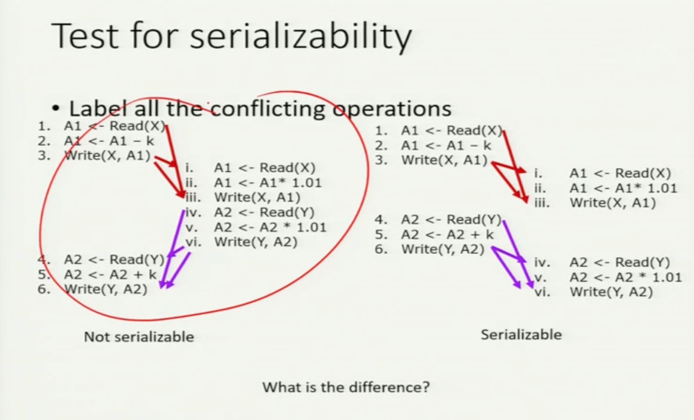

# Chapter 17 Transactions

> 中文 Chapter 14 
>
> What need do we done this chapter (focus on)
>
> just make sure when you read a textbook understand the context of the words.
>
> Because different textsbook will have totally different words.

> so we've done we've looked at the internal database in terms of query processing. We're going to look at the next big topic called transaction processing. So now transaction is one of the most loaded what in computer science? The word used in a different field can mean totally different thing. When you talk about transaction all worth of transaction in database versus transaction in security versus transaction in parallel processing, they all can mean different things. So my disclaimer for us. In database. In a database, contact transaction means something quite specific. So be careful. So just because you hear the word transaction, you better ask the context where you hear it. Different context. What means different thing? Please don't complain if historical issues. It is complicated, but it's okay.
>
> 我们已经了解了查询处理方面的内部数据库。我们将讨论下一个大主题，称为事务处理。事务处理是计算机科学中最重要的内容之一?这个词用在不同的领域可能意味着完全不同的东西。当你谈论数据库中的事务与安全中的事务以及并行处理中的事务的价值时，它们都是不同的意思。我的免责声明。在数据库中。在数据库中，联系事务意味着一些非常具体的东西。所以要小心。所以，仅仅因为你听到了transaction这个词，你最好问一下它是在哪里听到的。不同的上下文。什么是不同的东西?如果是历史问题，请不要抱怨。这很复杂，但没关系。
>
> So what is a transaction now in database so far? Let's move back to a relational contex. In theory, we can talk about transactions, any database context. But for now, we'll focus back on relational context. If we have time, we will actually talk about transactions in the context of NoSQL databases where there's actually something very interesting going on there. But for now, we go back to a relational database context. So let's say you have a relational database, you have two poles, you have tables, you can I ask you a query? Fine. Right. You often ask you if maybe the database system are required to actually execute, correct? Correct me with other tuples, everything is. Right. However, if you are working in a multi-user system. This may not necessarily be enough. What do I mean by that? We'll take the bank database, for example.
>
> 那么到目前为止，数据库中的事务是什么呢?让我们回到关系上下文。理论上，我们可以讨论事务，任何数据库上下文。但现在，我们将回到关系上下文。如果我们有时间，我们会讨论NoSQL数据库中的事务这是非常有趣的事情。但现在，我们回到关系数据库上下文中。假设你有一个关系型数据库，你有两个极点，你有表，我能问你一个查询吗?很好。正确的。你经常会问，数据库系统是否需要执行，对吗?用其他元组纠正我，一切都是。正确的。但是，如果您在一个多用户系统中工作。这可能还不够。这是什么意思呢?以银行数据库为例。
>
> Let's say you have a table storing, say, user name, account type. And amount. Right. So.
>
> Table A:
>
> | username | account_type | Amount |
> | -------- | ------------ | ------ |
> | Dr. Lin  | Saving       | $100   |
> | Dr. Lin  | Checking     | $5     |
>
> Okay. Is that accurate reflection of my life? It's an accurate reflection of sort of the stage of my life, obviously. Fair enough. So if I want to check my balance, what do I do? I just simply ask sql, excluding select stuff from let's call it, let's call this table A from a where you use a name equal to Dr. Lee.
>
> 好吧。这是我生活的真实写照吗?很明显，它准确地反映了我的人生阶段。很好。如果我想检查我的余额，我该怎么做?我只需要查询sql，排除select，我们称它为，我们称这个表为，如果你用的名字等于Dr. Lee。
>
> ```sql
> select * 
> from A
> where username = "Dr. Lin"
> ```
>
> I'll get that right. I may be using a API. I'll read those tuples and then I'll have a program to make it clean beautifully. That's perfectly fine. No problem. All right. If I want to put some money into the bank account, what do I do?
>
> 我会做好的。我可能正在使用一个API。我将读取这些元组，然后我将编写一个程序使其干净漂亮。那很好。没有问题。好吧。如果我想往银行账户里存点钱，我该怎么做?
>
> ```sql
> update A
> set amount = amount + 10
> where username = "Dr. Lin"
> 	 and account_type = Saving
> ```
>
> So I will update a set.  set amount equal to plus ten, where the user name is Dr. Ling and a Kong is saved one sql clearly do the job so far so good. So you saying the query the database system have the responsibility to make sure that this story is executed correctly. Cool. 
>
> 我要更新一个集合。将amount设置为+ 10，其中用户名是Dr. Ling，并且保存了一个Kong。你说数据库系统的查询有责任确保这个故事被正确执行。酷。
>
> What if I want to transfer money from? Well, I have to pay the bill, so I have to transfer money to savings on savings for checking. What else do I need to do? I do two updates. Right. I have to update. Savings and then I have to do an update.
>
> 如果我想从那里转账呢?嗯，我得付账单，所以我得把钱转到储蓄银行去检查。我还需要做什么?我做了两次更新。正确的。我得更新一下。然后我要做一个更新。
>
> ```sql
> update A
> set amount = amount - 10
> where name = "Dr. Lin"
> 	and account_type = Saving
> update A
> set amount = amount + 10
> where name = "Dr. Lin"
> 	and account_tyep = Checking
> ```
>
> The rest of it. Right now, the database is responsible to ensure each individual query is executed correctly. The database is not responsible for anything that can happen between the two queries. Correct? That's fair. That means things can go wrong. What can go wrong? So if the power went down, what happened? You done that? before you've done the second query of data system crash and when the system wake up, they never even know that your second update is supposed to be executed. What happened with us? You lost ten bucks and the Bengals just say, sorry, this is a pain. And what will you do? You will, basically. You will probably pick the money to handle that, right?  So that's not good for you. That's not good for the bank. But you think about it. From a database system Paula. Will, there's nothing you can do. It's not that they have a system to tell that call to keep the power up. If that is what is a force of nature, that it cannot be stopped. These things can be predicted. But and once again database do his job in execute this query successfully. e's supposed to execute this query just in that very small one that they start with that.  It may be due to a power failure. It may be due to that the game is actually buggy and there's something another another processes, some computer crash databases, though all of these things can happen. It may happen that the DB is strong and activated. We hit the off button. But all of these may happens and none of this is under your database system control. But hey, we have a power. When every man we go poof. But my stuff left me very, very bankable. Right. So what do we do? So now it's clear that something needs to be done. It's also clear there's nothing that nothing can be done to make sure that the police always help. You never know. Right. So what are the things that need to be done? The first thing first, if I am the database system friendly, you just send me these to ask the acquiring separate. I have no legal reason to do anything about it. So at the very least, the first thing that you have to tell the base system is what these two queries, these tuples they statement are actually related. You cannot just finish the one and then pay the second one of the three four killed. Sorry, I cannot do that. I let's just say sorry and. But even those sorry seems to be the hardest work. Just sorry it's not going to cut it. You have to tell a debate system. Sorry doesn't cut it. You better do something. And debt essentially is the notion of a transaction. A crime section is essentially a bunch of database operation, a bunch of for example, in this case, we assume after a statement, we're going to use a simpler way to describe it later on. It's going to be a bunch of sql statements taking together if finish a pass, for example, you have to have both statement together in order for me to actually do a successful money transfer. And because it takes two to actually achieve one task, you want to tell a database system, hey, don't leave the other thing alone. You if if something happens in the middle, you better do something about it.The first thing you need to do is to tell the database system, this is it. And that's the idea of a transaction. in the database context. A transaction is basically a bunch of database operation for now. One thing about SQL statement that you want to tell the database system, hey, these are related. These should be treated as one unit of work. You should execute the bunch of things as if you are executing one state, even though you're writing six separate query. That's the simplest way to understand a transaction. So I understand the concept here. So typically in the data in ask you how you can do something, have a say begin transaction. You list a bunch of school statements and that and transaction.
>
> 剩下的部分。现在，数据库负责确保每个单独的查询被正确执行。数据库对两个查询之间可能发生的任何事情都不负责。正确吗?这是公平的。这意味着事情可能会出错。什么会出错?如果停电了，会发生什么?你做到了?在您进行第二次数据查询之前，系统崩溃，当系统唤醒时，它们甚至不知道您的第二次更新应该被执行。我们之间发生了什么?你输了十块钱，孟加拉人说，对不起，这很痛苦。你要做什么?基本上你会的。你可能会选择钱来处理，对吧?所以这对你不好。这对银行不利。但是你想想。从一个数据库系统Paula。威尔，你无能为力。这并不是说他们有一个系统来告诉那个电话保持电力畅通。如果这是一种自然的力量，那是无法阻止的。这些都是可以预测的。但是数据库再次成功地执行了这个查询。E应该执行这个查询只在以它开始的那个很小的查询中。这可能是由于停电。这可能是由于游戏实际上是有bug的，还有一些其他的进程，一些计算机崩溃的数据库，尽管所有这些事情都可能发生。它可能发生的DB是强大的和激活的。我们按下了关闭按钮。但是所有这些都可能发生，而且这些都不在数据库系统的控制范围内。但是，嘿，我们有力量。当每一个男人我们走。但我的东西让我非常非常有吸引力。正确的。那么我们该怎么办呢?所以现在很明显需要做点什么。很明显，没有任何事情可以做来确保警察总是能提供帮助。谁知道呢。正确的。那么需要做些什么呢?第一件事首先，如果我是数据库系统友好的，你就把这些发给我单独要求获取。我没有法律理由去做任何事。所以至少，你必须告诉基本系统的第一件事是这两个查询，它们语句的这些元组实际上是相关的。你不能先杀了一个然后再杀了另外一个。对不起，我不能那样做。我让我们说声抱歉。但即使是道歉似乎也是最难的工作。只是很遗憾这不能解决问题。你必须告诉辩论系统。抱歉是不够的。你最好做点什么。债务本质上是一种交易。crime部分本质上是一堆数据库操作，例如，在这里，我们假设在一个语句之后，稍后我们会用更简单的方式来描述它。这将是一堆sql语句，如果完成一个pass，例如，你必须有两个语句在一起，以便我真正成功地进行转账。因为完成一个任务需要两个任务，所以你想告诉数据库系统，嘿，不要把其他事情放在一边。如果中间发生了什么事，你最好做点什么。你需要做的第一件事是告诉数据库系统，就是这样。这就是交易的概念。在数据库上下文中。现在，事务基本上是一堆数据库操作。关于SQL语句，你想告诉数据库系统，嘿，这些是相关的。这些应该被视为一个工作单元。你应该像执行一个状态一样执行这一堆事情，即使你写了六个独立的查询。这是理解交易最简单的方式。所以我理解这个概念。通常在数据中询问你如何做某件事，比如开始事务。你列出了一堆学校报表和交易。

> ```
> BEGIN TRANSACTION
> ....
> END TRANSACTION
> ```
>
> Typically we actually don't use the word cross-section. There are other, more specific terms. But for now, we're used to make seem to at this stage we just simply say beginning it. So a transaction is a bunch of data based operations that you tell the database system, hey, this is one thing. You should treat this as if it is a single SQL statement. Even though the statement of. That's the basic definition of a transaction. So what do so if I declared the database system need to do something about it to date to ensure certain things are correct. So we are not going to tell you how the database system do it for now. We'll leave that to you. Probably either later next week or even the week following. Depend on time, but will. But for now, at least for this set of life, I want to focus on what need to be done. So we so please don't ask me how to dump database system do it. We will tackle that later on. So what are the things that need to be done? Number one. Right. We go we go back to the same example. It's clear that I cannot just simply subtract the money from the, uh, from the savings account and not adding it back to the savings checking account. Right. And the money cannot disappear. Now, if you think about it, really the key thing that I care about is the money cannot disappear. If I take in $10, $10, all my savings, I can't have this $10 go to. I don't know. The other world got bored forever. However, let's say in the middle of it, something crack or whatever. I will probably accept the fact that when the system come back up, the transfer has never happen. It is a bit of annoyance about that, but at least my money is still there. So let's say if my system go down in the middle of this transaction and later you go back up. Either the transaction is finished, I'm happy or the transaction has never begin. So it'll be a noise. But I still have my money. I absolutely cannot accept the fact that Pandora is gone. In the beginning. Correct. So that is what we mean by atomicity.  So once a transaction start, they can only be two outcomes. Either the whole transaction is finished. All the transaction never was able to start. Notice that the second option is a step double option.  But it cannot be left hanging in the middle and never get finish. That is not acceptable. So that means also let's introduce your transaction you either have to finish working in database week. I used a term commit or it has to be never as if never started. Which I use a term rollback or a bomb depend on which textbook you read. So I have to roll back the transaction, as I say. Either one of those is acceptable later on, you see, really in real life. Only one only one option is available if there's a crash. We'll get to that later on. Okay. So this is what we mean by atomicity. 
>
> 通常我们不会使用横截面这个词。还有其他更具体的术语。但现在，我们习惯于在这个阶段，我们只是简单地说开始。事务是一系列基于数据的操作你告诉数据库系统，这是一回事。您应该将其视为单个SQL语句。即使。这就是事务的基本定义。那么，如果我声明数据库系统需要做一些事情来确保某些事情是正确的呢?所以我们现在不会告诉你数据库系统是如何做到这一点的。我们把这个留给你。可能下个星期晚些时候，甚至下个星期。靠时间，靠意志。但现在，至少在这一套生活中，我想专注于需要做的事情。所以我们所以请不要问我如何转储数据库系统做它。我们稍后会解决这个问题。那么需要做些什么呢?第一。正确的。我们回到同样的例子。很明显，我不能只是简单地从储蓄账户中减去钱而不把它加回储蓄支票账户。正确的。这些钱不会消失。现在，如果你仔细想想，我真正关心的关键是钱不能消失。如果我拿走10美元，10美元，我所有的存款，我不能把这10美元。我不知道。另一个世界永远无聊了。但是，假设在中间，有东西裂开了。我可能会接受这样一个事实，当系统恢复时，转移从未发生。这有点烦人，但至少我的钱还在。假设我的系统在交易过程中坏了然后你又恢复了。要么交易完成，我很高兴，要么交易从未开始。所以这是一种噪音。但我的钱还在。我绝对不能接受潘多拉消失的事实。一开始。正确的。这就是我们所说的原子性。因此，一旦交易开始，它们只能是两种结果。要么整个交易完成。所有的交易都无法开始。请注意，第二个选项是step double选项。但它不能被悬在中间，永远无法完成。这是不可接受的。这也意味着我们要介绍你的事务你要么要完成数据库周的工作。我用了一个术语“提交”，否则它必须永远像从未开始一样。我用的术语是回滚还是炸弹取决于你读的是哪本教科书。所以我必须回滚交易，我说过。在现实生活中，这两种都是可以接受的。只有一个只有一个选择，如果发生了崩溃。我们稍后会讲到。好吧。这就是我们所说的原子性。
>
> There is a second obvious requirement. It has to do with buffering. What is the buffer? Which links below the information below for a this to make memory. So let's say you update your car. Let's say your query success or the system don't crash. However, table is actually in main memory. There are every reason to hate. So when I update the table, update the version in my memory. There are reasons that I do not immediately ready to do this. Why? The reason that I choose not to immediately write a change to this. If there are a lot of transactions that update your table and every time you update a coupon, you have to write to the this less thing about a second or less. Nothing about a second. Right. You lose sleep in completely sick time, right? So there is a reason saying that, hey, maybe I will not write this anyway if I need to access a table read from the memory anyway. Understand that, and this is the motivation of not doing that. What can go wrong? When can power be?  The power can shut down before you actually have a chance to write this stuff back to the desk.When that's when the power shut down. Now what happens when the systems go back up? Now that's the way the concept never happened. Because it assuming you didn't run to any. But then you have a told. Refuse to hate the cause that has occurred. Now this in the first case, the first thing you happen to told does use a deck of cards mean you have the oldest, you have the throwback, but now you have tell, do use the data transfer piece. Then I will be super annoyed if it turned out the times, whatever. But you're lying to me in the first time. You didn't lie to me. I don't know. The transfer has finished a lot. So if you tell me that. Hey, the treasure that happens, the worst I can feel is being annoyed. And you can always give. They can always give me a pen to satisfy my annoyance. But if I if you have told me that this is finish and you actually ended the chain definitely reflecting the debate, then things are a lot more dicey and we have to deal with that problem. And there are two other problems that we need to deal with to to kind of complete the full notion of transaction and wield power.
>
> 还有第二个明显的要求。这和缓冲有关。什么是缓冲区?下面的链接下面的信息，以使记忆。假设你更新了你的车。假设你的查询成功或者系统没有崩溃。然而，表实际上是在主内存中。恨是有理由的。所以当我更新表时，更新我记忆中的版本。我现在还没有准备好这么做是有原因的。为什么?我选择不立即对此进行更改的原因。如果有很多事务更新你的表，每次你更新优惠券，你需要写这个东西大约一秒或更少。一秒钟都没有。正确的。你生病的时候会失眠，对吧?所以有一个理由说，嘿，也许我不会写这个如果我需要访问一个从内存中读取的表。理解这一点，这就是不去做那件事的动机。什么会出错?什么时候才能有权力?在你真正有机会把这些东西写回办公桌之前，电源就会关闭。那就是停电的时候。那么当系统重新启动时会发生什么呢?这就是为什么这个概念从未发生过。因为它假设你没有跑到任何。但你有一个告诉。拒绝憎恨已经发生的事情。在第一种情况下，你告诉的第一件事是使用一副牌意味着你有最古老的牌，你有复古牌，但现在你告诉，使用数据传输片。如果结果是《泰晤士报》我就会非常生气。但你第一次就骗了我。你没有骗我。我不知道。这次转移完成了很多工作。如果你告诉我。对我来说，最糟糕的感觉就是被惹恼了。你总是可以给予。他们总是能给我一支笔来满足我的烦恼。但如果你告诉我这已经结束了，你确实结束了链条，这反映了争论，那么事情就更危险了，我们必须处理这个问题。我们还需要处理另外两个问题来完成交易和运用权力的完整概念。

> So as we mentioned, right, if you send a single S to a query to the system, all single escrow commands say for update statement, the database system have the responsibility to make sure that you'll come out with either successfully carry out or don't screw up the whole database. However, if you send two queries, one over the other, the database system have responsible only for each query on its own right. It has no responsibility for what is happening in the middle. And that's fair to you. You tell two command to the database system, delivery system. We try to try to execute these to come back as much as possible and as long as you can successfully done the first one. And the system creation cannot do the second one. There's nothing the database system can do.  so it's only fair. However, life is not fair. Uh, in real life you have application where you go to use the database a lot. And frankly, an operation that you faced is a single unit in real life may consist of a lot of database operation one after the other.  The last example we talk about transfer money, right? So when we transfer money from savings to checking, we have to do how many of the operations ? Two, you have to update. You have to decrease the amount value in the savings account and increase the amount of money in the checking account. These are two sql execute commands. The database system have the responsibility to execute each command separately, either successfully or or make sure it doesn't crash the system. But between the two one, what is happening, frankly, is not the database business. Frankly, if your system run the first command successfully and then crash and then it will get about a second command, he database doesn't have to give you your money back.  that's not the database. At least if you don't tell to their base that they may have no responsibility for what's happening between query right? If you execute the actual statement, the system crash and then when the system go back up, they forget about your second query. That's perfectly fine. Now, if you are in the middle of executing a second query and the system crash, the database system have responsibility to make sure the second command is either successfully executed or other condition. But between two queries, frankly, I don't know what you are trying to do to make who you are not able to do anything in the middle. Why should I worry about it? Why should I be responsible? Right? How do I know these two excuse them are related. If you don't tell me, I kind of assume. So. The database system can say things like this. You can charge them anything. he may have a bad idea, but that's the only thing you say. However, in real life, like the money transfer, like why the bank account crisis operation. These two common are crucially related. You really cannot just execute one and then forget about the other. If you take money away from your savings. But hey, before you can update your database to increase your checking account. The system crashed and the and the database come back up and say, I'm sorry, I didn't see your signal to that. Now you will not be very happy. And the Deb system, people realized very early that, hey, if database have to be useful, we cannot let that happen. We have to have a mechanism for you to tell a database system, hey, these tools, even though these are two separate commands, they should be treated as one thing. Now notice that you have to explicitly tell the database system to do it. Otherwise the database system will assume that it. But the databases don't have to provide a mechanism so they can tell, hey these two or maybe these three or maybe these 25 Eskimo combine are actually one thing. And I cannot I. And in the system crash and in the middle. And the system will completely forget. The other is not acceptable. Understand the key concept here. So tried to look for infection in database, meaning something very specific.  Be careful. Didn't just simply use the generic definition of transaction. And as I said, I want to give you a fair warning to transactions to work transaction in different few of computer size can meet different specific facts. It is what much more where we are very much more than just a interaction, if often even a bit more than just a task. So when you read the word transaction in various textual areas, computer fields, make sure you try to see you can get as much of the context as possible. I want to warn you that this is one of the most loaded work in computer science. It can mean seven things when you read seven textbooks. So be very, very careful.
>
> 就像我们提到的，如果你发送单个S到系统查询，所有单个托管命令，比如更新语句，数据库系统有责任确保你成功执行或者不搞砸整个数据库。然而，如果你发送了两个查询，一个比一个多，数据库系统就只能对每个查询负责。它对中间发生的事情没有责任。这对你来说很公平。你告诉数据库系统两个命令，传送系统。只要你能成功地完成第一个，我们就会尝试尽可能多地执行这些操作。而系统创建无法执行第二项操作。数据库系统无能为力。所以这才公平。然而，生活是不公平的。在现实生活中你会经常用到数据库。坦白地说，你面对的一个操作在现实生活中是一个单元，但它可能由一个接一个的数据库操作组成。最后一个例子是转账，对吧?当我们把钱从储蓄转到支票时，我们需要做多少次操作?第二，你必须更新。你必须减少储蓄账户中的金额，增加支票账户中的金额。这是两个sql执行命令。数据库系统有责任分别执行每个命令，要么成功执行，要么确保不会使系统崩溃。但坦白地说，在这两者之间发生的并不是数据库业务。坦白地说，如果您的系统成功地运行了第一个命令，然后崩溃，然后它将得到第二个命令，他的数据库不必给您退款。这不是数据库。至少如果你不告诉他们，他们可能对查询之间发生的事情没有责任，对吗?如果您执行实际的语句，系统崩溃，然后当系统重新启动时，他们忘记了您的第二个查询。那很好。现在，如果您正在执行第二个查询并且系统崩溃，数据库系统有责任确保第二个命令成功执行或满足其他条件。但是在两个问题之间，坦率地说，我不知道你在试图做什么，让你在中间什么都做不了。我为什么要担心呢?我为什么要负责?对吧?我怎么知道这两个借口是有联系的。如果你不告诉我，我就假设。所以。数据库系统可以这样说。你可以向他们收取任何费用。他也许有个馊主意，但你只能这么说。然而，在现实生活中，像转账一样的银行账户为什么要危机操作。这两个共同点是至关重要的。你真的不能只执行一个，而忘记另一个。如果你从你的储蓄中取钱。但是，嘿，在你更新数据库来增加你的支票账户之前。系统崩溃了然后数据库恢复过来，说，对不起，我没有看到你的信号。现在你不会很高兴了。Deb系统，人们很早就意识到，如果数据库必须有用，我们不能让它发生。我们必须有一种机制让你告诉数据库系统，嘿，这些工具，即使这是两个独立的命令，它们也应该被视为一个东西。现在请注意，您必须显式地告诉数据库系统这样做。否则，数据库系统将假设它。但是数据库不需要提供一种机制，让他们可以判断，嘿，这两个或者这三个或者这25个爱斯基摩人组合实际上是一个东西。我不能，在系统崩溃的时候，在中间。系统会完全忘记。另一个是不能接受的。理解这里的关键概念。所以我试着在数据库中寻找感染，也就是一些非常具体的东西。小心些而已。没有简单地使用事务的一般定义。就像我说的，我想给你们一个公平的警告在不同大小的计算机中交易可以满足不同的具体事实。这不仅仅是一种互动，甚至不仅仅是一项任务。所以当你在各种文本领域，计算机领域阅读“事务”这个词时，确保你能尽可能多地了解上下文。我想提醒你，这是计算机科学中负荷最大的工作之一。当你阅读七本教科书时，它可以意味着七件事。所以一定要非常非常小心。
>
> It is a set of query that the youth are required to be taken as a single unit of operation. Now the users have to tell database system that they may see something I want to do. Otherwise, the database system will not assume you want to do. You can put one if if look back in history, this is probably one of the biggest advances databases system that make database system as powerful as popular today. Because if you do not have this mechanism that we live in, it's going to be a horrible issue of databases for databases and to be useful or at least a user will have to do significant amount more programing to make sure your system is reliable. And the whole transaction, obviously, so far what I tell you is that, hey, you have to tell the database system between us one unit, obviously that means that databases don't have to do a lot of things to ensure that is the case. And the good thing is that because of this mechanism, the database will do all these thing for you and you don't have to worry about it. We will look into some detail on how database systems do it because some of this will be relevant for new DBA, for instance. And it's also good to know, because this mechanism will be used if you if you have a say in the future, you have to develop some software. You don't want the full scale functionality of a database system, but you still want to be able to achieve certain kind of detail requirement. That study will be useful for you. So that's kind of two reasons why we want to do that.
>
> 它是一组要求青年人作为一个单一单位进行操作的查询。现在用户必须告诉数据库系统，他们可能看到我想做的事情。否则，数据库系统不会假定您想要这样做。如果回顾历史，这可能是最大的先进数据库系统之一，使数据库系统强大到今天的流行。因为如果你没有我们所处的机制，这将是一个非常可怕的问题数据库对数据库来说是有用的或者至少用户将不得不做大量的编程来确保你的系统是可靠的。整个事务，到目前为止我告诉你的是，你必须告诉数据库系统我们之间是一个单元，显然这意味着数据库不需要做很多事情来确保情况是这样的。好在有了这个机制，数据库会帮你做所有这些事情你不用担心。我们将详细研究数据库系统如何做到这一点，因为其中一些将与新DBA相关。知道这个也很好，因为这个机制会被使用如果你将来有发言权，你必须开发一些软件。您不想要数据库系统的全部功能，但仍然希望能够实现某种细节需求。那项研究对你很有用。这是我们做这个的两个原因。

## Motivation 

* Operations on databases (e.g. SQL commands)
  
  数据库操作(例如SQL命令)
  
  *  Queries : select … from … where
  
  * Insertions : insert … values …
  
  * Deletions : delete … where …
  
  * Updates : update … where …
  
  * Create tables, change attributes etc.
  
    > Whatever ask will provide, you can always excute them.
    >
    > 无论请求提供什么，你都可以执行它们. 
  
* These are basic operations on tables

  这些是对表的基本操作

* But are they “too basic” in real life?

  > so as I say, these are basic operations. So for each individual operation, the data base have to have the mechanism. This is correct. So for example, when you try to update a set of tuple in one single statement `update … where … `. the databases have to have internal mechanism such that if something very bad happened, your situation is still salvageable. You won't get into inconsistency all of these years. 
  >
  > 就像我说的，这些是基本的运算。所以对于每个单独的操作，数据库都必须有相应的机制。这是正确的。例如，当你试图用一条语句`update…where…`更新一组元组时。数据库必须有内部机制，以便在发生非常糟糕的事情时，您的情况仍然可以挽救。你不会一直处于不一致的状态。


* Consider a database for bank accounts

  考虑一个银行账户数据库

* Basic operations (in the eye of the customers)
  
  基本操作(客户眼中)
  
  * Withdraw 

    提取
  
  * Deposit
  
    存款
  
  * Transfer
  
    转账
  
  * Dividend
  
    股息
  
    > So your basic operation is you can withdraw, you can deposit, you can transfer, you can get paid dividends, right? nterest rate is rising. Sooner or later, you actually can get some money in your savings account. Not having it is a good thing or I'm not economist, but anything can happen.
  
* Each basic operations contains multiple database operations

  每个基本操作都包含多个数据库操作

  > if from a bank point view, these are basic operations. But each of these things may consist of multiple sql statement.
  >
  > 如果从银行的角度来看，这些都是基本操作。但是这些东西可能由多个sql语句组成.


* Example : Transfer \$k from x to y (Method 1)        示例:将$k从x转移到y(方法1)

  1. ==Find tuple for x’s account (database query)== ==查找x的账户的元组(数据库查询)==
  2. Read x’s account info into main memory 读取x的账户信息到主内存中

  3. Check if x have at least $k  检查x是否至少有k美元

  4. Subtract $k from x’s account 从x的账户中减去k美元

  5. ==Write x’s new balance back to the database (database update)== ==将x的新balance写回数据库(数据库更新)==

  6. ==Find tuple for y’s account (database query)==  ==查找y的账户的元组(数据库查询)==

  7. Read y’s account info into main memory 读取y的账户信息到主内存中

  8. Add $k to y’s account 向y的账户中添加k美元

  9. ==Write y’s new balance to the database (database update)==      ==将y的新余额写入数据库(数据库更新)==

  > At least as we mentioned, these are at least two sql statements


* One need to maintain

  * Consistency/Correctness

    > 一致性

  * Efficiency

* Correctness/consistency : The right amount of money being transferred
  
  正确性/一致性:转账的金额正确
  
  * Easy to check for normal operations 便于检查是否正常操作
  * But what if 
    * System crashes	系统崩溃
    * Multiple users want to update same data  多个用户想要更新相同的数据

> So correct this consistency the right obviously you want the right amount of money to be transferred. And if the transfer fails, for whatever reason, the money cannot go up infinite.
>
> 所以纠正一致性很明显你想要正确的转账金额。如果转移失败了，不管什么原因，钱都不能无限增加。


System crashes, case 1

1. ==Find tuple for x’s account (database query)==

2. Read x’s account info into main memory

3. Check if x have at least $k

4. Subtract $k from x’s account

5. ==Write x’s new balance back to the database (database update)==

6. ==Find tuple for y’s account (database query)==

***System crashes! --------------------------------- System crashes!***

7. Read y’s account info into main memory

8. Add $k to y’s account

9. ==Write y’s new balance to the database (database update)==

   

* What is the database like now?

* What happen if we don’t do anything about it?

> Now eventually the system go back up. But remember when the system crashed, the whole made memories wipe out crap. That means anything you. A story in my memory will be poof. Gone. You when you let your system go up, if you don't do anything, you have no clue. What if you make memory? Frankly, you have no clue whether this command, this this program is actually being run. So that means. Well, now this is updated. So that's fine. You have \$20 left, the \$20 less. But the other guys don't have 20 dollars, right? Let's say your husband money to your spouse. The candidate asks him or her to buy groceries for dinner. What happened? They'll look for you for that, right? So that means. Not doing anything may not be an option. Frankly, in this case, not doing anything is not an option. Now also, frankly, is probably put too much of a burden or to use it to do something. Remember, I might issue a command. I assume that the database system will take care of it.I go, I like watching Netflix movie and then I come back 2 hours later, so I cannot see the day because then I'm actually going to take care of it. So we have to do something about it. 
>
> 最终系统会恢复正常。但记住，当系统崩溃时，整个内存都被清除了。那意味着一切，你。一个故事在我的记忆里就会噗的一声。一去不复返了。当你让你的系统上升时，如果你什么都不做，你就什么都不知道。如果创建内存呢?坦白地说，你不知道这个命令，这个程序是否正在运行。这意味着。现在更新了。这很好。你剩下\ 20美元，少了\ 20美元。但是其他人没有20美元，对吧?比如说你丈夫把钱给你的配偶。面试者让他或她买些食品当晚餐。发生了什么事?他们会找你的，对吧?这意味着。什么都不做可能不是一个选择。坦白地说，在这种情况下，什么都不做是不可能的。现在，坦率地说，也可能是把太多的负担或用它来做某事。记住，我可能会发出一个命令。我假设数据库系统会处理它。我喜欢看Netflix的电影，然后两小时后我就回来了，所以我不能看到那天的情况，因为我要处理这件事。所以我们得做点什么。


System crashes, case 2

1. ==Find tuple for x’s account (database query)==

2. Read x’s account info into main memory

3. Check if x have at least $k

4. Subtract $k from x’s account

5. ==Write x’s new balance back to the database (database update)==

6. ==Find tuple for y’s account (database query)==

7. Read y’s account info into main memory

8. Add $k to y’s account

9. ==Write y’s new balance to the database (database update)==

*System crashes! --------------------------------- System crashes!*

* OK? 

  > Yes, seems ok!

* But what is output is being buffered?

  > Seek time. The money is still not yours.

> Now, let's say in case two, let's say you run everything correctly and then the system crashed, right? Sounds fine. No problem. Everything is done. Correct. So the money I transfer, the money is the account, the new money. I actually starting the database now. Seems ok! But what if the output is being buffer? What do I mean? Now, remember, initially the bank accounts table is under disk. However, during the operation I'm starting to read pages, if not the whole table of the bank account table in the main memory. I'm storing it probably somewhere in main memory.
>
> 现在，假设在第二种情况下，假设一切都正常运行然后系统崩溃了，对吧? 听起来不错。没有问题。一切都完成了。正确的。所以我转的钱，就是我的账户，新的钱。实际上我现在启动了数据库。似乎是好的!但是如果输出是buffer呢?我是什么意思?记住，最初银行账户表在磁盘下。但是，在操作期间，我开始读取页，如果不是主内存中的整个银行帐户表。我可能把它存储在主内存中。
>
> 
>
> Now, obviously I have the option of every time I'm updating a tuple I immediately right next to the disk. I can certainly do that. Understand what I'm saying here. Let's say. But if I update the wealth of a tuple, I will update it. When we the main menu, we end up immediately copy the wedding to the this. Why would you not want to do? Seek time will cost a lot. What if this account has to be updated every millisecond. Ouch. Every millisecond you do a feat you'll use the database in a performance can basically go down to. Fair enough. So what happened? I will rather keep the latest version in my memory. I will have a mechanism to remember what is in my memories. The latest version. Right. These can be done either. Usually operating system have some mechanism to do that too. If you take operating system, do you remember paging? Virtual peaking demand peaking same mechanism day. So that can be done. So those mechanisms are easily available from operating system and it send my DS an operating system will allow  you to do something like that and we'll have to automate will be able to figure out what is the latest version, where is it and how do we test which page on this daisy cross-pollinating. So these things can be done easily. So you do have to worry about, you know, obviously the users have to worry about implementing this. But even for data based systems programmer, this is not hard to do. It pretty much come with any operating system. But still, Murphy's Law was Murphy's Law tendency to what works right. Whenever it can go wrong, it will go wrong and it will go wrong at the worst possible time.  Right. I hope you guys does not have any taste of Murphy's Law this week. You know who actually have some movies they'll have in the den?  always. Okay, So power outage, right. These are things you can't expect and sort of all these things. But the point I want to make is that if there's a power outage and you have one, right, the data to do this well so that the money is not yours. After after the system went back up. Right.
>
> And the worst thing is what? You think the transaction is finished, right? Those execution to have been finished. You okay? It's actually a transaction finished. You are done. So I can say. Go to what? I think I am safe to go watch the Netflix movie and then come back and watch it. And then when I finish watching the movie, I come back. Oh, where is the money? The money is not there. What happened next? You hit the mall and you break your hand and you go to the hospital and the money still is not with you. Right. So and if that's not Murphy's Law, I don't know what is. So both are situations that can happen and both are situations that need to be dealt with and both by situation that you don't want the user to deal with it, but you want the database system to deal with it. Correct.
>
> 显然，每次更新元组I时，我都可以选择它就在磁盘旁边。我当然可以做到。理解我在说什么。假设。但是如果我更新元组的财富，我就会更新它。当我们打开主菜单的时候，我们会立即把婚礼复制到这个上面。你为什么不想做呢?寻找时间会花费很多。如果这个账户每毫秒都要更新呢。哎哟。每完成一项任务的毫秒，使用数据库的性能基本上都可以下降到。很好。发生了什么?我宁愿把最新的版本留在我的记忆中。我将有一种机制来记住我记忆中的东西。最新版本。正确的。这些也可以做到。通常操作系统也有一些机制来做到这一点。如果你选了操作系统，你还记得分页吗?虚拟峰值需求峰值日机制相同。这是可以做到的。所以这些机制很容易从操作系统中获得，它发送给我的DS，操作系统将允许你做类似的事情，我们必须自动化将能够找出什么是最新的版本，它在哪里，我们如何测试在这个交叉授粉的菊花上的哪个页面。所以这些事情很容易做到。你需要担心，显然用户需要担心实现这个。但即使对于基于数据的系统程序员，这也不难做到。它几乎是任何操作系统都有的。但墨菲定律仍然是墨菲定律的趋势。只要它可能出错，它就会出错，而且会在最糟糕的时候出错。正确的。我希望你们这周没有尝到墨菲定律的味道。你知道谁会在书房里放些电影吗?总是这样。好吧，停电了。这些都是你不能期望的事情等等。但我想说的是，如果停电了，你有数据来做好这件事，钱就不是你的了。在系统恢复正常之后。正确的。
>
> 最糟糕的是什么?你认为交易已经完成了，对吗?那些死刑已经完成了。你没事吧?这实际上是一笔已经完成的交易。这样就完成了。所以我可以说。去什么?我想我可以去看Netflix的电影，然后再回来看。然后当我看完电影，我回来。哦，钱在哪里?钱不在那里。接下来发生了什么?你去了商场，摔断了手，去了医院，钱还是没带在身边。正确的。如果这不是墨菲定律，我不知道什么是。这两种情况都可能发生这两种情况都需要处理这两种情况都不希望用户处理，但希望数据库系统处理。正确的。


* Two potential problems 两个潜在的问题

  * System crashes in the middle 系统在中间崩溃

    * Need to make sure the system is consistent after restarting

      请确保重启后系统保持一致

    * Some tuples may be updated by others aren’t

      一些元组可能被其他元组更新

    * What should one do?

  * System crashes at the “end” 系统在“结束”时崩溃

    * It is unclear if all changes is saved onto the disk
  
      不清楚是否所有的更改都保存到磁盘上
  
    * When system crashes, all the unsaved changes is lost
    
      当系统崩溃时，所有未保存的更改都会丢失
    
    * Need to ensure that all changes are reflected
    
      需要确保所有的更改都得到了反映

> when a system go back up, you really have to tell us, hey, if you are to tell the user, hey, the transaction is finished, you better make sure that process is really finished and everything actually got written to this, or at least when the system go back up or the change are being reflected. Any questions about these two requirements? 
>
> 当一个系统恢复运行时，你必须告诉我们，嘿，如果你要告诉用户，嘿，事务完成了，你最好确保这个过程真的完成了，所有的东西实际上都写入了这个，或者至少当系统恢复运行或更改被反映出来的时候。关于这两个要求有什么问题吗?

> Let's say you have \$100. How do you get \$200 out of it? Now you need a spouse that have an ATM card. So you have an ATM card. Your spouse have ATM card. All right. So let's say you have an ATM card. You put the ATM card in, you ask \$100. What's the idea? What's the ATM machine supposed to do? have to look at the balance. If you don't have \$100 and they and you also hundred dollar, what do can tell you? You are pool go away. Something nicer than that, obviously. Awesome. Hey, maybe there is hope tomorrow when you got enough money in the bank. I'll give you the hundred bucks. Right. And then bring out some. Some motivational speaker. Life is good, right? Let's go get a job. But you have to check, right? Okay. So let's say life is good. You actually have more than \$100 in the bank. You need to subtract, wandered off on the bank account, and then you split the money up. All right, let's say me and my spouse or your best friend or whatever. Basically, two guys have a thing that can both put the ATM machine in. In theory, the foreign thing can happen. The first ATM machine will check whether you have \$100. Yes, I do. Before the first ATM continues. go to the second ATM. The second ATM. Hey, do you have \$100? Yes, I do. Right.Then I'll subtract 100 from the 100 minus one is zero and write the local rebel in. I put it to zero. Then the second machine also have one. Remember you've got already read the value is 100 mile 100 000 back. If you give \$100 to you, if give \$100 to your spouse or accomplice or whatever and the bank account showing zero. Is it so you can get \$200 out of this \$100 backpack right now?
>
> 
>
> 假设你有\$100。如何从中得到200美元?现在你需要一个有ATM卡的配偶。您有一张ATM卡。你的配偶有ATM卡。好吧。假设你有一张ATM卡。你把提款卡放进去，要100美元。有什么想法?自动取款机是用来做什么的?必须要看平衡。如果你没有\$100，他们和你也有$100，什么能告诉你?你给我滚开。显然是比这更好的东西。太棒了。也许明天你银行里有了足够的钱，就有希望了。我给你一百美元。正确的。然后拿出一些。一些励志演说家。生活很美好，对吧?我们去找份工作吧。但你必须检查，对吧?好吧。假设生活很美好。你的银行存款实际上超过了100美元。你需要做减法，在银行账户上跑了，然后你把钱分了。好吧，比如说我和我的配偶或者你最好的朋友之类的。基本上，两个人都有一个东西可以把ATM机放进去。理论上，外来事物是可能发生的。第一个ATM机将检查您是否有\$100。是的，我喜欢。在第一个自动取款机继续运行之前。到第二个自动提款机去。第二个自动取款机。嘿，你有\$100吗?是的，我喜欢。正确的。然后100减100等于0，再减去100然后把当地的叛逆者写进去。我把它归零。然后第二台机器也有一个。记住，你已经读过值是100英里100 000。如果你给你\$100，如果给你的配偶或同伙或其他什么，银行账户显示为0。是为了从这个\$100的背包里得到\$200吗?

> Now, firstly, there are multiple processes that want to access the same data, right? More importantly, do you have control over the order of the execution? At least for now, is no. Remember, we lost the operating system. Operating system decide which operation to execute. So I understand the problem here. So I am not from a database with the point, I have at least if I do it this way, I have no control of what the method of executing it that perfectly. You do want to allow parallel. You don't want you do want to use users, right? Because increasing efficiency, blah, blah, blah. Go back to operating system textbook. They tell you why we should allow multiple uses. Virtually nowadays, all operating systems are multiple user database system. Allow multiple user to do consulting call go simultaneously even if you have a single call machine. But always it's simultaneous means something slightly different. We'll talk about that later on. But this thing happens and up and up you go back the operating system tax code, they'll tell you why, a reason why this is preferable than a single user system. So we won't we won't go back to that. But the problem is the potential inconsistency.
>
> 首先，有多个进程想访问相同的数据，对吧?更重要的是，你能控制执行的顺序吗?至少现在是这样。记住，我们失去了操作系统。操作系统决定执行哪个操作。所以我理解这里的问题。我不是从数据库中来的，我至少如果我这样做，我无法控制如何完美地执行它。你需要允许并行。你不想。你确实想使用用户，对吧?因为提高效率，等等。回到操作系统教科书。他们告诉你为什么我们应该允许多重使用。实际上，现在所有的操作系统都是多用户数据库系统。允许多个用户同时进行咨询呼叫，即使您只有一台电话机。但它总是同时发生的，意思是有点不同。我们稍后再谈。但是这种事情不断发生，你回到操作系统的税法，他们会告诉你为什么，为什么这比单一用户系统更好。所以我们不会回到那个。但问题是潜在的不一致性。


* Another problem: multiple users 另一个问题:多用户

* Consider another operation, dividend: 考虑另一个操作，股息:

  1. ==Find tuple for x’s account (database query)== ==查找x账户的元组(数据库查询)==

  2. ==Find tuple for y’s account (database query)== ==查找y的账户的元组(数据库查询)==

  3. Read x’s account info into main memory 读取x的账户信息到主内存中

  4. Read y’s account info into main memory 读取y的账户信息到主内存中

  5. Add 1% to x’s account 在x的账户上加1%

  6. ==Write x’s new balance back to the database (database update)==  ==将x的新balance写回数据库(数据库更新)==

  7. Add 1% to y’s account 在y的账户中增加1%

  8. ==Write y’s new balance back to the database (database update)== ==将y的新余额写回数据库(数据库更新)==


* Suppose x has \$100, y has $200

* Consider two operations
  * x transfer $50 to y
  * Dividend

* If transfer comes before dividend
  * X : 100 -> 50 -> 50.5
  
  * Y : 200 -> 250 -> 252.5
  
    > X+Y = 303
  
* If dividend comes before transfer
  * X : 100 -> 101 -> 51
  
  * Y : 200 -> 202 -> 252
  
    > X+Y =303

> Now, obviously, the transfer is done by me. I do it a certain time when the bank pay dividend is not under my control. It can happen before I do a transfer. It can happen after I do the transfer.
>
> Now the result may be different in these two case, but really the difference of the result is not because of anything logically wrong. It's just because it's one operation after the other.  
>
> Another reason you can't complain. What's a total amount?  The money is distributed slightly differently, but at least a total amount is consist. 
>
> 很明显，转移是由我来完成的。我在银行分红不在我控制范围内的时候做这件事。在我转学之前就会发生。等我转完车就可以了。
>
> 这两种情况下的结果可能不同，但结果的差异并不是因为任何逻辑错误。只是因为这是一个接一个的行动。
>
> 另一个你不能抱怨的原因。总金额是多少? 钱的分配略有不同，但至少总金额是一致的。

* What if we want concurrent execution?

  如果我们想要并发执行呢?

* What does concurrent mean?

  并发是什么意思?

* Can we concurrently run commands without any limitations?

  我们可以不受限制地并发执行命令吗?

* What is an acceptable **schedule**? 

  什么是可接受的**计划表**?

> Obviously, today's we have like quite poor coal machines. But even back in the seventies and eighties, I only have a single coal machine I can still talk about on current colliery execution. So what do I really mean by concurrent here? I'm going to use a relatively simple. Definition of concurrent heat. No, we cannot concurrent. And so what I mean by concurrent is that we have a bunch of programs. Let's assume that to be as powerless as possible. We only have one CPM. When I say concurrent, what do I mean is that I don't have to start program run, finish program one before I start program two. But concurrent meaning I can actually execute a first line or program one, then execute the first line in a program to execute the first final program free. then go back to the second line or program to first line or program to, and then go to the first line of program for in any order that I want. Obviously, the order within the program have to be respected so you can execute a fourth line or program two before you execute the first line. But other than that, I always have the options of choosing which line to execute, which line from which program to exit clinics. That told me once again, if you go back to the OS path, you should probably why this one is a good idea. increased throughput because your program might be waiting for something, so everybody know that is a good idea. Then go back to check Operating system textbook. So I'm not here to argue this is a good idea in general, but if you are not careful that things can go wrong
>
> 很明显，今天的煤机很差。但即使回到七八十年代，我也只有一台煤机，我仍然可以谈论当前的煤矿执行。那么我说的并发到底是什么意思呢?我将使用一个相对简单的。同时热的定义。不，我们不能同时进行。我说的并发是指我们有一堆程序。让我们假设它是尽可能无能为力的。我们只有一个CPM。当我说并发的时候，我的意思是，我不需要开始程序运行，在开始程序二之前，完成程序一。<u>但是并发意味着我可以执行第一行或者程序中的第一行，然后执行程序中的第一行来执行第一个最终程序。然后回到第2行，程序到第1行，程序到，然后回到第1行，程序到，我想要的顺序。</u>显然，程序内部的顺序必须遵守，这样你才能在执行第一行之前执行第四行或程序第二行。但除此之外，我总是可以选择执行哪一行代码，从哪一行程序退出诊所。这再次告诉我，如果你回到操作系统的路径，你应该知道为什么这是一个好主意。增加吞吐量，因为你的程序可能在等待一些东西，所以每个人都知道这是一个好主意。然后回到操作系统教科书。我并不是说这是个好主意，但如果你不小心，事情可能会出错


> Right now, if you decide to sue the bank, you at least have a case. The court will need to throw you physically. Okay. Contractually, I'll have the court. Not. Understand the problem here. Theoretically from an operating system point of view is a good idea to allow schedule to interleave. You are running a few steps to first program, then run a few steps for the second program and then run a piece of first program. For the operating system. Probably is a good thing. However. In the database context here. In this case, we are going to find. But because we allow it to lead to the level of such a result become inconsistent. Right. You lost \$0.50, right? If I lost in every day, I lost \$0.50. How much? I lost at the end of the year. 150. Right enough to what? What can you do with \$150? What would do? Pay for your annual Netflix subscription.  So the total amount now obviously the bank would be okay, I think $0.50 less, but the customer will once again be so angry that who hit them all then go to the hospital and lost more than 50 cent or the hospital bill.
>
> 现在，如果你决定起诉银行，你至少有一个案例。法庭会对你进行人身攻击。好吧。按照合同，我会去法庭。不是。理解这里的问题。理论上，从操作系统的角度来看，允许调度交错是一个好主意。你正在运行第一个程序的几个步骤，然后运行第二个程序的几个步骤，然后运行第一个程序的一部分。对于操作系统。可能是件好事。然而。在这里的数据库上下文中。在这种情况下，我们将找到。而是因为我们允许它导致这种水平的结果变得不一致。正确的。你损失了\ 0.5美元，对吗?如果我每天都赔，我就赔了\ 0.5美元。多少钱?我在年底输了。150. 足够对什么?你能用\$150做什么?怎么办呢?为你的Netflix年度订阅付费。总金额现在银行肯定没问题，少了0.5美元，但客户会再次生气，打他们的人会去医院，损失超过50美分或医院账单。

* Thus need to define an acceptable standard of consistency, **in the face of concurrent execution with other commands**

  因此需要定义一个可接受的一致性标准，**面对与其他命令的并发执行**

* A plausible definition:
  
  一个合理的定义:
  
  * “If multiple commands execute concurrently, the results must *looks* *like* that the commands are executed one by one (sequentially)
  
    “如果多个命令同时执行，结果必须*看起来像*这些命令是一个接一个(顺序地)执行的。

> Once again, this problem won't occur if you don't allow any interleaving. But as I say, from the operating system textbook, this is probably a very bad idea. And if somebody is probably not reasonable. Right.
>
> 同样，如果你不允许任何交叉，这个问题也不会发生。但正如我所说，从操作系统教科书来看，这可能是一个非常糟糕的主意。如果有人不讲道理。正确的


* Many of the above problems can be eliminated if we

  上面的许多问题可以消除，如果我们

  * Disable concurrency

    > 禁用并发

  * Forcing writes to disk immediately

    强制立即写入磁盘

  * Do not write anything until the end of the command

    在命令结束之前不要写任何东西

    > It turns out if you do that, then at least the first consistency to the initial pace of the music can be solved because you don't do any update until I'm 100% sure that the command is finished. But that carries onsets of problem too, because reaction time becomes slow.
    >
    > 事实证明，如果你这样做，那么至少可以解决音乐初始节奏的第一个一致性，因为在我100%确定命令完成之前，你不会进行任何更新。但这也带来了问题，因为反应时间变慢了。

* However this leads to inefficiency

  然而，这导致了效率低下

* Thus: how to get the best of both worlds…

  因此:如何两全其美……


## Transaction basics -- definition

* A **==transaction==** is a *unit* of program execution that accesses and possibly updates various data items. (Via multiple command)

  事务(transaction) 是访问并可能更新各种数据项的一个程序执行单元(unit)  (通过多个命令)

* Can be defined as 可以定义为
  * A set of SQL statements 一组SQL语句
  * Stored procedures 存储过程
  * Initiated by high level programming languages (Java, C++ etc.) 由高级编程语言(Java, c++等)发起

* Delimited by `begin transaction` & `end transaction`  以`begin transaction` 和 `结束事务` 分隔

* Example:
  * Begin transaction
  * X = select salary from person where name = “Chu”
  * update person set salary = x * 10 where name = “”
  * Update person set salary = x / 10 where name = “”
  * End transaction

>So in order to solve all these problem database database people introduced transaction. I've been screaming and yelling for this couple of lectures. Always remember that the word transaction is a loaded word in computer science. Transaction in one field may not mean the same transaction in the field. I mean, I need to get through this disclaimer again and again and again. So when you say go to an OS class and the OS costs people to eyeball transaction, it may mean something slightly or very different. Be careful. Right. Don't just rely on the dictionary or whatever. To understand the context. So. So in this class will define a transaction you say in a program, execute that access and possible update various data items and more importantly, via multiple comments. The key thing to remember a transaction and compress a list of comments. Frankly, it may be a full program. You may be full pipe on program with six or seven calls to API call to your database.  It can be a simple sql statement. It can be a bunch of stored procedures. It can be initiated by high level programing language like Java, C++, Python, whatever. In the database. People notice it. As I say, by default, the database don't assume that you have a transaction. You have to explicitly tell the database to foreign command format transaction. You have to explicitly tell that. Okay, fair enough. So and you do that by basically insert a `begin transaction` command and `end transaction` command between. And before you ask, a transaction cannot be nested. You cannot have a transaction there. There has been a lot of attempt in building nested transactions. It turns out in the implementing method, but the meaning is unclear. Secondly, implementing this even you somehow can define something on nested transaction. Implementation is a big mess. So so no notion of nested transaction has been put into practice as far as I know. So transaction cannot be nested before you ask. ==**<u>There's no nested transaction.</u>**== 
>
>为了解决这些问题，数据库人员引入了事务。这几节课我一直在大喊大叫。永远要记住，事务这个词在计算机科学中是一个有意义的词。一个字段中的事务可能并不意味着该字段中的相同事务。我得一遍又一遍地读这份免责声明。所以当你说到操作系统类，操作系统需要花费人们的眼球，它可能意味着稍微或非常不同的东西。小心些而已。正确的。不要只依赖字典或其他东西。理解上下文。所以。在这个类中，你会在程序中定义一个事务，执行访问并可能更新各种数据项，更重要的是，通过多个注释。记住事务并压缩评论列表的关键。坦白地说，这可能是一个完整的项目。您可能在程序中使用6或7个API调用数据库的完整管道。它可以是一个简单的sql语句。它可以是一堆存储过程。它可以由高级编程语言发起，如Java、c++、Python等。在数据库中。人们注意到了。如我所说，默认情况下，数据库不假设您有事务。您必须显式地告诉数据库要对外命令格式事务。你必须明确地告诉他们。好吧，有道理。你可以通过插入`begin transaction`命令和`end transaction`命令来实现。在你问之前，事务不能嵌套。你不能在那里进行交易。在构建嵌套事务方面已经有了很多尝试。它在实现方法中出现，但含义不清楚。其次，即使你在某种程度上也可以在嵌套事务上定义一些东西。实现非常混乱。据我所知，嵌套事务的概念还没有付诸实践。所以事务不能在请求之前嵌套。没有嵌套事务。


## 17.4 Transaction basics -- states

* A transaction can be in any one of the 5 states:

  事务可以处于5种状态中的任意一种

  * **Active,** the initial state; the transaction stays in this state while it is executing

    活动的(active): 初始状态, 事务执行时处于这个状态

  * **Partially committed,** after the final statement has been executed.

    部分提交的(partially committed): 最后一条语句执行后

    > Partially committed basis means that the last statement of sql should have been executed. There's no more new statement to execute. Interesting thing he said, just because it's still a last statement doesn't mean that you're concrete. We'll talk about why later on. For now, take this aspect.
    >
    > 部分提交的基础意味着应该执行最后一条sql语句。没有新的语句需要执行。他说的很有趣，仅仅因为这是最后的陈述并不意味着你是具体的。我们稍后会讨论为什么。现在，就拿这个方面来说。

  * **Failed,** after the discovery that normal execution can no longer proceed.

    失败的(failed): 发现正常的执行不能继续后

    > I know I am going to die but I have nothing to do.
    >
    > notice that this can be due to some force of nature that you cannot predict. Like an earthquake. Or it can be just because you have a deviation by zero error in your program.  It doesn't mean there's something that's, like a big disaster. It may just be you forget to define a variable in your program. Well or you forget to initialize a variable in the subgroup. That's as simple as it is that can cause a transaction to fail.
    >
    > 我知道我将死去，但我无事可做。
    >
    > 请注意，这可能是由于一些你无法预测的自然力量。像地震一样。也可能只是因为你的程序中有一个零误差的偏差。这并不意味着会有什么大灾难。它可能只是你忘记在程序中定义一个变量。或者你忘了在子组中初始化一个变量。这很简单，就是会导致事务失败。

  * **Aborted,** after the transaction has been rolled back and the database restored to its state prior to the start of the transaction. Two options after it has been aborted:

    中止的(aborted): 事务回滚并且数据库已恢复到事务开始执行前的状态后

    * restart the transaction – only if no internal logical error

      重启事务——只有在没有内部逻辑错误的情况下
    
      > 硬件错误
    
    * kill the transaction
    
      终止事务
    
    > I have already been die. 
    >
    > And on the other hand, if your program fail, Nowadays people used to roll back with probably small meaningful. Basically all the changes have to be rolled back. They have to be eliminated. If you have already subtracted the money from your bank account, those money have to be put back in your original bank account. For instance, this what I mean by rollback. But they depend on what textbook you read. If you read the text on the eighties and nineties, they probably used the word aborted. This is the original term that's used by the guy who developed the transaction. But nowadays, most database textbooks, for example, use the word rollback, which is kind of more descriptive because you have to undo all the changes.
    >
    > 我已经死了。
    >
    > 另一方面，如果你的程序失败了，现在人们通常会用小而有意义的方式回滚。基本上所有的更改都必须回滚。他们必须被淘汰。如果你已经从你的银行账户中扣除了这笔钱，那么这些钱必须回到你原来的银行账户中。例如，这就是我所说的回退。但这取决于你读的是什么教科书。如果你读上世纪八九十年代的文章，他们可能用了流产这个词。这是开发交易的人最初使用的术语。但现在，大多数数据库教科书，例如，使用回滚这个词，它更有描述性因为你必须撤销所有更改。
    
  * **Committed,** after <u>*successful completion*.</u>

    提交的(committed): 成功完成后

    > Got to commit to stick. That means it's successful when the atrocities committed, it is deemed successful and all the change should be effective. 
    >
    > 必须坚持下去。这意味着当暴行发生时，它被认为是成功的，所有的改变都应该是有效的

  


>Notice that so I can start being active and then I can either this big guy and fail or I can actually execute on a statement. Notice that interestingly, just because you execute a last payment successfully doesn't mean you're home free. For now, it's a bit hard to understand. We'll we'll we'll go. Data. I will explain why this can be the case later. Okay. For now, take it on, faith. Just because the last month doesn't mean that you are totally fine.
>
>注意，我可以开始活动然后这个大家伙失败或者我可以执行一条语句。有趣的是，仅仅因为你成功地执行了最后一次付款，并不意味着你就自由了。就目前而言，这有点难以理解。我们，我们，我们去。数据。稍后我会解释为什么会出现这种情况。好吧。现在，接受现实吧，费思。仅仅因为最后一个月并不意味着你完全没事。

* A transaction need not commit immediately after its last statement

  事务不必在最后一条语句之后立即提交

  * Why?

    >事务从活动状态开始。当事务完成它的最后一条语向后就进人了部分提交状态。此刻，事务已经完成执行，但由于实际输出可能仍临时驻留在主在中，因此一个硬件故障可能阻止其成功完成，于是事务仍有可能不得不中止。
    >
    >Once again, for now, it is a bit hard to explain. Well, let me give you at least a plausible explanation. Let's say a transaction read, the amount of money in your bank account and do things and such we do thing. But before it got committed, somebody suddenly told that transaction, Hey, the amount you read is wrong. All the money is coming from a transaction that has to be aborted. Then the manual suddenly becomes embedded. So that's why you you may have to apologize. Even if you execute all the statement is not home free.  
    >
    >再说一次，就目前而言，这有点难以解释。让我给你一个合理的解释。假设有一笔交易，你的银行账户里有多少钱，我们就这样做。但在提交之前，有人突然告诉交易，嘿，你读的金额是错的。所有的钱都来自一项必须中止的交易。然后手册突然变得嵌入。这就是为什么你你可能要道歉。即使你执行的所有语句都不是home free。

* It is the DBMS’s responsibility to determine which transactions can commit and which to abort

  DBMS负责确定哪些事务可以提交，哪些事务可以中止

* Also, it is the DBMS’s responsibility to clean up **(roll back)** after a transaction aborts

  此外，DBMS有责任在事务终止后进行**(回滚)**清理

* Possibility of cascade aborts 

  级联中止的可能性

> So if you are just a programmer user, you don't have to worry too much about it. But I think as a programmer you still need to know the mechanism. Like there's something called commit, there's something called a bot, and what really happens at the end of each of these steps? Now also, there is a possibility of what we call a cascade of abort is just like an avalanche. It turns out that, hey, the database decided to abort one transaction and before because it can't be causes about one transaction. all the data that is written by the second transactions suddenly become invalid because those values were updated by the first transaction, which no longer exists. And then all the values desperate by the third transaction is not better anymore because it's written by the second transaction, which is not weather anymore, so on and so forth. It's just like a snow stop. So that can happen. See the issue here.
>
> 因此，如果你只是一个程序员用户，你不必担心太多。但我认为，作为程序员，你仍然需要了解这种机制。比如有一种叫commit的东西，有一种叫bot的东西，那么每一步结束后会发生什么呢?现在，还有一种可能性我们称之为级联中止，就像雪崩一样。事实证明，嘿，数据库决定中止一个事务之前，因为它不可能是关于一个事务的原因。第二个事务写入的所有数据突然变得无效，因为这些值是由不再存在的第一个事务更新的。然后第三个事务的所有值都不再好了因为它是由第二个事务写的，不再是天气，等等。它就像一个雪停。这是可能发生的。点击这里查看问题。
>
> So let's say, for example. $T_1: \ x = 1000, T_2: \ x = x +100, T_3\ x= x+200 $
>
> Suddenly the database declared, this is the wrong transaction at T1. What happened? T2 took this value, which is no longer valid. That means T2 is not about it anymore. Then what happened? T3 reached the value of T2 x here, which is updated by T2 no longer valid anymore. So it's aborted. what we make a cascade of aborting one transaction can lead to aborting a lot of other transaction.
>
> 突然数据库声明，这是错误的T1事务。发生了什么事?T2取了这个值，不再有效。也就是说T2不再和它有关了。然后发生了什么?T3达到了T2 x的值，然后更新为T2不再有效。所以流产了。我们级联中止一个事务的行为可能会导致许多其他事务的中止。
>
> The key to it is just because you execute the last statement doesn't mean you can commit immediately. That's the challenge here. And Will and you see why in the next couple of lectures where we go into concurrency control, why this can happen. So you have to basically the the short answer is that there are system where once you execute the last eight months, you still have to wait for the green light for other transaction before you can commit.  Because they may be much, much better at the other transaction.Remember scheduler maybe the scheduler. Nice to you the allows you run oil oil come up. Right. 
>
> 关键在于，执行最后一条语句并不意味着可以立即提交。这就是挑战所在。在接下来的几节课中我们会讲到并发控制，为什么会这样。所以你必须基本上简单的回答是，有这样一个系统，一旦你执行了最后八个月，你仍然需要等待其他事务的绿灯才能提交。因为他们可能在其他交易中做得更好。记得调度器吧。很高兴你允许你运行石油石油上来。正确的。


## Transaction basics -- consistency (一致性)

* A transaction must see a consistent database.

  事务必须看到一致的数据库。

* During transaction execution the database may be inconsistent.

  在事务执行期间，数据库可能不一致

* When the transaction is committed, the database must be consistent.

  当事务提交时，数据库必须保持一致

* Two main issues to deal with:
  
  需要处理的两个主要问题
  
  * Failures of various kinds, such as hardware failures and system crashes
  
    各种各样的故障，例如硬件故障和系统崩溃
  
  * Concurrent execution of multiple transactions
  
    并发执行多个事务


## ==Transaction basics -- ACID==

* Four basic properties that must be maintained

  必须维护的四个基本属性

* **Atomicity** : All or nothing

  要么全部要么没有

  原子性(Atomicity): 事务的所有操作在数据库中要么全部正确反映出来, 要么完全不反映

* **Consistency** : Each transaction must ensure data consistency

  每个事务都必须确保数据的一致性

  一致性(Consistency): 隔离执行事务时(换言之, 在没有其他事务并发执行的情况下)保持数据库的一致性

* **Isolation** : Transactions “unaware” of other concurrent transaction

  事务“不知道”其他并发事务

  隔离性(Isolation): 尽管多个事务可能并发执行, 但系统保证, 对于任何一对事务$T_i$ 和$T_j$, 在$T_i$ 看来, $T_j$ 或者$T_i$ 开始之前已经完成执行, 或者在$T_i$完成之后开始执行. 因此, 每个事务都感觉不到系统中有其他事务在并发地执行. 

* **Durability** : Once committed, changes to database must be persistent

  一旦提交，对数据库的更改必须是持久的

  持久性(durability): 一个事务成功完成后, 它对数据库的改变必须是永久的, 即使出现系统故障. 


* ==**Atomicity** (原子性): All or nothing== 

* i.e. : Either all operations of the transaction are properly reflected in the database or none are.

  事务的所有操作都正确地反映在数据库中，或者一个都没有。

* Implications
  * If the system crashes in the middle of a transaction T, when the system restarts, *before any user can use the database* again, the DBMS must ensure either
    * T is finished
    * T never started

* Which do you think is easier? Make more sense?

> Basically atomicity means what you suggests. If you have a bunch of comas and you think of as a single transaction once the transaction started. Either at the very end, at the end of the transaction, it's like, what is abort to stay or commit to stay? Either all the operation of the transaction populated database or none of. You cannot say, Hey, I have this right in five more five update statement I execute free. I cannot exclude the two, so I'll make these three changes, but not those two changes. Thank you. That cannot happen. Your transaction disign your system. You automated decided. Your transaction must failed. Then at the end, none of the five modify statement should modify. Or at least that effect is that none of these five modify statements should have happened. It may be happening in the middle, but when you declare the 1830 supported or committed, if the declared condition is aborted that none of the five modify statements should have appear to be happen. The debate should have been and modify. If you decide to commit the transaction, all five of the change have to be made. Understand what these all or nothing me relatively straightforward and obviously the most relevant case in all or nothing is that. 
>
> 基本上，原子性就是你所建议的。如果你有一堆昏迷，你把它想象成一个交易，一旦交易开始。要么在交易的最后，要么在交易的最后，abort to stay和commit to stay是什么?要么所有的事务操作填充数据库，要么没有。你不能说，嘿，我有这个权利在另外5个update语句中，我可以自由执行。我不能排除这两个，所以我会做这三个更改，但不会做那两个更改。谢谢你！这是不可能的。你的交易设计你的系统。你自动做出了决定。您的交易必须失败。最后，5个modify语句都不修改。或者说，至少效果是这5个modify语句都不应该发生。它可能发生在中间，但是当您声明支持或提交1830时，如果声明的条件被放弃，那么五个修改语句都不应该发生。这场辩论本应得到修正。如果您决定提交事务，则必须完成所有5项更改。理解"全有或全无"的意思相对简单，显然"全有或全无"最相关的例子是。
>
> Obviously T never started is that we've looked at it from the user's point of view. You have obviously already started. But when the system crashed and go back up the use, when you lose a look at their base, the youth that the users should either be alive to finish or the changes make or deliver excess. There is no third option, at least a data based system. That helped to ensure that. So the good news that you are not responsible, the database system is responsible for all of this. So I'm not going to tell you how to do things. Now, this lecture is basically, what are we going to do? What do we need to do? Each of the four requirement is serve at least a lecture or two for that.
>
> 显然，我们从用户的角度来看待它。你显然已经开始了。但是当系统崩溃并重新使用时，当你失去了对他们的基础的关注时，年轻的用户应该活着完成或者改变产生或传递过量。没有第三种选择，至少是基于数据的系统。这有助于确保这一点。好消息是，你不需要负责，数据库系统负责所有这些。我不会告诉你怎么做。这节课基本上是，我们要做什么?我们需要做什么?四项要求中的每一项都至少要上一两堂课。

* **Consistency(一致性):** Each transaction must ensure data consistency

  Consistency一致性: 每个事务必须保证数据一致性

* i.e. Execution of a transaction in isolation preserves the consistency of the database.

  例如，隔离执行事务可以保持数据库的一致性。

* Thus all integrity and other constraints must be satisfied

  因此，必须满足所有完整性和其他约束


* **Isolation(隔离性)** : Transactions “unaware” of other concurrent transaction

  事务“不知道”其他并发事务

* Intermediate transaction results must be hidden from other concurrently executed transactions. 

  中间事务的结果必须对其他并发执行的事务隐藏。

* Implications:

  * for every pair of transactions $T_i$ and $T_j$ , it appears to $T_i$ that either $T_j$, finished execution before $T_i$ started, or $T_j$ started execution after $T_i$ finished.

    对于$T_i$和$T_j$这对事务，$T_i$认为要么$T_j$在$T_i$开始之前完成执行，要么$T_j$在$T_i$结束之后开始执行。

  * Some level of interleaving are not allowed
  
    > 某种程度的交叉是不允许的

> In the real life, whether you are in the living thing, that's another question altogether. But if you want to interleave, you cannot have the example that I have earlier. Now, if you think about it, let's go back here. If I interleave it this way. Now, in this case, actually, there's nothing much we can do.
>
> 在现实生活中，你是否在生物中，那完全是另一个问题。但是如果你想要交叉，你就不能像我之前说的那样。现在，如果你想一下，让我们回到这里。如果我这样交叉。现在，在这种情况下，实际上，我们无能为力。
>
> 
>
> I can subtract the money from x, a can give a dividend to x money to the Y accounts, give the dividends away, then you can actually work it out. If it go, this is perfectly okay. Even though you actually do in the leave it to transaction So you should allow interleaving. As your interleave never happens. Right.
>
> 我可以从x中减去钱，a可以给x分红给Y账户，然后把分红给Y账户，这样就可以算出来了。如果它走了，那就太好了。即使你实际上是把它留给交易，所以你应该允许交叉。因为你的交错从未发生过。正确的。


* ==**Durability(持久性)** : Once committed, changes to database must be persistent==

  一旦提交，对数据库的更改必须是持久的

* i.e. : After a transaction completes successfully, the changes it has made to the database persist, even if there are system failures. 

  事务成功完成后，即使有系统故障，它对数据库所做的更改也会保留。

  > Now, I'm not saying that another transaction can overwrite your result. I'm not saying that. I'm just saying that if this trans and you can think of this as example.

* Implications:
  * Suppose a transaction commits, and then the system crashes. When the system restarts, *before any user can use the database* again, the DBMS must ensure that the changes made by this transaction is stored onto the disk.

    假设提交了一个事务，然后系统崩溃。当系统重新启动时，在任何用户可以再次使用数据库之前，DBMS必须确保此事务所做的更改存储在磁盘上。
  
* Why is this not automatically the case? 为什么不是自动的呢?

  Buffer.  Updated value by a transaction may still remains in the buffers in main memory after transaction commits. 

> Now question why can you disappear in the first place?
>
> I can choose to write the tuples in the buffer and wait for the system to swap the buffer into the this. And the system can crash at that moment. Remember Murphy's Law. Anything that can go wrong will go wrong at the worst possible time. Right. So once again, the good news is not your problem is the database problem.
>
> 现在问你为什么一开始就能消失?
>
> 我可以选择将元组写入缓冲区，并等待系统将缓冲区交换到this。系统可能在那一刻崩溃。记住墨菲定律。任何可能出错的事情都会在最糟糕的时候出错。正确的。再一次，好消息不是你的问题而是数据库的问题。


* DBMS, not the user, is required to maintain ACID properties

  维护ACID属性需要DBMS，而不是用户

* The user will submit the transactions only containing the required database operations

  用户提交的事务只包含所需的数据库操作

* The DBMS will
  * Add additional operations
  
    添加额外的操作

  * Schedule the operations
  
    调度操作
  
  * Introduce various data structures and algorithms to ensure the ACID properties hold
  
    引入各种数据结构和算法，以确保ACID属性能够保持
  
* If needed, the DBMS will decide when a transaction will commit and/or abort

  如果需要，DBMS将决定事务何时提交和/或中止

* In many DBMS, users can specify when should a transaction commit/abort

  在许多DBMS中，用户可以指定事务何时提交/中止

* Roll back is also the task of the DBMS

  回滚也是DBMS的任务

* Need to worry about “observable external writes”

  需要担心“可观察的外部写入”

> Now, even though I say that the database control all things in your program, you can actually in most database system now, they allow you to have a command called Commit. call, roll back. So basically when the system reached the commit command, then the database system is is required to treat that this transaction has been executed successfully. Period. And notice that if the commit command is not present, successfully reaching the end transaction command will cut. Okay. It's just that in many cases you may have a say if, blah, blah, blah day or else blah blah blah and you want to commit on both cases. Or you can have a case of which legal way to see which case. A then you commit case B, then you abort case seed and you allow you to main, main reason why you give you these two commands, A Then you commit case B, then you abort case seed and you allow you to main, main reason why you give you these two commands, allow you to write programs like this that you and maybe your program might be easier to run. 
>
> Abort is more useful, For example, maybe you check there's a logical error in your program or that your program, after reading all the table data to figure out, is better just to give up. Then you can actually, in your program write in a bot, command a certain location to say If the program reached this line, you might, you know, what is better for a transaction to die? That can happen. Like, for example, if you if you rail programing homework, you reading the number and if you want to and if the number has to be positive and your program, I can read a negative number. What happened? You tell the user that number is incorrect, but more often you don't reduce the number of incorrect and you quit the moment. So they allow you to have an essentially. Okay. All right. Now, you can tell the system to roll back, but rolling back itself is a database task. You shouldn't worry about it. Now. They are. One thing you need to worry need to worry about observable external rights. So let's say when you say so, when we say right, I say updated their base. But when you program, you may actually just like sell print statement on the screen. Now, if you roll back then, the debates can always undo the change. If you print fake on the screen, the database cannot unfriend it. If your program, you vote transaction and you try to hop a statement and then you suddenly end up with them and say. I am rich. And then it turns out at the end, the translation right here, the bullet, that's. Quite embarrassing because you cannot print the statement. All right. So these are what I mean by observable external. That means when you write a program, you want to be careful when to print.
>
> Well, maybe you have a you have a program that decide to propose to you or to the one you love. And so after you read them a table, oh, that tuple contains my, my fiance's name. So let's say. And now will you marry me? And then. But your transaction turned out to be a mistake. You read the name of another girl.  I never to the now everybody got notified very observable. Very so, though very observable and absolutely cannot be rolled back. So that's fine. I think that they make. I think so. You still have to be careful about those. But if you just say updating the database, changing the marital status from from single to engaged, these are the things that everything.
>
> 现在，虽然我说数据库控制程序中的所有东西，但实际上在大多数数据库系统中，它们允许你有一个Commit命令。呼叫，回滚。因此，基本上当系统到达提交命令时，那么数据库系统就需要处理此事务已成功执行。时期。注意，如果不存在commit命令，则成功到达end transaction命令将被切断。好吧。只是在很多情况下，你可能会说，if, blah, blah, day或者else, blah, blah, blah，这两种情况下你都想提交。或者你可以用一种合法的方式来看待这个案例。然后你提交case B，然后你中止case seed，然后你允许，你给你这两个命令的主要原因，然后你提交case B，然后你中止case seed，你允许，你给你这两个命令的主要原因，允许你写这样的程序，你和你的程序可能会更容易运行。
>
> Abort更有用，例如，如果你检查程序中有逻辑错误，或者程序在读取所有表数据后找出错误，最好直接放弃。然后你可以在你的程序中写一个机器人，命令一个特定的位置，如果程序到达这一行，你可能会，你知道，什么对一个事务来说更好?这是有可能发生的。比如，如果你，如果你喜欢编程作业，你读数字，如果你想，如果数字必须是正数，你的程序可以读负数。发生了什么事?你告诉用户这个数字不正确，但更多情况下，你并没有减少错误的数量，而是立即退出。它们允许你有一个本质上。好吧。好吧。现在，您可以告诉系统进行回滚，但是回滚本身是一个数据库任务。你不应该担心它。现在。他们是。你需要担心的一件事是需要担心可观察的外部权限。所以当你这么说的时候，当我们说对的时候，我说更新他们的基数。但当你编程时，你可能只喜欢在屏幕上打印语句。现在，如果你回到过去，辩论总是可以撤销改变。如果你在屏幕上打印假的，数据库无法解除它的好友关系。如果你的程序，你投票交易你尝试跳转一个语句然后你突然结束，说。我很富有。然后在最后，这里的转换，子弹，这是。很尴尬，因为你不能打印这个声明。好吧。这就是我所说的可观察外部。这意味着，当你编写程序时，要小心何时打印。
>
> 也许你有一个你有一个程序，决定向你或你爱的人求婚。在你给他们读了一个表格之后，这个元组包含我未婚夫的名字。假设。现在你愿意嫁给我吗?然后。但你的交易结果是个错误。你看到了另一个女孩的名字。我从来没有到现在大家都被通知过很observable。非常正确，虽然非常明显，但绝对不能回滚。这很好。我认为他们。我想是的。你还是要小心这些。但如果你只是说更新数据库，将婚姻状态从单身变为订婚，这些就是一切。


### Quiz 5

Which of the following about atomicity for transaction is/are correct?

(a) It means that a transaction, once started, must finish

(b) It means that operations between different transaction cannot interleave

Neither(a) and (b) ✅

>* ==**Atomicity** (原子性): All or nothing== 
>
>* i.e. : Either all operations of the transaction are properly reflected in the database or none are.
>
>  事务的所有操作都正确地反映在数据库中，或者一个都没有。
>
>* Implications
>
>  * If the system crashes in the middle of a transaction T, when the system restarts, *before any user can use the database* again, the DBMS must ensure either
>    * T is finished
>    * T never started
>
>* Which do you think is easier? Make more sense?
>
>(a) ❌ a transaction does not have to once started and then must finish. because during the process it may encounter some bad problem, the the transaction is allowed to roll back.
>
>(b) ❌ it can have interleave operation. like serializability.  Concurrency schedule. 
>
>


In terms of transaction processing, why do DBMS need to have mechanisms to ensure durability?

A. The statement is false. Durability is always automatically maintained.

B. Updated value may get rollback if transactions aborts

C. Updated value is always flushed to the disk immediately (even before the transaction commits)

D. Updated value by a transaction may still remains in the buffers in main memory after transaction commits.

B ❌

D ✅

> * ==**Durability(持久性)** : Once committed, changes to database must be persistent==
>
>   一旦提交，对数据库的更改必须是持久的
>
> * i.e. : After a transaction completes successfully, the changes it has made to the database persist, even if there are system failures. 
>
>   事务成功完成后，即使有系统故障，它对数据库所做的更改也会保留。
>
>   > Now, I'm not saying that another transaction can overwrite your result. I'm not saying that. I'm just saying that if this trans and you can think of this as example.
>
> * Implications:
>
>   * Suppose a transaction commits, and then the system crashes. When the system restarts, *before any user can use the database* again, the DBMS must ensure that the changes made by this transaction is stored onto the disk.
>
>     假设提交了一个事务，然后系统崩溃。当系统重新启动时，在任何用户可以再次使用数据库之前，DBMS必须确保此事务所做的更改存储在磁盘上。
>
> * ==Why is this not automatically the case? ❓==
>
>   > Buffer.
>
> > Now question why can you disappear in the first place?
> >
> > I can choose to write the tuples in the buffer and wait for the system to swap the buffer into the this. And the system can crash at that moment. Remember Murphy's Law. Anything that can go wrong will go wrong at the worst possible time. Right. So once again, the good news is not your problem is the database problem.
> >
> > 现在问你为什么一开始就能消失?
> >
> > 我可以选择将元组写入缓冲区，并等待系统将缓冲区交换到this。系统可能在那一刻崩溃。记住墨菲定律。任何可能出错的事情都会在最糟糕的时候出错。正确的。再一次，好消息不是你的问题而是数据库的问题。
>
> A. ❌ The durability is no automatically maintained. Because when you automatically some information especailly when you update something, these thing when you automatically, and they are in the buffer, and at the same time the power break. Everything gone. You have to save in the disk.
>
> B. ❌ 所以 然后呢? 撤回了相当于没有更改 还没有commit的那块 答非所问
>
> C. ❌ not before commits


## Transaction basics – DBMS support

* 2 major tasks in DBMS to handle transactions
  
  DBMS处理事务的两个主要任务
  
  * **Concurrency control** (并发控制)
    * Handle how concurrent transaction is executed 
    
      处理并发事务的执行
    
    * Goal: Isolation
    
      目标:隔离
    
  * **Recovery** 恢复
    
    * Handle how to recover a database after a failure
    
      处理故障后如何恢复数据库
    
    * Goal: Atomicity & Durability
    
      目标:原子性和持久性
    
  * Consistency is maintained throughout various part of the DBMS (not the focus of this course)
  
    一致性贯穿于DBMS的各个部分(不是本课程的重点)
  
* Many systems rolls the two part together as a “transaction manager”

  许多系统将这两个部分结合在一起作为“事务管理器”

> If they have multiple transaction, they are running and you want to interleave them. How much interleaving do you want to allow? What if multiple transfers you want to access the same tuple? What do you want to do? These kind of things. Recovery.
>
> So this is mostly deal with like consistency in isolation recovery basically handle how to recover a database after a failure. The power went out for 5 seconds and then a system reboot. How can the debris system automatically ensure all those properties being hit? So let's go to atomicity and durability
>
> So this is what we call recovery module. In most database system, they will combine these two and just do a module, call a transaction manager.
>
> 如果它们有多个事务，则它们正在运行，并且您希望交叉它们。你想允许多少交叉?如果要多次传输访问同一个元组，该怎么办?你想做什么?诸如此类的事情。复苏。
>
> 这主要是在隔离中处理一致性恢复基本上是处理如何在故障后恢复数据库。停电了5秒然后系统重启。碎片系统如何自动确保所有这些属性都被击中?让我们来看看原子性和持久性
>
> 这就是我们所说的恢复模块。在大多数数据库系统中，他们将这两者结合起来，只做一个模块，称为事务管理器。


* What is actually happening
  * Database is stored on the disk 
  
    数据库存储在磁盘上 
  
  * DBMS allocate local memory for each transaction 
  
    DBMS为每个事务分配本地内存
  
  * Each transaction requests a set of tuples  
  
    每个交易请求一组元组
  
  * Transaction issues read commands (e.g. select … from … where ) 
  
    交易问题读取命令(例如select…from…where)
  
  * The set of tuples are read into main memory buffers 
  
    元组集合被读入主内存缓冲区
  
  * The value of the tuples are transferred from those buffers to the local memory for each transaction
  
    元组的值从这些缓冲区传输到每个事务的本地内存
  
  * Calculation and updates are done in local memory
  
    计算和更新在本地内存中完成
  
  * The transaction issues write commands (e.g. update … set … where)
  
    事务问题写入命令(例如:update…set…where)
  
  * The values in the local memory is copied to the buffers
  
    将本地内存中的值复制到缓冲区中
  
  * The buffers are flushed to the disk by the Operating systems (at unspecified time, unless transaction forces it) 
  
    缓冲区由操作系统刷新到磁盘(在未指定的时间，除非事务强制执行)


* What makes transaction processing tricky

  是什么让交易处理变得棘手

  * Scheduling is hidden from the DBMS

    调度对DBMS是隐藏的

    * DBMS cannot enforce which transaction to execute next

      DBMS不能强制规定接下来执行哪个事务
  
  * Buffer management is hidden from DBMS
  
    缓冲区管理对DBMS是隐藏的
  
    * Although the transaction write something onto the database, it is only written to the buffers, to be transferred to the disk at unspecified time
    
      尽管事务将一些内容写入数据库，但它只写入缓冲区，在未指定的时间传输到磁盘
    
    * One can force transfer immediately, but will be very inefficient
    
      可以立即强制转移，但效率很低


### Notation used (rest of semester)

* Database consists of objects (X, Y, Z), each of them is an integer

  数据库由对象(X, Y, Z)组成，每个对象都是一个整数

* Transactions are labeled T1, T2 etc.

  交易被标记为T1、T2等

* Each transaction has a set of local variables (not accessible by other transactions) in main memory. (Labelled as a1, a2, b1, b2 etc.)

  每个事务在主内存中都有一组局部变量(其他事务不能访问). (标为a1、a2、b1、b2等)

* Each transaction access the database by the read() & write() command

  每个事务通过read()和write()命令访问数据库

>  notice that remember you cannot just do a calculation on a database object. It has to be written into main memory before you do the calculation and each transaction access the database by region and recombined. so think of these as like this. This is a select statement. This is the modified update statements so on so forth. I just want to keep it simple, whole. Everything we talk about here translate to a datebase system.
>
> 请注意，记住，你不能只在数据库对象上进行计算。在进行计算之前，它必须写入主内存，并且每个事务按区域访问数据库并重新组合。把它们想象成这样。这是一条select语句。这是修改过的update语句等等。我只是想保持简单，完整。我们在这里讨论的所有内容都可以转换为数据库系统


* A read command read a database object into a local variables (a1 <- read(X))

  read命令将数据库对象读入局部变量(a1 &lt;- read(X))

* A write command write a local variable into the database object (write(X, a1))

  写命令将局部变量写入数据库对象(write(X, a1))

* Local variables for read() & write() will not be shown if the context is clear, or if it is unimportant

  如果上下文是明确的或不重要的，则不会显示read()和write()的局部变量

* Manipulation and calculation on objects can only be done on local variables (e.g. X <- X + 1 is not allowed, but a1 <- a1 + 1 is ok)

  对象的操作和计算只能在局部变量上进行(例如，X &lt;- X + 1是不允许的，但a1 &lt;- a1 + 1是可以的).

* In some case, the local manipulation is not shown (to highlight the effects of read() and write())

  在某些情况下，没有显示本地操作(以突出read()和write()的效果) 


* Example; (transfer, assuming overdraft is allowed)
  1. A1 <- Read(X)                   // read from disk
  2. A1 <- A1 – k                       // local calculation
  3. Write(X, A1)
  4. A2 <- Read(Y)
  5. A2 <- A2 + k
  6. Write(Y, A2)

> Nothing more. This is just for convenience, to be fair. Once again, the in this part of the class, the actual skew outcome is not as important as to understand the concept on what? How do I do the reading and writing with the interaction of the multiple user or the system going down? So that's why I'm going to use a simple location. Location. So, so good.
>
> 仅此而已。公平地说，这只是为了方便。再强调一次，在这部分课程中，实际的倾斜结果并不重要，重要的是理解什么概念?如何在多用户交互或系统宕机的情况下进行读写操作?这就是为什么我要用一个简单的位置。的位置。太好了。


## Table of contents ✅

* Concurrency control 并发控制
* Serializability 可串行性
  * Motivating examples 激励性例子
  * Conflict serializability 冲突可序列化性
  * Test of serializability 可串行性测试
* Recoverability 可恢复性

> So we have we have `acid`. We are going to look at c and I first, consistency and isolation. We are looking to look at this. We are going to look at A and D probably sometime next week. So and the thing that the kind of the culture I see and I have to do it, the notion of concurrency, that means multiple users are accessing the database at the same time.  And it turns out there is a notion costs serializability who is kind of in the hot of all discussion and will hopefully either this lecture or this lecture and the next we'll go through the whole idea of serializability.
>
> 我们有。我们有' acid '。我们先来看c和I，一致性和隔离性。我们正在看这个。我们可能会在下周的某个时候看一下A和D。我所看到的文化和我必须做的事情，并发的概念，这意味着多个用户同时访问数据库。有一个概念是可序列化性的代价这个概念是所有讨论的热点希望这节课或这节课以及下节课我们会讨论可序列化性的整个概念。

 

## Concurrency control ✅

* Why concurrrency?

  * **increased processor and disk utilization**, leading to better transaction throughput: one transaction can be using the CPU while another is reading from or writing to the disk

    **提高了处理器和磁盘利用率**，带来了更好的事务吞吐量:一个事务可以在使用CPU的同时，另一个事务正在读取或写入磁盘

  * **reduced average response time** for transactions: short transactions need not wait behind long ones.

    **减少事务的平均响应时间**:短事务无需等待在长事务之后

  * **Shared resources.** Many transaction may want to access the same object/tuple

    **共享资源** 许多事务可能想要访问同一个对象/元组

  * **Isolation.** One of the key requirement of transactions 

    **隔离**交易的关键要求之一 

> why do we want to have concurrency? Why do you want to allow multiple users to share the database speed of beefing up? Why do we speed things up? But that is all operating system talk. Now let's say you only have one CPU. Why do you still want to have concurrency? Think about it. Respond to what your full processes each need to ask the user for input. So then the first process can start asking and while these way the second process can wait so until full. So your overall computation technically, at least theoretically doesn't say much because you have to do the same amount operation. But then you can hopefully we use resources while one process is waiting, the other can do things, respond time faster, so on, so forth. And so that controversy is definitely something we want to do, right?
>
> 为什么我们想要并发?为什么要让多个用户共享数据库的速度得到加强呢?我们为什么要加快速度?但这些都是关于操作系统的讨论。现在假设你只有一个CPU。为什么你仍然想要并发?想想看。响应您的完整流程每个需要向用户请求的输入。然后，第一个进程可以开始请求，而第二个进程可以等待，直到满。所以从技术上讲，你的整个计算，至少从理论上来说没有太多意义因为你需要做相同数量的运算。但你希望我们可以在一个进程等待时使用资源，另一个进程可以做一些事情，响应时间更快，等等。所以这个争议肯定是我们想要做的，对吧?

>And if you once again remember our system class, right. Short transaction does have to wait for long transaction.  If you think about remember in your OS class, we thought about scheduling policy was the best paying shorters office.  So all these so and then obviously nowadays we have quad core, a core 16 core. I don't know how many calls then obviously you really can do some core panel processing too. So concurrency is a good thing. There's no turning back now. By the way, when I say concurrency, I want to be careful. When I say concurrency, I don't necessarily mean that multiple commands are executing simultaneously. I do not mean. I do not necessarily mean that. In fact, for this class, I'm going to use a loose definition of concurrency. All I'm saying is that there are multiple processes that eligible to be run. And though the old operating system will actually take one process, execute one command, and that you will pick another post by another process and execute one command, and then so on and so forth. At any given time, only one committee is being executed. So there's no parallelism here. But what I'm saying is that you have multiple processors that can we're waiting to execute it. I'll execute one step on this process. One step of this process. And I go back to this process. One step I go to this process, one step.
>
>如果你还记得我们的系统类。短事务必须等待长事务。如果你还记得在操作系统课上，我们认为调度策略是薪水最高的办公室。所有这些显然现在我们有四核，一个核16核。我不知道有多少电话显然你也可以做一些核心面板处理。所以并发是件好事。现在没有回头路了。顺便说一下，当我说并发时，我想要小心。当我说并发时，我并不一定是指多个命令同时执行。我不是说。我并不一定是这个意思。事实上，对于这个类，我将使用并发的松散定义。我想说的是有多个进程可以运行。虽然旧的操作系统实际上会有一个进程，执行一个命令，然后你会选择另一个进程执行另一个命令，以此类推。在任何给定的时间，只有一个委员会被执行。所以这里没有平行度。但我想说的是你有多个处理器我们在等待执行它。我将在这个过程中执行一个步骤。这只是这个过程中的一步。然后我回到这个过程。我一步一步进入这个过程，一步一步。
>
>
>
>Notice that in no circumstances here I have to operation distance operating simultaneous. I do not make that assumption. In fact, all my argument is valid even with it only with this assumption. I'm already going to be in trouble if I'm not kept. So there's no two process that's trying to write a point at the same time debt kind of thing. I'm not even willing to assume that that do not happen. But even then, we have to be careful. That's the point. please don't ask me the rest of the theater. Hey, Dr Lin. Want you to proceed right? But I think that we are not something that never happens. Okay?  Even if that never happened. Your database is better. Be careful. That's what makes concurrency control tricky. So under no circumstances is a tuple being simultaneously access and return at the same physical time.
>
>请注意，在任何情况下，我都不需要同时操作距离。我不做这样的假设。事实上，我所有的论证都是有效的，即使只有在这个假设下。如果不留下，我已经有麻烦了。所以没有两个过程是试图同时写出一个点债务之类的东西。我甚至不愿意假设这不会发生。但即便如此，我们也要小心。这就是重点。请别问我剧院里的其他人。嗨，林医生。你想继续吗?但我认为我们不是永远不会发生的事。好吧?即使那从未发生过。你的数据库更好。小心些而已。这就是并发控制棘手的原因。因此，在任何情况下，元组的访问和返回都不会同时发生。
>
>We go to talk about how to do it. And then the lower level, we could tell it in the relatively high level. We'll talk about certain Algorithms. Those Algorithms, if you want to implement that will probably require you to do some type of semaphores. But for this class, you're not going to use them. You're not going to go that level. Program Cool. I'm still thinking about what it's programed to relate to. But anyway, the parameters were to this. I probably thought that I should do a simulation, not a real process. Okay, so you don't need to take operating system for this class, But do be aware if I have to do all these things to talk about in next few lectures in this database system, you will probably need things like semaphores, monitors, any kind of construct that will mark whatever, any kind of thing, that open system. You will need those. But we are going to sweep this aside for now for this class.
>
>我们去谈谈怎么做。然后是较低的水平，我们可以在相对较高的水平上说出来。我们将讨论某些算法。如果你想实现这些算法，可能需要你执行某种类型的信号量。但是对于这个类，你不打算使用它们。你不会达到那个水平的。程序很酷。我还在思考它的程序与什么有关。总之，参数是这个。我可能认为我应该做一个模拟，而不是真正的过程。这门课你不需要选操作系统，但要注意如果我要在接下来几节课中讲到这些数据库系统，你可能会需要信号量，监视器之类的东西，用来标记开放系统的任何东西。你会需要的。但在这门课上我们先把它放到一边

* Why concurrrency?

  * **Shared resources.** Many transaction may want to access the same object/tuple

    **共享资源** 许多事务可能想要访问同一个对象/元组

  * **Isolation.** One of the key requirement of transactions 

    **隔离**交易的关键要求之一 

  > Well, that means the database system need to do have some kind of control. Now, remember, ultimately, the OS decides what operations to what the process to run it. I don't have to tell you again that we lost the what? The database through a lot of altered offline system people. We await the wife that. So OS have the final decision. So that means the database system have to build something on top of the operating system. To try to control which process can go. Which process cannot go. To that part of it. You have to live with that. But it is important that the database system can build a certain mechanism to do that.  
  >
  > 这意味着数据库系统需要有某种控制。现在，记住，最终，操作系统决定什么操作对什么进程运行。不用我再说一遍了，我们失去了什么?数据库通过很多人修改下线系统。我们等着那个妻子。所以OS有最终决定权。这意味着数据库系统必须建立在操作系统之上。试图控制哪个过程可以进行。哪个进程不能运行。这一部分。你必须接受这个事实。但重要的是，数据库系统可以建立一定的机制来做到这一点.
  >
  > semaphore it's a little bit more complicated is the lock is not just a binary number but it does say every time when my process where if I'm in this, I will look at the will or semaphore. If the semaphore is not of a certain value, I will say I cannot progress. So and the operating system is required in the hot weather level to ensure no due process can reach December flight ones on those to process updates and avoid one site. So far that is tipped nowadays with the advance of CPU, these are probably done in hardware level. So we'll do something like that later. So we're going to use that. Well, I can choose which process to run next. But I can't say, hey, when the process when I choose that process to run next. My code may say better look at that semaphore to determine whether you can move up that kind of a view. So there's something like this happening. We will talk about it in the higher level than using a semaphore. But we're going to do.
  >
  > 信号量，它有点复杂，锁不仅仅是一个二进制数，但它确实说，每次当我的进程，如果我在这里，我将查看意志或信号量。如果信号量没有确定的值，我就说无法继续处理。因此，操作系统需要在炎热的天气水平上确保没有正当程序可以到达12月的航班上处理更新和避免一个地点。到目前为止，随着CPU的进步，这些可能是在硬件级别完成的。我们稍后会做类似的事情。我们会用到它。我可以选择接下来运行哪个进程。但是我不能说，嘿，当这个过程当我选择这个过程运行下一个。我的代码可能会说，最好查看那个信号量，以确定你是否可以移动那种视图。这样的事情就发生了。我们将在比使用信号量更高的层次讨论它。但是我们要做.

  > I am assuming no two commands are executed at the same time. I've always assumed the CPU only pick one process at any given time. Run one step and then go ahead and pick end of the process. Now, it might be the same process. That's the system's prerogative. But I will not have the case that they are two processes, that there are two process that two commands Both of them are in the CPU at once. We are not assuming. We are absolutely not assuming.Okay. Now that means we can kind of define something, call a schedule.
  >
  > 我假设没有两个命令同时执行。我一直假设CPU在任何给定时间只选择一个进程。运行一个步骤，然后继续并选择end of the process。现在，可能是相同的过程。这是系统的特权。但我不会考虑它们是两个进程的情况，有两个进程，两个命令同时在CPU中。我们没有假设。我们绝对没有假设，好吧。这意味着我们可以定义一些东西，称之为时间表。


### 17.5 Concurrency control -- schedule ✅

* **Schedules** -- sequences that indicate the chronological order in which instructions of concurrent transactions are executed

  Schedules——表示并发事务指令执行的时间顺序的序列

  * a schedule for a set of transactions must consist of all instructions of those transactions 

    一组交易的时间表必须包含这些交易的所有指令

  * must preserve the order in which the instructions appear in each individual transaction.

    必须保持指令在每个单独事务中出现的顺序

* Assumption: at any time, only one operation from one transaction can be executed

  假设:在任何时候，一个事务只能执行一个操作

* However, DBMS may interleave operations from multiple transactions

  但是，DBMS可以交错地处理来自多个事务的操作

> So because technically, even though the process are not in sequential order, in the sense that I run P1 completely before I do P2 because I do P3. But if you look at all the individual operation, I can still see really of them. So I can, for example, I can say, hey, I'll run process one, step one and then process three, step one, and then process two, step one, and then process one, step two and then process one, step three and then process three. Step two. So on so forth. So because we are going to assume that every step, only one operation is being executed, we do not a simple process. So that in theory, we can at least order them in this order. Now, how it's actually been ordered once again, that's not my choice.
>
> 因为从技术上讲，虽然这个过程并不是顺序的，但我先运行了P1再运行P2因为我运行了P3。但如果你看所有的单个操作，我仍然可以看到它们。所以我可以，例如，我可以说，嘿，我要运行过程一，步骤一，然后过程三，步骤一，然后过程二，步骤一，然后过程一，步骤二，然后过程一，步骤三，然后过程三。第二步。等等。因为我们假设每一步，只有一个操作被执行，所以我们做的不是一个简单的过程。所以理论上，我们至少可以按这个顺序排列。现在，它实际上是如何排序的再说一次，这不是我的选择
>
> 

> Once again, things are only going to get complicated when multiple process, multiple combine can be executed a simultaneous. So I'll actually talk about the simplest situation and even and what I want to have is an event in the simplest situation. There are things to worry about. 
>
> 再一次地，当多个进程，多个combine可以同时执行时，事情只会变得复杂。我将讨论最简单的情况我想要的是最简单情况下的事件。有事情要担心。
>
> The OS will tell you run this process. Next, the OS will tell you run that process next. We have wait the white flag, we have surrender. We have put our weapons. But how can we still be able to do crazy control under that circumstances? That's the challenge. So we have no control, at least given any time. Which process do the operations and pick the exit clinics? We have zero control. 
>
> 操作系统会告诉你运行这个进程。接下来，操作系统会告诉你接下来运行该进程。我们得等白旗，我们得投降。我们已经放下了武器。但在这种情况下，我们怎么还能做到疯狂控制呢?这就是挑战所在。所以我们无法控制，至少在任何时候。操作和选择出境诊所的流程是什么? 我们完全控制不了。
>
> Now if it is one transaction. So for example, if I say subtract money and money is one transaction, right? So within a transaction things have to be serial. So you cannot say I do. Step 4p1 before I do. Step free of that is not that right? But I can say, hey, subtract money from one account and the money to the second account. But I can say, hey, subtract money from one account and the money to the second account. Because my code can tell me to subtract the money first before I add the money. So that in itself is not a problem within a single transaction. The order is preserve. If the challenge is what if you have two transactions? If subtract the money in one transaction and add the money it's a second transaction. Then good luck. See a difference here. If it is in the same transaction, that's fine. But remember last time we have the example to show what can go wrong apart from the trick of getting 200 or under $100 at account.
>
> 如果是一个事务。例如，如果我说减去钱钱是一笔交易，对吧?所以在交易中，事物必须是串行的。所以你不能说我喜欢。Step 4p1在我做之前。Step free的意思不是这样吗?但我可以说，从一个账户中减去钱，然后把钱转到第二个账户。但我可以说，从一个账户中减去钱，然后把钱转到第二个账户。因为我的代码会告诉我在加钱之前先减去钱。所以这本身不是单个交易中的问题。秩序是保持的。如果问题是如果有两个事务怎么办?如果在一笔交易中减去这笔钱，再加上这笔钱，那就是第二笔交易。那祝你好运。看到这里的区别了吧。如果是在同一个事务中，那很好。但是记得上次我们有一个例子来展示什么会出错除了在账户上得到200或不到100美元的技巧。
>
> Last lecture. We have two transactions. One is to transfer the money. The other is to pay the dividend. Right. And then the order within the first transaction transfer, then you will always have to check the money before you get the money. That's fine. And for the second transaction, you will always pay the defendant for one for you paying the defendant for the other. for example, but to order but say we trust you to run first, which I run next to I we how many step to the first transaction run before I go to a second transaction that's totally out of our control.
>
> 上一课。我们有两笔交易。一种是转账。另一种是支付股息。正确的。然后订单内的第一笔交易转账，然后你总是要在拿到钱之前检查钱。这很好。在第二笔交易中，你总是会为一笔支付被告为另一笔支付被告。举个例子，但是我们相信你会先运行，在我运行第二个事务之前，第一个事务运行了多少步，这完全超出了我们的控制。
>
> So within the transaction, although I respect respected. So for example, do I have a quick. So this would be transaction.
>
> 所以在交易中，虽然我尊重尊重。举个例子，我有没有。这是交易。

> So that's what I mean. My schedule at every step will pick one operation from one. We'll pick the next operation from each one of the transaction, execute that step. We can take the same transaction again, again if we want to. Get just totally the operating system prerogative. I have no control over. And if I have no control what the operating system. Now, I can certainly say that if the audiences don't pay and the next a month of excuses, wait, that's fine. We can do that. And notice that. Remember last time what? The whole probem database system, the database system will actually see these transactions and and it's kind of for people to go look ahead. The database system will actually not just simply execute. It's come up. It will actually add additional command before you actually run the port, run the transaction. It will add things. So that will ensure everything will settle. But what to add, how to edit. That will probably be the next lecture. Today I want to introduce to the key notion to discuss about this purpose. So we will talk about how to solve the problem. Yet I want to highlight the problem.
>
> 这就是我的意思。我的计划在每一步都会选择一个操作。我们将从每个事务中选择下一个操作，执行该步骤。如果愿意，我们可以再做一次相同的交易。获得完全的操作系统特权。我无法控制。如果我没有控制什么操作系统。现在，我可以肯定地说，如果观众不付钱，接下来一个月的借口，等等，没关系。我们可以这样做。注意这个。还记得上次吗?整个probem数据库系统，数据库系统会看到这些事务这是为了让人们向前看。数据库系统实际上不只是简单地执行。它已经出现了。它会在你实际运行端口，运行事务之前添加额外的命令。它会添加东西。这样就能确保一切都能解决。但是要添加什么，如何编辑。这可能是下节课的内容。今天我想介绍一下讨论这个目的的关键概念。所以我们将讨论如何解决这个问题。然而，我想强调这个问题。
>
> 
>
> There was a bit. So just remember, a schedule is just a ordering of the operation.  each transaction The ordering is respected. Okay. So that's all I'm saying.
>
> Once again, the only thing is that they will respect the order within a transaction. But other than that is totally up to the OS. The OS can decide to compete in finished Q1 before you start to the the OS can decide to run one step of T1 and they finish T2 and then go back to T1 is totally out of your control. I want to emphasize that. Totally out of your control. So process here is a separate transaction. Yeah. We'll think of each process as a whole transaction that makes discussion of the a step. So for the sake of this class I speak for those of picking OS, you can assume each process is a transaction. Each transaction has its own process.
>
> 有一点。记住，调度表只是操作的顺序。每笔交易都遵守顺序。好吧。这就是我要说的。
>
> 同样，唯一的问题是他们将遵守交易中的顺序。但除此之外完全取决于操作系统。操作系统可以决定在你开始之前完成Q1操作系统可以决定运行T1的一步然后他们完成T2然后回到T1这完全不受你的控制。我想强调一下。完全不受你控制。所以这里的过程是一个单独的事务。是的。我们将每个流程看作是一个完整的事务，使得对步骤的讨论成为一个步骤。因此，在这个类中，我代表那些选择操作系统的人，你可以假设每个进程都是一个事务。每个交易都有自己的流程。

> 
>
> > It's out of our control. So one of the things the database system has to do is to implement a solution regardless of how the operate system schedule.  I have no way to influence the schedule.The schedule to what is one what is once I have no assumption that I can actually tell the schedules to do things right. If I want to tell the schedule to do things, what would operating system do, operating system would just give you a cunning smile and kick you 500 miles out. So that's the rule of the game. So we need to implement a solution regardless of how the OS. So that's why I don't even need to talk about scheduling. Number one, we have no control. We have zero control over schedule zero, totally zero after zero.
> >
> > 这是我们无法控制的。因此，数据库系统要做的一件事就是实现一个解决方案，而不管操作系统如何调度。我没有办法影响日程安排。时间表是什么，一旦我没有假设，我可以告诉时间表，做正确的事情。如果我想让日程表做一些事情，操作系统会怎么做，操作系统只会给你一个狡猾的微笑，然后把你踢出500英里。这就是游戏规则。所以我们需要实现一个解决方案，不管操作系统如何。这就是为什么我甚至不需要讨论日程安排。第一，我们无法控制。我们对计划零控制，完全零控制。

* **Serial schedule**: schedules that does not allow interleaving between transaction(i.e one transaction finishes before the other begin)

  **串行调度**:不允许事务之间交叉的调度(i.E一个事务在另一个事务开始之前完成)

  每个serial schedule 串行调度由来自各事务的指令序列组成, 其中属于同一事务的指令在调度中紧挨在一起. 回顾组合数中一个众所周知的公式, 对于n个事务组, 共有$n!$个不同的有效串行调度.

* **Equivalent schedules**: two schedules are equivalent if they "produce the same results"

  等效调度:如果两个调度“产生相同的结果”，则它们是等效的

  * Still need to define what it means by "produce the same results"

    "仍然需要定义"产生相同的结果”的含义

> So serial schedule is the kind of lit up schedule that does not allow in the evening. So don't mean I will start transaction one, I will finish transaction one before I'm allowed to touch any other transactions. When an event for the nation, for the sake of this class, this lecture, you can think of transaction processing. So we will start with t one. We will company finished one and they will start t five. We will company finished t five and we do t four will complete finish t for so on. So this is a scheduled that will happen, you know, concurrency one after the other.
>
> 串行时间表是一种不允许在晚上进行的时间表。所以，不要说我要开始第一笔交易，我要先完成第一笔交易，然后才能接触其他交易。当一个国家的事件，为了这节课，这节课，你可以想到事务处理。我们从t 1开始。我们完成一项，他们开始五项。我们将完成五项工作，我们将完成四项工作。这是一个会发生的计划，一个接一个的并发。
>
> There is a concept called equivalent schedule. so you can have different schedules, right? Given a setup transaction, you can produce various schedule like the alternate system can do whatever you want. You keep the same transactions a day, you produce one schedule, you'll get the same process at Treasury tomorrow if produce a different schedule. I'm going to kind of introduce a notion of equivalent schedule to say that if the two different schedule produce the same result called the two schedule equivalent. That seems to make sense, right? We started to set up to start off transaction, even though with two different schedule at the very end, We started to set up to start off transaction, even though with two different schedule at the very end, That may mean okay, but we call that equivalent. It turns out the concept is a little bit more complicated than that. For now we will live with producing the same result from now. Later on you see that we need to kind of get a little bit to deliver meat to this. But for now, let's live with that. All right. Once again, these are the rules of the game stuff. Make sure you understand the rules of the game.
>
> 有一个概念叫做等价时间表。所以你可以有不同的时间表，对吧?给定一个设置事务，您可以生成各种日程表，就像备用系统可以做任何您想做的事情一样。你每天保持相同的交易，你制定一个时间表，如果明天制定一个不同的时间表，你就会在财政部得到相同的流程。我要引入一个等价的时间表的概念就是说如果两个不同的时间表产生相同的结果就叫做两个时间表等价。这似乎是有道理的，对吧?我们开始设置开始交易，即使在最后有两个不同的时间表，我们开始设置开始交易，即使在最后有两个不同的时间表，这可能意味着好，但我们称之为等效的。事实证明，这个概念比这要复杂一些。从现在起，我们将生活在产生同样的结果。稍后你会看到我们需要一点肉来给它送肉。但现在，让我们接受这个事实。好吧。再说一次，这些都是游戏规则。一定要了解游戏规则。


### Concurrency control -- schedule (example) ✅

* Let $T_1$ transfer \$50 from A to B, and $T_2$ transfer 10% of the balance from A to B. The following is a serial schedule in which $T_1$ is followed by $T_2$

  设$T_1$将\$50从A转到B， $T_2$将10%的余额从A转到B。下面是一个序列表，其中$T_1$后面是$T_2$

  

  > We assume the schedule is basically beginning to end. So we execute all this operation and then we have all this operation. So this is what we call a serial schedule. And we can we will call this serial schedule T one, T two, because we execute every T one before we execute T2. o this serial schedule is called T1, T2 

* Let $T_1$ and $T_2$ be the transactions defined previously. The following schedule is not a serial schedule, but it is **equivalent** to Schedule 1.

  设$T_1$和$T_2$为先前定义的事务。下面的调度表不是串行调度表，但它与调度表1 **等效**。

  

> So this is not a serious schedule. Obviously. because execute a few steps here and then a few steps here. And then a few steps here and a few steps. There's interleaving. It turns out if you do some of that, you will figure out that this schedule3 and this schedule1 will produce the same result. So this schedule3 and this schedule1 is equivalent. 
>
> 所以这不是一个严肃的时间表。很明显。因为在这里执行几步，然后在这里执行几步。这里还有几步，还有几步。有交叉。如果你这样做了一些，你会发现这个schedule3和这个schedule1将产生相同的结果。这个schedule3和这个schedule1是等价的


* The following concurrent schedule does not preserve the value of the sum A + B.

  下面的并发调度不保留和A + B的值. 

  

  > This is also a non serial schedule, but this is not equivalent. It does not preserve the value of the sum. A-plus. We will have a later example to expand on this point. So for now, I just want you to see a few slides you. Okay. So your reason why not? We'll do the math later on. 
  >
  > 这也是一个非串行调度，但并不等价。它不会保留和的价值, 我们将在后面的例子中进一步阐述这一点。现在，我想让你们看几张幻灯片。好吧。你的理由是什么?我们稍后再做计算。


## 17.6 Concurrency control -- big question ✅

并发控制——一个大问题

* Why is schedule 3 equivalent to schedule 1, but schedule 4 is not? 

  为什么附表3等同于附表1，而附表4则不同?

  * Conflicts? 冲突?
  * Order of conflicts? 冲突的顺序?
  * Any general rules we can apply?  有什么通用规则可以应用吗?

> Is there any conflicts that are to some degree day, some conflict? Both transaction want to read and write and the same variables. It's the order of conflicts matters ?  is there any general rule we can apply? So what we want to look at this structure is can we identify when does a schedule is problematic? When is a schedule problematic? When is the schedule okay? So we'll do this first and then we'll see. What does it tell us? How to solve the problem. So we want to ident. So. So the rest of this lecture, we pretty much want to identify the problem. We are going to solve the problem next week. So if you want to. Hey, how can I solving piece of your part will do that next week and obviously you'll be on the except. But we are going to identify what the problem is. Okay.


### Serializable schedule -- example (2) ✅

在并发执行中, 通过保证所执行的任何调度的效果都与没有并发执行的调度效果一样, 我们可以确保数据库的一致性. 也就是说, 调度应该在某种意义上等价于一个串行调度. 这种调度称为可串行化(serializable) 调度.

* Consider the fund transfer operation (last lecture)

  


* Consider the dividend operation (last lecture)

  


* Suppose x has $100, y has \$200
* Consider two operations
  * x transfer \$50 to y
  * Dividend
* For serial schedules 
  * If transfer comes before dividend
    * X : 100 -> 50 -> 50.5
    * Y : 200 -> 250 -> 252.5
  * If dividend comes before transfer
    * X : 100 -> 101 -> 51
    * Y : 200 -> 202 -> 252
  * In both case, X + Y = 303

> Notice that the worry of x and Y is different, but that's the nature of the beast, depending on what you do. That's right. So so you cannot quite say this is wrong. However, the total amount here is free of three and that is still remain the same no matter which one, because this one is consistent depend on the serial order and frankly in database terms. Remember, I am I in the database, I am not the OS. And may I remind you again, the database have lost the battle to the OS, painfully so. DBS have their have no had no reason to decide which one to go first. So that's why the databases still do not care which transaction go first, as long as the result is consistent. Within both operation, I grew the ticket. So in this case, even though the individual sum is different, those individual where it was different but it pulled on our money is to say, that's good enough. And frankly, that's the best we can do, right? Right. I'm standing like a sore loser. Database people are better than that.
>
> 请注意，x和Y的担心是不同的，但这是野兽的本质，取决于你做什么。这是正确的。所以你不能说这是错的。然而，这里的总数是没有3的，而且不管哪一个都是一样的，因为这个是一致的取决于序列的顺序，老实说，从数据库的角度来说。记住，我是数据库中的我，不是操作系统。请允许我再次提醒您，数据库在与操作系统的战斗中失败了，非常痛苦。脑起搏器有他们没有没有理由决定先做哪一个。这就是为什么数据库仍然不关心哪个事务先执行，只要结果是一致的。在两次行动中，我都获得了成功。所以在这种情况下，即使个人的总和是不同的，那些不同的人会说，这足够好了。坦白地说，这是我们能做到的最好的了，对吧?正确的。我站得像个输不起的人。数据库人员比这要好


> Let's look at what happened. Let's look at this schedule.

* But with the following schedule

  

  X : 100 -> 50 -> 50.5; Y : 200 -> 202 -> 252; X + Y = 302.5

  

> 少了0.5 , So this interleaving is bad. This schedule is bad. This shadow doctor is not equivalent to a serious head. So it's interleaving the problem. If interleaving always bad?
>
> 少了0.5，所以这种交错是不好的。这个时间表太糟糕了。这个影子医生不等于一个严肃的头。这是一个交叉的问题。如果交错总是不好的?


* What cause the problem? 什么导致了这个问题?
  * Contention of resources? 资源争夺?
  * Interleaving? 交叉?
* Is interleaving always bad? 交织总是不好的吗


* But with the following schedule

  > This schedule still has the interlevaving. But this is perfectly okay

  

  X : 100 -> 50 -> 50.5; Y : 200 -> 250 -> 252.5; X + Y = 303

  

  > So interleaving is not the root of all evil. It doesn't say that you. So you can allow interleaving and the results to be okay. So now we have to ask if interleaving is not the root of all evil. Why does this interleaving work? And last this interleaving doesn't. Notice that in this case, there's nothing like, Hey, I read it before I interrupted.
  >
  > 

* Let's change slightly:

  

  X : 100 -> 50 -> 50.5; Y : 200 -> 250 -> 202; X + Y = 252.5

  In this case, interleaving is very bad!

  


* Let's change slightly (again):

  

  X : 100 -> 50 -> 50.5; Y : 200 -> 250 -> 252.5; X + Y = 303

  In this case, interleaving is good again!

  

  

* What's going on here?  这是怎么回事?

  * Interleaving can be very bad 交叉可能非常糟糕
  * However, some interleaving does not cause problems. 然而，有些交叉并不会导致问题。
  * How can we determine what kind of interleaving is "nice"? 我们如何确定哪种交织是“好的”的?

  > The question is to figure can we figure out some principles on why some interleaving is good but other is bad? If we can figure things out, that will lead to our solution to the problem. Right if I can figure out what that what is a living bat what make a living in the living good. That will be an important step towards moving to a solution that we want to find. 
  >
  > 问题是我们能否找出一些原则来解释为什么有些交错是好的，而另一些则是坏的?如果我们能把事情弄清楚，就能找到解决问题的办法。好吧，如果我能弄清楚什么是活着的蝙蝠什么是谋生的好。这将是迈向我们想要找到的解决方案的重要一步。


* Notice in example 

  * The value of X (and Y) is changed twice

    X(和Y)的值被改变了两次

  * Let's call the values

    * <font color=red> Old value (before any change) </font>

      旧值(在任何更改之前)

    * <font color = blue >Intermediate value (after one change)</font> 

      <font color = orange>中间值(一次更改后)</font>

    * <font color = purple> Final value (after all changes) </font>

      最终值(所有更改之后)


* But with the following schedule

    

  

  Notice that the two transaction use inconsistent values as input.

  注意，两个事务使用不一致的值作为输入。

  But: how to formalize this notion?

  但是:如何形式化这个概念?

> So that seems to be some inconsistency here. I can make an argument this way. Correct. So that seems to be the problem. In fact, to some, to a large degree, it is. The problem. When we are leading the value for X and Y, I really want to. Because remember, a serial cut is a serial schedule. A serious ghetto, or in this case, a few stadia will do. It will update the opening for both X and Y into intermediate well. And in the second transaction, I don't care which one to do first will also be both intermediate where new and updated to the final with. So the two tribes that can one will use the both old values. The other will use both intermediaries. Correct. It is Eurocentric. Because I update X and Y together. But in this schedule, with respect, I see a inconsistency in the sense that poll transaction. One of the variable is using the Old value. The other is using the intermediate value. That seems to be a problem. Yeah. I mean, I understand what's going on here, but it turns out if we just do this, this is a sequence that we've only two variables in two database objects. If the transaction is longer and with more database objects, it is relatively hard to categorize. So we need a more easy to understand of.
>
> 这里似乎有些不一致。我可以这样论证。正确的。这似乎就是问题所在。事实上，在某些人，在很大程度上，是这样的。这个问题。当我们领先X和Y的值时，我真的想。记住，一个连续的剪辑就是一个连续的时间表。一个严肃的贫民区，或者在这种情况下，几个体育场就可以了。它将更新X和Y的开口到中间井。在第二个事务中，我不关心先做哪个也会是中间的，即新的和更新到最终的。所以两个部落可以使用两个旧的价值观。另一个将使用两个中介。正确的。它以欧洲为中心。因为我同时更新了X和Y。但是在这个时间表中，我发现在poll事务的意义上不一致。<u>其中一个变量使用了旧值。另一种是使用中间值。</u>这似乎是个问题。是的。我的意思是，我明白这里发生了什么，但如果我们这样做，这是一个序列，我们只有两个数据库对象中的两个变量。如果事务较长且包含更多数据库对象，则相对难以分类。所以我们需要一个更容易理解的。


## 17.6 Serializability 可串行性 ✅

* How to formalize the notion? 如何形式化这个概念?

  * One can look at final results 

    可以查看最终结果

  * If the schedule produce the same result as a serial schedule, then it's fine. 

    如果调度与串行调度产生相同的结果，则没有问题

  * However, this may be due to luck and/or "commutative" operators

    然而，这可能是由于运气和/或“交换”操作符

  

> What if both transduction only do a dish? Remember here one protection. Do the dish and the other do the multiplication. But if all the operation additions, frankly, I don't care to allow because things are either commutative or associative, So we need a better notion.
>
> 如果两种转导都只做一道菜呢?记住这里有一个保护措施。做盘子，另一个做乘法。但是如果所有的加法运算，坦白地说，我不允许因为它们要么是交换律要么是结合律，所以我们需要一个更好的概念。


## ==17.6 Conflict serializability 冲突可串行化== ✅

> 考虑一个调度S, 其中含有分别属于I与J的两条连续指令$I_i$ 和 $I_j$ ($i \neq j$). 如果$I$和$J$ 引用不同的数据项, 则交换$I$和$J$不会影响调度中任何指令的结果. 然而, 若$I$ 与$J$ 引用相同的数据项$Q$, 则两者的顺序是重要的. 由于我们只能处理read 与 write 指令, 因此需考虑一下4种情形:

* Suppose two transactions ($T_1$, $T_2$) want to operate on the same data object (X).

  假设两个事务($T_1$， $T_2$)想操作同一个数据对象(X)

* Four possible scenarios 四种可能的场景

  * $T_1$ Read(X), $T_2$ Read(X)
  * $T_1$ Read(X), $T_2$ Write(X)
  * $T_1$ Write(X), $T_2$ Read(X)
  * $T_1$ Write(X), $T_2$ Write(X)

* How does the order of these operations affect the results of the transactions?

  这些操作的顺序如何影响事务的结果?


* $T_1$ Read(X), $T_2$ Read(X)

  * No effect.

* $T_1$ Read(X), $T_2$ **Write(X)**

  * Order will determine what value of X $T_1$ reads
  * Affect the results of $T_1$

* $T_1$ **Write(X).** $T_2$ Read(X)

  * Order will determine what value of X $T_2$ reads
  * Affect the results of $T_2$

* $T_1$ **Write(X)**, $T_2$ **Write(X)**

  * No effect on $T_1$ and $T_2$
  * But affect on the next transaction that read $X$

* Thus, in $2^{nd}$ to $4^{th}$ case order matters

* We denote that the pair(s) of operations are **==in conflict==**

  我们表示这一对操作**==冲突==**

> So in these three case 2, 3, 4, the order really matters. You put in a different order. The effect on the transactions will be different.  So we know that the pace of operations are in conflict. So if one transaction reached an item, the other transaction, right, the same item or if both I think write the same item, then we call those transaction i.e. the we call the pair of operations and we don't call the transaction. I can confirm we just closed that pair of operations is in conflict. So far so good. Understand the notion of conflict first, because our whole argument is built on top of this. So any question of this.
>
> 在这三种情况下(2 3 4)顺序很重要。你按不同的顺序排列。对交易的影响将是不同的。所以我们知道，行动的节奏是有冲突的。如果一个事务得到了一个项目，另一个事务，对，相同的项目，或者我认为两个都写了相同的项目，那么我们称这些事务，即我们称操作对，我们不称事务。我可以确认我们刚刚结束了这对操作有冲突。到目前为止还不错。首先要理解冲突的概念，因为我们的整个论点都是建立在这个基础上的。有什么问题吗。

当$I$与$J$是不同事务在相同的数据项上的操作, 并且其中至少有一个是write指令时, 我们说$I$与$J$是冲突(conflict)的.


* What's conflict have to do with it? 这和冲突有什么关系?

* Consider a schedule of two transactions $(T_1, T_2)$

  考虑两个事务的调度$(T_1, T_2)$

  * Suppose $T_1$ execute operation $l_1$, and than $T_2$ execute operation $l_2$

    假设$T_1$执行操作$l_1$，而$T_2$执行操作$l_2$

  * If $l_1$ and $l_2$ has conflict

    $l_1$和$l_2$存在冲突

    * Then swapping them implies potential problem

      然后交换它们意味着潜在的问题

  * Else, (we claim) the results are not affected

    否则，(我们声明)结果不受影响


#### Quiz 5

Consider 2 transaction T1 and T2, with a database Which of the following pairs of transaction is in conflict?

(a) T1 Read(X), T2 Write(X)

(b) T1 Read(X), T2 Write(Y)

(c) T1 Write(Y), T2 Write(Y)

ac ✅

> 当$I$与$J$是不同事务在相同的数据项上的操作, 并且其中至少有一个是write指令时, 我们说$I$与$J$是冲突(conflict)的.
>
> (a) 对于T2的Write(X)的先后会影响  T1Read(X)的会不同 所以顺序重要 从而在conflict
>
> (b) T1 和 T2 对于不同的数据项进行操作, 所以不冲突
>
> (c) T1 写和T2写 Y, 它俩的写的先后顺序, 会导致 下一次读取Y的进行影响 所以顺序重要, 从而存在conflict.


### Conflict serializability -- example ✅

* Remember this schedule ?

  

  X: 100 -> 50 -> 50.5;	Y : 200 -> 250 -> 252.5;	X + Y = 303

  In this case, interleaving is ok!

  

* Swap iii. and 4

  One is read X, The other is Y. they're two different variables.

  一个是X，另一个是Y，它们是两个不同的变量。

  

​		

* Swap 4 and ii

  


* 

  

* 

  

* 


> So if I do this well, there should be no effect on the result because there's no conflict. Same here. Operation five does not involve an read and write, so I can definitely swap without causing a problem. How about Operation six? What is why? Why is it so that production? No problem. So what do we get now? After doing all this while, I got a serial schedule. So things are cool. Correct. So as I understand it.
>
> 如果我做得好，结果应该没有影响，因为没有冲突。我也一样。操作5不涉及读写操作，因此我完全可以进行交换而不会产生问题。六号行动怎么样?为什么?为什么这样生产?没有问题。现在我们得到什么?做了这么久之后，我有了一个连续的日程表。所以事情很酷。正确的。我是这么理解的。


* Now, remember this schedule ?

  

  > I cannot swap these two. Because swapping these two will actually change the behavior.  I cannot swap this to either. Swapping these two will also change the effect. That means I'm stuck. So that means I cannot do swapping change to a serial schedule. So that's why this is not behaving the same as a serial schedule.
  >
  > 我不能交换这两个。因为交换这两个会改变行为。我也不能换这个。交换这两个元素也会改变效果。这意味着我被困住了。所以这意味着我不能交换改变到一个串行时间表。这就是为什么它和串行调度不一样的原因。

* Can you work through this case?

  

  In this case, interleaving is very bad!

  > I can try to swat T2 4 down. This is swappable. But not T1 6. I tried to go up works. This is already stuck. T1 3. So once again, I'm stuck with the operations I cannot get into.
  >
  > 我可以试着打击T2 4。这是可切换的。但不是T1 6。我试着去工作。这已经卡住了。T1 3。所以再一次，我被困在无法进入的操作中。

  

* From previous slides, it seems 

  从之前的幻灯片来看，似乎是这样

  * A schedule can be transformed to a serial schedule => good! (Achieve isolation)

    调度可以转换为串行调度=&gt;好!(实现隔离)

  * A schedule cannot be transformed to a serial schedule => bad! (do not achieve isolation)

    调度不能转换为串行调度=&gt;糟糕了!(没有实现隔离)


* Can we generalize?
  * Yes.

> So it does seems that if a schedule can be transformed into a serious schedule, life is good. If the schedule cannot be transformed to a serial schedule. It seems bad.
>
> 所以，如果一个时间表可以转变成一个严肃的时间表，生活是美好的。如果调度不能转换为串行调度。看起来很糟糕。


如果调度S可以经过一系列非冲突指令交换转换成S', 我们称为S与S'是冲突等价的(conflict equivalent)的.

不是所有的串行调度相互之间都冲突等价. 例如schedule1 和schedule 2 不是冲突等价的.

由冲突等价的概念引出了冲突可串行化的概念: 若一个调度S与一个串行调度冲突等价, 则称调度S是冲突可串行化(conflict serializable)的. 那么, 因为schedule 3 冲突等价于serial schedule 1, 所以schedule 3 是冲突可串行化(conflict serializable)

### ==Conflict serializability -- definitions== ✅

* Schedule: -- sequences that indicate the chronological order in which instructions of concurrent transactions are executed.

  Schedule:——表示并发事务指令执行的时间顺序的序列

* Complete schedule: Schedule that contain commit/abort decision for each transaction in the schedule 

  完成时间表:时间表中包含每个事务的提交/中止决策

* Serial schedule: A schedule where there is no interleaving of operations by multiple transactions.

  串行调度:不存在多个事务交叉操作的调度

  * Denoted by \<T1, T2, ..., Tn>

    表示为\<T1, T2，…, Tn&gt;

> So we about schedule is a sequence that indicated chronological order in which instruction on contraception are executed. So it is nothing more than just listing the operation step by step. A complete schedule will contain either coming in a decision diff will be used later. Maybe not this lecture, probably the next lecture. So you can tell your for the week about serial schedule also.
>
> 所以我们说的时间表是指按时间顺序执行避孕指令的顺序。因此，它只是一步一步地列出操作。一个完整的日程表将包含一个决定，稍后将使用差异。可能不是这节课，可能是下节课。所以你也可以告诉你这周的串行计划。


* Given a schedule S, let p and q be two operations in S, we write $p <_s q$ if $p$ occurs before $q$ in S.

  给定调度S，设p和q是S中的两个操作，如果S中$p$出现在$q$之前，则写$p <_s q$ 

  * We write < instead of $<_s$  if the schedule is understood from context.

    我们写&lt;而不是$<_s$，如果是从上下文理解时间表的话

* We use a subscript to indicate the transaction that issues an operation, e.g., $p_i$ is an operation issued by transaction $T_i$.

  我们使用下标来表示发出操作的事务，例如，$p_i$是由transaction $T_i$发出的操作


* Conflict equivalent transformation: swapping **==adjacent==** operation on a schedule which does not conflict.

  冲突等价转换:在不冲突的调度上交换相邻操作

* Conflict equivalent: Two schedules S and S' are conflict equivalent if S can be transformed to S' by successive conflict equivalent transformations

  冲突等价:如果可以通过连续的冲突等价转换将S转换为S'，则两个调度S和S'是冲突等价的

> So we can identify conflict equivalent transformation and that transformation just not what we say. We are only swapping adjacent operation, so only we swap operators next to one another on a scale that does not conflict. And then we call it we call a schedule conflict to schedule conflict, because if I can swap one schedule in this way into the other schedule.
>
> 所以我们可以识别冲突等价的转换，而这个转换不是我们说的。我们只是交换相邻的操作，所以我们只是在不冲突的范围内交换操作符。然后我们称它为我们称一个时间表冲突为时间表冲突，因为如果我可以用这种方式将一个时间表交换成另一个时间表。

* Given a schedule S, the committed projection of S, denoted by C(S), is the schedule obtained from S by deleting all operations that do not belong to transactions committed in S.

  给定调度S, S的提交投影记为C(S)，即删除所有不属于S中提交事务的操作，从S得到的调度。

> Okay. And we can also commit the projection of once again, this is not used in this lecture. So we leave it to the next lecture. 好吧。我们也可以做投影再次强调，这节课没有用到。所以我们把它留给下一讲 


* Conflict serializability: a schedule S is conflict serializable if it is conflict equivalent to a serial schedule

  冲突可序列化性:一个调度是冲突可序列化的，如果它与串行调度是冲突等价的

* Example of a schedule that is not conflict serializable:

  不可冲突序列化的调度示例:

  

  We are unable to swap instructions in the above schedule to obtain either the serial schedule <$T_3$, $T_4$>, or the serial schedule <$T_4$, $T_3$>

  我们无法在上述调度中交换指令以获得串行调度&lt;$T_3$， $T_4$&gt;或串行调度&lt;$T_4$, $T_3$>

  上图中, 该调度仅包含事务T3与T4的重要操作(即read 与 write). 这个调度不是冲突可串行化的, 因为它既不等价于串行调度<T3, T4>, 也不等价于<T4, T3>

> So a conflict serializability, 
>
> So basically what I mean is that if there's a schedule, if I can do the adjacent swap things eventually to give me a serial schedule there, this is called conflict serialized.  It's called serialize because I can eventually swap it into a serial schedule.
>
> So, for example, this is a very simple case of thing that doesn't work. I cannot swap t I cannot swap this somewhere because there is a conflict here. I cannot swap this dialog because that's a complicated. So that's probably the simplest non conflict and I suppose you. The question about a definition here. There's a lot of writing, but really the concept is relatively straightforward. I just keep swapping if I can swap to a serial schedule, that's fun.
>
> Now, this is this is at least a consistent definition. You can this is at least a solid definition and which seems to make a lot of sense. The problem is that this is not quite reasonable in real life because you calculate all this optics all the time. This is to. This is two transaction what you're calling a transaction.


### Quiz 5

Which of the following about conflict serializability is correct?

(a) If a schedule is conflict serializable, it can be transformed into a serial schedule (by swapping adjacent operations in the schedule)

(b) A schedule that is NOT conflict serializable will never produce the same result as a serial schedule of the same set of transactions.

My answer: (a) (b)❓❌

Correct answer: a ✅

> 由冲突等价的概念引出了冲突可串行化的概念: 若一个调度S与一个串行调度冲突等价, 则称调度S是冲突可串行化(conflict serializable)的. 那么, 因为schedule 3 冲突等价于serial schedule 1, 所以schedule 3 是冲突可串行化(conflict serializable)
>
> Conflict serializability: a schedule S is conflict serializable if it is conflict equivalent to a serial schedule
>
> (a) ✅ 就是conflict serializability 的定义的另一种表达. conflict serializable -> serial schedule 就是判定是否为conflict serializability 的方法
>
> (b) 不可冲突序列化的调度永远不会与使用同一组事务的串行调度产生相同的结果 ❌ 有可能  p -> q ✅ 但你不能说 非 p -> 非 q.
>
> 
>
> 有可能会产生相同的结果, 但不能保证所有的.

### Test for serializability ✅

* Consider the following schedules:

  考虑以下时间表:


What is the difference?


> All these three arrows are doing what? What this these three arrows indicate. Each arrow connect to operations that are in contract and the arrow go from the main. Go from the earlier to later. Right. Same here. Better. What is the purple ash? Once again, it's pale. This is a conflict. What is the difference between the two sets of rules? Now the arrow defined it the same way. Every arrow is a conflict and the direction of Italy from the earlier time to really the time. Can you spot the difference between these two arrows, these 12 arrows transactions? I don't even need to know that if I can do evaluation in this case, the conflict goes both ways. In this case, the conflict go one way. That turned out to be the crucial difference. Right. So it's not that conflict is bad. Conflict is okay. Right. It's just that the conflict better always go in one direction and not both.
>
> 这三个箭头是干什么用的?这三个箭头表示什么。每个箭头都连接到contract中的操作，箭头指向main。从早到晚。正确的。我也一样。更好。紫色的灰是什么?再一次，它很苍白。这是一种冲突。这两套规则有什么区别?箭头的定义是一样的。每一支箭都是一个冲突和意大利的方向从早期到真正的时间。你能看出这两个箭头之间的区别吗，这12个箭头的交易?我甚至不需要知道我是否可以在这种情况下进行评估，冲突是双向的。在这种情况下，冲突是单向的。这就是关键的区别。正确的。所以冲突并不是坏事。冲突是可以的。正确的。只是冲突总是朝着一个方向发展，而不是两个方向。
>
> Now, if I draw a graph, if I if I say, this is t1,  This is T2. If I draw the area of the conflict, I have a graph like this. Right? What does this graph have that this graph doesn't have?
>
> 现在，如果我画一个图，如果我如果我说，这是t1，这是T2。如果我画出冲突区域，我有一个这样的图。对吧?这幅图有什么而这幅图没有的?
>
> 
>
> So that give you a quick as a how do I check 40 serious ability I can create a graph called a serialization graph.
>
> 这就给了你们一个快速的，我如何检查40的能力，我可以创建一个叫做序列化图的图。

* The **==serializaiton gragh==** (SG) (or the precedence graph used in the textbook) for a schedule S, denoted SG(S), is a directed graph (V, E) such that:

  调度S的序列化图(SG)(或教科书中使用的优先图)，记为SG(S)，是一个有向图(V, E)，其内容如下:

  * V(nodes) = the set of transactions that ==**committed**== in S.

    V(节点)= S中提交的事务的集合.

  * E(edges) = $T_i \rightarrow T_j$ ($i \neq j$) if one of $T_i's$ operation precedes and conflicts with one of $T_j's$ operations in S.

    E(边)= $T_i \rightarrow T_j$ ($i \neq j$)如果$T_i的$操作先于S，并且与$T_j的$操作发生冲突.

* **Theorem: A schedule is conflict serializable iff its serializaiton graph is acyclic.**

  **定理:如果调度的序列化图是非循环的，那么调度是冲突可序列化的**

> Each transaction is a note and then there will be a edge from T1 to T2. If they say conflict between operation of T1 and T2 and the operating T1 go earlier than T2. So two things. There is an edge. If there's a conflict, the direction is based on which operating office. I direct the graph and you can actually prove that a schedule is conflict zero table if and only if. If the rotation provides a cyclic. You can prove that.
>
> 每一笔交易都是一张票据，然后从T1到T2会有一条边。如果他们说T1和T2之间的冲突T1要早于T2。有两件事。有一个边缘。如果有冲突，方向取决于哪个运营办公室。我有向图，你可以证明一个时间表是冲突零表当且仅当。如果旋转提供了循环。你可以证明这一点。


> Now, given a schedule, I can actually prove that this is serious about not right cycle checking how much time. How was the rain pilot checking up over the cycle? You do a how do you try to grow a cycle? Deth Search. Then you have a cycle. But you care about whether you actually care about whether the cycle makes the cycle. But you okay with dialog about this the only thing you can do concern, right? That first service, how much time the depot stake even a profit and what access. Why is the rent out there for such? You guys like this? You need to know that right now there was such order and. And quit was the worst case scenario. $n^2$  You have to go down. You have to go find Tyra, and you'll be so unlucky that you choose to go down the final thing at the very last minute.
>
> 现在，给定一个时间表，我可以证明这是认真的，不是正确的周期检查多少时间。下雨的飞行员在整个循环中检查得怎么样?你要做的是你要如何使周期增长?Deth搜索。然后是一个循环。但你关心的是你关心的是循环是否构成循环。但你能接受对话这是你唯一关心的事情，对吧?第一项服务，仓库需要多少时间甚至是利润，还有什么通道。为什么会有这样的租金?你们喜欢这个吗?你要知道现在有这样的秩序。而辞职是最糟糕的情况。$n^2$必须向下。你必须去找泰拉，你会很不幸在最后一刻选择做最后一件事。


* Proof: (if)

  * SG(S) is acyclic => there exists a topological order of the committed transactions in S.

    SG(S)是无环的=&gt;在S中，已提交事务存在一个拓扑序。

  * W.l.o.g., let S' = $T_1, T_2,..., T_m$ be such an order. We can show that $C(S) \equiv S'$

    W.l.o.g, let S' = $T_1, T_2，…， T_m$就是这样一个顺序。我们可以证明$C(S) \equiv S'$

  * Let $p_i$ and $q_j$ ($i \neq j$ ) be two conflicting operations in S such that $T_i$ and $T_j$ are committed in S.

    设$p_i$和$q_j$ ($i \neq j$)在S中是两个冲突的操作，使得$T_i$和$T_j$在S中提交

  * Clearly, $p_i$ & $q_j \in C(S)$.

    显然，$p_i$ & $q_j \in C(S)$.

  * If $p_i <_s q_j$, we have an edge $T_i \rightarrow T_j$ in SG(S).

    如果$p_i <_s q_j$, 则在SG(S)中有一条边$T_i \rightarrow T_j$。

  * Therefore, $T_i$ must precede $T_j$ in $S'$. That is, all operations of $T_i$ appear before all operations of $T_j$ in $S'$.

    因此，在$S'$中，$T_i$必须在$T_j$之前。即在$S'$中，对$T_i$的所有操作都出现在对$T_j$的所有操作之前

  * Hence, $p_i <_s q_j$

    因此，$p_i <_s q_j$

 

* Cycle-detection algorithms exist which take order $n^2$ time, where $n$ is the number of vertices in the graph.

  存在循环检测算法，其时间复杂度为$n^2$，其中$n$是图中顶点的数量

  * (Better algorithms take over $n+e$ where $e$ is the number of edges.)

    (更好的算法使用$n+e$，其中$e$是边的数量)

* If precedence graph is acyclic, the serializability order can be otained by a ==**topological sorting**== of the graph. This is a linear order consistent with the partial order of the graph. 

  如果优先图是无环的，则可以通过对图进行**拓扑排序**来获得可串行化顺序。这是一个线性顺序，与图的偏序一致. 

> More interestingly, if you are given such graph that if the graph is a sickly if the graph no cycle, then we can do a topological start with a topological sort. Remember algorithms class. That's right. If you do not, I'll ask you to look at everyone textbook, but you can do a couple logical thought. Also think of earnings where time actually will come free after you do deficit. And you can actually find out the equivalent serial schedule.
>
> Because if you detect a site code, that means what that means. Bad things have already happened. but the shell already failed to be theorized about the damage has been done. I now know the criteria if a cycle is to be form of dead. So what can I do? I will try to use all my capacity to make sure that a site code will not be full. Correct. So that's the essential general idea of how we deal with this problem. Certainly cycle detection is useless here in the sense that you don't detect a cycle. Then in fact things have happened. We are already. But can we do something to prevent the cycle from ever happening? That's essentially the solution. How do we do things to Asia? Once again, you cannot tell the operating system, which is likely to pick, but you can add operations into your transaction such that you can and should that cycle to market. So that's why we still want to talk about the organization for the whole lecture. We sort of spent a whole letter doing this because this is an important concept. and this will give you an idea why we are doing the things that we want to do.
>
> 更有趣的是，如果你有这样一个图如果这个图是病态的如果这个图没有环，那么我们可以从拓扑排序开始。记住算法类。这是正确的。如果你不知道，我会让你看看每个人的课本，但你可以做一些逻辑思考。同时想想当你赤字时，时间实际上是免费的。实际上你可以找到等价的串行时间表。
>
> 因为如果你检测到一个网站代码，这就意味着它的意义。不好的事情已经发生了。但是炮弹的破坏已经被理论化了。我现在知道循环的标准是什么了。那么我能做什么呢?我会尽量使用我所有的能力，以确保一个网站的代码不会满。正确的。这就是我们处理这个问题的基本思路。当然，循环检测在这里是没有用的，因为你不检测一个循环。然后事实发生了。我们已经做到了。但是我们能做些什么来防止这种循环发生吗?这就是解。我们如何对待亚洲?同样，您无法判断操作系统可能会选择哪一个，但您可以将操作添加到您的交易中，以便您可以并且应该将该周期用于市场。这就是为什么我们整节课都要讨论组织结构。我们花了一整封信写这个，因为这是一个重要的概念。这能让你们明白为什么我们要做我们想做的事情

11.15

> Now, to be fair, this is obviously at least a good thing to test whether is serializable or not. However, there is limitation. very seldom you prearranged a schedule. Remember, you are not a schedule writer. The OS design the schedule. So you pretty much are responding retroactively. So if you detect that a schedule is not serializable that all that means has already happened. That means there's really little thing you can do about it. So even though the civilization graph, this gives you a very good notion of checking about your last ability, if it is not serializable cannot happen.  that means the damage has done. It's a little bit different from that lucky, remember your operating system class. We talk about that lock detection right. In deadlock you can afford to do detection because that lock, typically there's nothing critical that is done and you cannot recover it like deadlock this one but back in OS. All our operations are stuck, right? So you can typically at least recover it and do something about it. But here the damage is done. So no delivery system to detection here. All database system will do some kind of preventative technique to make sure that something not serializable is not allowed to happen. And we'll get to that in like 10 or 15 minutes before that. One more concept to go through before we move on. That's the notion of recoverability.
>
> 现在，公平地说，测试是否可序列化显然是一件好事。然而，这也有局限性。你很少事先安排日程。记住，你不是一个时间表作者。操作系统设计时间表。所以你的反应很有追溯力。因此，如果你检测到一个调度是不可序列化的，这意味着已经发生了。这意味着你能做的真的很少。因此，即使是文明图，这也能让你很好地判断自己最后的能力，如果它是不可序列化的，就不会发生。这意味着损害已经造成。这有点不同于，记住你的操作系统类。我们讨论了锁检测。在死锁中，你可以进行检测，因为通常情况下，没有什么重要的事情发生，你不能像死锁那样恢复它，但是在操作系统中。我们所有的操作都被卡住了，对吧?所以你至少可以恢复它并做些什么。但损害已经造成。所以这里没有传送系统。所有的数据库系统都会采取一些预防措施，以确保不可序列化的情况不会发生。我们会在这之前的10到15分钟讲到。在我们继续之前，还要了解一个概念。这就是可恢复性的概念。
>
> 

11.15

> So last we kind of end on this note. We talk about the definition of serializability. When do we call a schedule ? Notice that whenever I talk about serializability, I always refers to a schedule of transactions that mean not just the sale transaction, but I've already given you the order execution. So when I say a set of transactions is serializable. what does it mean that that's equivalent to a serial schedule? what do I mean by equivalent? by swapping adjacent operations. Remember, when can we swap and when can we not swap? There are certain clustering where that we can or we cannot swap operations chain with the variable.
>
> 最后我们就讲到这里。我们讨论可串行化的定义。我们什么时候叫日程表?请注意，每当我谈到可串行化时，我总是指的是交易的时间表，它不仅指销售交易，还指订单执行。所以当我说一组事务是可序列化的。这和串行时间表是什么意思?我说的等价是什么意思?通过交换相邻的操作。记住，什么时候可以交换，什么时候不可以交换?在某些聚类中，我们可以或不能与变量交换操作链。


> This diagram kind of illustrate what is a good way of testing about serializability. So look at these two schedules again. The left is not serializable, the right is serializable. What the difference between these two schedules? In this case, the serializable all the conflicts going from one transaction to the other, going from left to right. Now notice that it's okay if all the conflict over right to left, the direction doesn't matter. So you can go to from left to right. Go from right left. The direction doesn't matter. And then the left hand is not serializable schedule. The schedule goes both sides. That's where the problems. 
>
> so we talk about then we can create something called a serialization grab. Each node is a transaction. There is an edge from a transaction to the other. If there is a conflict between the two transaction and the one who appear to appear first in time will be the source. And you can prove that a schedule is serializable if its serializable graph is acyclic. acyclic means no cycle. 
>
> 这张图说明了测试可序列化性的好方法。再看一下这两个时间表。左边是不可序列化的，右边是可序列化的。这两个时间表有什么不同?在这种情况下，从一个事务到另一个事务的所有冲突都是可序列化的，从左到右。现在请注意，如果所有的冲突都是从右向左的，方向无关紧要。你可以从左到右。从右到左。方向并不重要。然后左边是不可序列化的调度。时间表是两面性的。这就是问题所在。
>
> 然后我们可以创建一个序列化抓取。每个节点都是一个事务。一笔交易对另一笔交易有优势。如果两个事务之间存在冲突，最先出现的事务将是源头。你可以证明一个调度是可序列化的如果它的可序列化图是无循环的。Acyclic的意思是没有循环。


> I have the proof here. I won't go for it. You're not responsible for it. We ran out of time, but I'll leave it here for you to enjoy if you wanted.
>
> 我这里有证据。我不会这么做的。这不是你的责任。我们没时间了，但我把它留在这里，你们可以自己看。


### 17.7.1 Recoverbility ✅

* Abort transactions caused another problem:

  中止事务会导致另一个问题:

  

* Suppose $T_9$ commits.

  假设有T9提交。

* What happen when $T_8$ has to abort after read(B)?

  如果$T_8$在读取(B)之后必须中止，会发生什么?

* T9 will in fact be reading an inconsistant value

  T9实际上读取了一个不一致的值

* Can be problematic (e.g. if T9 print the value of A)

  可能会有问题(例如，如果T9打印了A的值)

上图中, T9的事务只执行一条指令: read(A), 称之为**部分调度(partial schedule)**, 因为T7中没有包括commit或者abort操作. 注意T9执行read(A)指令后立即提交的话, T8仍然处于活跃状态. 现假定T8在提交前发生故障. T9已读取了由T8写入的数据项A值. 因此说T9依赖(dependent)于T8. 因此必须中止T8以保证事务的原子性. 但T9已经提交, 不能在中止. 这样就出现了T8发生故障后不能正确恢复的情形. 上图调度是不可恢复调度的一个例子. 一个**可恢复调度(recoverable schedule)** 应该满足: 对于每项事务Ti和Tj, 如果Tj读取了之前由Ti所以写的数据项, 则Ti先于Tj提交.

> Is a serializable? Yes. The only kind the only conflict is between write(A) and read(A). And so there's only one conflict. In theory, that's no problem. Now let's say suppose that's T9 one operation. So it does operate only commits. But what if after this, T8 abort. Well, a commit transaction cannot be rolled back. Why is this bad? T8 abort what does it mean? Basically it never exists. But then what happens? T9 is read the updated value by T8, but T8 is not existed. So that's the problem. So this schedule is not recoverale. T9 will be reading inconsistent value. This can be problematic. So that is a big problem.
>
> The key idea recovery is basically this a schedule is not recoverable means that if a transaction abort. Then other transaction will will be leading value to invest because those transaction. So what's the what's the implication? So strictly speaking, let's say T9 has only one operation just to relay and nothing else can T9 commit at this moment? Technically, no. You have to make sure T8 commits before T9 commits. Because you don't know where that the value you rent is a valid value until it commits. See the problem here. So this is even though this is a totally serializable schedule. It is a non recoverable schedule. So in this sense, a database system need to even need to worry about these things with. Also, if T8 abort, let's say after T8 do this, for whatever reason, decide abort. That means what? T9 has abort with it.
>
> Once again, don't worry about next two slides  I'm not going to ask you a question using this formalism. 
>
> 是可序列化的吗?是的。唯一的冲突发生在写(A)和读(A)之间。所以只有一个冲突。理论上，这没有问题。假设这是第T9个操作。所以它只操作提交。但如果在这之后，T8中止。嗯，提交事务不能回滚。为什么这样不好呢?T8夭折是什么意思?基本上它从未存在过。但是接下来会发生什么呢?T9通过T8读取更新后的值，但T8不存在。这就是问题所在。所以这个时间表不是恢复期。T9将读取不一致的值。这可能会带来问题。这是个大问题。
>
> 恢复的关键思想基本上是调度不可恢复意味着如果事务中止。那么其他的交易将会引导投资价值因为这些交易。这意味着什么?所以严格地说，让我们假设T9只有一个操作只是为了中继，T9此时不能提交其他任何操作?从技术上讲,没有。您必须确保T8提交先于T9提交。因为在它提交之前，你不知道你租借的值在哪里是一个有效值。看到这里的问题了吧。即使这是一个完全可序列化的时间表。这是一个不可恢复的时间表。从这个意义上说，数据库系统需要考虑这些事情。另外，如果T8中止，让我们在T8之后这样做，不管什么原因，决定中止。这意味着什么?T9有中止。
>
> 再强调一次，不用担心接下来的两张幻灯片，我不会用这种形式来问你们问题

* We say that $T_i$ reads from $T_j$ in a schedule S if 

  * $W_j[x]<_sR_j[x]$, ($T_i$ read an x value written by $T_j$)
  
  * $A_j$ not $<_s R_i[x]$, ($T_j$ has not aborted when $T_i$ read $x$)
  
  * if $\exists W_k[x] \ s.t. \ W_j[x]<_s W_k[x]<_s R_i[x]$, then $A_k <_sR_i[x]$. (Any transaction that update x between $T_j$ write x and T_i read x is aborted before the read - that means the value of x read by $T_i$ is actually written by $T_j$)
  
    (在$T_j$ write x和$T_i$ read x之间更新x的事务在读取之前被终止-这意味着$T_i$读取的x的值实际上被$T_j$写入)

* We say that $T_i$ reads from $T_j$ in $S$ if $T_i$ reads some data item from $T_j$ in S.

  如果$T_i$从S中的$T_j$中读取某些数据项，则$T_i$从$S$中读取$T_j$。

* A schedule S is called **==recoverable==** if, whenever $T_i$ reads from $T_j(i\ne j)$ in $S$ and $C_i \in S$ then $C_j < C_i$ 

  * i.e., each transaction commits after the commitment of all transactions (other than itself) from which it read from.

    也就是说，每个事务在它从其中读取数据的所有事务(除了它自己)提交之后提交。

* This implies all aborted transaction with not make values that are read by committed transaction obsolete/inconsistent.

  这意味着所有终止的事务不会使已提交事务读取的值过时/不一致。


* Even for recoverable schedule, trouble may still bestow.

  即使是可恢复的时间表，麻烦仍然可能降临。

* Suppose none of the transactions committed yet. 

  假设还没有任何事务提交

* Suppose T8 aborts after T10 read(A)

  假设T8在read(A)之后终止

* T9 needs to be aborted (as it read vlaues from T10)

  需要中止T9(因为它从T8读取值)

* T10 needs to be aborted too 

  T10也需要中止

* Cascade aborts

  级联终止.
  
  这种因单个事务故障导致一系列事务中止的现象称为联级终止(cascade aborts)
  
  也有联级回滚(cascadeing rollback)


级联回滚导致撤销大量工作, 是不希望发生的. 希望对调度加以限制, 避免级联回滚发生. 这样的调度称为无级别联调度.规范的说, 无级联调度(cascadeless schedule)应满足: 对于每对事务$T_i$ 和$T_j$, 如果$T_j$ 读取了先前由$T_i$ 所写的数据项, 则$T_i$ 必须在$T_j$ 这一读操作前提交. 容易验证每一个cascadelss schedule(无级联调度)也都是recoverable schedule(可恢复的调度).

* We say that a schedule S **==avoids cascading abort==** if, when $T_i$ read x from $T_j(i\ne j), C_j <R_i[x]$.

  如果$T_i$ read x from $T_j(i\ne j), C_j <R_i[x]$，则调度$S$避免级联夭折

  * i.e., a transaction may read only those values that are wriiten by committed transaction or by itself.

    例如，事务只能读取由已提交事务或自身写入的值。

* A schedule S is **==strict==** if whenever $W_j[x] < O_i[x] (i\ne j),$ either $A_j < O_i[x] \ or \ C_j< O_i[x] where O_i[x] is R_i[x] or W_i[x]$. 

  * i.e., no data item may be read or written until the transaction that previously wrote into it terminates, either by aborting or by committing.

    也就是说，在之前写入数据的事务终止(通过中止或提交)之前，不能读写数据项


## Serializability - In practice

* Scheduling is usually not up to the DBMS

  调度通常不取决于DBMS

  * Operating systems do it, so why spend time reinventing the wheel?

    操作系统可以做到，所以为什么要花时间重新发明轮子?

* Detection of serializability is limited in usage

  可串行性检测在使用中受到限制

  * Cycle detection (while not NP complete) is not very cheap

    循环检测(虽然不是NP完全)代价不菲

  * Testing for serializability after execution is not really helpful

    在执行后测试可序列化性并没有多大帮助

    >  because damage has been done.

* Goal - to develop concurrency control protocols that will assure serializability.

  目标——开发并发控制协议，以确保可串行化。

  * not examine the precedence graph as it is being created;

    在创建优先级图时不检查它;

  * instead a protocol will impose a discipline that avoids nonseralizble schedules.

    相反，协议将强制规定避免不可串行化的调度。

  * However, test for serializability will help one to understand and proof the correctness of such protocals.

    然而，可串行化测试将有助于理解和证明此类协议的正确性。

> So why do we talk about all these things if it is not very practical? For one thing, it gives you a concrete definition of what we want to achieve.
>
> So the goal of what we learn here is not to just let it run. You want to develop scheme such that things like what we have can not happen. I want to for example, I want to detect skin. I want to I want to create a scheme such that this schedule will not happen.
>
> 那么，如果它不是很实用，我们为什么要谈论所有这些事情呢?首先，它给你一个我们想要实现的具体定义。
>
> 所以我们在这里学习的目标不是让它运行。你想要制定出这样的计划，这样的事情就不会发生。比如说，我想检测皮肤。我想我想创建一个计划，这样这个时间表就不会发生。
>
> 
>
> You want to have a mechanism to in the database system, basically. The data base have to tell you. Wait. Until T1 is done. Or if T2 really don't want to listen. Then what do we do? We have to be cruel. To be kind. T2 has to be silence or kill or destroy or whatever. Basically the DBMS has the powder transaction. You better behave what I say or else that you're dead. That sounds very cruel. But for data consistency, you have to be cruel to become. It's a cruel world out there. there are a lot of nice work out there. Transaction processing is not one of them.
>
> 你需要在数据库系统中有一个机制。数据库必须告诉你。等待。直到T1结束。或者T2真的不想听。那我们怎么办?我们必须残忍。要善良。T2必须保持沉默，要么杀人，要么毁灭。基本上DBMS具有粉末事务。你最好照我说的做，否则你就死定了。这听起来很残酷。但是为了数据的一致性，你必须变得很残酷。外面的世界太残酷了。有很多不错的作品。事务处理不在其中。


* Data manipulation language must include a construct for specifying the set of actions that comprise a transaction.

  数据操作语言必须包含用于指定组成事务的操作集的结构。

* In SQL, a transaction begins implicitly. 

  在SQL中，事务隐式开始。

* A transaction in SQL ens by:

  SQL中的事务可以通过以下方式实现:

  * Commit work commits current transaction and begins a new one.

    Commit work提交当前事务并开始一个新事务。

  * Rollback work causes current transaction to abort.

    回滚工作导致当前事务中止。

* Levels of consistency specified by SQL - 92:

  QL - 92指定的一致性级别:

  * Serializable - default

    可序列化—默认值

  * Repeatable read

    可重复读取

  * Read committed

    读取已提交

  * Read uncommitted

    未提交读取

> Let's sort of talk about this a little bit. In practice, what happened? So in SQL we talk about the public transaction have begin transaction statement between transactiont and end transaction statement. Now some system, they're even going to be very implicit about it. Now some system, they're even going to be very implicit about it. But you have a begin and end statement construct, it will basically have a good encapsulation of these transaction.  Then a transaction ends by either commit or rollback. Once again, if you have the commit, you don't explicitly you don't have to explicitly make it as a command. If the database system basically execute all the way to the transaction and when the end transaction combined execute it, it will automatically commit if it is possible. Rollback, although once again, you don't have to explicitly mention it because the database system will figure out when do you need to roll back? And that, on the other hand, you can also explicitly mentioned, Hey, this poem is hopeless, you might as well die.
>
> If you want to make the program look nicer, be a clear understanding. There is also something called level of consistency, isolation sometimes because the level of isolation, we may not have time this semester to cover the algorithm in detail. So at least I want to tell you what it is all about. So Now remember these trials that go back to this situation.
>
> 我们来讨论一下这个问题。实际上，发生了什么?因此，在SQL中，我们讨论的是公开交易中有交易开始语句和交易结束语句。现在一些系统，它们甚至会非常含蓄。现在一些系统，它们甚至会非常含蓄。但是你有一个begin和end语句结构，它基本上会对这些事务有一个很好的封装。然后事务通过提交或回滚结束。同样，如果你做了提交，你不需要你不需要显式地把它作为一个命令。如果数据库系统基本上一直执行到事务，并且当结束事务组合执行它时，它将在可能的情况下自动提交。回滚(Rollback)，不过同样，你不需要明确提到它，因为数据库系统会知道什么时候需要回滚?另一方面，你也可以明确地提到，嘿，这首诗是没有希望的，你还不如去死。
>
> 
>
> If T8 abort, then T9 and T10 have to abort. Why? Because T9 is reading a value of A from a transactinos that has to be committed. So you are essentially reading data that is not committed. You are saying you are allowing this to happen, which we call read uncommitted. Now your database system may make insert this new thing that, hey, if you want to read something, make sure that I come to you. It has been covered. It can tell t9 want to read A right now and the databases don't pick up A, tell the T9 to wait. The how to do it. We talk about later. We have a mechanism to do that. So then we forced them to the databases. Everything I read is is committed. So I understand what's going on here.
>
> 如果T8中止，那么T9和T10也必须中止。为什么?因为T9正在从必须提交的transactinos中读取a的值。你实际上是在读取未提交的数据。你是说你允许这种情况发生，我们称之为read uncommitted。现在你的数据库系统可能会插入这个新东西，嘿，如果你想读什么，一定要去找你。它已经被覆盖了。它可以告诉t9现在想要读取A，而数据库没有读取A，告诉t9等待。如何做这件事。我们稍后再谈。我们有一个机制来做到这一点。所以我们强迫他们去数据库。我读到的一切都是承诺的。所以我明白这是怎么回事。 

> So you can say, hey, I don't care. Go ahead and read the uncommitted data. If there's a problem too bad some databases, some allow to specify that.Now, of course, if you allow that and something bad happens, you have to be responsible for the consequences. You can also have what we call a weak committed so that say I don't allow them to do it and commit. I guarantee all data is committed. Then there's a next level called repeatable read. What do I mean here? Let's say t1 read(x) from the database system. And then later on, for whatever reason, they want to read X from the database system also. The following things can happen between these two reads. T100 comes in, Start the transaction. Decide to write X and decide to commit. Everything is fine, right? So this X being read. Let's say the commit the transaction is a committed value. T1 last read X is also a committed value. Right. But those two areas potentially are not the same because T100 one messed up the way. So just be just because you are allowed you are forcing a transaction to write a committed variable doesn't necessarily means that the credit is the same value. See the problem here. Because there may be between the two Reads that may swoop in and do a lot of things. So there's a third level called repeatable.
>
> 
>
> So there's a third level called repeatable. We wish the database system will guarantee that if you want to read two of X, they'd better be the same value. And then the highest level is Serializable. Now, frankly, most of the case repeatable is probably good enough. But there are cases where we want to do serialize. And there are cases where you do that. As I said, I don't know. We have the time to cover that in detail. So far, we are looking into issues that we the individual item, if you want to do aggregate them, can be very interesting. Let's say I want to calculate the average of all students. If I give you a lot student. What if in the middle of a transaction. Another translation to decide to add to new students. By that. I didn't say data. I did not measure existing data. Right. But then once again, things can be inconsistent if you're not careful. And these are very tough problem to handle, but data is a way for databases to handle it. So we called a different level. Now, why do we have these different level? Because there are transactions that lead to the rationale of doing this is the following. Are transaction that you argue that is not going to be trouble even if you let them with an uncommitted data. They are transaction debts, for example, you've got content he's going to write. It is a new tuple and do nothing else. Then he's not going to get anything. So. Well, that transaction I don't care about, I'm reading any data anyway. Right. Now. And then there are the transaction which actually if you allow it to run in a lower level, it's not going to cause you problem. But those are typically have certain semantics. That govern. So use this even though this is available. Use this with extreme caution. Playing safe is the best thing to do if you don't know anything else. Let run into Cyril, I suppose level. Okay. As I say, because of lack of time, I because I do want a cup of tea, cup of tea recovering from such a little bit. So we don't we probably won't have a time to do with that. Right.
>
> 第三个层次叫做可重复。我们希望数据库系统能够保证，如果你想读取X中的两个值，它们最好是相同的值。然后最高级别是可序列化的。现在，坦率地说，大多数情况下可重复可能已经足够了。但在某些情况下，我们想要进行序列化。有些情况下你会这样做。我说过，我不知道。我们有时间详细讲一下。到目前为止，我们正在研究的问题是，我们单个项目，如果你想做汇总，可以很有趣。假设我想计算所有学生的平均值。如果我给你很多学生。如果在交易过程中。另一个翻译决定添加到新的学生。通过。我没有说数据。我没有测量现有的数据。正确的。但是，如果你不小心的话，事情可能会不一致。这些都是很难处理的问题，但数据是数据库处理它的一种方式。所以我们称之为不同的水平。那么，为什么我们有这些不同的水平呢?因为有一些事务导致这样做的基本原理如下。是你认为即使你让他们使用未提交的数据也不会带来麻烦的事务。比如交易债务，你有他要写的内容。它是一个新的元组，其他什么都不做。那他什么也得不到。所以。我不关心这个交易，反正我要读取任何数据。正确的。现在。然后还有事务如果你允许它在较低级别运行，它不会给你带来问题。但它们通常具有一定的语义。管理。所以即使这个是可用的，也要使用它。使用时要格外小心。如果你什么都不知道，最好的办法就是谨慎行事。我们去找西里尔吧。好吧。就像我说的，因为缺乏时间，我因为我想要一杯茶，一杯茶从这样的一点点恢复。所以我们可能没有时间做这个。正确的。


SQL 标准规定的隔离级别如下

* Serializable - default

  可串化—默认值: 通常保证可串行化调度. 然而, 正如将要解释的, 一些数据库系统对该隔离性级别的实现在某些情况下允许非可串行化执行

* Repeatable read - only committed records to be read, repeated reads of same record must return same value. However, a transaction may not be serializable - it may find some records inserted by a transaction but not find others.

  可重复读(repeatble read): 只允许读取已提交数据, 而且在一个事务两次读取一个数据项期间, 其他事务不得更新该数据. 但该事务不要求其他事务可串行化. 例如: 当一个事务在查找满足某些条件的数据时, 它可能找到一个已提交事务插入的一些数据, 但可能找不到该事务插入的其他数据.

* Read committed - only committed records can be read, but successive reads of record may return different (but committed) values.

  已提交读(read committed): 只允许读取已提交数据, 但不要求可重复读. 比如, 在事务两次读取一个数据项期间, 另一个事务更新了该数据并提交.

* Read uncommitted - even uncommitted records may be read.

  未读提交(read uncommitted): 允许读取提交数据. 这是SQL允许的最低一致性级别.

(We will revisit these terms later)

以上所有隔离性级别都不允许脏写(dirty write), 即如果一个数据项已经被另外一个尚未提交或中止的事务写入, 则不允许对该数据项执行写操作.

>As a default repair is only to me the records to be read repeatedly to the same record must be turned to same value. Recovery to only committed wreck can be read but successfully read or read cut recommend we turn different but commit at various and read a community space or anything.
>
>作为一个默认的修复只是对我来说，重复读取同一记录的记录必须转换为相同的值。对只承诺残骸的恢复可以阅读但成功阅读或读切建议我们转向不同但在各种阅读社区空间或任何东西。


## Quiz 5

Which of the following about atomicity for transaction is/are correct?

(a) It means that a transaction, once started, must finish

(b) It means that operations between different transaction cannot interleave

Neither(a) and (b) ✅

>* ==**Atomicity** (原子性): All or nothing== 
>
>* i.e. : Either all operations of the transaction are properly reflected in the database or none are.
>
>  事务的所有操作都正确地反映在数据库中，或者一个都没有。
>
>* Implications
>
>  * If the system crashes in the middle of a transaction T, when the system restarts, *before any user can use the database* again, the DBMS must ensure either
>    * T is finished
>    * T never started
>
>* Which do you think is easier? Make more sense?
>
>(a) ❌ a transaction does not have to once started and then must finish. because during the process it may encounter some bad problem, the the transaction is allowed to roll back.
>
>(b) ❌ it can have interleave operation. like serializability.  Concurrency schedule. 


In terms of transaction processing, why do DBMS need to have mechanisms to ensure durability?

A. The statement is false. Durability is always automatically maintained.

B. Updated value may get rollback if transactions aborts

C. Updated value is always flushed to the disk immediately (even before the transaction commits)

D. Updated value by a transaction may still remains in the buffers in main memory after transaction commits.

B ❌

D ✅

> * ==**Durability(持久性)** : Once committed, changes to database must be persistent==
>
>   一旦提交，对数据库的更改必须是持久的
>
> * i.e. : After a transaction completes successfully, the changes it has made to the database persist, even if there are system failures. 
>
>   事务成功完成后，即使有系统故障，它对数据库所做的更改也会保留。
>
>   > Now, I'm not saying that another transaction can overwrite your result. I'm not saying that. I'm just saying that if this trans and you can think of this as example.
>
> * Implications:
>
>   * Suppose a transaction commits, and then the system crashes. When the system restarts, *before any user can use the database* again, the DBMS must ensure that the changes made by this transaction is stored onto the disk.
>
>     假设提交了一个事务，然后系统崩溃。当系统重新启动时，在任何用户可以再次使用数据库之前，DBMS必须确保此事务所做的更改存储在磁盘上。
>
> * ==Why is this not automatically the case? ❓==
>
>   > Buffer.
>
> > Now question why can you disappear in the first place?
> >
> > I can choose to write the tuples in the buffer and wait for the system to swap the buffer into the this. And the system can crash at that moment. Remember Murphy's Law. Anything that can go wrong will go wrong at the worst possible time. Right. So once again, the good news is not your problem is the database problem.
> >
> > 现在问你为什么一开始就能消失?
> >
> > 我可以选择将元组写入缓冲区，并等待系统将缓冲区交换到this。系统可能在那一刻崩溃。记住墨菲定律。任何可能出错的事情都会在最糟糕的时候出错。正确的。再一次，好消息不是你的问题而是数据库的问题。
>
> A. ❌ The durability is no automatically maintained. Because when you automatically some information especailly when you update something, these thing when you automatically, and they are in the buffer, and at the same time the power break. Everything gone. You have to save in the disk.
>
> B. ❌ 所以 然后呢? 撤回了相当于没有更改 还没有commit的那块 答非所问
>
> C. ❌ not before commits


Consider 2 transaction T1 and T2, with a database Which of the following pairs of transaction is in conflict?

(a) T1 Read(X), T2 Write(X)

(b) T1 Read(X), T2 Write(Y)

(c) T1 Write(Y), T2 Write(Y)

ac ✅

> 当$I$与$J$是不同事务在相同的数据项上的操作, 并且其中至少有一个是write指令时, 我们说$I$与$J$是冲突(conflict)的.
>
> (a) ✅对于T2的Write(X)的先后会影响  T1Read(X)的会不同 所以顺序重要 从而在conflict
>
> (b) ❌ T1 和 T2 对于不同的数据项进行操作, 所以不冲突
>
> (c) ✅ T1 写和T2写 Y, 它俩的写的先后顺序, 会导致 下一次读取Y的进行影响 所以顺序重要, 从而存在conflict.


Which of the following about conflict serializability is correct?

(a) If a schedule is conflict serializable, it can be transformed into a serial schedule (by swapping adjacent operations in the schedule)

(b) A schedule that is NOT conflict serializable will never produce the same result as a serial schedule of the same set of transactions.

My answer: (a) (b)❓❌

Correct answer: a ✅

> 由冲突等价的概念引出了冲突可串行化的概念: 若一个调度S与一个串行调度冲突等价, 则称调度S是冲突可串行化(conflict serializable)的. 那么, 因为schedule 3 冲突等价于serial schedule 1, 所以schedule 3 是冲突可串行化(conflict serializable)
>
> Conflict serializability: a schedule S is conflict serializable if it is conflict equivalent to a serial schedule
>
> (a) ✅ 就是conflict serializability 的定义的另一种表达. conflict serializable -> serial schedule 就是判定是否为conflict serializability 的方法
>
> (b) 不可冲突序列化的调度永远不会与使用同一组事务的串行调度产生相同的结果 ❌ 有可能  p -> q ✅ 但你不能说 非 p -> 非 q.
>
> 
>
> 有可能会产生相同的结果, 但不能保证所有的.