# Chapter 18 Concurrency Control

并发控制. 

中文chapter 14

事务中最基本的特征之一就是隔离性. 当数据库中有多个事务并发执行时, 事务的隔离性不一定能保持. 为了保持事务的隔离性, 系统必须对并发事务之间的相互作用加以控制; 这种控制是通过一系列机制中的一个称为并发控制的机制来实现的. 这一章中, 我们考虑并发执行事务的管理, 并且我们忽略故障. 

并发控制有许多种机制. 没有哪儿种机制是明显最好的; 每种机制都有优势. 在实践中, 最常用的机制有**两阶段封锁**和**快照隔离**.

> So to give you a brief overview, the homework obviously will be mostly covering the transcription processing stuff and a little bit of current optimization. And the program two I will give you as soon as possible, probably by tomorrow afternoon. And program two will be a little bit more of a simulation of two phase locking which we were going to talk about today. So what we going to cover above today's class is going to be make up the main point program. So just to give you a brief idea.
>
> Final exam make sure to do a take home. It will still be kind of deal on the regular because the regular exam is on Monday, if I recall correctly. Monday of exam week from 11 to 12, you will have a take home exam. It will be due on that date. So I will also knock on canvas to give you some detail below final exam to give you some idea. It will be comprehensive. It will cover everything we talked about in class. There may be a few topics that I won't cover now explicitly list about what is not being covered, things you take home. So that's no panel. You can basically open whatever you want if you don't want to download five textbook to revoke to be my guess. So it will be a bit longer than a traditional exam. It will also happen and basically about half of the exam, maybe a little bit more, will look very similar to question you do in the homework. So maybe like say homework 1 question two for example. I'm just making it up. I will ask it again. Obviously, I will I will give you different parameters to work with. I may change a word or two so that that's got a little bit twists of that, but at least half of them will be very, very familiar to the exam material. You are not expected to write pseudocode, no programing process necessary for the for the final exam. Also be aware since you are open books, open looks, I have very little incentive to ask question where you can directly copy the eyes off on the PowerPoint slides. Very little incentive. I will give more information as the time comes. So if my math is correct, we really only have three more lectures to cover the material.
>
> 给你们一个简短的概述，作业显然会主要包括转录处理的内容以及一些现有的优化。第二个项目我会尽快给你，可能明天下午。程序二更像是两相锁定的模拟我们今天要讲的。所以我们今天要讲的内容是构成主要的要点。给你们一个简单的概念。
>
> 期末考试一定要做一个带回家。它仍然是常规的因为常规考试是在周一，如果我没记错的话。考试周的周一11点到12点，你们会有一次家庭考试。它将在那一天到期。所以我也会在下面的期末考试中给你一些细节，给你一些想法。它将是全面的。它将涵盖我们在课堂上讨论的所有内容。可能有一些话题我现在不会涉及，明确列出没有涉及的内容，你可以带回家。所以没有面板。你可以打开任何你想要的，如果你不想下载五本教科书，吊销是我的猜测。所以它会比传统的考试稍微长一点。它也会发生，基本上一半的考试，可能会多一点，看起来会很像你们在家庭作业中做的问题。比如作业1第二题。我只是瞎编的。我再问一遍。很明显，我会给你不同的参数。我可能会改一两个词，这样会有一点扭曲，但至少有一半人会非常非常熟悉考试材料。你不需要写伪代码，没有必要的编程过程来应付期末考试。同时也要注意，因为你是打开的书，打开的眼神，我很少有动力问你可以直接把眼睛复制到幻灯片上的问题。很少激励。随着时间的推移，我会提供更多的信息。所以如果我的计算是正确的，我们真的只有三节课来涵盖这些材料。

## Table of contents  ✅

* Lock-based protocol

  基于锁的协议

* 2-phase locking 

  两阶段锁

* Deadlocks

  死锁

* Lock implementation

  锁的实现

* The phantom problem 

  幽灵问题

> So now in so far we talk about last time.  I suppose if a good definition you use is a good way to measuring whether we are doing the right thing, but detection is not really helpful. So we need to have a technique to make sure that the schedule is serializable. And the most common effort to do is some kind of locking protocols. And the most commonly used is what we call two-phase locking.
>
> 到目前为止，我们讨论了上节课。我想如果你使用的一个好的定义是衡量我们是否在做正确的事情的好方法，但检测并没有真正的帮助。所以我们需要一种技术来确保调度是可序列化的。最常见的做法是使用某种锁定协议。最常用的是我们所说的两阶段锁。


### The story so far ✅

* Isolation: one key requirement for transaction 

  隔离:事务的一个关键要求

* Isolation as conflict serializability

  隔离作为冲突序列化

* Why conflict serializability

  为什么会冲突可序列化性

  * Cycles in serializability

    可序列化性中的循环

  * Multiple transactions share the same objects

    多个事务共享相同的对象

  * The contention goes in both directions

    争论是双向的

> So we want to make sure multiple transaction shared the same object. The connotation goes in both direction. Right? We talk about the acyclic, the acyclic graph, this positive thought that's caused the problem. So we need to provide a protocol.
>
> 所以我们想要确保多个事务共享同一个对象。内涵是双向的。对吧?我们讨论无环，无环图，这个积极的想法导致了问题。所以我们需要提供一个协议。


### So ...

* Need to provide protocol (rules on how data item is accessed) to ensure conflict serializbility

  需要提供协议(关于如何访问数据项的规则)以确保冲突的序列化

* Goal of protocol:

  协议的目标

  * To allow access for data items that are not required by multiple transactions

    允许访问多个事务不需要的数据项

  * For those data items required by multiple transaction, restrict access in some way, or limit it to exclusive access

    对于那些需要多个事务的数据项，以某种方式限制访问，或者将其限制为独占访问

* Balance between safety and efficiency

  平衡安全性和效率

  * Too restrictive: little or no concurrency, ineffective

    限制太多:很少或没有并发，效率低下

  * Too lenient: leads to inconsistency

    太宽松:导致不一致

> A protocol is basically telling you when just because I want to read an item or just because I want to write an item, I can go ahead do I cannot just go ahead do it. So basically what happens is this. Now, remember still the schedule of the schedule. So the schedule pick  this process, this process around this transaction. The next step of this transaction is to read an item, for example. What actually will happen is that before it actually read the item, we'd have to ask the database Can I really read it? So call automatically inserted into the transaction so the user doesn't write those code. When you submit the transaction, the database system will actually add those code automatically.
>
> We still DBMS level.  remember, I am not the scheduler. I have no right to schedule. Sure. Now I will. Now we won't talk too much on implementation. Now to give you a to give you a preview, we are going to talk locks and these are typically that are implemented by some of. But the idea is this. I want to. Before I can read something and write something. I have to ask the database system. And I should mention the part of database system that deal with this. We call it the transaction manager. Basically, you have to ask a, can I do this? The answer can be yes. Go ahead. The answer can be no. You can wait. You have to wait. The answer can even be know to bet you are going to die. Or even not yet. Then we kill the other guy so that you can read. I love you so much. I'll kill the other guy for you. Uh. But that's the idea we called protocol. There are rules to determine whether you can read or write an item. And even if this transaction, even if the secular select knew to execute that command before you execute it, you will have to ask the transaction manager whether you can do it. So I'm not overwriting the scheduler because I have no right to override scheduler. I can only instruct coincide my transaction to do the asking. Understand the rules of the game here. And you also want to allow me that they are not required by multiple transaction. you restrict access in a certain way and you have to achieve the balance between safety and efficiency. You want to make sure civilized ability is not compromised. But you also don't want to be so restricted that basic tied the serious schedule. Because frankly, for example, if I want to get money to my account and you want to add money to your account. Why should we block either one of us? Right. Unless you and I say the money on the same account. But other than that, why should I block one? There's no point in blocking. Right. On the other hand, if I want the money to my account and my wife also want to buy my apartment, take money out, buy a car. Then we have to negotiate. But. And you know, typically who's going to win when you negotiate with your wife? Let me let me give a guy here before me mean there was.
>
> 协议基本上是告诉你，当我想读一个项目或者仅仅因为我想写一个项目，我可以继续做，我不能继续做。基本上是这样的。现在，记住时间表。所以计划选择这个过程，这个过程围绕这个交易。例如，该事务的下一步是读取一个项目。实际上会发生的是，在它真正读取项之前，我们必须询问数据库，我真的可以读取它吗? 因此，调用自动插入到事务中，这样用户就不会编写这些代码。当你提交事务时，数据库系统实际上会自动添加这些代码。
>
> 我们仍然是DBMS级别。记住，我不是调度器。我没有安排时间的权利。确定。现在我会的。现在我们不会过多讨论实现。现在给你们一个预览，我们将讨论锁这些通常是由一些实现的。但想法是这样的。我想。才能读和写东西。我得问一下数据库系统。我应该提到数据库系统中处理这个的部分。我们称之为事务管理器。基本上，你要问a，我能做这个吗?答案可能是肯定的。去做吧。答案可能是否定的。你可以等等。你得等一等。答案甚至可以是知道你会死。甚至还没有。然后我们杀了另一个人，这样你就能阅读了。我很爱你。我会为你杀了另一个人。呃。但这就是我们所说的协议。有一些规则可以确定你是否可以读写一个项目。即使这个交易，即使世俗选择在你执行之前就知道要执行这个命令，你也必须询问交易管理器你是否可以这样做。我没有覆盖调度器因为我没有权利覆盖调度器。我只能指示我的交易做要求。了解这里的游戏规则。而且你还想让我不需要多重交易。你以某种方式限制访问，你必须在安全和效率之间取得平衡。你要确保文明能力不受损害。但你也不想被限制到基本捆绑了严重的时间表。因为坦白地说，举个例子，如果我想把钱存入我的账户而你想把钱存入你的账户。我们为什么要阻止我们中的任何一个?正确的。除非你和我说这笔钱是在同一个账户上。但除此之外，我为什么要屏蔽一个呢?阻挡没有意义。正确的。另一方面，如果我想把钱存入我的账户，我的妻子也想买我的公寓，那就把钱取出来，买辆车。那我们得协商。但是。你知道，当你和你的妻子谈判时，通常谁会赢?让我。让我给前面的一个人。


## 18.1 Lock-based protocols 基于锁的协议 ✅

* "Exclusive" access => locks 

  “独占”权限=&gt;锁

* Each database item is associated with locks

  每个数据库项都与锁关联

* Transaction must obtain locks before accessing the object

  事务在访问对象之前必须获得锁

* Transaction must release lock when it finishes.

  事务完成时必须释放锁

>  So most of not there are many ways of doing things, A major category is what we call Lock-based protocols. So we basically talk about the notion of putting a lock on the object on a database item Can be a loophole, can be a table. For now, let's not worry about what to put on the lock. We'll worry. We'll get to worry about that potentially. Next lecture. So, you know, the lock base protocol, it has to have exclusive. So if database item is associated with locks. Transactions must obtain locks before accessing the objects. And transmission must release the lots. Where is finish? Fair enough. So for each less onerous system is to pull out a lock associated with it. If I want to read the tuple or update of tuple, I have to get the lock first. If I cannot get the lock, I have to wait. And so on.
>
> Finish means two things: It can mean that the transaction is finished or it can mean that I'm finished dealing with that object.
>
> 所以大多数没有很多方法做事情，一个主要的类别是我们称之为基于锁的协议。我们说的是，给对象加锁可以是一个漏洞，可以是一个表。现在，让我们不要担心锁上什么。我们会担心。我们可能会担心这个。下节课。锁基础协议，它必须具有排他性。如果数据库项与锁关联。事务在访问对象之前必须获得锁。传输必须释放大量物质。终点在哪里?很好。因此，对于每个不那么繁重的系统，都需要拔出与之相关的锁。如果我想读取元组或更新元组，我必须先获得锁。如果我拿不到锁，我就得等。以此类推。
>
> 完成意味着两件事:它可以意味着事务已经完成，也可以意味着我已经完成了对那个对象的处理。


* Example:

  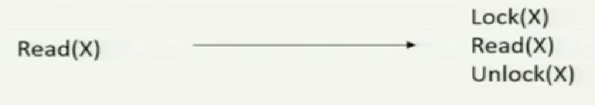

* Lock(X): check if object X is already locked

   Lock(X): 检查对象X是否已经锁定

  * If not, obtain the lock

    如果没有，获取锁

  * If so, wait or "do something" to handle the potential deadlock (like aborting)

    如果是，等待或“做点什么”来处理潜在的死锁(如中止)

* One does not have to read immediately after locking

  不需要在锁定后立即读取

* Unlock(X): release the lock on object X

  Unlock(X): 释放对象X上的锁

* The addition of Lock(X) and Unlock(X) commands are done by the DBMS

  添加Lock(X)和Unlock(X)命令是由DBMS完成的

> Once again, `Read(X)` is what user write.  
>
> The left `Lock(X)`, `Read(X)`, `Unlock(X)` This is what the data base do at a lock and unlock command before and after.
>
>  So lock it. Basically, check if the object exits or lock. If not, then opting to lock. If so, then wait. Or do something. To handle the potential deadlock or do something generally mean bloodshed. But we'll get to that later on. But. Now notice that these are the distinct operations.It does not mean that once you are paid a lot, you are obliged to read the item immediately. You can obtained a lot of X to 500 things and then you relax. Nothing for stopping you from doing that. Now, whether that's nice, no question. But there's nothing stopping you from doing this. Okay. And once again, after you read, you don't necessarily have to embody unlock. You can play five operations before you unlock item on x. Once again. We are not about being nice, but once we get this a cruel world, they are bloodshed. This is not what new life should be, but unfortunately, these are transactional things happen. One thing to remember again, can't emphasize enough. These things are added by your database system.
>
> 再说一次，`Read(X)`是用户写入的内容。
>
> 左边的`Lock(X)`， `Read(X)`， `Unlock(X)`这是数据库在Lock和Unlock命令前后执行的操作。
>
> 所以锁上它。基本上，检查对象是否退出或锁定。如果没有，则选择锁定。如果是，那么等待。或者做些什么。处理潜在的僵局或做某事通常意味着流血。但我们稍后会讲到。但是。注意这些是不同的操作。这并不意味着一旦你得到了很多报酬，你就必须立即阅读该项目。你可以得到很多X到500的东西，然后放松。没什么能阻止你这么做。现在，这是不是件好事，毫无疑问。但没有什么能阻止你这么做。好吧。再说一次，在你阅读之后，你不一定要体现解锁。在解锁x上的道具之前，你可以进行5次操作。我们不是要友善，但一旦我们了解了这个残酷的世界，他们就会流血。这不是新生活应该有的样子，但不幸的是，这些都是事务性的事情。有一件事要记住，再怎么强调也不为过。这些东西是由数据库系统添加的


### 18.1.1 Lock-based protocols: S and X locks ✅

* How many transaction can obtain the lock to an item?

  有多少事务可以获得一个项目的锁?

  * One

    一个

* Too restrictive?

  限制太多?

* Consider the two transactions

  考虑这两个事务

  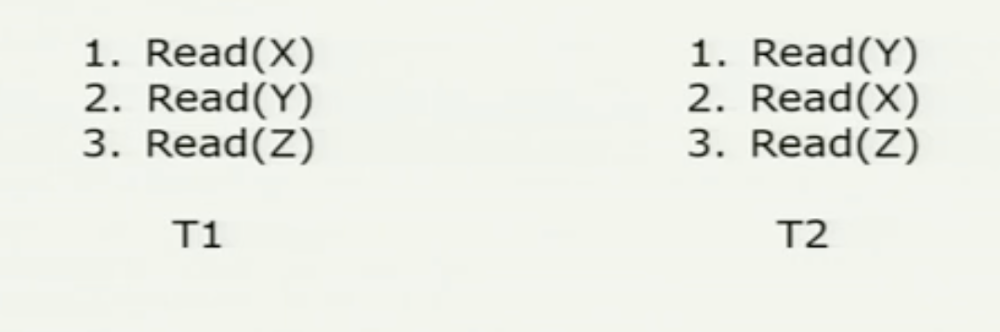

* There seems to be no reason for one transaction to wait for the other. 

  似乎没有理由让一个事务等待另一个事务。

> Now, if you think about lock, you think Each lock can only have one keys or one kind of TV. That's very often one, right. Is it too restrictive? Maybe let look at these two transactions. Is there any conflict? Is there any reason for blocking one transaction from the other? No. But if I have a lock once on T1 Read(X), T2 is block. So that doesn't seems too nice.  there's no perfect in theory. The two rather can in whatever way they want. But you put a lock in and require a transaction to get a lock first, then one try to think he's going to block the other, which is not very nice. So I exaggerate it. They are nice thing here. So that's why there seems to be no reason for one transaction to wait for the other. And in fact, there is no reason so that so because of that with distinct two kinds of locks.
>
> 现在，如果你想锁，你认为每个锁只能有一把钥匙或一种电视。通常是1。它是否限制过多?让我们看看这两笔交易。有冲突吗?有任何理由阻止一个事务访问另一个事务吗?不。但是如果我在T1 Read(X)上有一个锁，那么T2就是阻塞。这看起来不太好。理论上没有完美。这两个人可以想怎么做就怎么做。但是你先给一个事务加了锁，然后一个事务试图去阻止另一个事务，这不是很好。所以我夸大了它。他们是这里的好东西。这就是为什么一个事务似乎没有理由等待另一个事务。事实上，这是没有原因的因为这是两种不同的锁。


* Two kinds of locks on each object
  每个对象上有两种锁

  * shared locks (S-locks) 

    共享锁(S-locks): 如果事务$T_i$获得了数据项Q上的(shared-mode lock(共享型锁)(记为S), 则$T_i$ 可读但不能写Q.

    * Requested before reading

      阅读前要求

    * Multiple transactions can hold a S-lock on an object simultaneously

      多个事务可以同时持有一个对象的S-lock

  * Exclusive locks (X-locks)

    排他锁(X-locks): 如果事务$T_i$获得了数据项Q上的排他型锁(exclusive-mode lock)(记为X), 则$T_i$既可读又可写Q.

    * Requested before writing

      在写入之前要求

    * Only one transaction can hold an X-lock on an object at any given time

      在任何给定的时间，只有一个事务可以持有一个对象的X-lock

    * ==No other transaciton can hold any lock (not even a S-lock) if some transaction has an X-lock.== 

      如果某个事务有X-lock，则其他事务不能持有任何锁(甚至不能是S-lock)。

> Multiple transactions can hold a S-lock on an object simultaneously, because if five transaction want to read the item and none of them want to update the item. things are perfectly fine. Correct. So this is what we call a Shared locks. There is the anther exclusive lock. How long?
>
> So exclusive really is exclusive.  Understand standard definition to cover a lot.
>
> Shared lock. It can be shared. Many times I hold a shared locks together.
>
> Exclusive locks, only one transaction and hold exclusive lock at any different time and one trasaction I should actually hold exclusive lock. You cannot even keep the share lock to anybody.
>
> 多个事务可以同时持有一个对象的S-lock，因为如果有5个事务想要读取该对象，但没有一个事务想要更新该对象。一切都很好。正确的。这就是我们所说的共享锁。有另一个排他锁。多久?
>
> 所以独家就是独家。理解标准定义以涵盖很多内容。
>
> 共享锁。它可以被共享。很多时候我把共享的锁放在一起。
>
> 排他锁，只有一个事务，并在任何不同的时间持有排他锁，而我实际上应该持有排他锁的一个事务。你甚至不能把股份锁留给任何人。
>
> Now I'll challenge you to write Punch Crystal using S BLOCK X Lock Share and exclusive
>
> 现在我将挑战你使用S BLOCK X Lock Share和exclusive来编写Punch Crystal

#### Quiz 6

5. Let say a transaction T holds an S-lock of an object. Which of the following statement(s) is/are true?

   (a) If T wants to obtain an X-lock of the same object, it will be granted

   (b) If a different transaction T' want to obtain an S-lock on the same obiect, it will be granted

   (c) If a different transaction T' want to obtain an X-lock on the same object, it will be granted

   A. (a), (b) and (c)

   B. (b)

   C. (a) and (b)

   D. (a)

   C ❌

   B ✅

   > a. ❌  ==No other transaciton can hold any lock (not even a S-lock) if some transaction has an X-lock.==  Therefore you have to wait other release s-lock. then it will be granted.
   >
   > b. ✅ Multiple transactions can hold a S-lock on an object simultaneously.
   >
   > c. ❌ 同理于 a.


* More on S and X locks

  更多关于S和X锁的信息

  * A transaction that holds an S-lock on an object can read the object

    持有对象S-lock的事务可以读取该对象

  * A transaction that holds an X-lock on an object can read and write the obejcts.

    持有对象X-lock的事务可以读写对象

* Lock-compatibility table

  锁兼容性表

  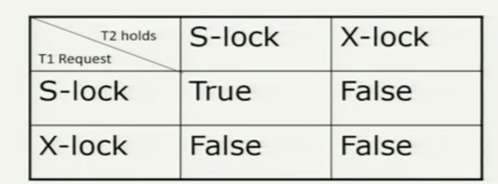
  
  共享型与共享型是相容的, 而与排他型不相容. 在任何时候, 一个具体的数据项上可同时有(被不同的事务持有的)多个共享锁. 此后的排他锁请求必须一直等待直到该数据项上的所有共享锁被释放.

> Typically, we can define the relationship between the two kinds of lock have called a lock compatibility table. Basically this table looks like this. So let's say T1 is requesting a  S-lock. Any T 2 already have a slock. Should I allow T one to get the s-lock? In this case, the answer is yes. 
>
> So if T1 requested slock but T2 already have a x-lock, then the answer is no.  T-1 cannot get the S-lock.
>
> And if T1 get an x-lcok,  Can T2 get S-lock?  the answer is still no. Because one we done exclusive lot only debt transaction can hold.
>
> And similarly the last. So that's what we call a compatibility table. Basically if I request a lock and then another tries to already have a lock, should I say yes or no?
>
> Nothing very complicated, if you think about it. It's very intuitive. I want to I want to reassure you that everything is in. It's up to here. Do not include this coming in the next few slides up to here. Hopefully these are all intuitive points. 
>
> 通常，我们可以将两种锁之间的关系定义为锁兼容性表。这个表格看起来像这样。假设T1请求S-lock。任何T 2都有一个slock。我应该允许T人拿到s锁吗?在这种情况下，答案是肯定的。
>
> 如果T1请求了slock，但T2已经有了x-lock，那么答案是否定的。T-1拿不到s锁。
>
> 如果T1得到x- lcock，那么T2能得到S-lock吗?答案仍然是否定的。因为一个我们做的独家批债交易只能持有。
>
> 最后一个也是类似的。这就是我们所说的相容性表。基本上，如果我请求一个锁，然后另一个尝试已经有一个锁，我应该回答yes还是no?
>
> 如果你仔细想想，不会很复杂。这很直观。我想我想向你保证一切都在。到这里为止。不要在接下来的几张幻灯片中提到这个。希望这些都是直观的观点。


* Consider the following examples (again):

  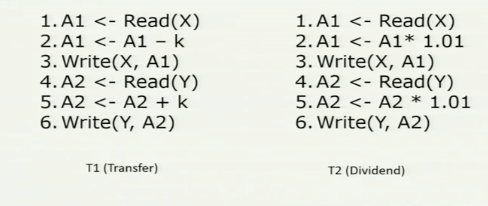

> So let's say look at these two case, right? Trasaction for a different example. We've been using all the time in this couple of lectures.


#### Lock-based protocol -- example ✅

* With a lock-based protocol, one possible way T1 is transformed 

  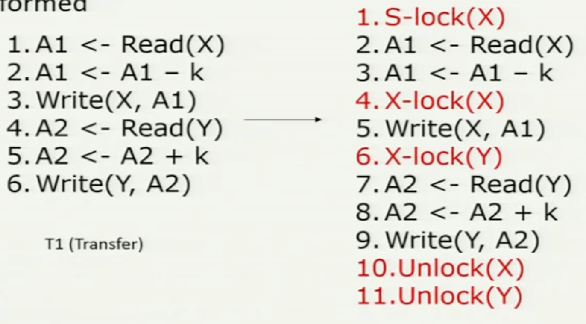

  > If a lock-base protocol. This is one way we can do this is by no means the only way you can do it. I want to emphasize there are other ways of doing it. But what happens is the T1 when the user submits to the database system. Once again, The T1(Transfer) left part is what the user to write. And then the red lines are where the DBMA writes. Once again, there is more than one way of doing this. For example, I can tell all why I don't even bother requesting the estimate. I'll just go ahead and request an expert right at the beginning. It's not nice, but nobody can. Nobody can stop me from doing this. And for T1, I read X, I just did not unlock(X) immediately. Obviously I get a lot earlier if I want to, because after this operation I don't need to do it anymore, for instance.
  >
  > 如果是锁基协议。这是我们能做到的一种方式这绝不是你能做到的唯一方式。我想强调一下还有其他的方法。但是当用户提交到数据库系统时，发生的是T1。同样，T1(传输)左边是用户要写的内容。然后红线是DBMA写的地方。同样，有不止一种方法可以做到这一点。例如，我可以告诉大家为什么我甚至不麻烦地请求估计。我一开始就请个专家。虽然不好，但没人能做到。没人能阻止我这么做。对于T1，我读取X，我没有立即解锁(X)显然，如果我想的话，我可以提前很多，因为在这个手术之后，我就不需要再做了。

* Notes from the previous example:

  上一个例子的注意事项:

  * Locks must be obtained before read/write can begin

    读写操作开始之前，必须获得锁

  * If a transaction want to read and write the same object, it can either

    如果一个事务想要读写同一个对象，它也可以

    * Obtain an X-lock before reading

      在读取之前获取X-lock

    * Obtain an S-lock before reading, then obtain an X-lock before writing (it is not automatically granted)

      在读取之前获得一个S-lock，然后在写入之前获得一个X-lock(不会自动授予)

* A transaction does not have to release locks immediately after use 

  事务在使用后不需要立即释放锁

  * Good or bad?

    好还是坏?

> So upgrading essentially once again, the upgrade is not automatically granted. And once you're done, then you can unlock it. But also, there is no requirement that you release the lock immediately. For example, in this case, I'm holding on to the lock on X until the very end. So as I understand the rules again here. Is this a good faith? No Why not? So you should unlock it before because I'm done with x.
>
> 升级本质上，升级不是自动授予的。一旦你完成了，就可以解锁了。但是，也没有要求您立即释放锁。例如，在这种情况下，我一直保持对X的锁，直到最后。我明白这里的规则了。这是善意吗?不，为什么?你应该提前解锁，因为我已经完成了x。
>
> 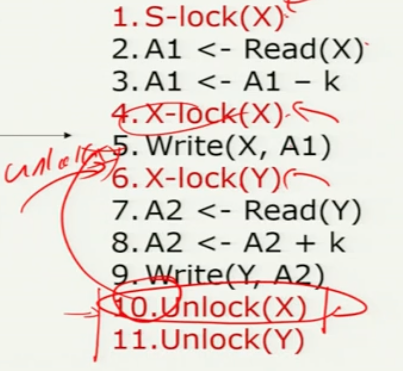
>
> Are you really sure? I give you one more chance to change your answer. The whole thing has to be done before me. Let's go through an example. Things are going to get dicier than you think because of the support.
>
> 你真的确定吗?我再给你一次改变答案的机会。一切都得在我之前完成。让我们来看一个例子。由于支持，事情会变得比你想象的更冒险。

  

* Example of schedule with locks

  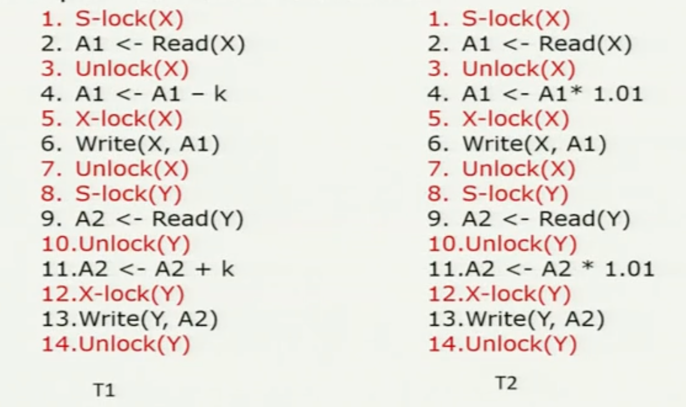

* Example of schedule with locks 

  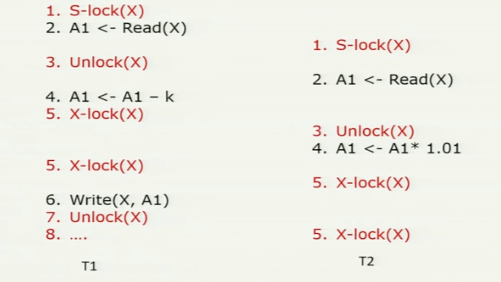

  > I S-lock on x, I read x, then X took S-lock(x), and then let's say T1 is done and T! decides to unlock x. I'm a nice boy. I start reading it. I don't need any more. T2 Read X. Then notice that here T1 5 have to wait because he chose to have the X-lock to x. Unlock (x) . Now with t and try x-lock(x) again is succeed. Right. And T2 want to exclusive X-lock(x) actually has to wait and T1 gonna to do that and so on so forth. But so that's how to then finally. So it's a good any question that.
  >
  > I在x上S-lock，我读取x，然后x获取S-lock(x)，然后假设T1完成，T!决定解锁x，我是个好孩子。我开始读它。我不需要了。T2读取x，然后注意T1 5必须等待，因为他选择了x -lock to x. Unlock (x)。现在使用t并尝试x-lock(x)再次成功。正确的。T2想要排他x -lock(x)实际上需要等待而T1会这样做，以此类推。这就是最后的方法。所以这是一个很好的问题。

  

  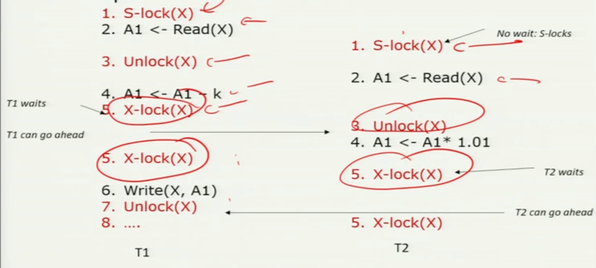


#### Lock based protocols -- questions ✅

* Does having locks this way guarantee conflict serializability?

  使用这种方式的锁是否能保证冲突的可序列化性?

* Is there any other requirements in the order/manner of accquiring/releasing locks?

  在获取/释放锁的顺序/方式上还有其他要求吗?

* Does it matter when to acquire locks?

  何时获取锁重要吗?

* Does it matter when to release locks?

  何时释放锁重要吗?


#### Lock based protocols -- need for a protocol ✅

* Suppose we request a lock immediately before reading/writing

  假设我们在读/写之前立即请求加锁

* We release a lock immediately after each read/write

  我们在每次读写后立即释放一个锁

* Does it guarantee serializability? 

  它能保证可串行化吗?

> Suppose so, let's say. Are you guys think we should be nice guy, right? Once we're done, we've an object. We should release it. No problem. And we release a lot in media after rate. Does it guarantee the serializability? Let's look at this schedule.
>
> 假设是这样。你们觉得我们应该做个好人吗?一旦我们完成了，我们就得到了一个对象。我们应该释放它。没有问题。我们在媒体上发布了很多。它能保证可串行化吗?让我们看看这个时间表。


* But with the following schedule

  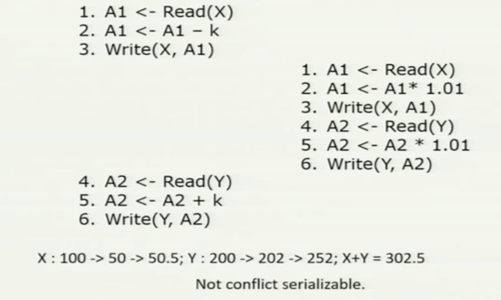

  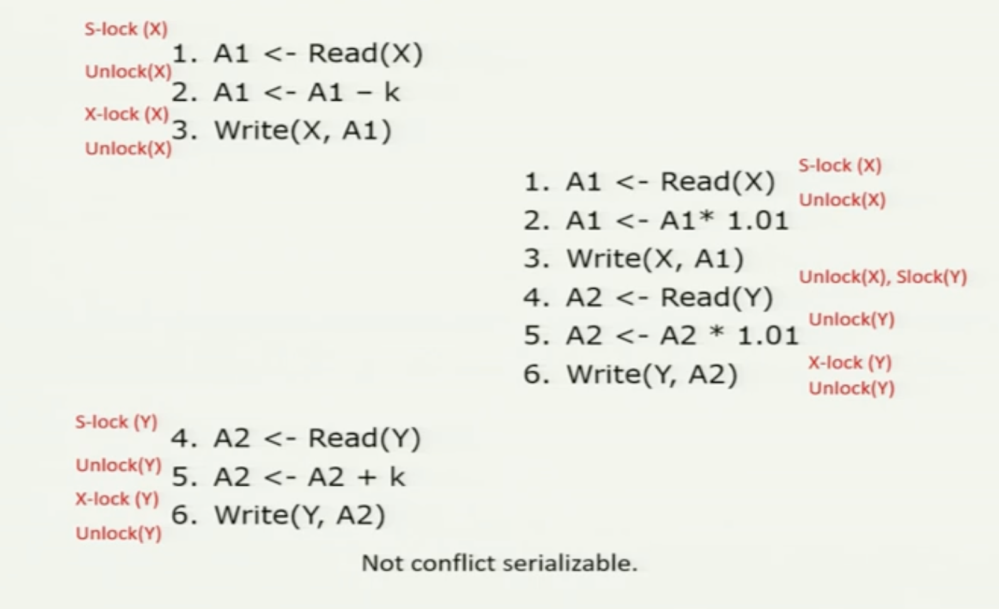

  > 结果还是302.5

* So the previous technique does not work

* How about, only releasing a lock after all operations on the object is finished?

  如果只在对象上的所有操作完成后才释放锁呢?

  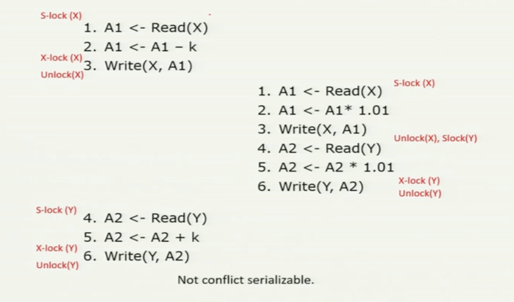
  
  > 结果还是302.5å

> So what's wrong?
>
> I am being nice and unfortunately in the world of transaction, being nice is not really what it is. You still allow a non serializable and I suppose schedule to be executed. The question here is that once you release a lock. But any other transition can swoop in and do as much stuff as you can before you deal with this. It can be as moving as completely execute a transaction before you can have a chance to continue. Then the problem will be full size, right? So what is the problem? When they transaction, we lose a lot.
>
> 那么问题出在哪里呢?
>
> 我表现得很好，但不幸的是在交易的世界里，表现得很好并不是真正的好。你仍然允许一个不可序列化的，我想schedule会被执行。这里的问题是，一旦你释放锁。但任何其他过渡都可能突然出现，在你处理这个问题之前尽可能多地做一些事情。在您有机会继续之前，可以完全执行事务，这是令人移动的。那么问题就是全尺寸的，对吧?那么问题是什么呢?当他们交易时，我们损失很大


#### Two-phase locking -- motivation ✅

* What is the problem?

  有什么问题?

* When a transaction release a lock on an object, that means other transactions can obtain a lock on it. 

  当事务释放对象的锁时，意味着其他事务可以获得该对象的锁。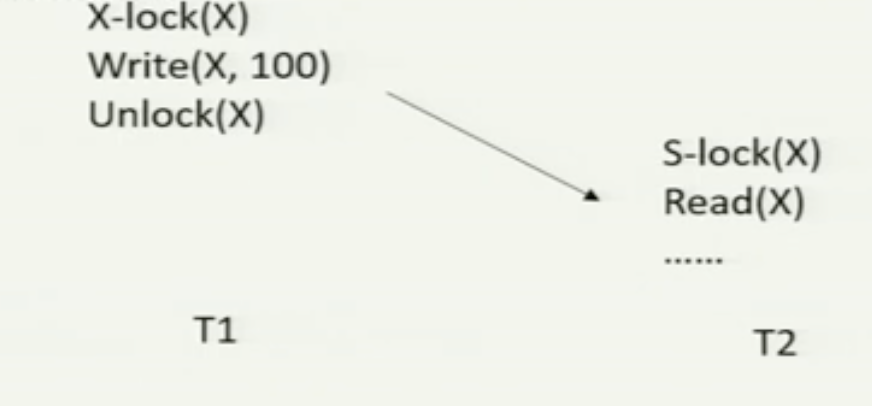

* In this case, there is contention from T1 to T2

  在这种情况下，T1和T2之间存在竞争

* To ensure serializability, we must ensure there is no conflict from T2 back to T1

  为了确保可串行化，我们必须确保从T2回T1没有冲突

* How?

> In this case, you are potentially out obviously when you release a lot, that is an immediate means. A conflict is created, but there is a possibility of a conflict. This is not the end of the world. I want to remind you, this is actually not the end of the world. If you just do this, there's no cycle up to here. Your schedule is still so realizable, correct? The problem is what the problem if you are a lot. Now you are potentially doing a read and write off some other things.  But you cannot stop the transaction from doing things on the same object that then creating the backward going edge. Once you release this law, there's no way for you to stop. And then a transaction, the editor saying to create an act like this.
>
> 在这种情况下，当你释放很多时，很明显你可能会出局，这是一种即时的方法。冲突产生了，但有可能发生冲突。这不是世界末日。我想提醒你们，这实际上并不是世界末日。如果你这样做，没有到这里的循环。你的时间表还是很清晰的，对吧?问题是如果你很多，问题是什么。现在，您可能正在进行一些其他的读取和注销操作。但是你不能阻止事务在同一个对象上执行操作，然后创建向后移动的边缘。一旦你释放了这条法律，你就无法停止。然后是交易，编辑说要创造这样的行为。
>
> 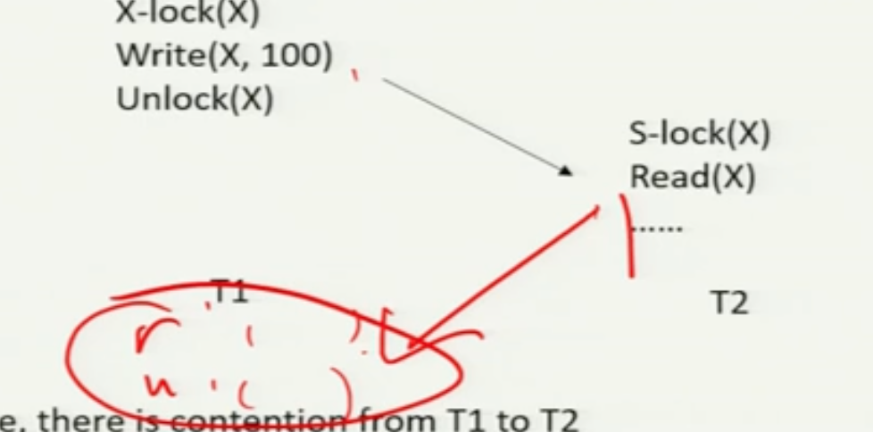
>
> So once you release a lock, there is a potential for conflict. That conflict by its own is not the end of the world. But you open a door to allow in a transaction to produce a conflict back and debt will be the end of the world. understand the problem here. I understand why you cannot be Mr. Nice Guy. I'm sorry. This was is cruel. This is not. I do not advocate dealing with people the way you do with conception. I do not advocate that. But here is clearly no more Mr. Nice Guy. Now the question become, once I released the lock here, I can produce a conflict. How can I ensure this conflict never happened? red arrow? 
>
> Remember, what he is doing is none of your business. You cannot control what it was doing. But what can I control? if I do not write anything or if I do not write anything without the other trasaction. then I'm fine. 
>
> So let's see if this is the end of the transaction.
>
> 所以一旦你释放锁，就有可能发生冲突。这场冲突本身并不是世界末日。但你打开了一扇门，允许在交易中产生冲突，而债务将是世界末日。理解这里的问题。我理解你为什么不能做个好人。我很抱歉。这是残酷的。这不是。我不主张像你对待怀孕那样对待别人。我不赞成这样做。但这里显然不再是好先生了。现在的问题是，一旦我在这里释放锁，我可以产生一个冲突。我怎样才能确保这种冲突不会发生呢?红色箭头吗?
>
> 记住，他在做什么与你无关。你无法控制它在做什么。但我能控制什么呢?如果我什么都不写或者在没有其他事务的情况下什么都不写。那我就没事了。
>
> 让我们看看这是不是交易的结束。
>
> 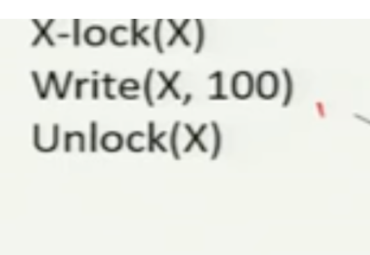
>
> Oh, I am no more creations. Then I'm cool, right? You can do whatever you want. So releasing the lock at the very end is absolutely safe. Correct. See the argument here because once I've released the lock, I can this is may not may eight may or may not happen but if this urge happen,
>
> 哦，我不再是造物。那我就没事了，对吧?你可以做任何你想做的事。所以在最后释放锁是绝对安全的。正确的。看这里的论点，因为一旦我释放锁，我可以这可能不是可能8可能不会发生但如果这个冲动发生了，

>  Now, the good news is that it doesn't have to be that straight. It turns out. And should he want to stop and write anything that he can read and write? 
>
>  好消息是，它不必那么直。事实证明。他是否应该停下来写他能读能写的东西?


* Ensure that T1 does not read/write anything that T2 read/write.

  确保T1不读/写T2能读/写的任何内容

  * Unrealistic to check in real life
  
    在现实生活中检查是不现实的
  
* What is a sufficient condition then?

  那么充分条件是什么?

* **Ensure T1 does not read/write anything after releasing the lock!**

  确保T1在释放锁后不再读写任何东西!

* **===> (basic) Two-phase locking==**

  (基本)两阶段锁定

  > It too is reading and writing anything you don't allow to want to read and write it afterwards. Right. For example, this is Y if T2 is reading and writing Z who cares. But if  T2 want to read and write I. I either have to make sure I don't read and write or I want to be sure that T2 is a ten to y cannot succeed. Now, as I say, I can't control the schedule. The only thing I can show that these to happen is two things. Either I don't touch. Or I have already have the lock y. Then T2 can not do anything. So we can chat in real life. That's too much trouble. Too much power button. And shooting. One does not mean anything after releasing the lot. And that's what we mean by two things. It turns out.
  >
  > 它也在读取和写入任何你不允许读取和写入的内容。正确的。例如，如果T2读写Z，这是Y谁在乎呢。但如果T2想读写I，我要么要确保我没有读写要么要确保T2是10 ^ y，无法成功。就像我说的，我控制不了时间表。我能证明的只有两件事。要么我不碰。或者我已经有了锁y，那么T2什么都做不了。这样我们可以在现实生活中聊天。太麻烦了。电源按钮太多。和射击。放了一堆之后，一个人就没有任何意义了。这就是我们所说的两件事。事实证明。

> What do I mean? Not to read or write anything. In fact, actually, I can be a loser in the sense that if I don't paint any more looks. What does it mean? So if I want to read or write something here, I already have the lock. I admit you already have the lock. And if I have the lock, that means the transaction cannot mess with me. So I'm saying. But if I don't have the luck and I need to acquire the luck, then that means other transaction might have written on that. And then there's the conflict. So to be absolutely safe, all I need is to make sure you sit one side and not some thing here. I better not lock anything else. It's a bit conservative, but frankly, I don't have the time to check individual items. So that's what we call. That's why we call two-phase locking. And the basic rule is this once you start unlock something, you cannot lock anything else. If you think about it, what does that mean? Your transaction will look something like this. And then once you start the first unlock, all you can do is unlock, unlock, unlock undone. So that's why we mean by two phase. That's a locking face. There's a unlocking face. And to ensure things like stability. Debt is enough.
>
> 我是什么意思?不要读或写任何东西。事实上，事实上，我可以成为一个失败者，如果我不再画任何外观。这是什么意思?如果我想在这里读或写一些东西，我已经有锁了。我承认你已经拿到锁了。如果我有锁，这意味着交易不能干扰我。所以我说。但如果我没有这种运气，我需要获得这种运气，那就意味着其他交易可能已经写在上面了。然后就是冲突。所以为了绝对安全，我只需要确保你坐在一边，而不是坐在这里。我最好别锁别的东西了。这有点保守，但坦率地说，我没有时间检查每个项目。这就是我们所说的。这就是我们称之为两阶段锁定的原因。基本规则是，一旦你开始解锁某个东西，你就不能再锁定其他东西。如果你仔细想想，这意味着什么?你的交易看起来像这样。一旦你开始第一次解锁，你所能做的就是解锁，解锁，解锁未完成。这就是为什么我们说两阶段。那是一张锁定的脸。这是一张解锁的脸。并确保稳定。有债务就够了。
>
> 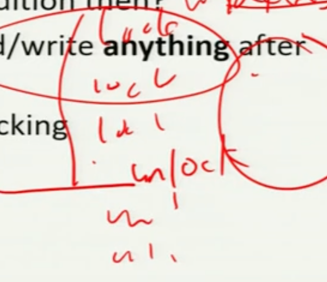
>
> 


#### ==Two phase locking -- definition ✅==

保证可串行性的一个协议是两阶段封锁协议(two-phase locking protocol). 该协议要求每个事务分两个阶段提出加锁和解锁申请.

* The basic two-phase locking (2PL) protocol

  基本的两阶段锁定(2PL)协议

  * A transaction T must hold a lock on an item x in the appropriate mode before T accesses x.

    事务T在访问x之前，必须以适当的模式对项目x持有锁。

  * If a conflicting lock on x is being held by another transaction, T waits.

    如果另一个事务持有x上的冲突锁，则T等待。

  * Once T releases a lock, it cannot obtain **==any other==** lock subsequently.

    一旦T释放了一个锁，它就不能随后获得任何其他的锁。

* Note: a transaction is divided into two phases:

  注意:交易分为两个阶段:

  * A **==growing phase==**(obtaining locks)

    增长阶段(获取锁): 事务可以获得锁, 但不能释放锁

  * A **==shrinking phase==**(releasing locks)

    收缩阶段(释放锁): 事务可以释放锁, 但不能获得新锁.

* Claim: 2PL ensures conflict serializability.

  声明:2PL确保了冲突的可序列化性。

最初, 事务处于增长阶段, 事务根据需要获得锁. 一旦该事务释放了锁, 它就进入了缩减阶段, 并且不能再发出加锁请求.

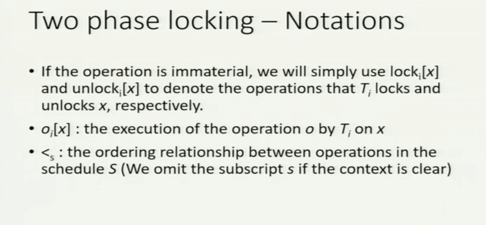

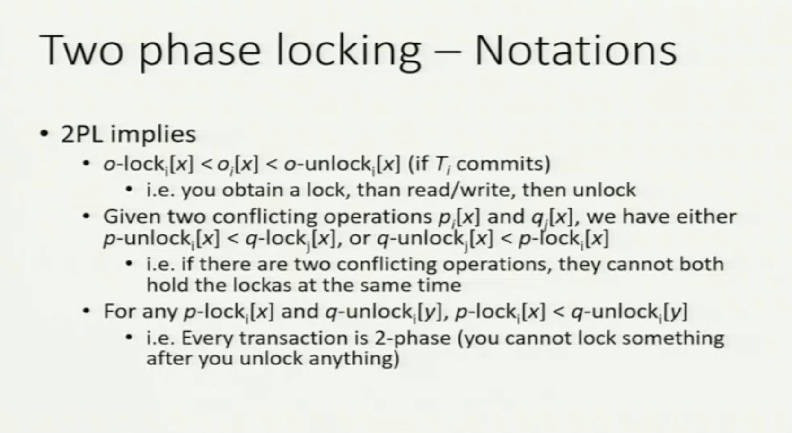

> So I will kind of skip this notation.
>
> This is kind of the proof. Once again, we don't have a time to go through the proof in detail. I'll leave it for your reading. Pressure is not a hard thing to prove.

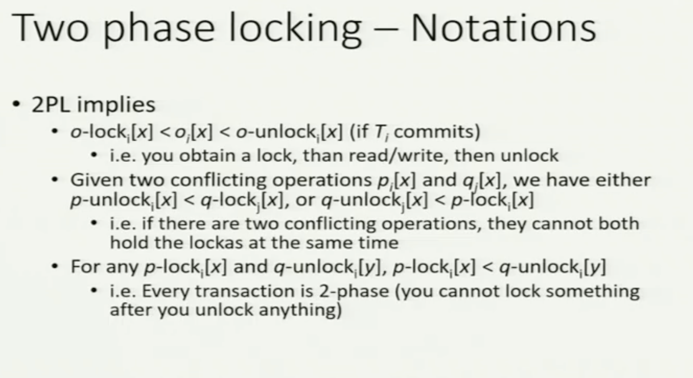

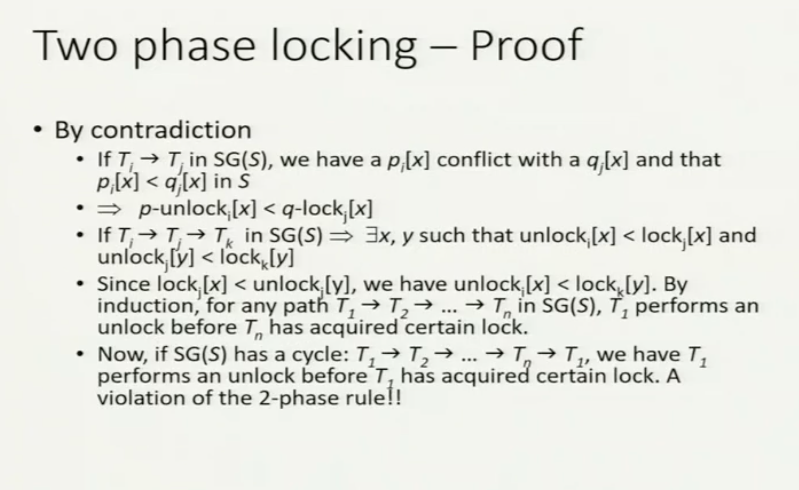


#### Two phase locking -- Serializability 两阶段锁定——可串行化 ✅

* Lock-point: the point where the transaction obtains all the locks

  锁点(Lock-point): 事务获取所有锁的点

  对于任何事务, 在schedule调度中该事务获得其最后加锁的位置(增长阶段结束点)称为事务的封锁点(lock point).

* With 2PL, a schedule is conflict equivalent to a serial schedule ordered by the lock-point of the transactions.

  在2PL中，调度的冲突等价于按事务锁点排序的串行调度


多个事务可以根据它们的封锁点进行排序, 实际上, 这个顺序就是事务的一个可串行化排序.

两阶段封锁并不保证不会发生死锁.

> If you have two phase locking. Then we can define a lock-point to be the part where transactions finish obtaining all the locks. And you can once again, I will prove it. But you can prove that. That if you do two things locking a schedule is conflict equivalent to a serial schedule order by the lock-point. Basically the corresponding serial schedule will be order by which transaction reached a lot first. Not writing, but obtaining the rock looks. 
>
> 如果你有两阶段锁定。然后，我们可以将锁点定义为事务完成获取所有锁的部分。你可以再一次，我会证明给你看的。但你可以证明。如果你做了两件事，锁定一个时间表和按锁定点排序的串行时间表是冲突的。基本上，相应的串行调度将按照事务最先到达的顺序进行。不是写作，而是获得岩石的外观。


#### Two phase locking -- example ✅

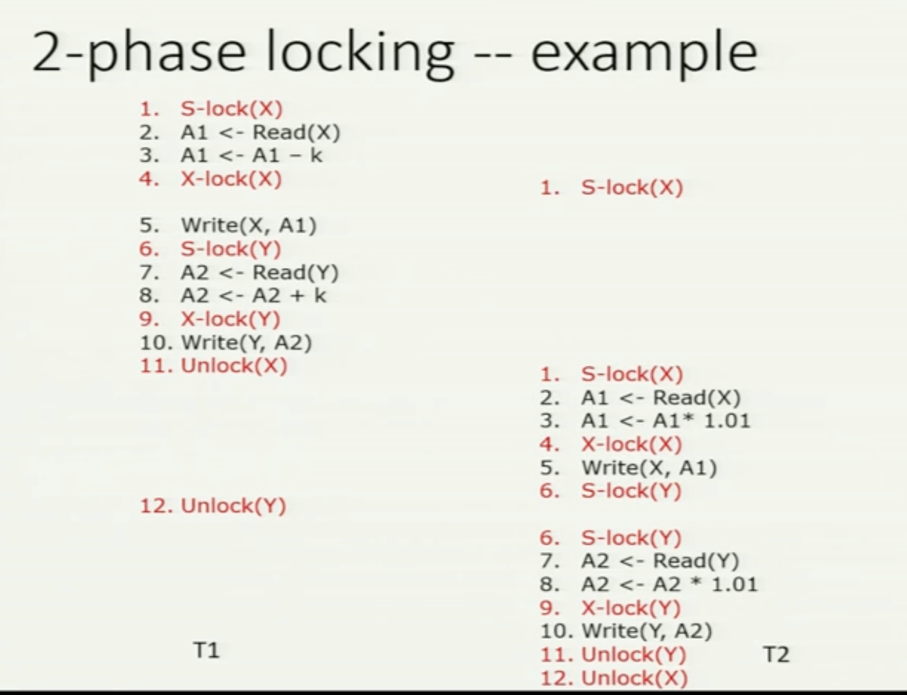

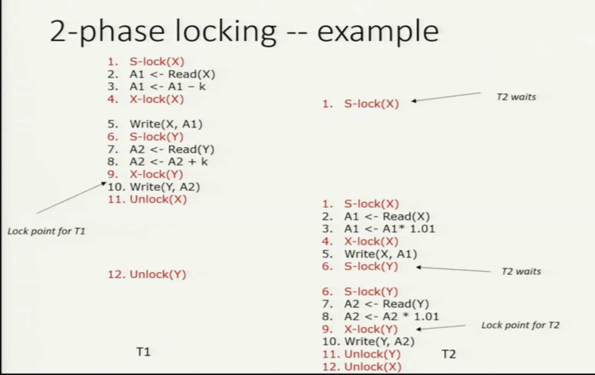

> Only one transaction can hold a lock, you request an X lock for writing. And the key thing about two phase locking, why do we call these two phase locking? Your transaction is divided in two phase. The first is lock, and the second phase is unlock. And the key result is what? Once you start locking, you cannot require any more locks. That is enough to ensure the serializability. We talk about an example here. We won't go into detail again because of time constraints.
>
> 只有一个事务可以持有一个锁，您请求一个X锁用于写入。关于两阶段锁定的关键是，为什么我们叫它两阶段锁定?您的交易分为两个阶段。第一个阶段是锁定，第二个阶段是解锁。关键结果是什么?一旦开始锁定，就不能再需要更多的锁了。这足以确保可串行化。我们在这里讨论一个例子。由于时间限制，我们不会再详细介绍。


#### ==Two phase locking -- recoverability== ✅

两阶段锁定——可恢复性

* Recall definitions for recoverability

  可恢复性的召回定义

  * Recoverability

    可恢复性

  * Avoid cascade aborts

    避免级联中止

  * Strict

    严格

* If a schedule is 2PL, does it guarantee any of the above?

  如果日程是2PL，它能保证上述任何一项吗?

* Consider the following schedule

  考虑以下时间表

> Now, however, the bad news is two phase locking definitely guarantees your life stability. But there are still other potential problems not related to what I said pretty directly, but other issues. Look at this transactions. Let's say I do this right.
>
> 然而，坏消息是两阶段锁定肯定能保证你的生活稳定。但还有其他潜在的问题与我刚才说的没有直接关系，而是其他问题。看看这些交易。假设我做对了。

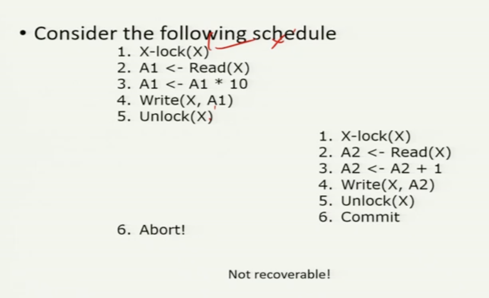

> Let's say T1 abort here. Notice that two phase locking, don't stop this. So that means to two phase  locking doesn't mean that the schedule is recoverable if you just do. Because this can still happen. Because we go to face stopping only required once you start a lock you can unlock anything back. It doesn't say that you must finish the transaction once you start unlocking. You can unlock everything and then sit for 5 minutes before you decide to come in. Now why you would do it? That's the question. But there's no law in the land stopping you from doing this. But if you allow this, things can be totally happen. And you are totally screwed. This is not quite recoverable.
>
> 假设这里是T1中止。注意两阶段锁定，不要停止。这意味着两阶段锁定并不意味着调度是可恢复的。因为这仍然可能发生。因为我们只需要在启动锁时停止，所以你可以解锁任何东西。它并没有说你一旦开始解锁就必须完成交易。你可以打开所有东西，然后坐上5分钟再决定进来。你为什么要这么做?这就是问题所在。但这片土地上没有法律阻止你这么做。但如果你允许，事情完全可以发生。你完全完蛋了。这是不可恢复的。

除了调度可串行化外, 调度还应该是无级联的. 在两阶段封锁协议下, 级联回滚可能发生.

* What's the problem?

  有什么问题?

* There is a gap between releasing locks and the decision to commit/abort

  在释放锁和决定提交/中止之间有一个间隔

* Other transactions can still access data written by a uncommitted transaction 

  其他事务仍然可以访问未提交事务写入的数据

* How to solve this problem?

  如何解决这个问题?

> And once do we leave the lock, notice that other transaction can access the item. However, those items have not been committed. So you are allowing other transaction to reach uncommitted data. Notice that all its so it's not a crime it doesn't affect serializability because you are not reading anything more. The conflict will not go both ways. So serialziability is still maintained. That's the tricky part of this. But How do you solve it? Well what is draconian solution. You can't unlock until  
>
> 一旦我们离开锁，请注意其他事务可以访问该项目。但是，这些项目尚未提交。所以你允许其他事务访问未提交的数据。请注意，这并不是犯罪，它不会影响可序列化性，因为你不会再阅读任何内容。冲突不会是双向的。因此，可串行性仍然保持。这是最棘手的部分。但是如何解决它呢?什么是严厉的解决方案。你不能解锁，直到

> So we call it stric 2-phase locking
>
> 所以我们称之为严格两阶段锁

级联回滚可以通过将两阶段封锁修改为严格两阶段封锁协议(strict two-phase locking protocol) 加以避免. 这个协议除了要求封锁是两阶段之外, 还要求事务持有的所有排他锁必须在事务提交后方可释放. 这个要求保证未提交事务所写的任何数据在该事务提交之前均以排他方式加锁, 防止其他事务读这些数据. 

* Strict 2-phase locking:

  严格的两阶段锁

  * 2-phase locking

    两阶段锁

  * ==X-locks can only== be released when the transaction commits

    X-locks只能在事务提交时释放

* Question: does strict 2-phase locking ensure 

  问题:严格的两阶段锁是否能确保

  * ==Recoverability? (Yes)==

    可恢复性?

  * Avoid cascade aborts (Yes)

    避免级联中止

  * Strict? (Not quite)

    严格吗?

  > Remember you are the translator reading your data, right? The problem with privacy is so so that only that's really only concern items that you have updated you can only update something you have an excellent. So as long as X lock is released when the second commits you'll find At least that problem would occur. At least with respect to yourself.  The data you have over return cannot be read by somebody else until you come in. Another was saying the same thing. Right.
  >
  > 记住你是读取数据的翻译，对吧?隐私的问题是只有那些你已经更新过的东西你才可以更新一些你已经很好的东西。因此，只要在第二次提交时释放X锁，你就会发现至少会发生这个问题。至少对你自己来说是这样。你返回的数据不能被其他人读取，直到你进来。另一个也在说同样的话。正确的。


> Now we can have a stricter version of it.

另一个两阶段封锁的变体是强两阶段封锁协议(rigorous two-phase locking protocol), 它要求事务提交之前不得释放任何锁. 很容易验证rigourous two-phase locking protocol(强两阶段封锁)条件下, 事务可以按其提交的顺序串行化.

* Rigorous 2-phase locking:

  严格的两阶段锁机制:

  * 2-phase locking

    两阶段锁

  * **==Any lock==** can only be released when the transaction commits

    任何锁只能在事务提交时释放

* Ensure serializbility

  确保可串行化

  * Moreover, serial schedule is ordered by the time the transaction commits

    此外，串行调度是根据事务提交的时间排序的

    

> There are some slight problem we didn't cover when we talked about strict we theorized. But he said We won't, we won't hammer here. Previous version is X Lock can only be released to a transaction commits, but if you want to be even more restrictive, you can have what we call rigorous 2-phase locking. And the law can only be released when a transaction commits. The good thing about this is that now come mic time will actually correspond to the civil order of the transactions of the schedule. And that may be a good thing because it's easier to keep track. On the other hand, it is not that often that knowing the civil order is important. It's not clear that at least for many applications nowadays, people don't care too much. Now, remember, serializability means that the schedule can be a serial schedule. It can either be T1 Before T2 or T2 before T1. The data based system can care less. Which one go first. A system don't care where T1 go before T2, or T2 go before T1 one.  
> They don't care. Even if you start T1 first 2-phase locking have no responsibility to make sure the serious schedule is T1 to T2. No such responsibility. All they care if it returns if correspond to if it's the equivalent to a serial schedule. 2-phase locking that they have no responsibility to behave. because want to be serious can do that. I think don't do that. Remember that there is no expectation and you can make no assumption to what the actual zero schedule is. In this case, the fuel schedule depends on when does the transaction come and when does the transaction commit who has the final say? The scheduler and who does the schedule belong to set to be made public through the OS.  I mean, it's like putting thoughts on my own one, but that's life. We database are just a small title bowing down to the all powerful operating systems.
>
> 有一些小问题我们没有讲到当我们讲严格的时候我们讲了理论。但他说我们不会，我们不会锤这里。以前的版本是X锁只能被释放到事务提交，但是如果你想要更严格的限制，你可以有我们称为严格的两阶段锁。只有当交易发生时，法律才能被释放。这样做的好处是，现在到了mic时间，实际上将对应于文明秩序的交易时间表。这可能是一件好事，因为这样更容易跟踪。另一方面，了解文明秩序并不重要。不清楚的是，至少对于现在的许多应用程序，人们并不太关心。现在，请记住，可序列化意味着调度可以是串行调度。它可以是T1先于T2也可以是T2先于T1。基于数据的系统可以不那么关心。哪一个先走。系统不在乎T1在T2之前的位置，或者T2在T1 1之前的位置。
>
> 他们不在乎。即使你开始第1阶段，2阶段锁定也没有责任确保严格的时间表是从第1阶段到第2阶段。没有这样的责任。它们只关心它是否返回，是否对应于是否等同于一个串行schedule。两阶段锁，它们没有责任行为。因为想要认真才能做到。我认为不要那样做。记住，这里没有期望，你也不能对实际的零计划做任何假设。在这种情况下，燃料时间表取决于事务何时到来以及事务何时提交谁有最终决定权?调度器和调度的归属设置通过操作系统公开。我是说，这就像把自己的想法放在自己身上，但这就是生活。我们的数据库只是一个向强大的操作系统低头的小标题。


#### Quiz 6

What is "two-phase" in two phase locking?

A. None of the other answers are correct

B. Once you start releasing locks you cannot obtain more locks

C. Once you start acquiring X-locks, you cannot acquire S-locks

D. Once you start acquiring X-locks, you cannot acquire S-locks

B ✅

> * **Ensure T1 does not read/write anything after releasing the lock!**
>
>   确保T1在释放锁后不再读写任何东西!
>
> * **===> (basic) Two-phase locking==**
>
>   (基本)两阶段锁定
>
> C.D  You can acquire S-locks after you start acquiring X-locks.


What is the motivation of having strict two-phase locking over basic two-phase locking?

A. Strict two phase locking avoid non-recoverable schedule

B. Strict two phase locking require only one type of lock

C. Strict two phase lockng allow for more concurrency

D. All of the other answers are correct.

A ✅

> A. 
>
> * Strict 2-phase locking:
>
>   严格的两阶段锁
>
>   * 2-phase locking
>
>     两阶段锁
>
>   * ==X-locks can only== be released when the transaction commits
>
>     X-locks只能在事务提交时释放
>
> * Question: does strict 2-phase locking ensure 
>
>   问题:严格的两阶段锁是否能确保
>
>   * Recoverability? (Yes)
>
>     可恢复性?
>
>   * Avoid cascade aborts (Yes)
>
>     避免级联中止
>
>   * Strict? (Not quite)
>
>     严格吗?
>
> ❌B. it is based on basic on 2 phase lock, so it still have some limit on s-lock
>
> you unlock you can not add the other locks whatever s-lock.
>
> ❌C. more strict less concurrency


## Lock conversion (upgrades) ✅

```
1. Read(X)
2. Read(Y)
3. Read(Z)
4. ...
1000 operations not involving X
1005 Wrtie(X)
```

* Consider the transaction on the above

  考虑如上的交易

* Eventually transaction will need an X-lock on X

  最终事务将需要对X进行X-lock

* But obtainning it at the beginning seems a waste of effort

  但一开始就获得它似乎是白费力气

* => lock conversion

  => 锁转换

* Obtain an S-lock on X first, then obtain an X-lock only at the end

  首先在X上获取S-lock，然后仅在末尾获取X-lock

* ==Notice that X-lock is not automatically granted==

  注意X-lock不是自动授予的

* Similarly, downgrades are allowed (X->lock -> S-lock)

  同样，降级也是允许的(X-&gt;lock -&gt;s锁)

> ```
> T8: read(a1);
> 		read(a2);
> 		...
> 		read(an);
> 		write(a1).
> T9: read(a1);
> 		read(a2);
> 		display(a1+a2)
> ```
>
> 如果我们采用两阶段封锁协议, 则T8必须对a1加排他锁. 因此两个事务的任何并发执行方式都相当于串行执行. 然而, 请注意, T8仅在其执行结束, 写a1时需要对a1加排他锁. 因此, 如果T8开始时对a1加共享锁, 然后在需要时将其变更为排他锁, 那么我们就可以获得更高的并发度, 因为T8与T9可以同时访问a1和a2.

以上观察提示我们对基本的两阶段封锁协议加以修改, 使之允许锁转换(lock conversion). 我们将提供一种将共享升级为排他锁, 以及将排他锁降级为共享锁的机制. 我们用升级(upgrade)表示从共享到排他的转换, 用降级(downgrade)表示从排他到共享的转换. 锁转换不能随意进行. 锁升级只能发生在增长阶段, 而锁降级只能发生在缩减阶段.


* Why lock conversion?

  为什么要进行锁转换?

  * Allow more concurrency

    允许更多的并发

  * If the lock operations are generated automatically by CC, we have no information about whether a transaction that reads x will or will not write x later.

    如果锁操作是由CC自动生成的，我们不知道读取x的事务以后是否会写入x

* Upgrades are consider equivalent as obtaining a new lock (must be in growing phase)

  升级被认为等同于获得一个新锁(必须处于增长阶段)

* Downgrades are consider equivalent as releasing a lock (must be in shrinking phase)

  降级被认为等同于释放锁(必须处于收缩阶段)


事务T8与T9可在修改后的两阶段封锁协议下并发执行, 如图所示, 其中的调度是不完整的, 它只给出了一些封锁指令.


这里介绍一种简单却广泛使用的机制, 它基于来自事务的读、写请求, 自动地为事务产生适当的加锁、解锁指令:

* 当事务Ti进行read(Q)操作时, 系统就产生一条lock-S(Q)指令, 该read(Q)指令紧跟其后.
* 当事务Ti进行write(Q)操作时, 系统检查Ti是否已在Q上持有共享锁. 若有, 则系统发出upgrad(Q)指令, 后接write(Q)指令. 否则系统发出lock-X(Q)指令, 后接write(Q)指令. 
* 当一个事务提交或中止后, 该事务持有的所有锁都被释放.

> Now this is a bit of an implementation detail, but I do want to mention it here. That seems like the right place to talk. The notion of lock upgrades in the basic, basic locking lock manager you have locked and locked. But if you think about it, sometimes there's a need to do the following. Let's say you relax with rope, RIGSBY And then you do dials, operations that have nothing to do with X. And then you decide to write to. What should you do now? All these things you going to write anyway? Why not just request an x slot in the beginning? Nothing wrong to do that. But if you request and it's not any successful, it doesn't mean you block everything else. That is not very nice. Now you can argue I'm a transsexual. I'm not a human being. I don't need to be nice. I can't give you a comeback. But they are. And they send it off. You can always request that slot first and be granted an S lock. And then later on at this moment you upgrade it to an excellent. So your lock manager will have to have some kind of an upgrade option.
>
> 这是一个实现细节，但我想在这里提一下。那地方似乎是谈话的好地方。锁的概念升级在基本的、基本的锁管理器中已经锁定和锁定。但如果你仔细想想，有时需要做以下事情。假设你用rope放松，RIGSBY然后你做刻度盘，和x无关的操作，然后你决定写入。你现在该怎么办?这些东西你都要写吗?为什么不一开始就要求一个x位置呢?这样做没有错。但是如果你的请求没有成功，这并不意味着你阻止了其他一切。这不是很好。现在你可以说我是变性人了。我不是人。我不需要客气。我不能给你回复。但事实就是如此。他们把它送走了。你可以总是先请求那个插槽，然后被授予S锁。然后在这个时候你把它升级到一个优秀的。所以你的锁管理器必须有某种升级选项。

> Why not? Was maybe others because others may have a share, Sherlock, but rather may have a flop by what? The safe. Think about it. Why do we want to do this? What are we being nice to when Operation Transact of what kind of transaction are we.  Other transactions that need to read x but not right. That's what we are doing. A fatally. Correct that that means they're at a transaction who want to read X somewhere but do not update it. That's funny because if they do it here, you are not updating it until very late. So if they can read the window and not change it and come with the transaction, nothing's wrong.
>
> In theory, you can also do a downgrade. It is unclear how useful a downgrade is that it's some news because once again, you may not be finished, but you are still doing things But remember, a downgrade correspond to a release in terms of to Facebook. That means once you downgrade from exclusive lock to a share lock, you are not allowed to obtain more locks either. It can be 2-phase Okay. So so it's less clear why a downgrade is useful because if you do a downgrade, that means you still want to read the updated item. They are some convoluted situation where this can be helpful. I'll grant you that. So people tend to talk about upgrades rather than downgrades.
>
> 为什么不呢? 也许是别人，因为别人可能有股份，夏洛克，但更可能是被什么搞砸了?保险箱里。想想看。我们为什么要这样做?我们对什么好，当操作交易，我们是什么样的交易。其他需要读取x但不正确的事务。这就是我们正在做的。一个致命的。正确的是，这意味着他们在一个事务中，想要在某处读取X，但不更新它。这很有趣，因为如果他们在这里做，你直到很晚才更新它。所以，如果他们可以阅读窗口，而不改变它，并与交易，没有什么错。
>
> 理论上，你也可以降级。目前还不清楚降级有多有用，它是一些新闻，因为再一次，你可能还没有完成，但你仍然在做事情，但记住，降级相当于Facebook的发布。这意味着一旦你从排他锁降级为共享锁，你也不允许获得更多的锁。它可以是两相的。所以降级有用的原因就不太清楚了因为如果你降级了，那意味着你仍然想要读取更新后的项。在一些复杂的情况下，这可能是有帮助的。我同意你的说法。所以人们倾向于谈论升级而不是降级。


## Deadlock ✅

封锁可能导致一种不受欢迎的情形. 如果所示, T1在X上有共享锁, 而T2正在申请X上的共享锁, 而接着T1正在申请X上的排他锁, 因此T1等待T2释放X上的锁. 而T2后续还申请了排他锁, 还得等待T1释放X上的锁. 于是, 进入了一种哪儿个事务都不能正常执行的状态, 这种情形称为死锁(deadlock). 当死锁发生时, 系统必须回滚两个事务中的一个. 一旦某个事务回滚, 该事务锁住的数据项将被解锁, 其他事务就可以访问这些数据项, 继续自己的执行.

* 2 phase locking is a blocking protocol (transaction) has to wait if it cannot obtain a lock)

  2阶段锁是一个阻塞协议(事务)必须等待，如果它不能获得锁)

* Probability of a deadlock

  死锁的概率

* Example: 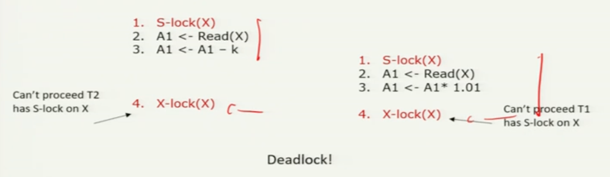

> What do I mean by blocking? That mean another transaction might have to wait. You want to read something, but somebody have an exclusive lot. You just have to wait. Right. Like this. So let's say both X and Y want to read and write the same item. This can happen. Right. He won't get a. Read the item before he one can write the item t to flipping. Get the share locked and read the item. Now t one request x of t one cannot proceed right because t to have the slot t. to request an x while he took an approach to either because he wanted the slot. So at this case. We have a lot. we have deadlock. For those sticking operating systems somewhere else.
>
> 我说的阻塞是什么意思?这意味着另一笔交易可能需要等待。你想读一些东西，但有人有独家的东西。你只需要等待。正确的。像这样。假设X和Y都想读写相同的元素。这是可能发生的。正确的。他不会得到a。在他写出t到翻转之前，先把题目读一遍。锁定共享并读取项目。现在，一个请求x (t)不能继续下去，因为要得到位置t，而请求x，因为他想要这个位置。在这种情况下。我们有很多。我们陷入僵局。对于那些在其他地方安装操作系统的人。

> But how do you know? So that is what I do have to detect, that there is a deadlock and one sided deadlock. Then I'll kill someone. Correct. So that's what we call detection. So there will be blood. What's the next level? 
>
> -oswitch
>
> -detection
>
> -avoidance
>
> -prevention
>
> At every operation that I will check whether if I allow these operations, will there be a deadlock?  A possibility of a deadlock. If the answer is affirmative, then. There'll be blood. Right. Well, they may not be, but maybe next year we'll do something that someone may basically say, okay,  is okay to wait or it may turn out it's not okay for you to wait because there would be deadlock then bloodshed. But you either kill. Will you either tell the other two, are they going to go away? We start it or you kill one or the other transaction. So death of us.
>
> And then the last is what was the difference between avoidance and prevention? 
>
> prevention. You set up extra rules such that as long as the transactions follow the rules, that lot will never happen. You don't need to even bother to check. That's prevention. Obviously, there's no free lunch. What? The cost of prevention?  You don't leave out a check for a lot of money on prevention. But in order to achieve prevention, that means what? Typically, the rules are very draconian. That will cut down on concurrency significantly because you have to have very restrictive.
>
> I don't ever have to set anything up, but before every operation I do check where the
>
> Before everything that operation. I will ask this question. If I allow this operation to go ahead, is it possible that a deadlock would develop if that if the answer is negative, then go ahead. If the answer is affirmative, then I need to do something and that something might be killing a transaction. So executing a transaction or doing this operation, execute an operation. Operation. Okay. Only if this one calls you into a deadlock.  Otherwise there will be blood. Basically, for every part before every operational transaction that touched the database. I will check it and notice that I will track it until I'm going to execute. Look, I don't do any analysis beforehand. I'll just take it as it goes. Now, obviously in terms of cost, what's the cheaper? authorities keep us right to do nothing. Right. And and and prevention is pretty much the way. Why does have to kind of expressiveness of the expense of avoidance that every time you execute operation you need to check for things and that takes time and effort and results. Prevention means that by default you are restricting concurrency significantly and also forcing transaction to a by to a social route can be also very costly to. So obviously so that no once again, there's no free lunch. There's no free lunch. Right. You want to ensure there's no deadlock. You have to pay a high price. If that lot is not a problem, like what Microsoft thinks, then be my guest. Yeah, that's right. So this is two minute summary of three lectures in the OS. 
>
> 但是你怎么知道呢?这就是我要检测的，有死锁和单边死锁。那我就去杀人。正确的。这就是我们所说的检测。所以会有血。下一关是什么?
>
> -oswitch
>
> 检测
>
> 避免
>
> 预防
>
> 在每个操作中，我都会检查是否允许这些操作，是否会出现死锁?僵局的可能性如果答案是肯定的，那么。会有血的。正确的。好吧，他们可能不会，但也许明年我们会做一些事情，有人可能会说，好吧，可以等待，或者结果可能是，你不可以等待，因为会有僵局，然后流血。但你要么杀人。你能告诉另外两个吗，他们会走吗?要么启动，要么终止其中一个交易。我们去死吧。
>
> 最后一个问题是回避和预防的区别是什么?
>
> 预防。你设置了额外的规则，这样只要交易遵循规则，那批交易就永远不会发生。你甚至不需要费心去检查。这是预防。显然，天下没有免费的午餐。什么?预防的成本?你不会漏掉一张用于预防的支票。但是为了实现预防，这意味着什么呢?通常情况下，这些规定非常严格。这将大大减少并发性，因为你必须有非常严格的限制。
>
> 我不需要设置任何东西，但每次操作之前我都会检查
>
> 在一切操作之前。我会问这个问题。如果我允许这个操作继续，有没有可能会发生死锁，如果答案是否定的，那么继续。如果答案是肯定的，那么我需要做一些事情，而这些事情可能会扼杀事务。执行一个事务或者执行一个操作。操作。好吧。除非这件事让你陷入僵局。否则就会流血。基本上，对于触及数据库的每个操作事务之前的每个部分。我将检查它，注意，我会跟踪它，直到我将要执行。听着，我事先不做任何分析。我就顺其自然吧。显然从成本来看，哪个更便宜?当局让我们什么都不做。正确的。预防就是这样。为什么每次执行操作的时候你都需要检查那些需要时间，精力和结果的东西。预防意味着在默认情况下，您会显著限制并发，并强制事务到社会路由，这也可能非常昂贵。很明显，没有免费的午餐。天下没有免费的午餐。正确的。你希望确保没有死锁。你必须付出高昂的代价。如果这不是问题，就像微软想的那样，那就请便吧。是的，没错。这是操作系统三堂课的两分钟总结。


如果存在一个事务集, 该集合中的每个事务在等待该集合中的另一个事务, 那么我们说系统处于死锁状态. 更确切地说, 存在一个等待事务集{T0, T1, ... Tn}, 使得T0正等待被T1锁住的数据项, T1正等待被T2锁住的数据项, ..., Tn-1正等待被Tn锁住的数据项, 且Tn正等待被T0锁住的数据项. 在这种情况下, 没有一个事务能取得进展.

* How to deal with deadlocks?

  如何处理死锁?

  * Ostrich

    * Pretend nonthing happens and wait for user to hit the `<ctril-alt-del` key

      假装什么都没有发生，等待用户点击`<ctrr-alt-del`键

  * Timeout

    * Assume deadlock after there is no progress for some time, and do something about it

      假设在一段时间没有进展后会发生死锁，并采取措施解决它

    > Technically, we can also do a timeout. Basically nothing happened in 10 seconds.We assumed after that deadlock.

  * Detection and recovery

    检测和恢复

    * Wait until a deadlock occurs and do something about it

      等待，直到死锁发生并采取措施

      允许系统进入死锁状态, 然后试着用死锁检测(deadlock prevention)和死锁恢复(deadlock detection)机制进行恢复.

    > Or we can actually have a more elaborate method to determine that there is a deadlock. And then we do something about. But. Now waiting for time. No, he's not in distress just because nothing of been 10 seconds. To me, there's a lot. It's just that everybody just get a cup of coke and chill out.

  * Avoidance

    避免

    * Wait until a deadlock can occur if certain operations is executed and do something about it.

      等待，直到某些操作被执行时可能发生死锁并采取措施。

  * Prevention

    预防

    * Set up the system such that there is never a chance of deadlocks

      设置系统，使其永远不会发生死锁

      死锁预防(deadlock prevention) 协议保证系统永不进入死锁状态. 

正如将要看到的那样, prevention and detection and recovery均有可能引起事务回滚. 如果系统进入死锁状态的概率相对比较高, 则通常使用死锁预防机制; 否则, 使用检测与恢复机制更有效.

注意, 检测与恢复机制带来各种开销, 不仅包括在运行时维护必要信息及执行检测算法的代价,  还要包括从死锁中恢复所有固有的潜在损失.


### Deadlocks -- timeout 超时 ✅

* When transaciton waits too long for a lock, it is aborted and restarted again from the beginning

  当transaciton等待锁的时间太长时，它将被终止并重新开始

* The timeout period should be:

  超时时间应该是

  * Long enough so that most transactions that are aborted are actually deadlocked;

    时间长到大多数被中止的事务实际上都是死锁的

  * Short enough so that deadlocked transactions don't wait too long for their deadlocks to be broken.

    足够短的时间，使得死锁的事务不会等待太久才被打破

> But I won't go that far. All right. Time constraint, because we are. There's only one more lecture. I do want a cup of recovery, so we'll skip the time out. And detection thing detection is nothing new. To give you a if you take opera in system, we are essentially doing the same thing. I do want to talk about avoidance here.


### Deadlock -- Detection ✅

* Deadlocks can be described as a **wait-for** graph, which consists of a pair G=(V,E),

  死锁可以被描述为一个**等待**图，它由一对G=(V,E)组成，

  * V is a set of vertices (all the transactions in the system)

    V是顶点的集合(系统中的所有事务)

  * E is a set of edges; each element is an ordered pair $T_i \rightarrow T_j$

    E是一组边;每个元素都是一个有序对$T_i \rightarrow T_j$

* If $T_i \rightarrow T_j$ is in E, then there is a directed edge from $T_i$ to $T_j$, implying that $T_i$ is waiting for $T_j$ to release a data item.

  如果$T_i \rightarrow T_j$在E中，那么从$T_i$到$T_j$之间有一条有向边，这意味着$T_i$正在等待$T_j$释放数据项。

* When $Ti$ requests a data item currently being held by $T_j$, then the edge $T_i, T_j$ is inserted in the wait-for graph. This edge is removed only when $T_j$ is no longer holding a data item needed by $T_i$

  当$Ti$请求当前由$T_j$保存的数据项时，边$T_i, T_j$被插入到等待图中。仅当$T_j$不再持有$T_i$所需的数据项时，该边才被删除。

* The system is in a deadlock state if and only if the wait-for graph has a cycle. Must invoke a deadlock-detection algorithm periodically to look for cycles.

  当且仅当等待图有循环时，系统处于死锁状态。必须周期性地调用死锁检测算法来查找循环。

 

* When deadlock is detected:

  当检测到死锁时

  * Some transaction will have to rolled back (made a victim) to break deadlock. Select that transaction as victim that will incur minimum cost.

    一些事务将不得不回滚(成为受害者)以打破死锁。选择产生最小成本的交易作为受害者

  * Rollback -- determine how far to roll back transaction

    Rollback——确定回滚事务到什么程度

    * Total rollback: Abort the transaction and then restart it.

      完全回滚:中止事务，然后重新启动它

    * More effective to roll back transaction only as far as necessary to break deadlock. (But tricky to implement)

      仅在必要时才能更有效地回滚事务以打破死锁。(但很难实现)

* Drawback:

  缺点

  * maintaining wait-for-graph is not cheap

    维护wait-for-graph并不便宜

  * Detecting cycles is an overhead.

    检测周期是一种开销。


死锁可以用称为wait-for-graph等待图的有向图来精确描述. 该图由G=(V, E)对组成, 其中V是顶点集, E是边集. 顶点集由系统中的所有事务组成, 边集E的每一个元素是一个有序对Ti->Tj. 如果Ti->Tj属于E, 则存在事务Ti到Tj的一条有向边, 表示事务Ti在等待Tj释放所需数据项. 

当事务Ti申请的数据项当前被Tj持有时, 边Ti->Tj被插入等待图中. 只有当事务Tj不再持有事务Ti所需数据项是, 这条边才从等待图中删除.

当且仅当等待图包含环时, 系统中存在死锁. 在该环中的每个事务称为处于死锁状态. 要检测死锁状态, 系统需要维护等待图, 并周期性地激活一个在等待图中搜索环的算法.


### Deadlocks -- Stravation

* Sometimes the same transaction may keep being aborted

  有时同一个事务可能会一直中止

* This leads to starvation (really no blocking, but one transaction never get progressed)

  这会导致“饥饿”(实际上没有阻塞，但是一个事务永远不会进行)

* Solution: incorporate number of times being rolled-back as part of the cost

  解决方案:将回滚次数作为成本的一部分


### ==Deadlocks -- Avoidance== ✅

* Allow normal operation, but when there is a chance that deadlock will occur, then do something about it.

  允许正常的操作，但当有可能发生死锁时，然后采取措施

* Recall that deadlock cannot occur if the wait-for-graph have no cycles.

  回想一下，如果等待图没有循环，就不会发生死锁

* If we numbered each transaction (e.g. timestamp), then

  如果我们对每个交易编号(例如时间戳)，那么

  * If every edge in the wait-for graph points from $T_i \rightarrow T_j$ such that $i<j$, then deadlock never occurs

    如果wait-for图中的每条边都从$T_i \rightarrow T_j$指向$i<j$，则死锁不会发生

  * Why?

    为什么

  * Works also if for every edge, $i > j$

    对于每条边，$i>j $

timestamp(时间戳): 另一类用来实现隔离性的技术为每个事务分配一个timestamp时间戳, 通常是当它开始的时候. 对于每个数据项, 系统维护两个时间戳. 数据项的读时间戳记录读该数据项的事务的最大(即最近的)时间戳. 数据项的写时间戳记录写入该数据项当前值的事务的时间戳. 时间戳用来确保在访问冲突情况下, 事务按照事务时间戳的顺序来访问数据项. 当不可能访问时, 违例事务将会中止, 并且分配一个新的时间戳重新开始.

>  I do want to talk about avoidance here.  so now some ground rules. We as well to make discussion easier. We assign a number to each transaction. Notice that the transaction doesn't need to have anything to do with time, although very often it does because it's easier to assign a transaction to the time to establish. But we radically it doesn't have anything to do with each transaction. Just have to have a number. So stay with it. It may be all the protection that Kerkorian once had. So but for now, we can assume that it doesn't have to assume that that the transaction is based on, say, whether the transaction stopped. I do want to mention the transaction number has nothing to do with anything. It's just an arbitrary number. Okay. But we do assume each transaction have a unique number associated with it. And for nine, I think for this this area will assume that T1 start before T2 stat before T3. But as I say, it doesn't have to be this way. Okay. So now I do want to know if you once again, if you go back to OS. Okay. This is a bit more typical. You do it more common to Apple Phone because you may have multiple worth of results in a database. It's much simpler. You don't have multiple working of the same results. So if you remember offline system class, the best way to detect that I thought was is something like serialized ability create graph if not if the transaction if T1 is waiting for T2 you put it from t went on to say t112x but t to hold and explore next. Then you have a you have you have an edge from T1 to T2, right? So very similar to serialized ability, very similar, but not noticed here. It's not just reading here, it's just you're holding a lot. T I want to read something key to hold a lot on that you have an edge on it and you go off and you think that's the right ability. If you have a cycle, then that's a demo. But if you don't remember that, go back to your left textbook. So tell me to think about it. What does that mean? Let's say we have a transaction fee.
>
> T1
>
> T2
>
> We want to read an item less 81, want to read x, but T to have an exclusive lock on x already key to that means t one have to wait for T2.That mean doesn't exit it. Does it mean there's a deadlock right now? So no, because we thought it was like it's perfectly okay for T1 to wait for T2 as long as t two is not waiting for t one. I'm fine. I can wait for t two to finish so we don't have to avoid having any h death. I can have a lot of transaction waiting for a lot of other transactions. But why does what do I not want to see? I do not want to see a cycle. So the general approach is this. If I did so basically before execute any command, let's say you beat Transfection. Request a lock, then I'll ask this question. If I give him that lock, might. If I ever let him go on.  will I create a possibility that will be affected? Let's say t one wanted, let's say in this case t one. Whatever it takes to explore next. So if I allow p one to wait, will we possibly to a cycle we'll actually create a cycle on the graph. If so. Not can do that. I duty one or two has died. And you can decide who die later on. We'll talk about that in a minute. So that's the general idea. Any questions that at least a very generic emblem that you maintain the graph which I think is really for others and every time I a transaction need to weight that request a lot but hey somebody else have it then you're potentially adding an edge to that graph. If I think that graph will lead to a cycle, then do something. Killing one of the two transaction decimal. So I said this. That's a genuine effort to do it. The problem of doing this is what every time I do a I execute operation, I have to check for cycles in a graph. What is the cost of checking a cycle in a graph? A directed graph. Go back to out. How do you check for cycles? It's a direct graph, so anything called union fine doesn't work checks sense but checklists said.
>
> cycle
>
> Union find does't work.
>
> DFS √
>
> n^2
>
> So how can we have a cheaper solution but still do avoidance? Now. The key thing is this. Remember, I have a graph, I have each transaction. You not is the transaction of a number of it. If I tell you every ash in this graph looks like this, if I have a if I have an ash from title, I will have to be less than j then and my OC. If this is the only type of issue I allow in this graph, can I show that this graph can have any cycle? So I but I have a graph p22t pretty people and the only kind of x I allow is always go from a t i to DKA where I is smaller than J. That's the only kind of okay allowed to be on this graph. Can I guarantee that this product no cycle. yes
>
> 我想在这里谈谈回避。现在是一些基本规则。我们不妨让讨论变得容易些。我们为每笔交易分配一个数字。请注意，事务不需要与时间有任何关系，尽管它通常需要，因为这样更容易将事务分配给要建立的时间。但从根本上说，它与每笔交易都没有任何关系。只需要一个数字。所以坚持下去。这可能是科克里安曾经拥有的所有保护。但现在，我们可以假设它不需要假设交易是基于，交易是否停止。我想说的是交易号与任何事情都没有关系。它只是一个任意数。好吧。但我们假设每笔交易都有一个唯一的编号。对于9，我认为这个区域假设T1开始于T2开始于T3。但就像我说的，事情不一定要这样。好吧。现在我想知道，如果你回到OS。好吧。这是更典型的。这种情况在苹果手机上更常见，因为数据库中可能有多个有价值的结果。它简单多了。你不会多次运行相同的结果。如果你还记得离线系统类，我认为最好的检测方法是类似于序列化能力创建图如果不是如果事务T1在等待T2，你把它从t开始，然后说t112x，但t继续，然后继续探索。然后你有一条从T1到T2的边，对吧?非常类似于序列化能力，非常类似，但这里没有注意到。不只是阅读，只是你拿了很多。我想读一些关键的东西，你有一个优势，你认为这是正确的能力。如果你有一个循环，那就是一个演示。但是如果你不记得了，回到左边的课本。所以让我考虑一下。这是什么意思?假设我们有交易费。
>
> T1
>
> T2
>
> 我们想要读取小于81的元素，想要读取x，但是如果x已经被排它锁了，这意味着我们必须等待T2。这意味着不退出。这是否意味着现在出现了僵局?不，因为我们认为只要t 2不等待t 1 T1等待T2是完全可以的。我很好。我可以等t 2完成这样我们就不用避免任何h的死亡。我可以让很多事务等待很多其他事务。但为什么我不想看到的东西?我不想看到循环。一般的方法是这样的。如果我基本上是在执行任何命令之前这样做的，假设你击败了转染。请求锁，然后我会问这个问题。如果我把锁给他，可能会。如果我让他继续下去。我会创造一种被影响的可能性吗?假设t 1想要，假设在这种情况下是t 1。无论接下来要探索什么。所以如果我让p 1等待，我们可能会形成一个循环实际上我们在图上创建了一个循环。如果是这样的话。不能那样做。我的职责有一两个已经死了。你可以决定谁会死。我们待会再谈。这就是总体思路。有什么问题吗，至少是一个非常通用的标志，你维护这个图，我认为这对其他人来说是真的，每次交易都需要权衡，要求很多但是，嘿，其他人有它那么你可能会在这个图上添加一条边。如果我认为这个图会导致一个循环，那就做点什么。杀死两个交易小数中的一个。所以我说。这是真正的努力。这样做的问题是每次我执行一个操作，我必须检查图中是否有环。在图中检查一个循环的开销是多少?有向图。回到外面去。如何检查循环?这是一个有向图，所以任何叫做union fine的东西都不起作用检查意义，但检查清单说了。
>
> 周期
>
> Union find不起作用。
>
> DFS√
>
> n ^ 2
>
> 那么，我们如何既能有更便宜的解决方案，又能做到规避呢?现在。关键是这个。记住，我有一个图，我有每一笔交易。你不就是交易了多少吗。如果我告诉你这个图中的每个灰点都是这样的，如果我有一个。如果我有一个灰点，那么我必须小于j，我的OC。如果这是我在这个图中允许的唯一类型的问题，我能证明这个图可以有任何循环吗?所以我有一个图，p22t漂亮的人，我唯一允许的x总是从ti到DKA, I比j小，这是唯一允许在这个图上的。我能保证这个产品没有周期吗?是的
>
> 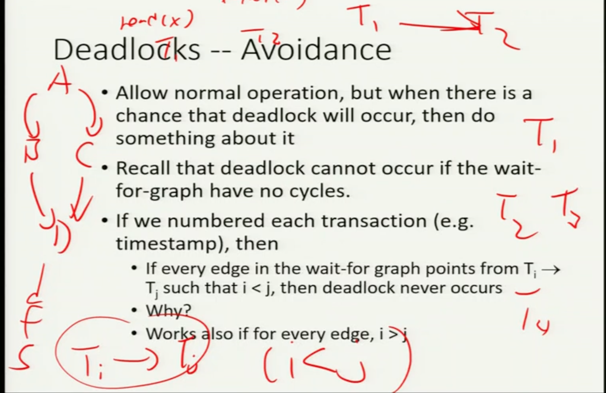
>
> Not there is in the notice that this graph only we cut when you are waiting for something, if there's no waiting, there's no interleaving there's there's nothing stopping about me that and also if P was waiting for T2, that's fine too. But so if I can guarantee all the edges looks like this, I'm fine. Now let me do the reverse. How about this? If I tell you once again, I have a graph like this, but every edge PJ will be j will be greater than I. (J< i) Can I still guarantee the national cycle? Same problem. I have a graph p22t three people I'll tell you every age from pi to DKA. I've graded Angie strictly grading. Can I go to the auto cycle? The answer is yes. I get the same argument every time a go along the path the number is decreasing.Even to go back up, I have to increase the number. But you tell me that. No, those are. No, actually this. So if I can guarantee that. Then I'm home free. I don't have to do I don't have to be careful. If I coves everything right, then at least things are not that expensive.
>
> 注意到这个图只有在等待的时候才进行切割，如果没有等待，就没有交叉没有任何停止如果P在等待T2，这也没问题。但是如果我能保证所有的边都是这样的，就没问题。现在我来做相反的操作。这个怎么样?如果我再告诉你一次，我有一个这样的图，但是每条边PJ都会是j会大于I (J&lt;i)我还能保证国家周期吗?同样的问题。我有一个图p22t三个人的年龄从pi到DKA。我给安琪打分了，严格打分。我可以去骑摩托车吗?答案是肯定的。每次a沿着数字减少的路径移动，我都会得到相同的参数。即使要回去，我也要增加数字。但是你告诉我。不，那些是。不，实际上是这个。如果我能保证。然后我就自由了。我不需要我不需要小心。如果我什么都买对了，那么至少东西没那么贵。


* When a transaction $T_i$ request a lock on an object, but $T_j$ currently have the lock

  当事务$T_i$请求一个对象上的锁，但是$T_j$当前拥有锁

* Two options:

  两个选项:

  * ==Wait-die (non pre-emptive)==

    Wait-die(非抢占式): 基于非抢占技术. 当事务Ti申请数据项当前被Tj持有, 仅当Ti的时间戳小于Tj的时间戳(即, Ti比Tj老)时, 允许Ti等待. 否则, Ti回滚(死亡)

    * If $i<j$ then wait

      如果 $i<j$ ，则等待

    * else $T_i$ aborts

      否则 $T_i$ 中止

    例如, 假设事务T14, T15及T16的timestamps分别为5, 10, 15. 如果当前T14申请的数据项当前被T15持有, 则T14将等待. 如果T16申请的数据项被当前T15持有, 则T16讲回滚.

  * ==Wound-wait (pre-emptive)==

    伤口等待(先发制人):基于抢占技术, 与wait-die相反的机制. 当事务Ti申请的数据项当前被Tj持有, 仅当Ti的时间戳大于Tj的时间戳(即, Ti比Tj年轻)时, 允许Ti等待. 否则, Tj回滚(Tj被Ti伤害)

    * If $i > j$ then wait

      如果 $i > j$然后等待

    * Else $T_j$ aborts

      否则$T_j$终止

    例如, 假设事务T14, T15及T16的timestamps分别为5, 10, 15. 如果当前T14申请的数据项当前被T15持有, 则T14将从T15抢占该数据项, T15将回滚. 如果T16申请的数据项被当前T15持有, 则T16讲回滚.

* If i and j represent time (i.e. small number = older transactions)

  如果i和j表示时间(即较小的数字=较早的事务)

  * Wait-die: older transactions wait for younger transactions;

    wait -die:旧事务等待新事务;

  * Wound-wait: younger transaction wait for older transactions

    Wound-wait:年轻事务等待旧事务

> I still have to create a t to wait for t. One on the surface is okay right now. However, remember, my goal is not to check the graph. My goal is not to check a cycle every step. My goal is to have a rigid rule so that anything that will happen, it will not create a cycle. So just to play, say, I still have to say no. He too still has to die. I'm sorry. See that. So once you do it, once you have this happen, the destiny is 42 to die. I'm sorry, but that's life. So one to conception decide to content what I think being essentially if I use this strategy p two is destined to die no matter whether T through request first or TV request. If he if he went out, they have a shell, artillery shell up. I don't care which one because I don't care which one requested the exclusive first pick. This crew. They look to human beings, what kind of transaction, what is true and authentic. The point is, I mean, why don't you want. Why don't why don't you let see? Truly, if that sounds very cruel, right? You might tell them. I think you probably told me that. I hope you've probably say I don't care. I want I just want to look at my cell phone. But why does it sound so cruel? Because I don't want to put any effort into looking at the graph for every request. That will take me a lot of time. It will make the whole system very inefficient just to check with their. So that means that's why I'm going to impose something so that the thing that I check is just whether I've been in jail or not. And one of those windows that is going to be a good compromise, essentially. That. Yeah. So P two has to die to have to die in the name of efficiency and correctness. So the death of Peter is actually quite meaningful, though. So Peter does not die in vain. This flu. This way, if you want to feel better, the death of people and here the transaction can go on without that lot and makes you realize that.
>
> So the sacrifice of T2 is very meaningful. Does it make you feel better?
>
> 我仍然需要创建一个t来等待t，现在一个在表面上是可以的。但是，请记住，我的目标不是检查图表。我的目标不是每一步都检查一个循环。我的目标是有一个严格的规则，这样任何可能发生的事情，都不会造成循环。所以为了玩，我还是要拒绝。他也必须死。我很抱歉。看到。所以一旦你这样做了，一旦你这样做了，命运就是42死。对不起，但这就是生活。所以一个概念决定内容，我认为本质上如果我使用这个策略p 2注定会死亡，无论是通过请求优先还是电视请求。如果他如果他出去了，他们有炮弹，炮弹。我不在乎哪一个因为我不在乎哪一个要求优先选择。这个船员。他们看人类，什么样的交易，什么是真实和真实的。重点是，我是说，你为什么不想。为什么不让我看看?真的，如果这听起来很残酷，对吧?你可以告诉他们。我想你可能跟我说过。我希望你可能会说我不在乎。我想我只想看看我的手机。但为什么听起来这么残忍?因为我不想花任何精力去查看每个请求的图表。那要花很多时间。这将使整个系统非常低效，只是检查他们的。这意味着这就是为什么我要强加一些东西这样我要检查的就是我是否进过监狱。从本质上说，其中一个窗口将是一个很好的妥协。那是的。所以p2必须以效率和正确性的名义消亡。所以彼得的死其实很有意义。这样彼得就不会白白死去。这种流感。这样，如果你想感觉好一点，人的死亡和这里的交易可以在没有这些东西的情况下继续，让你意识到这一点。
>
> 所以T2的牺牲很有意义。这会让你感觉好些吗?


> But the difference between the two methods. Now, on one hand, if t to that lowly stipend doesn't have real good. But if nobody dies, what actually happens in the first case? T1 will wait for T2 will wait for T3. So if nobody has to die is the larger number transaction that will get finished. Because t one is waiting for t to t one have to wait, but t two can proceed.  If on the one way if nobody dies t to have to wait for t1t free of the way 42 people have to wait for t free still until full. The smaller number will get priority of execution. So you will probably have to decide what the number represents and whether you want to give smaller number, higher priority, or larger number high priority if nobody dies. Right. So I said that if somebody that always had bin Laden number. I'm sorry. Okay. Any questions about that? But I do want to emphasize again this have nothing theoretically. It has nothing to do when a transaction is done. It only has to do with the transaction number. You can choose to assign transaction number with the time of transactions that you doesn't have to do it this way. You doesn't have to do it. If the database decides some arbitrary way of assigning transaction number, we still follow that transaction of number assignment
>
> 但两种方法之间的区别。现在，一方面，如果t到低津贴没有真正的好。但如果没有人死亡，第一种情况下会发生什么?T1等待T2等待T3。因此，如果没有人死亡，那么完成的交易数量会更大。因为t 1在等待t到t 1必须等待，但t 2可以继续。如果在一条路上如果没有人死亡t必须等待t自由的方式42人必须等待t自由仍然直到满。较小的数字将获得执行优先级。因此，您可能需要决定数字代表什么，以及在没有人死亡的情况下，是给较小的数字以更高的优先级，还是给较大的数字以高优先级。正确的。所以我说如果有人一直有本拉登的号码。我很抱歉。好吧。有问题吗?但我想再次强调，这在理论上没有任何意义。当事务完成时，它没有任何作用。它只和交易号有关。你可以选择用交易时间来指定交易编号，而不必这样做。你不需要这么做。如果数据库决定了某种分配事务编号的方式，我们仍然遵循该分配事务编号的方式
>
> ==We follow nothing but can give you a hint for homework two and a final exam . A lot of people make this mistake assuming transaction number equivalent to time,  transaction number has nothing, absolutely nothing. If I cannot embody totally nothing to do that to do with where does this transaction start.This trip up a lot of you the exams. I'll give you a warning them.==
>
> 我们什么都没做，只是给你一个第二家庭作业和期末考试的提示。很多人会犯这样的错误，认为交易编号等于时间，交易编号什么都没有，绝对没有。如果我不能体现完全没有做那与这个交易从哪里开始。这次绊倒了你们很多人。我要给你一个警告


* How to avoid starvation?

  如何避免饥饿?

* Note that in both scheme, at any given time, at least one transaction is never going to be aborted

  注意，在这两种方案中，在任何给定的时间，至少有一个事务不会被中止

  * The one with the smallest i

     i最小的那个

* Thus, to avoid starvation, ensure that when a transaction is aborted, it is restarted with the SAME i

  因此，为了避免“饿死”，确保在事务中止时，用相同的i重新启动它

  * Eventaully it will becomes the one with the smallest i. 

    最终它会变成i最小的那个。


有可能存在一个事务序列, 其中每个事务申请对该数据加共享锁, 每个事务在授权加锁后一小段时间内释放锁, 而T1总是不能在该数据项上加排他锁. 事务T1可能永远不能取得进展, 这称为starved饿死.

> If you remember, you're off class. Let me finish with this final little bit transaction. Also have to debt. Apart from debt lot. There's also something called life locked of starvation. What if they will be offering some class?  He had the lowest pecking order. Whenever I'm ready to start another high priority, just flipping Right. And then this. I'm ready to go. Another high priority to him. Right. This like your Looney Tunes things, right? So wherever the investor want to eat that, but and then come in and get it. So we made it like this cost of a there's either cauliflower in this in this would call starvation. The good thing about this, if you think about it, because remember, no matter what scheme you use when key one in key to contact for resources which can die p Q Always die. I don't care which skin you are, so. T one will never die. T1 will eventually be able to continue. Because if there continue eventually. Q And Q everybody. All right. But I don't know, maybe I think I'll keep you like people will eventually everybody'll and be able to finish I don't care. But. So. So that means what? To avoid starvation. When do we start the transaction? You have to restart a transaction with the state. So let's say T6 is a bottle. So you may want to restart that process again. You will have to restart with P6. Why? Because there's only five numbers left. And he thinks eventually team T1 will finish. But we told her that he will never kill and once tyranny is finished, he will eventually finish the key to who never get killed. Eventually TV will never get deputy, but TV would never get killed. So eventually, if you're ten. So whenever a title is supported, when you restart it, you will restart the same high. Eventually, it's going to be able to. Right. So there's resurrection. So. Now.
>
> 如果你还记得，你已经下课了。让我以这最后一点交易结束。还得负债。除了债务。还有一种被称为饥饿锁定的生命。如果他们会提供一些课程呢?他的地位最低。当我准备开始另一项高优先级的工作时，就向右转。然后是这个。我准备好了。另一个对他来说很重要的任务。正确的。这就像你的疯狂曲调，对吧?所以无论投资者想在哪里吃到它，然后进来拿它。所以我们把它做成这样的代价。这里面有花椰菜。这叫做饥饿。这样做的好处是，如果你考虑一下，因为不管你使用什么方案，当你用一个键来联系资源时，p Q总是会死的。我不管你是什么肤色，所以。一个人永远不会死。T1最终将能够继续。因为如果最终继续。每个人都问。好吧。但我不知道，也许我想我会像其他人一样留住你最终每个人都能完成我不在乎。但是。所以。这意味着什么?避免挨饿。我们什么时候开始交易?您必须重新启动具有该状态的事务。假设T6是一个瓶子。所以你可能想重新启动该进程。你必须从P6重新开始。为什么?因为只剩5个数字了。他认为T1团队最终会结束。但我们告诉她，他永远不会杀人，一旦暴政结束，他最终会完成谁永远不会被杀的关键。最终TV永远不会成为副警长，但TV永远不会被杀死。最终，如果你是10岁。无论何时支持一个标题，当你重新启动它时，你会以相同的高度重新启动。最终，它将能够。正确的。所以有复活。所以。现在。

> Any question about voidness? We are finding as we wrap up on a couple of smaller topics.
>
> 关于无效性有问题吗?我们在总结几个更小的话题时发现。

#### quiz 6

3. Consider deadlock avoidance in two-phase locking. Suppose Ti is holding a S-lock on an item, and then a transaction Tj request an X-lock on the same item. Which of the following is correct? (Assume i < j)

   A. Tj will be allowed to proceed because i > j

   B. Tj will be allowed to wait if "wait-die" policy is in place

   C. Tj will be allowed to wait if "wound-wait" policy is in place

   D. No matter what policy is used, Tj will abort

B ❌

C ✅

>A. ❌ Ti has not released the s-lock
>
>B. ❌ i < j means i older than j.  j wait for i means yonger transaction wait for older transactions 
>
>-> wound-wait
>
>C. ✅
>
>D. Tj can wait
>
>* Two options:
>
>  两个选项:
>
>  * ==Wait-die (non pre-emptive)==
>
>    Wait-die(非抢占式): 基于非抢占技术. 当事务Ti申请数据项当前被Tj持有, 仅当Ti的时间戳小于Tj的时间戳(即, Ti比Tj老)时, 允许Ti等待. 否则, Ti回滚(死亡)
>
>    * If $i<j$ then wait
>
>      如果 $i<j$ ，则等待
>
>    * else $T_i$ aborts
>
>      否则 $T_i$ 中止
>
>    例如, 假设事务T14, T15及T16的timestamps分别为5, 10, 15. 如果当前T14申请的数据项当前被T15持有, 则T14将等待. 如果T16申请的数据项被当前T15持有, 则T16讲回滚.
>
>  * ==Wound-wait (pre-emptive)==
>
>    伤口等待(先发制人):基于抢占技术, 与wait-die相反的机制. 当事务Ti申请的数据项当前被Tj持有, 仅当Ti的时间戳大于Tj的时间戳(即, Ti比Tj年轻)时, 允许Ti等待. 否则, Tj回滚(Tj被Ti伤害)
>
>    * If $i > j$ then wait
>
>      如果 $i > j$然后等待
>
>    * Else $T_j$ aborts
>
>      否则$T_j$终止
>
>    例如, 假设事务T14, T15及T16的timestamps分别为5, 10, 15. 如果当前T14申请的数据项当前被T15持有, 则T14将从T15抢占该数据项, T15将回滚. 如果T16申请的数据项被当前T15持有, 则T16讲回滚.
>
>* If i and j represent time (i.e. small number = older transactions)
>
>  如果i和j表示时间(即较小的数字=较早的事务)
>
>  * Wait-die: older transactions wait for younger transactions;
>
>    wait -die:旧事务等待新事务;
>
>  * Wound-wait: younger transaction wait for older transactions
>
>    Wound-wait:年轻事务等待旧事务

### 18.2.1 Deadlock -- prevention  ✅

* Select a scheme such that deadlock will never occurs

  选择一种不会发生死锁的方案

* Conservative 2PL

  保守的2PL

  * 2 phase locking

    两阶段锁定

  * A transation must request ALL the locks in the beginning, and either all the locks or none of the locks are granted

    事务必须在开始时请求所有锁，要么所有锁，要么没有锁被授予

* Labelling database objects

  标记数据库对象

  * Transaction can only request locks in order of the database objects 

    事务只能按照数据库对象的顺序请求锁


> Now, if I'm clear where prevention is useful, probably very useful in some aspects. Number one, it guarantee no deadlocks that mean there's no overhead. Do any solution, no checking, no rules like this. But you are going to impose a very strict rule in system where you don't mind having not a lot of concurrency, but you actually lie about having no overhead. A very concerted scheme might be useful So I do want to mention. And how do you prevent that? Locks in the open system talking about how to implement the locks. There are a couple of there are a couple of tricks. How how what rules can you set such that that lot will never. So that's what I thought. Oh, if I said no, that's that's actually not quite that. One. One reason why you have that long is that you're waiting for something. Right. How do you avoid the chance of waiting? Now actually waiting for something, and then you have something that other people won't. And that because it's out of the way for you. How can you avoid that? Yes. I'm not. Time out means that you may be aborting someone a transaction that overhead. I won't bother about you or. How do you avoid it? That's why I can be so one way too. Of what is what? I accept this route.You want a lot? Fine. You request every lot you want right at the beginning. And you cannot get all the luck in the beginning. You get no locks. So if every lock or no lock. What does it mean? You know, if you get every love you can go on and that's fine. You never get blocked. If you don't, you cannot proceed because other people are holding a lock. Then you are holding no lock. So you are not blocking anybody. You are not blocking anybody. Is that draconian? Yes. Does it guarantee no deadlock? We might be able to live with that. So that's what we call conservative two phase lock, but we still to face. But you request every lot you want right at the beginning. If I cannot give you every lot you want at any moment, I will give you zero lock. That is draconian, but that works in a database system where you don't mind being draconian. But you you definitely my about that lot and you definitely don't want also had direct execution this is at least a acceptable scheme okay yes if you request what I wanted.
>
> So you lot many you have to be updated two things that okay start a transaction now you want to request law give me every lock unique in a public state and I will tell you yes or no. If I tell you yes, you immediately get every lock you want. If you say no, go by the beginning of the line, wait for your time to start or open. So that's the way to do so, because they are system where you cannot afford to have any deadlocks. But you can afford to have lower concurrency immediately. And if you have that scheme that used to take us to the school, you know that your system is used in this scheme. That means this will discourage you to use a lot of lock for in one transaction, which may be a good thing or a bad thing. But if you've been preventing deadlock and no overhead operator is your utmost priority, that is something you should think about. Well, it's not often that that happens, but there may be some extreme situation, maybe life and death situation where rocking the middle over in the middle is not acceptable. Then maybe you have to resort to this. Okay. Any questions? Because of time constraints. I will. There is actually a whole other set of life I talk about to face arcane and other community control scheme. But because of the time constraint, we won't be able to cover it. I might put another set of life on on canvas, but you will not be responsible. The exams. I think there's a lot of interest to make the long dead even harder, right?
>
> 现在，如果我清楚预防是有用的，可能在某些方面非常有用。第一，它保证没有死锁，这意味着没有开销。做任何解决方案，不检查，没有这样的规则。但你会在系统中强加一个非常严格的规则，你不介意没有很多并发，但你实际上撒谎说没有开销。一个非常协调的方案可能是有用的，所以我想提一下。如何防止这种情况发生呢?讨论了锁在开放系统中的实现方法。有一些有一些技巧。怎么，怎么，你能制定什么规则让那群人永远不会。我就是这么想的。如果我说不，那。那其实不是那么回事。一个。你有这么长的时间的一个原因是你在等待什么。正确的。如何避免等待的机会?现在真的在等待一些东西，然后你得到了其他人不会得到的东西。那是因为它对你来说不碍事。如何避免这种情况呢?是的。我不是。超时意味着您可能正在中止某人的事务。我不会为你或。你如何避免它?这就是为什么我也可以这样。什么是什么?我接受这条路线。你想要很多?很好。你一开始就想要多少就要多少。你不可能在一开始就得到所有的运气。你没有锁。所以如果每个锁或没有锁。这是什么意思?你知道，如果你能得到所有的爱，那很好。你永远不会被阻挡。如果你不这样做，你就无法继续，因为其他人已经锁定了。那你就没有锁了。所以你没有阻碍任何人。你没有阻挡任何人。这很严厉吗?是的。它能保证没有死锁吗?我们也许可以接受。这就是我们所说的保守两相锁，但我们仍然要面对。但你一开始就想要多少就要多少。如果我不能在任何时候给你你想要的每一份，我会给你零锁。这太苛刻了，但它适用于一个你不介意苛刻的数据库系统。但是你，你肯定我的很多，你肯定不想也有直接执行，这至少是一个可以接受的方案，好的，是的，如果你要求我想要的。
>
> 所以你需要更新两件事开始交易现在你想请求法律给我所有的锁在公共状态下是唯一的我会告诉你是或不是。如果我说是，你马上就能得到你想要的所有锁。如果你说不，从队伍的开头开始，等待你的时间开始或开始。这就是这样做的方法，因为它们是你不能承受任何死锁的系统。但是你可以立即降低并发度。如果你有一个曾经带我们去学校的方案，你知道你的系统在这个方案中使用。这意味着这将阻止您在一个事务中使用大量锁，这可能是好事，也可能是坏事。但是，如果您一直在防止死锁，并且没有开销运算符是您的最高优先级，则应该考虑这一点。这种情况并不经常发生，但可能会有一些极端的情况，可能是生死攸关的情况，在中间摇摆是不可接受的。那也许你得求助于这个。好吧。有什么问题吗?因为时间限制。我会的。实际上，我谈论的是另一种生活方式，即面对奥术和其他社区控制方案。但由于时间限制，我们不能覆盖它。我可以把另一种生活画到画布上，但你不用负责任。考试。我觉得让逝者变得更加艰难是很有意义的，对吧?


### Quiz 6

1. What is "two-phase" in two phase locking?

   A. None of the other answers are correct

   B. Once you start releasing locks you cannot obtain more locks

   C. Once you start acquiring X-locks, you cannot acquire S-locks

   D. Once you start acquiring X-locks, you cannot acquire S-locks

B ✅

> * **Ensure T1 does not read/write anything after releasing the lock!**
>
>   确保T1在释放锁后不再读写任何东西!
>
> * **===> (basic) Two-phase locking==**
>
>   (基本)两阶段锁定
>
> C.D  You can acquire S-locks after you start acquiring X-locks.


2. What is the motivation of having strict two-phase locking over basic two-phase locking?

   A. Strict two phase locking avoid non-recoverable schedule

   B. Strict two phase locking require only one type of lock

   C. Strict two phase lockng allow for more concurrency

   D. All of the other answers are correct.

A ✅

> A. 
>
> * Strict 2-phase locking:
>
>   严格的两阶段锁
>
>   * 2-phase locking
>
>     两阶段锁
>
>   * ==X-locks can only== be released when the transaction commits
>
>     X-locks只能在事务提交时释放
>
> * Question: does strict 2-phase locking ensure 
>
>   问题:严格的两阶段锁是否能确保
>
>   * Recoverability? (Yes)
>
>     可恢复性?
>
>   * Avoid cascade aborts (Yes)
>
>     避免级联中止
>
>   * Strict? (Not quite)
>
>     严格吗?
>
> ❌B. it is based on basic on 2 phase lock, so it still have some limit on s-lock
>
> you unlock you can not add the other locks whatever s-lock.
>
> ❌C. more strict less concurrency


3. Consider deadlock avoidance in two-phase locking. Suppose Ti is holding a S-lock on an item, and then a transaction Tj request an X-lock on the same item. Which of the following is correct? (Assume i < j)

   A. Tj will be allowed to proceed because i > j

   B. Tj will be allowed to wait if "wait-die" policy is in place

   C. Tj will be allowed to wait if "wound-wait" policy is in place

   D. No matter what policy is used, Tj will abort

B ❌

C ✅

>A. ❌ Ti has not released the s-lock
>
>B. ❌ i < j means i older than j.  j wait for i means yonger transaction wait for older transactions 
>
>-> wound-wait
>
>C. ✅
>
>D. Tj can wait
>
>* Two options:
>
>  两个选项:
>
>  * ==Wait-die (non pre-emptive)==
>
>    Wait-die(非抢占式): 基于非抢占技术. 当事务Ti申请数据项当前被Tj持有, 仅当Ti的时间戳小于Tj的时间戳(即, Ti比Tj老)时, 允许Ti等待. 否则, Ti回滚(死亡)
>
>    * If $i<j$ then wait
>
>      如果 $i<j$ ，则等待
>
>    * else $T_i$ aborts
>
>      否则 $T_i$ 中止
>
>    例如, 假设事务T14, T15及T16的timestamps分别为5, 10, 15. 如果当前T14申请的数据项当前被T15持有, 则T14将等待. 如果T16申请的数据项被当前T15持有, 则T16讲回滚.
>
>  * ==Wound-wait (pre-emptive)==
>
>    伤口等待(先发制人):基于抢占技术, 与wait-die相反的机制. 当事务Ti申请的数据项当前被Tj持有, 仅当Ti的时间戳大于Tj的时间戳(即, Ti比Tj年轻)时, 允许Ti等待. 否则, Tj回滚(Tj被Ti伤害)
>
>    * If $i > j$ then wait
>
>      如果 $i > j$然后等待
>
>    * Else $T_j$ aborts
>
>      否则$T_j$终止
>
>    例如, 假设事务T14, T15及T16的timestamps分别为5, 10, 15. 如果当前T14申请的数据项当前被T15持有, 则T14将从T15抢占该数据项, T15将回滚. 如果T16申请的数据项被当前T15持有, 则T16讲回滚.
>
>* If i and j represent time (i.e. small number = older transactions)
>
>  如果i和j表示时间(即较小的数字=较早的事务)
>
>  * Wait-die: older transactions wait for younger transactions;
>
>    wait -die:旧事务等待新事务;
>
>  * Wound-wait: younger transaction wait for older transactions
>
>    Wound-wait:年轻事务等待旧事务


5. Let say a transaction T holds an S-lock of an object. Which of the following statement(s) is/are true?

   (a) If T wants to obtain an X-lock of the same object, it will be granted

   (b) If a different transaction T' want to obtain an S-lock on the same obiect, it will be granted

   (c) If a different transaction T' want to obtain an X-lock on the same object, it will be granted

   A. (a), (b) and (c)

   B. (b)

   C. (a) and (b)

   D. (a)

C ❌

B ✅

> a. ❌  ==No other transaciton can hold any lock (not even a S-lock) if some transaction has an X-lock.==  Therefore you have to wait other release s-lock. then it will be granted.
>
> b. ✅ Multiple transactions can hold a S-lock on an object simultaneously.
>
> c. ❌ 同理于 a.

