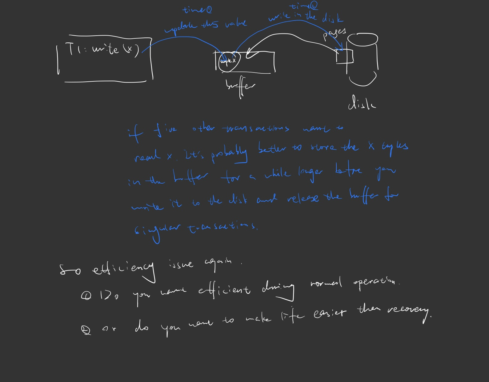
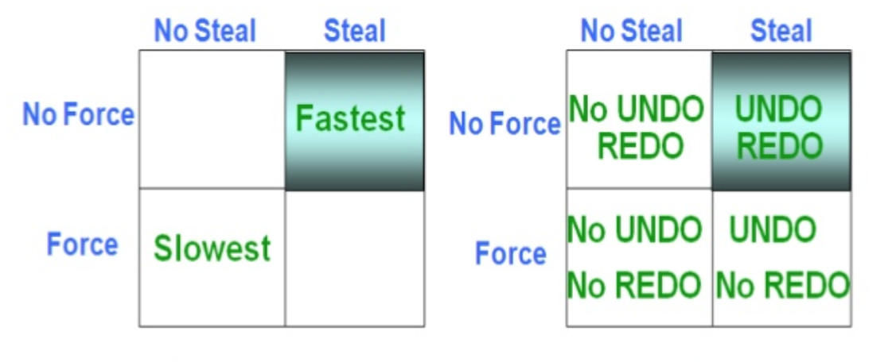
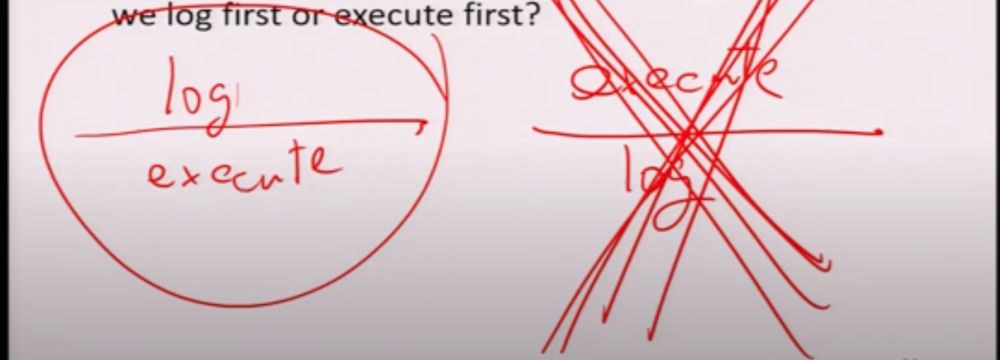
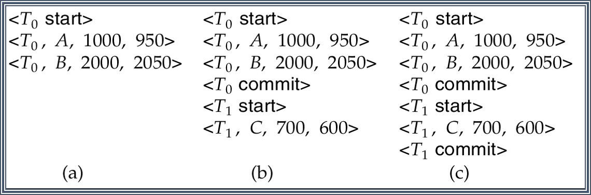

# Chapter 19 Recovery System

# Recovery Overview

### Recovery - why? ✅

* **A**CI**D** properties

  ACID 属性

  * Atomicity: all or nothing

    原子性: 要么有 要么全无

  * Durability: Once committed, changes must be permanent

    持久性: 一旦提交, 更改必须是永久性的

    > I'm saying that your transaction is finished and no other following a transaction update value you update and the change will eventually have to make permanent has a little bit less to do is whether you right immediately to do this but more to do if your system crash and your system go back up to changes, you may still have to be there. Assume no following transaction update.

* If the system is always functional, that's ok.

  如果系统总是正常运行，那就没问题。

  > system crash

* However, system may crash (failure)

  但是，系统可能会崩溃(故障).


## 19.1 Types of failures ✅

* Types of failures
  
  故障类型

  * **Transaction failure:** 
  
    事务故障
  
    * **Logical errors:** transaction cannot complete due to some internal error condition (e.g. your program have a division by zero error)
  
      **逻辑错误**: 由于某些内部错误条件导致事务无法完成(例如，您的程序有一个除零错误)
  
      事务由于某些内部条件而无法继续正常执行, 这样的内部条件如非法输入, 找不到数据, 溢出或超出资源限制.
    
    * **System errors**: the database system must terminate an active transaction due to an error condition (e.g. deadlock)
    
      **系统错误**: 数据库系统必须由于错误条件(例如死锁)终止活动事务
      
      系统进入一种不良状态(如死锁), 结果事务无法继续正常执行. 但该事务可以在以后的某个时间重新执行.
  
  * **System crash**: a power failure or other hardware or software failure causes the system to crash.
  
    系统崩溃: 电源故障或其他硬件或软件故障导致系统崩溃
  
    硬件故障, 或者是数据库软件或操作系统的漏洞, 导致易失性存储器内容的丢失, 并使得事务处理停止. 而非易失性存储器仍完好无损.
  
    * Fail-stop assumption: non-volatile storage contents are assumed to not be corrupted by system crash
  
      故障-停止假设: 假定非易失性存储内容不会因系统崩溃而损坏
  
      * Database systems have numerous integrity checkes to prevent corruption of disk data
  
        数据库系统有许多完整性检查，以防止磁盘数据的损坏
  
  * **Disk failure**: a head crash or similar disk failure destorys all or part of disk storage
  
    **磁盘故障**: 磁头崩溃或类似的磁盘故障会破坏磁盘存储的全部或部分
  
    在数据传送操作过程中由于磁头损坏或故障造成磁盘块上的内容丢失.
  
    * Destruction is assumed to be detectable: disk drives use checksums to detect failures
  
      假定销毁是可检测的:磁盘驱动器使用校验和来检测故障
  
    * With some disk systems, some failures maybe correctable.
  
      对于某些磁盘系统，某些故障是可以修复的
  
    

* We focus on transaction/system failure as well as other failures that are **correctable**.

  我们关注事务/系统故障以及其他**可纠正**的故障。


* Failure can occur **any** time 
  
  故障随时可能发生
  
  * including the time that you do not want
  
    包括你不想要的时间
    
  * We do assume in this class that writing a page is atomic
  
    我们在这个类中假设写一个页面是原子的
    
    (i.e. failure do not occur in the middle of writing a page)
    
    (例如，在写页面的过程中不会发生失败)
  
* Thus need to maintain atomicity and durability at all times.

  因此需要始终保持原子性和持久性。

  

* After failure, the system needs to recover

  故障发生后，系统需要恢复

  * Need to recover to a consistent state

    需要恢复到一致状态

  * Need to ensure all transactions are ==atomic== and ==durable==

    需要确保所有事务都是原子性和持久性的

* Thus when the system go back up and running after a failure 

  因此, 当系统发生故障后重新启动并运行时

  * A ==recovery module== is up and running - before allowing any other transaction to run

    恢复模块已经启动并运行——在允许任何其他事务运行之前

  * It will restore the database to the consistent state as well as ensure the ACID properties

    它将恢复数据库到一致状态，并确保ACID属性

  * After that transactions may continue

    之后交易可以继续

* Notice that information need to be stored during the normal running of the transaction for the recovery module to run properly.

  请注意，在事务正常运行期间需要存储信息，以便恢复模块正常运行。

> 所以如果你是一个数据库系统, 我们将如何处理这些随时可能发生的事情


## 19.3 Recovery - atomicity requirement ✅

* Suppose the system crash while a transaction T is being executed (but not committed)

  假设事务T正在执行(但未提交)时系统崩溃

* During recovery, one need to 

  * Find those transactions

    查找这些交易

  * Ensure atomicity is held.

    确保原子性保持

    * Abort or complete?

      中止还是完成

    * Abort! (In many case, don't know how to complete anyway)

      中止!(在很多情况下，不知道如何完成)

    * Abort means restoring the database to the point where those transactions has not started (as some changes may have propagated to the disk)

      Abort意味着将数据库恢复到那些事务尚未启动的位置(因为一些更改可能已经传播到磁盘)

    > Remeber, in the middle of processing, the system can crash again.
    >
    > 记住，在处理过程中，系统可能会再次崩溃。

    * Thus, after the recovery procedure, those transaction should seems to have NEVER been executed

      因此，在恢复过程之后，这些事务应该看起来从未执行过

      


* Counter-argument:

  反论点

  * Can we just not write anything (i.e. uncommitted data) to the disk until T commits?

    我们可以在T提交之前不写入任何内容(即未提交的数据)到磁盘吗?

  * Problems:

    * When pages are to be read/written, it is moved from the disk to a buffer

      在需要读/写页时，将页从磁盘移动到缓冲区

    * If we avoid writing anything to the disk immediately, then the buffer holding that page cannot be released until end of T

      如果我们避免立即向磁盘写入任何内容，那么保存该页的缓冲区直到T结束时才能释放

    * If T is long, or if T write something early in the transaction, it can hold up resources

      如果T很长，或者T在交易的早期写了一些东西，它可能会占用资源

    * If many transactions are running, buffers can be used up very quickly

      如果有很多事务正在运行，缓冲区可能很快被耗尽

      > 如果你这样做有什么缺点, 这意味着你在主内存中保留一些缓冲区, 直到你的事务提交. 如果你有5000个事务, 想想他们最终可以容纳多少个缓冲区, 你现在运行一个缓冲区, 这意味着你正在阻止其他交易.

* If the uncommitted data is written to the disk, then buffer replacement policy (e.g. FIFO, LRU) can utilize resources much more effectively and allow higher concurrency.

  如果未提交的数据被写入磁盘，那么缓冲区替换策略(例如FIFO, LRU)可以更有效地利用资源并允许更高的并发。

  > 为什么我们实际上要写未提交的, 因为如果写入磁盘, 意味着我不必有缓冲区, 因为它们已经在磁盘上. 所以我可以释放其他buffer给其他使用


* Thus, during recovery, one need to

  因此，在恢复期间，一个需要

  * Find those transactions that has started but not yet committed

    查找已经启动但尚未提交的事务

  * Ensure atomicity is held

    确保原子性保持

    * Find all the changes to the database that the transactions has done

      查找事务对数据库所做的所有更改

    * *Undo* all the changes

      撤销所有更改


### Recovery - durability requirement

Do you want efficency here? or Do you want recoverable.

* Suppose the crash occurs right after a transaction T committed.

  假设崩溃发生在事务T提交之后

* Seems to be ok, but...

  看起来很好，但是…

  

  * T may have written something onto the disk

    T可能在磁盘上写了一些东西

  * However, the writes may not have propagated to the disk 

    但是，写入操作可能没有传播到磁盘

  * Reasons:

    * The writes may be scheduled/buffered but the system crashed before such writes can execute

      写操作可以被调度或缓冲，但在执行这些写操作之前系统就崩溃了

    * The buffer manager/virtual memory management may decide to put a disk page into main memory for a long time(save disk access time)

      缓冲区管理器/虚拟内存管理器可能决定长时间将磁盘页放入主内存(节省磁盘访问时间)

      * This is especially true on a network/shared file system

        在网络/共享文件系统上尤其如此

        > Network delay

        

* Remember, when you issue a `write()` command, the system does not necessary write what you have onto disk immediately.

  记住，当你执行`write()`命令时，系统不需要立即将你拥有的内容写入磁盘

* In some systems, you may issue a `flush()` command to force the writes onto the disk

  在某些系统中，可能会使用flush()命令强制写入磁盘


* Counter-argument

  辩论

  * Don’t commit until transaction is certain that all the pages are safely written onto the disk

    在事务确认所有页都安全写入磁盘之前，不要提交

* Problems:

  * Sometimes it is impossible to check for that

    有时根本无法检查

  * Even if it is possible, it may slow down the transaction significantly

    即使这是可能的，它也可能会显著降低交易速度

  * As well as lead to lower concurrency (locks being held longer)

    同时导致并发性降低(锁被持有的时间更长)

    

* Thus, during recovery, one need to

  * Find those transactions that has committed

    查找已经提交的事务

  * Ensure durability is held

    确保持久性

    * Check if all the changes made by the transactions is written onto the disk

      检查事务所做的所有更改是否已写入磁盘

    * If not, then *redo* all the changes

      如果不是，则重做所有的更改


### 19.5.2 Force/No-force vs. Steal/No-steal

* To sum up, what we need to do at recovery depends on how we deal with uncommitted data (especially data in buffers)

  总而言之，我们需要在恢复时做什么取决于我们如何处理未提交的数据(特别是缓冲区中的数据)

* **Steal/No-steal**: A system is said to steal buffers if it allows buffers that contain dirty (uncommitted but updated) data to be swapped to physical storage

  **窃取/不窃取**: 如果系统允许将包含脏数据(未提交但已更新)的缓冲区交换到物理存储，则称其窃取缓冲区

  > 脏读: 指当一个事务正在访问数据，并且对数据进行了修改，而这种修改还没有提交到数据库中，这时，另外一个事务也访问这个数据，然后使用了这个数据。因为这个数据是还没有提交的数据， 那么另外一个事务读到的这个数据是脏数据，依据脏数据所做的操作可能是不正确的。

* If steal is allowed, undo is necessary

  如果允许窃取，则需要撤销

* **Force/No-force**: A system is said to force buffers if every committed data is guaranteed to be forced onto the disk at commit time

  **强制/非强制**:如果保证每个提交的数据在提交时都强制到磁盘上，则称系统强制缓冲

  * If force is not allowed, redo is necessary

    如果不允许强制执行，则需要重做


* Thus no-steal and force means no work required at recovery.

  因此，no-steal和force意味着恢复时不需要工作。

* However, it is either unimplementable or impractical

  然而，它要么无法实现，要么不切实际

* Thus we need to deal with them

  因此我们需要处理它们


> **steal/no-steal:**
>
> 是否允许一个uncommitted的事务将修改更新到磁盘，如果是steal策略，那么此时磁盘上就可能包含uncommitted的数据，因此系统需要记录undo log，以防事务abort时进行回滚（roll-back）。如果是no steal策略，就表示磁盘上不会存在uncommitted数据，因此无需回滚操作，也就无需记录undo log。
>
> 
>
> **force/no-force:**
>
> force策略表示事务在committed之后必须将所有更新立刻持久化到磁盘，这样会导致磁盘发生很多小的写操作（更可能是随机写）。no-force表示事务在committed之后可以不立即持久化到磁盘， 这样可以缓存很多的更新批量持久化到磁盘，这样可以降低磁盘操作次数（提升顺序写），但是如果committed之后发生crash，那么此时已经committed的事务数据将会丢失（因为还没有持久化到磁盘），因此系统需要记录redo log，在系统重启时候进行前滚（roll-forward）操作。       
>
> steal/no-steal主要决定了磁盘上是否会包含uncommitted的数据。force/no-force主要决定了磁盘上是否会不包含已经committed的数据。
>
>  现在DBMS常用的是steal/no-force策略，因此一般都需要记录redo log和undo log。这样可以获得较快的运行时性能，代价就是在数据库恢复（recovery）的时候需要做很多的事情，增大了系统重启的时间。
>
> 
>
> 原文链接：https://blog.csdn.net/Singularinty/article/details/80747290


### Recovery -- overview ✅

* Recovery algorithms have two parts

  恢复算法由两部分组成

  1. Actions taken during normal transaction processing to ensure enough information exists to recover from failures

     在正常事务处理期间采取的操作，以确保存在足够的信息以从故障中恢复

  2. Actions taken after a failure to recover the database contents to a state that ensures atomicity, consistency and durability

     失败后采取的操作，以将数据库内容恢复到确保原子性、一致性和持久性的状态

* In order to achieve (1), we need to store the information in **stable storage**

  为了实现(1)，我们需要将信息存储在稳定存储中

> 如果第一步多做点, 则第二步就少做些. 第二步多做点, 则第一步就多做点.


## 19.2 Stable storgae ✅

* Volatile storage:

  易失性存储:

  * does not survive system crashes

    不能在系统崩溃时存活

  * examples: main memory, cache memory

    例如: 主内存、高速缓存

* **Nonvolatile storage**:

  **非易失性存储**:

  * survives system crashes

    系统崩溃后仍能存活

  * examples: disk, tape, flash memory, non-volatile (battery backed up) RAM 

    示例:磁盘、磁带、闪存、非易失(电池备份)RAM

* **Stable storage**:

  **稳定存储**:

  * a mythical form of storage that survives all failures

    一种神话般的存储形式，可以经受住所有的失败

  * approximated by maintaining multiple copies on distinct nonvolatile media

    近似于在不同的非易失介质上维护多个副本

----

* Maintain multiple copies of each block on separate disks

  在不同的磁盘上维护每个数据块的多份副本

  * copies can be at remote sites to protect against disasters such as fire or flooding.

    副本可以放在偏远的地方，以防止火灾或洪水等灾难。

* Failure during data transfer can still result in inconsistent copies: Block transfer can result in

  数据传输期间的失败仍然可能导致副本不一致:块传输可能导致

  * Successful completion

    成功完成

  * Partial failure: destination block has incorrect information

    部分失败:目标块包含不正确的信息

  * Total failure: destination block was never updated

    完全失败:目标块从未更新

* Protecting storage media from failure during data transfer (one solution):

  保护存储介质在数据传输过程中不发生故障(一种解决方案)

  * Execute output operation as follows (assuming two copies of each block):

    执行如下输出操作(假设每个数据块都有两个副本):

    1. Write the information onto the first physical block.

       将信息写入第一个物理块

    2. When the first write successfully completes, write the same information onto the second physical block.

       当第一次写操作成功完成时，将相同的信息写入第二个物理块

    3. The output is completed only after the second write successfully completes.

       只有在第二次写操作成功完成后，输出才会完成。

* Copies of a block may differ due to failure during output operation. To recover from failure:

  由于输出操作失败，数据块的副本可能不同。恢复:从失败中恢复

  1. First find inconsistent blocks:

     首先找到不一致的块

     1. *Expensive solution*: Compare the two copies of every disk block.

        *昂贵的解决方案*:比较每个磁盘块的两个副本.

     2. *Better solution*: 

        更好的解决方案

        * Record in-progress disk writes on non-volatile storage (Non-volatile RAM or special area of disk). 

          在非易失存储器(非易失RAM或磁盘的特殊区域)上记录正在进行的磁盘写操作。

        * Use this information during recovery to find blocks that may be inconsistent, and only compare copies of these. 

          在恢复期间使用此信息来查找可能不一致的块，并只比较这些块的副本。

        * Used in hardware RAID systems

          用于硬件RAID系统

  2. If either copy of an inconsistent block is detected to have an error (bad checksum), overwrite it by the other copy. If both have no error, but are different, overwrite the second block by the first block.  

     如果检测到不一致数据块的任何一个副本有错误(错误的校验和)，则用另一个副本覆盖它

----


### ==19.3.1 Log files ✅==

* Logs are needed to record the operations on the database during ==normal operations==

  对数据库进行的操作需要记录日志==正常操作==

* The log is a sequence of **log** **records**, and maintains a record of update activities on the database.

  日志是一个**日志** **记录**的序列，并在数据库上维护更新活动的记录.


* Different types of log records during **normal operations:**

  正常操作期间不同类型的日志记录

  * Begin record: $<T_i, start>$ -- registered when transaction $T_i$ begins

    开始记录:$<T_i, start>$ -- 在事务$T_i$开始时注册

  * Write record: $<T_i, X, V_{old}, V_{new}>$ -- registered when a database item $X$ is updated by $T_i$, where $V_{old}, V_{new}$ store the old and new values respectively 

    写入记录:$<T_i, X, V_{old}, V_{new}>$ --当$T_i$更新数据库项$X$时注册，其中$V_{old}, V_{new}$分别存储旧值和新值

  * $V_{old}, V_{new}$ also known as before-image & after-image respectively

    $V_{old}, V_{new}$ 分别称为前图像和后图像

* Commit record: $<T_i, commit>$ -- registered when $T_i$ commits. 

  提交记录:$<T_i, commit>$ --在$T_i$提交时注册。

  * Formally, a transaction commits when the commit log record is written

    形式上，事务在写入提交日志记录时提交

* Abort record: $<T_i, abort>$ -- registered when $T_i$ aborts

  中止记录:$<T_i, abort>$ $T_i$ 中止时注册


* With such information, redoing and undoing operations can be done:
  * Undo: copy $V_{old}$ back to the object.
  * Redo: copy $V_{new}$ back to the object

> 现在我们这样做的原因是我们在这种情况下恢复更简单, 因为如果我想撤销某些事情, 我只需将旧值复制回来

* Logs are written onto stable storage

  日志被写入稳定存储

* Question: given an operation to be logged, should we log first or execute first?

  问题:给定要记录日志的操作，我们应该先记录日志还是先执行?

* Consider the case the system fail between the two operations

  考虑两个操作之间系统失败的情况


* Suppose we execute first, and before we can log

  假设我们先执行，然后才能记录日志

  * Then when the system recovers, it cannot find the write operation on the log. 

    当系统恢复正常时，日志上找不到写操作

  * If the operation is from a transaction that is not committed, then one do not know that the operation needs to be undone

    如果操作来自一个没有提交的事务，那么人们不知道该操作需要被撤销

  * Big problem!

    大问题!


* Suppose we log first and system crash before it executes

  假设我们先记录日志，系统在执行之前就崩溃了

  * Then when the system recovers, it saw an operation that have not been executed

    当系统恢复时，它看到一个未执行的操作

  * If the operation is from a transaction that is not committed, then one is undoing an operation that has not been done.

    如果操作来自一个未提交的事务，那么它正在撤销一个尚未执行的操作。

  * Undo means copying old value back to the database

    撤销意味着将旧值复制回数据库

  * In this case, overwriting the same value (since new value never make it to database)

    在这种情况下，覆盖相同的值(因为新值永远不会进入数据库)

  * No problem. (Maybe inefficient, but correct)
    没问题。(可能效率不高，但正确)



* ==Thus logs must be **write-ahead logs** (WAL)== 

  ==因此，日志必须是**预写日志** (WAL)。==

  * ==i.e. all operations must be logged first==

    ==即，必须首先记录所有操作==

  * ==Log records must be forced to stable storage before actually operations can be executed==

    ==在执行实际操作之前，必须将日志记录强制存储到稳定存储中==

> Obviously, if you are a  database user, you don't worry about these kind of things, but you have to write your own application to excute this kind of recovery.

 


### Log-based recovery : basic approach

* Given a write-ahead log. How should recovery proceed after the system crash?

  给定预写日志。系统崩溃后如何进行恢复?

* Two major steps:

  两个主要步骤:

  * Locating the transaction that need works to be done

    定位需要处理的事务

  * Apply *compensatory* action on these transactions

    在这些事务上应用*补偿*操作


* Step 1: locating transactions that needed to be dealt with.

  步骤1: 定位需要处理的事务。

  * Uncommitted but active transactions

    未提交但活跃的事务

    * Need undo

      需要撤销

    * Transactions that has `<start T>` in log, but not `<commit T>`

      日志中有 `<start T>` ，但没有` <commit T>`的事务

  * Committed transactions

    提交的事务

    * Need redo

      需要重做

    * Transactions that has `<commit T>` in log

      日志中有`<commit T>`的事务

      




* Example

  a) Undo T0

  b) Undo T1, Redo T0

  c) Redo T0, T1

> 首先, 我们假定崩溃恰好发生在事务$T_0$的write(B). 步骤的日志记录已经写到稳定存储器之后(a). 当系统重新启动时, 它在日志汇总找到记录$<T_0 \ start>$ , 但是没有相应的$<T_0 \ commit>$ 或 $<T_0 \  abort>$ 记录. 这样, 事务$T_0$ 必须撤销, 于是执行$undo(T_0)$. 其结果是, (磁盘上)账户A和账户B的值分别恢复成\$1000 和  \$2000.
>
> 假定崩溃恰好发生在事务$T_1$ 的write(C) 步骤的日志记录已经写到稳定存储器之后(见图b). 当系统重新启动时, 需要采取两个恢复动作. 因为$<T_1 \ start>$ 记录出现在日志中, 但没有$<T_1 \ commit>$ 或 $<T_1 \  abort>$, 所以必须执行undo(T1). 因为日志中既包括$<T_0 \ start>$记录, 又包括$<T_0 \ commit>$ 记录, 所以必须执行$redo(T_0)$. 在整个恢复过程中, 账户A, B, C的值分别为$950, 2050, 700$.
>
> 最后, 假定崩溃恰好发生在事务$T_1$的日志记录$<T_1 \ commit>$ 已经写到稳定存储器之后(c). 当系统重新启动时, 因为$<T_0 \ start>$ 记录和$<T_0 \ commit>$ 记录都在日志中, 并且$<T_1 \ start>$记录和$<T_1 \ commit>$ 记录也都在日志中, 所以$T_0, T_1$都必须重做. 在系统执行$redo(T_0)$ 和 $redo(T_1)$过程后, 账户A, B和C的值分别为\$950, \$2050 和\$600.

* Step 2: Apply compensatory actions

  步骤2:应用补偿动作

  * Redo & Undo

    重做和撤销

  * Requirement: actions have to be ==**idempotent**==

    要求:action必须是**幂等**的

    * That is, even if the operation is executed multiple times the effect is the same as if it is executed once

      也就是说，即使操作执行多次，其效果也与只执行一次相同

      > 比如说你有个页面, 你想复制该页面10次, 没有变化
      >
      > ```mermaid
      > graph LR;
      > A(page) --> B
      > A--> B
      > A-->B
      > A--> B
      > A-->B
      > A--> B
      > A-->B
      > A--> B
      > A-->B
      > ```
      >
      > 这叫做idempotent
      >
      > 而你如果 x = x+2 做十次, 那么得到的结果不一样, 这不是idempotent. 


* Why idempotent?

  为什么是幂等的?

* Consider the case when system crash during recovery

  考虑系统在恢复过程中崩溃的情况

* Assume we do not log the compensatory actions

  假设我们不记录补偿操作

* Then after the system go back up again we will apply the same operations. 

  然后在系统重新启动后，我们将应用相同的操作。

* Thus the need to be idempotent

  因此需要具有幂等性


* For undo: copying old value of the item from the log to the database

  用于撤销:将项目的旧值从日志复制到数据库

* For redo: copying new value of the item from the log to the database

  对于重做:将项目的新值从日志复制到数据库

* Both operations are idempotent

  两个操作都是幂等的


* Order of operations: redo first or undo first?

  操作顺序:先重做还是先撤销?

* Depends on the recovery method used.

  取决于使用的恢复方法。

* Undo first then redo is typically correct.

  先撤销再重做通常是正确的。

* Undo has to go backwards (from end of the log to beginning)

  撤销必须向后执行(从日志末尾到开头)

* Redo has to go forward (from beginning of log to the end)

  重做必须前进(从日志的开始到结束)

* Why? 

  为什么? 

> 它也决定了, 你现在在恢复过程中要存储多少信息, 有时当你实际在进行复制时, 你也想锁定他们. 系统可能在你恢复期间再次崩溃. 你需要知道我已经正确地完成了这些操作, 所以事情可以在任何给定时间改变. 


### 19.3.6 Checkpoints

* If the system have been running for a while, the log can be huge. 

  如果系统已经运行了一段时间，日志可能会非常大。

* Some committed transactions may have result forced to the disk already

  一些提交的事务可能已经被强制写入磁盘

* Thus need to create checkpoints to eliminate redo a large number of transactions

  因此需要创建检查点来消除重做大量的事务


* The simplest checkpoint is a hard checkpoint

  最简单的检查点是硬检查点

  * Normal operation of database is halted

    数据库的正常操作停止

  * All data that is in the buffers are forced (flushed) to the disk

    缓冲区中的所有数据都被强制(刷写)到磁盘

  * A `<checkpoint>` record is written on the log (write-ahead)

    一个`<checkpoint>`记录写入日志(预写)

  * Normal operation of database resumes 

    数据库正常操作恢复


#### 19.3.6 Recovery with checkpoints

* Consider a log with a checkpoint

  考虑一个带有检查点的日志

* For recovery purpose: 
  
  为了恢复:
  
  * Finding transactions that need to be redone:
    
    查找需要重做的事务:
    
    * i.e. if `<commit T>` record is in the log
    
      即，如果`<commit T>`记录在日志中
    
    * Now, if `<commit T>` appears before `<checkpoint>` record.
    
      现在，如果`commit T`出现在`<checkpoint>`记录之前
    
  * We do not need to redo it, why?
  
    我们不需要重做，为什么?
  
    > 因为T所做的任何数据修改都必然已在检查点前或作为检查点本身的一部分写入数据库. 因此, 在恢复时就不必再对T执行redo操作了
  
  * Finding transactions that need to be undone:
  
    查找需要撤销的事务
  
    * i.e. if `<start T>` record is in the log, but `<commit T> `isn’t
  
      即，如果`<start T>`记录在日志中，但是`<commit T>`不是
  
    * Now, if `<start T>` is in the log before the `<checkpoint>` record but `<commit T>` is not in the log...
  
      现在，如果`<start T>`在`<checkpoint>`记录之前在日志中，但是`<commit T>`不在日志中……
  
    * We still need to undo it, why?
  
      我们仍然需要撤销它，为什么?


* Thus, recovery procedure after a system crash
  
  因此，这是系统崩溃后的恢复过程

  1. Start reading the log from the end
  
     从末尾开始读取日志
  
  2. Before reaching a `<checkpoint>` record
  
     在到达`<checkpoint>`记录之前
  
     * If one see a `<commit T>` record, put it in the list of transactions to redo (redo-list)
  
       如果有人看到一个`<commit T>`记录，将它放入要重做的事务列表(redo-list)
  
     * If one see a `<start T>` record, such that T is not already in the redo-list, then put it in the list of transactions to undo (undo-list)
  
       如果一个人看到一个`<start T>`记录，这样T还没有在重做列表中，然后把它放在要撤销的事务列表中(undo-list)
  
  3. After reaching a `<checkpoint>` record, continue to scan backwards
  
     在到达`<checkpoint>`记录后，继续向后扫描
  
     * If one see a `<commit T>` record, put it in the list of transaction that is done (done-list)
  
       如果有人看到`<commit T>`记录，将其放入已完成的事务列表中(done-list)
  
     * If one see a `<start T>` record, such that T is not already in the redo-list or the done-list, then put it in the undo-list
  
       如果一个人看到一个`<start T>`记录，这样T就不在重做列表或完成列表中，然后把它放到撤销列表中
  
   4. Once the whole log is read, the system know which transaction to undo and redo. 
  
      一旦整个日志被读取，系统就知道该撤销和重做哪个事务。
  
   5. Start reading the log backwards again
  
      重新开始向后读取日志
  
      * If a `<write>` record belong to a transaction in the undo-list, undo this operation (by overwriting the item with the old value)
  
        如果`<write>`记录属于撤销列表中的事务，撤销此操作(用旧值覆盖该项)
  
      * Until the beginning of the log is reached
  
        直到到达日志的开头
  
    6. Start reading from the `<checkpoint>` record.
  
       从`<checkpoint>`记录开始读取。
  
       * If a `<write>` record belong to a transaction in the redo-list, redo this operation (by overwriting the item with the new value)
  
         如果`<write>`记录属于重做列表中的事务，则重做此操作(用新值覆盖该项)


* One way of speeding up

  加快速度的一种方法

  * One still have to go through all the logs to find all transactions that need to be undone

    仍然需要遍历所有日志以找到所有需要撤销的事务

  * To speed up, when checkpointing, one can write the list of all transactions that are active with the checkpoint

    为了加快速度，当设置检查点时，人们可以编写检查点激活的所有事务的列表

  * i.e. `<checkpoint T1, T2, … Tn>` where Ti are all the transactions that are running at the time of checkpointing

    即 `<checkpoint T1, T2, … Tn>`时运行的所有事务$T_i$在哪里

  * Save time in the first stage (but not necessarily in the second)

    节省第一阶段的时间(但不一定是第二阶段)

* Other optimizations to be discussed later

  稍后讨论的其他优化方法


### Recovery with checkpoints -- example

----

1. \<start T1>
2. <T1 write X, 30, 40>
3. \<start T2>
4. <T1 write Y, 40, 50>
5. \<start T3>
6. <T3 write Z, 8, 30>
7. \<commit T3>
8. \<start T4> 
9. <T4 write A 10, 5>
10. <checkpoint T1, T2, T4>
11. <T1 write Z 30, 10>
12. <T2 write W 50, 9>
13. \<commit T1>
    System crashes!

-----

* Consider the log on the LHS

* First, determine which transactions need to be redo/undo
* Initially
  * Undo = {}
  * Redo = {}
  * Done = {}


----

1. \<start T1>

2. <T1 write X, 30, 40>

3. \<start T2>

4. <T1 write Y, 40, 50>

5. \<start T3>

6. <T3 write Z, 8, 30>

7. \<commit T3>

8. \<start T4> 

9. <T4 write A 10, 5>

10. <checkpoint T1, T2, T4>

11. <T1 write Z 30, 10>

12. <T2 write W 50, 9>

13. ==\<commit T1>==

System crashes!

----

* T1 commits after checkpoint
* Add T1 to redo
  * Undo = {}
  * Redo = {T1}
  * Done = {}


----

1. \<start T1>

2. <T1 write X, 30, 40>

3. \<start T2>

4. <T1 write Y, 40, 50>

5. \<start T3>

6. <T3 write Z, 8, 30>

7. \<commit T3>

8. \<start T4> 

9. <T4 write A 10, 5>

10. <checkpoint T1, T2, T4>

11. <T1 write Z 30, 10>

12. ==<T2 write W 50, 9>==

13. \<commit T1>

System crashes!

----

* T2 active but not committed
* Add T2 to undo
  * Undo = {T2}
  * Redo = {T1}
  * Done = {}


-----

1. \<start T1>

2. <T1 write X, 30, 40>

3. \<start T2>

4. <T1 write Y, 40, 50>

5. \<start T3>

6. <T3 write Z, 8, 30>

7. \<commit T3>

8. \<start T4> 

9. <T4 write A 10, 5>

10. <checkpoint T1, T2, T4>

11. ==<T1 write Z 30, 10>==

12. <T2 write W 50, 9>

13. \<commit T1>

System crashes!

----

* T1 already in Redo list
  * Undo = {T2}
  * Redo = {T1}
  * Done = {}


----

1. \<start T1>

2. <T1 write X, 30, 40>

3. \<start T2>

4. <T1 write Y, 40, 50>

5. \<start T3>

6. <T3 write Z, 8, 30>

7. \<commit T3>

8. \<start T4> 

9. <T4 write A 10, 5>

10. ==<checkpoint T1, T2, T4>==

11. <T1 write Z 30, 10>

12. <T2 write W 50, 9>

13. \<commit T1>

System crashes!

-----

* Checkpoint reached
* T4 added to undo
  * Undo = {T2, T4}
  * Redo = {T1}
  * Done = {}

* All the necessary transactions discovered


-----

1. \<start T1>

2. <T1 write X, 30, 40>

3. \<start T2>

4. <T1 write Y, 40, 50>

5. \<start T3>

6. <T3 write Z, 8, 30>

7. ==\<commit T3>==

8. \<start T4> 

9. <T4 write A 10, 5>

10. <checkpoint T1, T2, T4>

11. <T1 write Z 30, 10>

12. <T2 write W 50, 9>

13. \<commit T1>

System crashes!

----

* Notice that T3 does not need to be redo because T3 is committed before checkpoint
* Thus all the pages T3 changes is forced onto the disk


-----

1. \<start T1>

2. <T1 write X, 30, 40>

3. \<start T2>

4. <T1 write Y, 40, 50>

5. \<start T3>

6. <T3 write Z, 8, 30>

7. \<commit T3>

8. \<start T4> 

9. <T4 write A 10, 5>

10. <checkpoint T1, T2, T4>

11. <T1 write Z 30, 10>

12. <T2 write W 50, 9>

13. \<commit T1>

System crashes!

----

* Step 2 : Undo

* T2, T4 need to be undone

* Undo are done backwards

* Read log backwards until the `<start T>` for all transactions to be undone reached


* Step 3 : Redo

* T1 needed to be redo
* So logs have to be returned from the earliest start time of all transactions to be redone


### Non log-based recovery: shadow paging

* **Shadow paging** is an alternative to log-based recovery; this scheme is useful if transactions execute serially

  **影子页面**是基于日志恢复的替代方案; 如果事务是连续执行的，这种方案很有用

* Idea: maintain *two* page tables during the lifetime of a transaction –the **current page table**, and the **shadow page table**

  想法:在事务的生命周期内维护**两个**页表:**当前页表**和**影子页表**

* Store the shadow page table in nonvolatile storage, such that state of the database prior to transaction execution may be recovered. 
  
  将影子页表存储在非易失存储中，以便可以恢复事务执行之前的数据库状态。
  
  * Shadow page table is never modified during execution
  
    影子页表在执行期间永远不会修改
  
* To start with, both the page tables are identical. Only current page table is used for data item accesses during execution of the transaction.

  首先，两个页表是相同的。在事务执行期间，只有当前页表用于访问数据项。

* Whenever any page is about to be written for the first time
  
  任何页即将第一次写入时
  
  * A copy of this page is made onto an unused page. 
  
    将该页复制到未使用页上。
  
  * The current page table is then made to point to the copy
  
    接下来建立当前页表，指向该副本
  
  * The update is performed on the copy
  
    更新在副本上执行


### Shadow paging

* To commit a transaction :

  提交事务:

1. Flush all modified pages in main memory to disk

   将主内存中所有修改过的页刷新到磁盘

2. Output current page table to disk

   输出当前页表到磁盘

3. Make the current page table the new shadow page table, as follows:

   将当前页表创建为新的影子页表，如下所示:

   * keep a pointer to the shadow page table at a fixed (known) location on disk.

     在磁盘上一个固定(已知)的位置保存一个指向影子页表的指针

   * to make the current page table the new shadow page table, simply update the pointer to point to current page table on disk

     要使当前页表成为新的影子页表，只需更新指向磁盘上当前页表的指针

* Once pointer to shadow page table has been written, transaction is committed.

  一旦指向影子页表的指针被写入，事务就提交。

* No recovery is needed after a crash — new transactions can start right away, using the shadow page table.

  崩溃后不需要恢复——新的事务可以使用影子页表立即开始。

* Pages not pointed to from current/shadow page table should be freed (garbage collected).

  当前/影子页表中未指向的页应该被释放(垃圾回收)。


* Advantages of shadow-paging over log-based schemes
  
  影子分页比基于日志的方案的优势

  * no overhead of writing log records
  
    没有写入日志记录的开销
  
  * recovery is trivial
  
    恢复很简单
  
* Disadvantages :
  
  缺点
  
  * Copying the entire page table is very expensive
  
    复制整个页表的开销非常大
  
    * Can be reduced by using a page table structured like a B+-tree
  
      可以通过使用类似B+树结构的页表进行归约
  
      * No need to copy entire tree, only need to copy paths in the tree that lead to updated leaf nodes
  
        不需要复制整棵树，只需要复制树中通往更新叶节点的路径
  
  * Commit overhead is high even with above extension
  
    即使使用上述扩展，提交开销也是很高的
  
    * Need to flush every updated page, and page table
  
      需要刷新每个更新的页和页表
  
  * Data gets fragmented (related pages get separated on disk)
  
    数据被分片(相关的页在磁盘上被分离)
  
  * After every transaction completion, the database pages containing old versions of modified data need to be garbage collected 
  
    在每次事务完成后，需要对包含已修改数据的旧版本的数据库页面进行垃圾收集
  
  * Hard to extend algorithm to allow transactions to run concurrently
    
    难以扩展算法以允许事务并发运行
    
    * Easier to extend log based schemes
    
      更容易扩展基于日志的方案


### Quiz 6

For recovery purpose, why do we need to have log an operation before executing it?

A. The statement is wrong, one shuld exeuction the opeartion before logging it

B. Otherwise many transactions will have to wait

C. Otherwise we may not be aware of an operation being executed when the system restart

D. Otherwise it is going to be less efficient

C ✅

> A. The statement is right, we have log an operation before executing it. 
>
> B. 无中生有, 只是为了出现bug的时候能够查找
>
> C. 是的, 为了重启的时候system 可以知道在重启前发生了什么, 在execute之后则会导致system重启的时候不知道刚才发生了啥
>
> D. 无中生有, 用小部分效率换取安全性 
>
> Thus logs must be **write-ahead logs** (WAL) 
>
> 因此，日志必须是**预写日志** (WAL)。
>
> * i.e. all operations must be logged first
>
>   即，必须首先记录所有操作
>
> * Log records must be forced to stable storage before actually operations can be executed
>
>   在执行实际操作之前，必须将日志记录强制存储到稳定存储中
