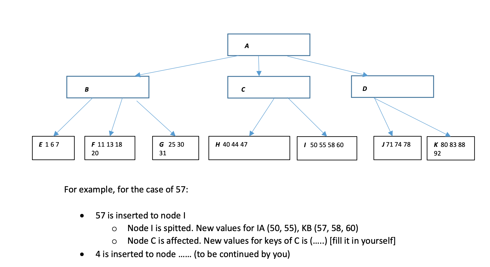
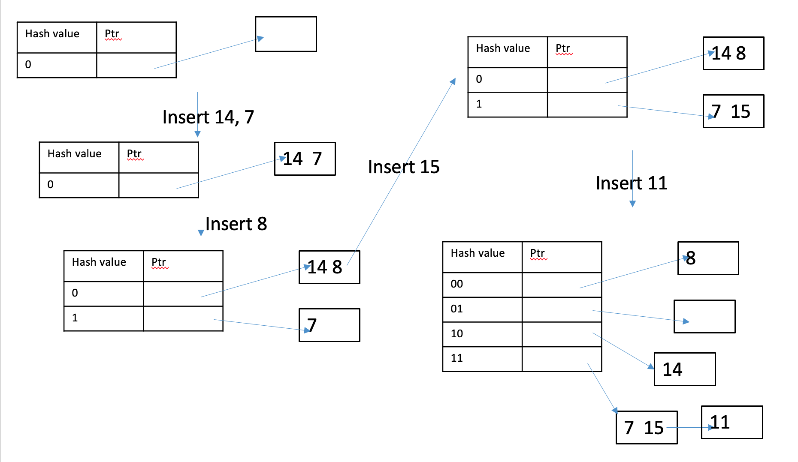
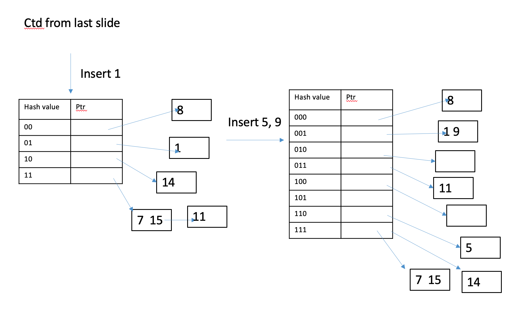
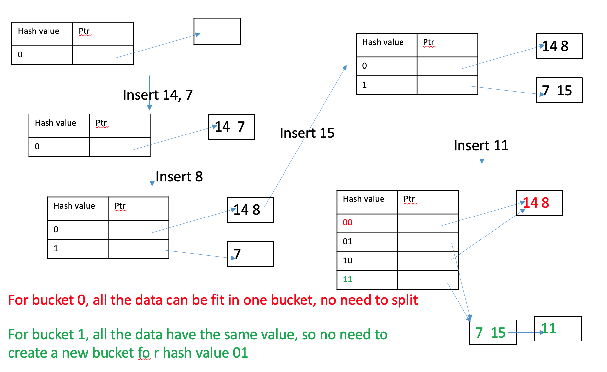
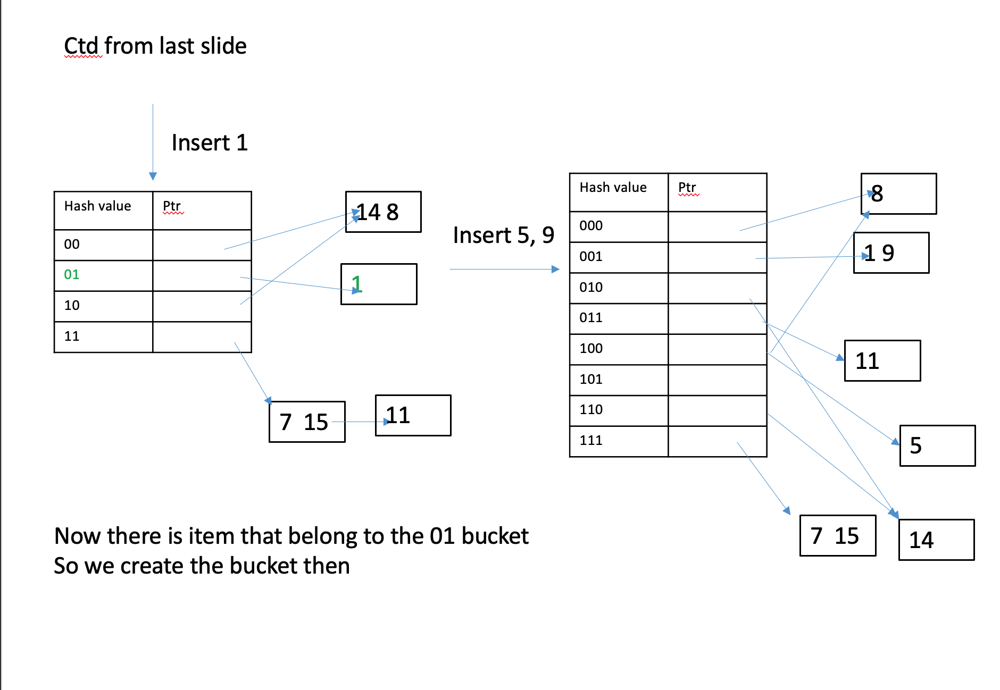
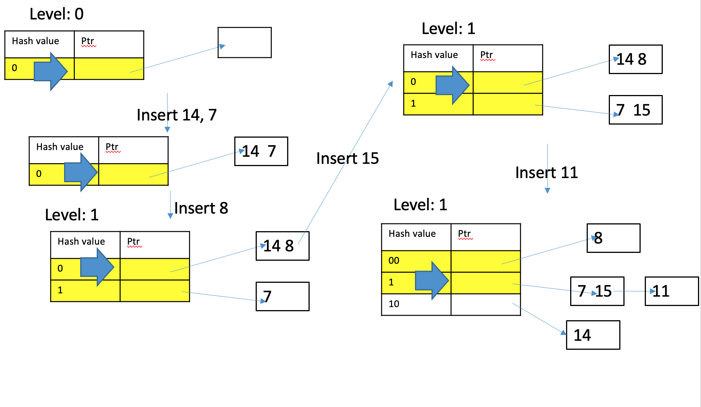
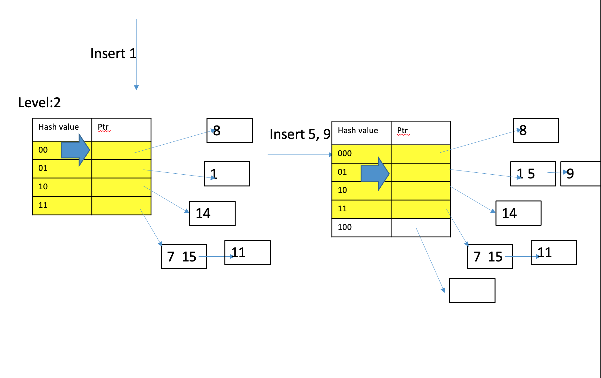
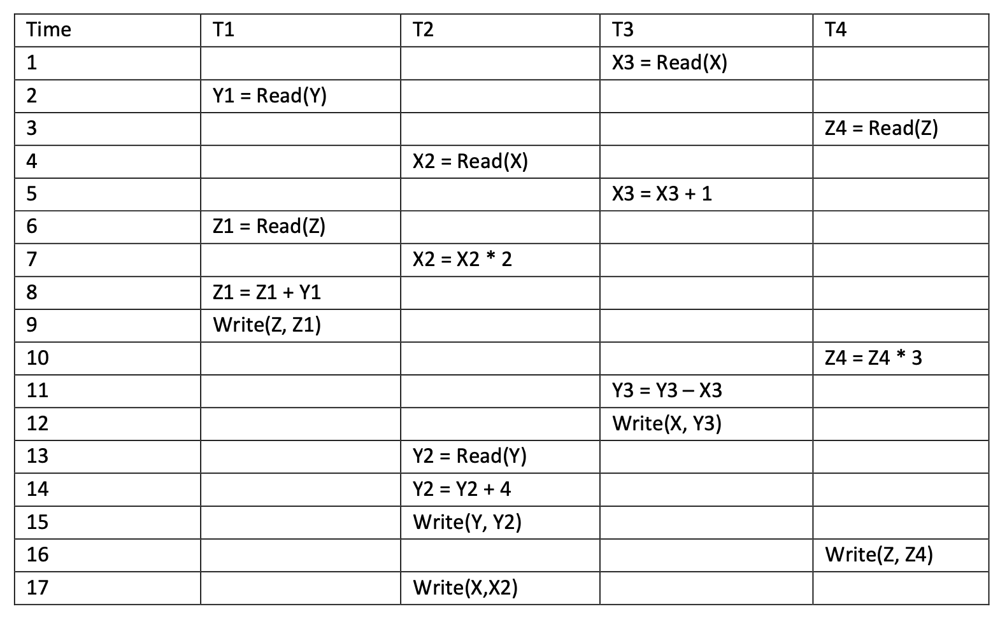
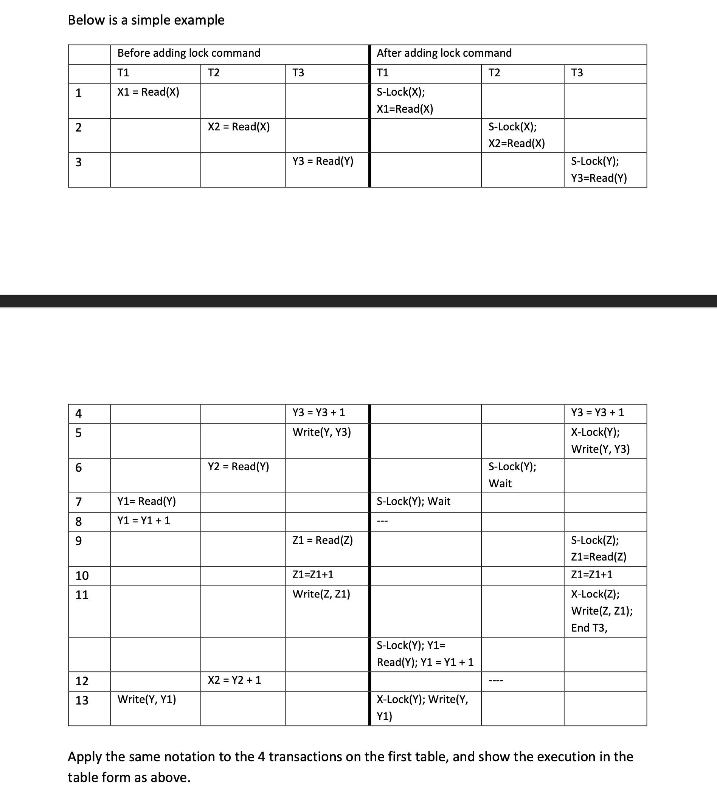
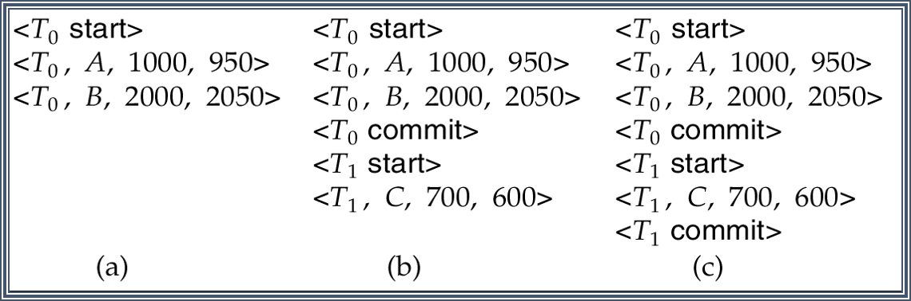

1 How long does one sector to transfer?

one sector is 512 bytes

data-transfer is 200 MB per second

Solution:

$\frac{512}{200 \times 10^6} = 256 \ microseconds$


2 Consider the following numbers, seek time = 7 ms, rotational latency = 5ms. Data transfer rate = 50 MB per second

a. Reading one 4KB block

Time =?

b. Reading one block

Time = ?

c. Reading 10 consecutive block same track

Time = ?

d. Reading 10 blocks on different tracks 

Time = ?

Solution: 

a. Time = $\frac{4K}{50M}= 0.078125 ms $(1/100 times of seek/rotation)

> $\frac{4KB}{50MB/s} = \frac{4KB}{50\times1024KB/s}=\frac{0.08}{1024}s=7.8125\times10^{-5}s = 7.8125\times10^{-2} milliseconds = 0.078125 milliseconds$

b. So $reading\  one\  block = 7 + 5 + 0.078125ms = 12.078125ms$

c. Reading 10 consecutive blocks same track $= 7 + 5 + 10 \times 0.078125 = 12.78125ms$

d. Reading 10 blocks on different tracks = $10 \times (7 + 5 + 0.078125) = 120.78125ms$


3 Two tables `Department(dept_name, building, budget)`. Assume each tuple is 40 bytes,`dept_name` is key. `Instructor(id, name, dept_name, salary)`. Assume each tuple is 50 bytes. `id` is key, `dept_name` is foreign key (referencing Department). Assume data are stored on disk. Each page has 1050 bytes. Assume 50 bytes are needed for overhead information. Assume the pages are fully filled

a. Now assume Department has 100,000 tuples, So number of pages =?

b. Assume Instructor has 400,000 tuples, So number of pages =?

c. Now consider the following query

```sql
SELECT * FROM Instructor 
where id = “1997”
```

Now if you have a heap file, you have to look for each tuple. 

i. You can stop when you find the tuple (why?) Worst case is what ? How many pages you have to search, i.e. what the total cost?

ii. However, if Instructor table is sorted via id?

d. Now consider the following query

```sql
 SELECT * FROM Instructor 
 where id = “1997”
```

However, <u>for magnetic disk, we need to worry about seek/rotation</u> , for binary search, <u>subsequent searches are not on consecutive pages</u>, thus need rotate (or even seek). Now suppose reading a page take $s$ seconds, and a rotate/seek take $100\times s$ second 

i. Worst case. Then time for heap file = ?

ii. Worst Time for sequential file = ?

e. Now consider the following query

```sql
 SELECT * FROM Instructor 
 where id = “1997”
```

What is the file is smaller (e.g. 400 pages)

i. Worst case. Then time for heap file = ?

ii. Worst Time for sequential file = ?

solution:

a. So number of pages = $\frac{100000 \times 40}  {1050-50} = 4000$ pages

b. So number of pages = $\frac{400000 \times 50} {1050 – 50} = 20000 $pages

c. i. Because the id is the key, it just only one. Worst case: no instructor has such ID. In this case, you have to search the whole file. Total cost = 20,000 pages;

ii. However, if Instructor table is sorted via id: Then can apply binary search

Total cost =ceiling( $log_2(20000)$ ) = $\left \lceil log_2(20000)   \right\rceil $ =$\left\lceil 14.287712379549449 \right\rceil$ = 15 pages

d. 

i. Then time for heap file = $100\times s + 20000\times s = (1 seek + 20000 read) = 20100 \times s$ seconds

ii. Time for sequential file = $100\times s + log_220000 \times (100 \times s + s) = (1 seek + 15 rotate \ and\  read) = 1615 \times s $ seconds


e. i. Then time for heap file = 100s + 400s = 500s

ii. Time for sequential file = 100s + ceiling( $log_2(400) ) \times(100s + s)$ = 1009s 


4 Merge sort

Suppose you have a file with 12,800 pages, Assume you have 200 page of memory available. 

The total number of iterations?

So the total page read/written?

Write the the process. 


5 Hm1

Consider you have a Person table with SSN as the primary key, and an attribute age (there are other attributes, which is not important to this problem). You are also given the following:**

* Each tuple of the table has size of 200 bytes

* Each sector (page) on the disk have 1600 bytes

* No tuple is split between two pages

* There are 250,000 tuples in the table

* The table is store in a single file, but is split (equally) between 2 tracks on the disk. Within the same track the sector of the file is contiguous

* Each seek/rotation combination takes 50 milliseconds on average

* Transferring a single page from the disk to memory take 0.5 millisecond.

* When you first access a file, you will need to do a single seek/rotation combination

  a. How many tuples can be stored in a single page?

  b. How many pages are needed to store the table?

  c. Consider the following SQL query: `SELECT * from Person where SSN=”123456789”`. Calculate the best case and worst case time taken to answer this query if

  * i. There is no index

  * ii. There is a clustering index on SSN (Ignore the time needed for reading the index)

  d. Now consider the following SQL query: `SELECT * FROM Person WHERE (age > 20) and (age < 29) ORDER BY age`. Assume that there is a non-clustering index on the age attribute. Assume that you want to use the index to answer the query by first accessing the indexing, and then read each tuple in the order that the index provided. (Assume there is NO buffer to store the location of the buffer so as to make reading easier – i.e. you really do have to access each tuple in the order of the age attribute). Calculate the (worst case) time taken to answer this query using the index if

  * i. There are 2 tuples that satisfy this query

  * ii. There are 10,000 tuples that satisfy this query

    (Once again, ignore the time needed for reading the index)

  Show your work in all the cases.

solution:

a) 1600/200 = 8

​        (b) 250000/8 = 31250

​       (c) (i) best case: 1 page find the key: 50 + 0.5 = 50.5

​             worst case : not found, 31250 pages = 50 * 2 + 0.5 * 31250 =15725

​           (ii) best and worst case: 0 (ssn not found)

​        (d) (i) 2 tuples : 50 * 2 + 0.5 * 2 = 101

​           (ii) 10000 * (50 + 0.5) = 505,000

-1 if c.ii = 50.5


6 B+-tree Hm 1

1. Consider building a B+-tree to store numbers. You are given the following constraints on the B+-tree.

* Each leaf node can store at most 4 numbers

* Each internal node can store at most 2 numbers (how many children maximum?)

* Suppose an internal node stores (14, 28). The three children correspond to number with value strictly less than 14, greater than or equal 14 and strictly less than 28, and greater than or equal to 28 respectively.

* If a node is split, and the number of items of the nodes are odd – this implies one of the split node will have one more item then the other. In such case choose the node on the “right” (containing larger numbers) to be the one who get one more item.

  a. Suppose 100 is inserted into the tree. This will cause nodeK to be split. That means a new key value need to be installed into node D. What is (in theory) the range of the value that can be used there? Explain your answer. (Notice that even though the algorithm use a certain number, but in theory there are other numbers that can be used without violating the B+-tree’s requirements).

  b. Fill in the key values of all nodes A to D, assuming we take the largest possible value for each key value. (Assume the insertion of 75 in part (a) did not happen).

  c. (Ignore part a) Suppose the following numbers are inserted (in order): 57, 4, 99, 12, 53, 5, Every time a node is split, listed the contents of all the nodes being affected. Use the following convention:

  * For any leaf nodes that has changes, list its content after the insertion
  * If a node is split, name the two new nodes by added letter A and B to it. For example, if node K is split, the two new nodes should be named KA and KB. Later if KB is split, then the two nodes should be named KBA and KBB etc.
  * If a new root is created, name the new root N. If subsequently another new root is created then name it NN etc.



solution:

a. 83 < x <= 88

b. B 11 25, C 50, D 80, A 40 71

c.  57 is inserted to node I

·    *Node I is spitted. New values for IA (50, 55), KB (57, 58, 60)*

·    Node C is affected. New values for keys of C is (50 57 ) [fill it in yourself]

​      4 is inserted to node E

 99 is inserted to nodeK

·    Node k is splitted, new values of KA (80, 83), KB (88 92 99)

·    Node D is affected, new values of key of D(80 88)

12 is inserted into node F

·    Node f is splitted new valus of FA (11 12), FB (13 18 20)

·    Node B is splitted BA(11), BB (25)

·    Node A is splitted AA(13) AB (71)

·    New RootA (40)

53 is insert to IA IA (50, 53, 55)

5 is inserted to E

·    Node E is split, EA (1 4), EB (5 6 7)

·    Node BA is affected BA(5 11)


7 Dynamic hashing

* Items to be stored are numbers 

* Assume each bucket store 2 numbers

  insert 14, 7

  insert 8

  insert 15

  insert 11

  insert 1

  insert 5, 9

  solution:

  

  


8 Extensible hashing

* Items to be stored are numbers 

* Assume each bucket store 2 numbers

  insert 14, 7

  insert 8

  insert 15

  insert 11

  insert 1

  insert 5, 9

solution:






9 Linear hashing

* Items to be stored are numbers 

* Assume each bucket store 2 numbers

  insert 14, 7

  insert 8

  insert 15

  insert 11

  insert 1

  insert 5, 9

  

  

 


10  Suppose we want to represent a ternary relationship between three entities. Assume each entity has a unique key attribute, and other attributes that need to be stored. Now suppose you are only allowed to use embedding to store the information. Suggest what can be a problem. Use an example to illustrate. Is there any restrictions on the relationship that will make this at least a feasible way of representing the relationship?

solution:

Embedding means you need to duplicate certain entities (if all entities participate in many relationships). Restricting cardinality of participation will help (especially uniques)

 


11

hw2

Consider the following query (x is only integer)

```sql
SELECT *
FROM A, B WHERE A.x = B.x
```

Calculate (or provide lower and/or upper bound, if you don’t have enough information) the number of tuples returned from the query, under the following conditions (each part is separate from the other). Unless otherwise stated, table A has 10000 tuples, table B has 20000 tuples.

1. A.x is the primary key of x, and B.x is the primary key of B
2. A.x is the primary key of x, and B.x is the foreign key refer to A.x (but B.x is not unqiue)
3. A.x and B.x is evenly distributed between 1-100.
4. A.x is evenly distributed between 1-100, B.x is evenly distributed between 51-150.

solution:

a.   Both are primary keys, so each tuple is going to match with at most one other tuple. So lower bound = 0 (no guarantee of a match), upper bound = 10000 (each tuple of A match with a tuple of B) [Notice the other side don’t work, (Why?))

b.   B.x refer to A.x, so each tuple of B will match with a tuple of A, so lower bound = upper bound = 20000

c.   Each value of A.x will match with each value of B.x. 

So each tuple of A will match with 20000/100 tuples of B, so lower bound = upper bound = 10000 * 20000 / 100 = 2000000

d.   Similar to above, but halved on both sizes: upper = lower bound = 10000/2 * 20000/(100*2) = 500,000


12 Consider the following schedule for four transactions



- X, Y, Z are data stored on the database in the disk

- X1..X4, Y1..Y4, Z1..Z4 are local variables stored in memory and only accessible via the

  corresponding transactions (T1 for X1, Y1, T2 for X2, Y2 etc.). You can assume all local

  variables are initialized to 0.

- The Read() operation read in the corresponding data on the disk and store it in the local

  variable

- All the operations (*, +, - etc.) only operate on the local variable, and do not affect the

  data on the disk

- The Write() command write the value of the local variable onto the corresponding data

  on the disk.

1. Is the above schedule serializable? If it is, list all possible equivalent serial schedule. If not, explain why not.
2. Now suppose we want to implement 2-phase locking on the transactions. Assume we

use the following convention: 

i. Every time a transaction wants to read/write an item in the disk for the first time, it will request a share/exclusive lock (respectively). We denote it as the operation S-Lock(), X-Lock() respectively

ii.  If a request is granted, the transaction can proceed immediately and execute the corresponding command
Otherwise, the transaction will use the wait-die policy to determine whether it will wait or abort.

iii. If a transaction waits, it will wait until the lock is released and attempt to obtain it. It will try to obtain the lock immediately after it was released by another transaction. 

iv. If it can obtain the lock, it will execute all commands up to the time that the lock is requested/obtained.

v.  If a transaction aborts, it will not be restarted

vi.  If there is more than one transaction waiting for the same lock, the lock is always granted to the transaction Ti with the smallest value of i.

vii. We assume a transaction immediately commits and release all the locks after the last operation is successfully executed.



solution:


13 Consider joining to tables R (1000 pages), S (100000 pages), assume we have 10 pages of buffers. 

a. Consider sorting R write the iterations and total number of read/write

b. Consider sorting S write the iterations and total number of read/write

c. Total cost?

d. if not sorting table first?

solution:

a.

* First step: Divide page into segments of 10 pages = 100 segments (to make analysis easier) 

* Merging step: assume merge 10 segment as a time 

  * Two iterations: 100 segments, 10 page each -> 10 segments, 100 page each -> sorted, 1000 pages

* Total number of read/writes = 3 (total iterations) * 2 (read/write) * 1000 = 6000 read/writes

b. Consider sorting S

* First step: Divide page into segments of 10 pages = 10000 segments (similar as R)
* Merging step: assume merge 10 segment as a time 
  * Four iterations : 10000 segments, 10 page each -> 1000 segments, 100 page each -> 100 segments, 1000 page each -> 10 segments, 10000 pages -> sorted, 100000 pages 
* Total number of read/writes = 5 (total iterations) * 2 (read/write) * 100000 = 1000000 read/writes

c. 

* Total cost = Cost of sorting R + Cost of sorting S + cost of merge = 60000 + 1000000 + (1000 + 100000) = 1161000 pages read/write


14 Hash joins

Consider joining to tables R (1000 pages), S (100000 pages), Assume we have 11 pages of buffers. Assume all hash function evenly distribute the tuples for both tables.

What is the iteration and the running time ? 

solution:

* * First iteration:

    * R and S divided into 10 segement (100 page for R, 10000 page for S)

      R和S分10段(R 100页，S 10000页)

  * Second iteration

    * Each segment is further subdivided (10 page for R, 1000 page for S)

  * Now the segments for R is small enough to fit in main memory

    * Nested loop for each pair

* Running time = 4 * (100000 + 1000) + 100000 + 1000 =505000


15 

```sql
SELECT S.id, I.id, I.salary
From Student S, Instructor I, Advise A
WHERE S.id = A.s_id AND I.id = A.i_id AND S.dept = "CS" AND S.gpa >= 3.5
```

$$
\Pi_{S.id, I.id, I.salary} (\sigma_{S.gpa \ And \ S.dept='CS'}(Student \Join_{A.sid =S.id''}Advisor\Join_{A.iid=I.id''}Instructor))
$$


Build a parse tree

solution:


16 
$$
\sigma_{gpa>3.0}(Student) \Join Department
$$
Suppose

* 1000 pages for Department

* 5000 pages for Student

* $\sigma_{gpa>3.0}(Student)$ return 2500 pages

* Suppose 100 buffers, split 50 each

a. Consider Student in the inner loop (no pipeline)

cost is what?

b. Consider Student in the outer loop (no pipeline)


solution:

a. 
$$
Cost (page \ read) = 5000 (read\  Student \ for \ \sigma) \\+ 2500 (write \ Student\ for \ \sigma  ) \\+ 1000 (outer\  loop \ for \ Department) \\+ 2500 \times \frac{1000}{50} (inner \ loop \ for \ \sigma_{gpa>3.0}(Student))\\ = 58500
$$
b. 
$$
Cost (page \ read) = 5000 (read\  Student \ for \ \sigma, outerloop) \\+ 1000 \times \frac{2500}{50} (inner \ loop \ for \ Department)\\ = 55000
$$


17



a. Broke at write T0 wirte B, already write in the stable storage, what should do ?

b. Broke at T1 write C, already write in the stable storage,  what should do?

c. Broke at T1 commit, already write in the stable storage, what should do?


18

1. \<start T1>
2. <T1 write X, 30, 40>
3. \<start T2>
4. <T1 write Y, 40, 50>
5. \<start T3>
6. <T3 write Z, 8, 30>
7. \<commit T3>
8. \<start T4> 
9. <T4 write A 10, 5>
10. <checkpoint T1, T2, T4>
11. <T1 write Z 30, 10>
12. <T2 write W 50, 9>
13. \<commit T1>
    System crashes!

-----

* Consider the log on the LHS

* First, determine which transactions need to be redo/undo
* Initially
  * Undo = {}
  * Redo = {}
  * Done = {}


solution:

Checkpoint reached

* Undo = {T2, T4}
* Redo = {T1}
* Done = {}

All the necessary transactions discovered. Notice that T3 does not need to be redo because T3 is committed before checkpoint. Thus all the pages T3 changes is forced onto the disk. 

Step 2 : Undo .

T2, T4 need to be undone. Undo are done backwards. Read log backwards until the `<start T>` for all transactions to be undone reached

Step 3 : Redo

T1 needed to be redo

So logs have to be returned from the earliest start time of all transactions to be redone
