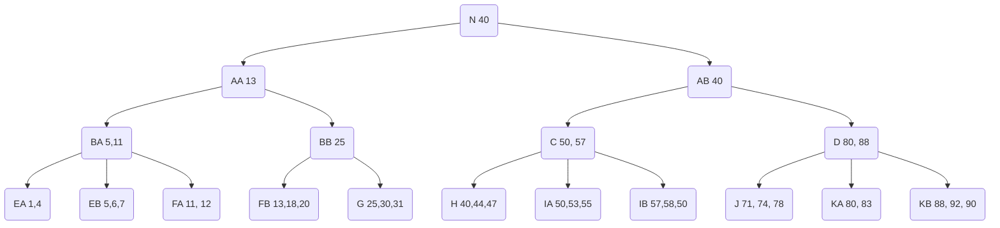

c. 

* 57 is inserted to node $I$ ✅

  * Node $I$ is splitted. New values for $IA(50, 55)$ ,$IB(57, 58, 50)$
  * Node $C$ is affected. New values for keys of $C$ is (50, 57)

  ```mermaid
  graph TB
  A(A 40,71)
  A-->B(B 11,25)
  A-->C(C 50,57)
  A-->D(D 80)
  B-->E(E 1,6,7)
  B-->F(F 11,13,18,20)
  B-->G(G 25,30,31)
  C-->H(H 40,44,47)
  C-->IA(IA 50,55)
  C-->IB(IB 57,58,50)
  D-->J(J 71,74,78)
  D-->K(K 80,83,88,92)
  ```

  

* 4 is inserted to node $E$ ✅

  * Node $E$ is afftected. New values for keys of $E$ is (1,4,6,7)

    ```mermaid
    graph TB
    A(A 40,71)
    A-->B(B 11,25)
    A-->C(C 50,57)
    A-->D(D 80)
    B-->E(E 1,4,6,7)
    B-->F(F 11,13,18,20)
    B-->G(G 25,30,31)
    C-->H(H 40,44,47)
    C-->IA(IA 50,55)
    C-->IB(IB 57,58,50)
    D-->J(J 71,74,78)
    D-->K(K 80,83,88,92) 
    ```

* 99 is inserted to node $K$ ✅

  * Node $K$ is splitted. New values for $KA(80,83), KB(88,92,99)$ 

  * Node $D$ is affected. New values for keys of $D$ is $(80, 88)$.

    ```mermaid
    graph TB
    A(A 40,71)
    A-->B(B 11,25)
    A-->C(C 50,57)
    A-->D(D 80,88)
    B-->E(E 1,4,6,7)
    B-->F(F 11,13,18,20)
    B-->G(G 25,30,31)
    C-->H(H 40,44,47)
    C-->IA(IA 50,55)
    C-->IB(IB 57,58,50)
    D-->J(J 71,74,78)
    D-->KA(KA 80,83)
    D-->KB(KB 88,92,99)
    ```

    

* ==12 is inserted to node $F$==       This place I wrong before.

  * Node $F$ is splitted. New values for keys of $FA(11,12), FB(13, 18, 20)$
  * Node B is affected, and B is also splitted. $BA (11), BB(25)$
  * Node A is affected, and A is also splitted. $AA(13), AB(40)$
  * Create new root $N(40)$ 

  ```mermaid
  graph TB
  N(N)
  AA 
  AB
  
  
  AA(AA 13)
  AB(AB 40)
  N(N 40)
  N-->AA
  N-->AB
  AA-->BA
  AA-->BB
  AB-->C
  AB-->D
  BA(BA 11)
  BB(BB 25)
  BA-->E(E 1, 4, 6, 7)
  BA-->FA(FA 11, 12)
  BB-->FB(FB 13,18,20)
  BB-->G
  G(G 25,30,31)
  H(H 40,44,47)
  IA(IA 50,55)
  IB(IB 57,58,50)
  J(J 71, 74, 78)
  KA(KA 80, 83)
  KB(KB 88, 92, 90)
  C(C 50, 57)
  D(D 80, 88)
  C-->H
  C-->IA
  C-->IB
  D-->J
  D-->KA
  D-->KB
  
  
  
  ```


* 53 is inserted to node $IA$  ✅

  * Node $IA$ is affected. New values for keys of $IA$ is $(50, 53, 55)$

    ```mermaid
    graph TB
    N(N)
    AA 
    AB
    
    
    AA(AA 13)
    AB(AB 40)
    N(N 40)
    N-->AA
    N-->AB
    AA-->BA
    AA-->BB
    AB-->C
    AB-->D
    BA(BA 11)
    BB(BB 25)
    BA-->E(E 1, 4, 6, 7)
    BA-->FA(FA 11, 12)
    BB-->FB(FB 13,18,20)
    BB-->G
    G(G 25,30,31)
    H(H 40,44,47)
    IA(IA 50,53,55)
    IB(IB 57,58,50)
    J(J 71, 74, 78)
    KA(KA 80, 83)
    KB(KB 88, 92, 90)
    C(C 50, 57)
    D(D 80, 88)
    C-->H
    C-->IA
    C-->IB
    D-->J
    D-->KA
    D-->KB
    
    ```

    


* ==5 is inserted to node $E$== 		This place I wrong before.
  * Node E is splitted. New values for $EA(1,4)$ $EB(5,6,7)$
  * Node BA is affected. New values for $BA(5, 11)$ 



