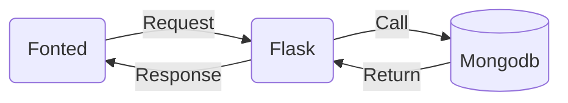

# Developer Manual

Version 1.0. Team 6: Sports League Track System. 

## Frontend

General layout and correspondence

| Add Menu       | Correspondence      | Add Menu       | Correspondence      |
| -------------- | ------------------- | -------------- | ------------------- |
| Add new game   | add_new_game.html   | Add new season | add_new_season.html |
| Add new league | add_new_league.html | Add new team   | add_new_team.html   |
| Add new score  | add_new_score.html  | Add result     | add_result.html     |

| Query Menu                | Correspondence           | Query Menu | Correspondence    |
| ------------------------- | ------------------------ | ---------- | ----------------- |
| Query league basic        | query_basic_league.html  | Game       | query_game.html   |
| Query league more  detail | query_detail_league.html | Season     | query_season.html |
| Team basic                | query_basic_team.html    | Rating     | query_rating.html |
| Team more detail          | query_detail_team.html   |            |                   |

| Modify Menu      | Correspondence   | Modify Menu            | Correspondence        |
| ---------------- | ---------------- | ---------------------- | --------------------- |
| Home Page        | modify.html      | Modify menu page       | modify_menu.html      |
| Modify date page | modify_date.html | Modify move team  page | modify_move_team.html |

| Delete Menu        | Correspondence     | Delete Menu      | Correspondence   |
| ------------------ | ------------------ | ---------------- | ---------------- |
| Home Page          | delete_menu.html   | Delete team page | delete_team.html |
| Delete league page | delete_league.html |                  |                  |

## Interaction

We use flask framework to connect the front and backend. When we the use flask framework to get the data from front pages, we set some limit on that. Like we have to make sure the some input cannot be null. We also use Javascript to limit user input. 

When user successfully get the access to the system, we offer the main menu, `Add` ,`Query ` ,`Modify`, `Delete`    which makes the system look more logical. And Each of them, we also create submenu for all them, which allow users to do more specific operations.

We write `enteryinput.py` ,`entryquery.py`, `enterymodify.py`, `entrydelete.py` to get the data from the fronted pages and use python to do some data processing for each different functions. And then we also we `link_entryinput.py` , `link_entryquery.py` , `link_entrymodify.py`, `link_entryquery.py` to connect the database to do more logic processing. We also use blueprints to schedule the whole application. For understanding, the system can be divided the application as three parts. We divided the application as three parts. First is `app.py` which include the main logic of our applications. Second is `static ` and `templates` flies we store the fronted pages in the flask framework. And the then the `blueprints ` stores the functions of the application which help us to do different operations. 

**For users account:**

`Login`: We need users to input their `Username`, `Password`, and we limit the length of password at least 6 characters and less than or equal to 20. `Register`: We want more users can join us and for the safe of the database, we have to offer this function. `Edit`:  we allow users to change their password. But we have to make sure the user know the old password, if not they will not allow to do change. 

**For adding data:**

When we the fronted pages post some data to the database, we have to make sure the data forms are limited, we also double check the data during the request. And when we get the right information, then will call the funtion in the `link_` files to do the operations in the database. And then return the result from the database to tell the users whether their opeations successful. If got wrong, we also tell the users about more details.

**For query data:**

For the different query, we use different functions. Just same as before, we also use limit to check the datas. We first let user to give us some data 

**For modify data:**

We set the users computers time as default time. We allow users to set a new time if they want. Change the times might bring some risks. We not suggest users to do that. In the furture verisons. Other developers might improve of this part. 

**For delete data:**

We just create the system for delete two things, one is team, and second is league. In the future versions, might adding more functions about this if necessary. You can improve this parts of our system.

## Backend

The structure of documents is shown below, more details are in new_data.py, which stored the insert funtions of the documents:

The `.py` files belongs to this part are the files which name format is `link_(x).py`. The `(x)` is  `.py` file which link`(x).py` connect with. For example, the function def `login()` is in `app.py`, which can get the information from webpage and send data to backend in order to check the user name and password are all correct. In this function, a function named `link_login(user, pwd)` is able to send data and return the check result, and the code of `link_login(user, pwd)` is stored in `link_app.py`. Therefore, it's easy to find the corresponding code just by looking at the py file and the function name format.

The only exception is `link_other.py`. To ensure that the relationships described earlier are neat enough, the remaining functions that do not correspond directly but are still used need to be placed in a separate file, that is, in this file.

There are several functions in this part that involve some calculation, and the logic will be briefly explained below:

| .py file name | function name                        | Explanation                                                  |
| ------------- | ------------------------------------ | ------------------------------------------------------------ |
| link_app.py   | link_login, link_register, link_edit | Using hash encryption to protect passwords security          |
| schedule      | groupStage                           | Called in function **link_generate_random_table** in file **link_entryinput**. By using combinations to get a matchup table for all teams in the current league and disrupt the order. |
| link_other.py | link_score_input                     | Called in function **link_result_input** in file **link_entryinput**. Change the current season team points by calculating the game score of both teams. The winning team accumulates three points, the losing team has no points, and the tie-breakers each accumulate one point. |
| link_other.py | calculate_rating                     | Called in function **link_rating_query** in file **link_entryquery**.Write a matrix of all the teams in the current league matchups. In the matrix m, if team $i$ beat team $j$ in a game, them $m_{ij} + 1$, if lose, $m_{ij} - 1$. If tie-breaker or they never have a game, $m_{ij}$ would not change. Then find the eigenvalues of the matrix as the rating of each team. |

